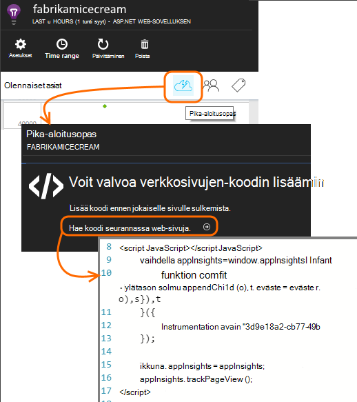

<properties 
    pageTitle="SharePoint-sivuston kanssa sovelluksen tiedot-näyttö" 
    description="Seurannan uudella instrumentation avaimella uuden sovelluksen käynnistäminen" 
    services="application-insights" 
    documentationCenter=""
    authors="alancameronwills" 
    manager="douge"/>

<tags 
    ms.service="application-insights" 
    ms.workload="tbd" 
    ms.tgt_pltfrm="ibiza" 
    ms.devlang="na" 
    ms.topic="article" 
    ms.date="03/24/2016" 
    ms.author="awills"/>

# <a name="monitor-a-sharepoint-site-with-application-insights"></a>SharePoint-sivuston kanssa sovelluksen tiedot-näyttö


Visual Studio hakemuksen tiedot valvoo käytettävyys, suorituskyvyn ja käyttömäärän sovellus. Tässä opit, miten se määritetään SharePoint-sivustoon.


## <a name="create-an-application-insights-resource"></a>Luo sovelluksen tiedot-resurssi


[Azure portal](https://portal.azure.com)Luo uusi sovelluksen havainnollistamisen resurssi. Valitse ASP.NET sovelluksen tyyppi.


Sivu, joka avaa on paikka, jossa näet suorituskykyä ja -käyttötietoja sovelluksen tietoja. Voit palata siihen seuraavan kerran, voit kirjautua sisään Azure-olisi Etsi ruudun sen aloitusnäytössä. Voit myös valitsemalla Selaa ja hakea sitä.
    


## <a name="add-our-script-to-your-web-pages"></a>Tutustu komentosarjan lisääminen web-sivuille

Pikaoppaassa hakeminen verkkosivujen komentosarja:



Lisää juuri ennen komentosarjan &lt;/head&gt; jokaisen sivun, jota haluat seurata tunnistetta. Jos sivuston perustyylisivun, voit sijoittaa komentosarja siellä. Esimerkiksi ASP.NET MVC projektin lisäät sen View\Shared\_Layout.cshtml

Komentosarja sisältää instrumentation avaimen, joka ohjaa telemetriatietojen sovelluksen tiedot-resurssiin.

### <a name="add-the-code-to-your-site-pages"></a>Koodin lisääminen sivuston sivuille

#### <a name="on-the-master-page"></a>Perustyylisivun

Jos voit muokata sivuston perustyylisivun, joka parantaa sivuston jokaisen sivun seuranta.

Kuittaa ulos perustyylisivu ja muokkaamaan sitä SharePoint Designer tai muita editorilla.


Lisää koodi juuri ennen </head> tunniste. 


#### <a name="or-on-individual-pages"></a>Tai yksittäisiä sivuja

Voit valvoa vain tiettyjä sivuja, Lisää komentosarja erikseen jokaiselle sivulle. 

Verkko-osan lisääminen ja upota se koodikatkelman.


## <a name="view-data-about-your-app"></a>Näytä tietoja sovelluksen

Ota sovelluksesi uudelleen.

Palaa sovellusta-sivu [Azure portal](https://portal.azure.com).

Etsi ensimmäinen tapahtumat tulevat näkyviin. 


Valitse Päivitä muutaman sekunnin kuluttua, jos olet odotetaan enemmän tietoja.

Valitse Yhteenveto-sivu, voit tarkastella kaavioita käyttäjien, istunnot ja sivun näkymät **käyttöanalyysin** :


Napsauta mitä tahansa kaavion saat näkyviin lisätietoja – esimerkiksi Page Views:


Tai käyttäjille:


## <a name="capturing-user-id"></a>Tallentaa käyttäjätunnus


Vakio verkkosivun koodikatkelman ei siepata käyttäjätunnus SharePointista, mutta voit tehdä sen pieniä muutoksia.


1. Kopioi sinua sovelluksen instrumentation avain Essentials avattavan luettelon hakemuksen tiedot. 


    

2. Korvaa instrumentation avain "XXXX"-alla koodikatkelman. 
3. Upottaa komentosarja SharePoint-sovelluksen sen sijaan, että sinulla on portaalin koodikatkelman.


```


<SharePoint:ScriptLink ID="ScriptLink1" name="SP.js" runat="server" localizable="false" loadafterui="true" /> 
<SharePoint:ScriptLink ID="ScriptLink2" name="SP.UserProfiles.js" runat="server" localizable="false" loadafterui="true" /> 
  
<script type="text/javascript"> 
var personProperties; 
  
// Ensure that the SP.UserProfiles.js file is loaded before the custom code runs. 
SP.SOD.executeOrDelayUntilScriptLoaded(getUserProperties, 'SP.UserProfiles.js'); 
  
function getUserProperties() { 
    // Get the current client context and PeopleManager instance. 
    var clientContext = new SP.ClientContext.get_current(); 
    var peopleManager = new SP.UserProfiles.PeopleManager(clientContext); 
     
    // Get user properties for the target user. 
    // To get the PersonProperties object for the current user, use the 
    // getMyProperties method. 
    
    personProperties = peopleManager.getMyProperties(); 
  
    // Load the PersonProperties object and send the request. 
    clientContext.load(personProperties); 
    clientContext.executeQueryAsync(onRequestSuccess, onRequestFail); 
} 
     
// This function runs if the executeQueryAsync call succeeds. 
function onRequestSuccess() { 
var appInsights=window.appInsights||function(config){
function s(config){t[config]=function(){var i=arguments;t.queue.push(function(){t[config].apply(t,i)})}}var t={config:config},r=document,f=window,e="script",o=r.createElement(e),i,u;for(o.src=config.url||"//az416426.vo.msecnd.net/scripts/a/ai.0.js",r.getElementsByTagName(e)[0].parentNode.appendChild(o),t.cookie=r.cookie,t.queue=[],i=["Event","Exception","Metric","PageView","Trace"];i.length;)s("track"+i.pop());return config.disableExceptionTracking||(i="onerror",s("_"+i),u=f[i],f[i]=function(config,r,f,e,o){var s=u&&u(config,r,f,e,o);return s!==!0&&t["_"+i](config,r,f,e,o),s}),t
    }({
        instrumentationKey:"XXXX"
    });
    window.appInsights=appInsights;
    appInsights.trackPageView(document.title,window.location.href, {User: personProperties.get_displayName()});
} 
  
// This function runs if the executeQueryAsync call fails. 
function onRequestFail(sender, args) { 
} 
</script> 


```


## <a name="next-steps"></a>Seuraavat vaiheet

* [Web-testien](app-insights-monitor-web-app-availability.md) sivuston käytettävyyttä.

* Muuntyyppisten app [Sovelluksen tiedot](app-insights-overview.md) .


<!--Link references-->


 