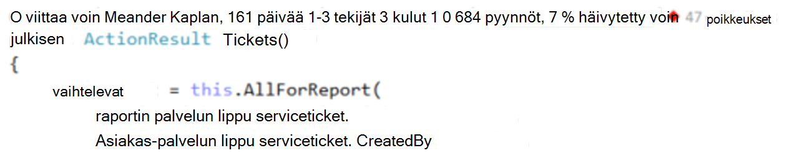
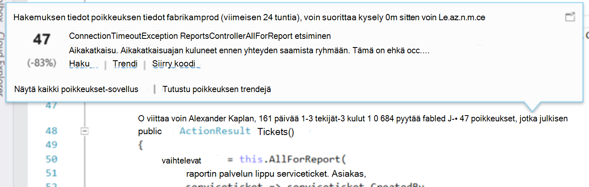
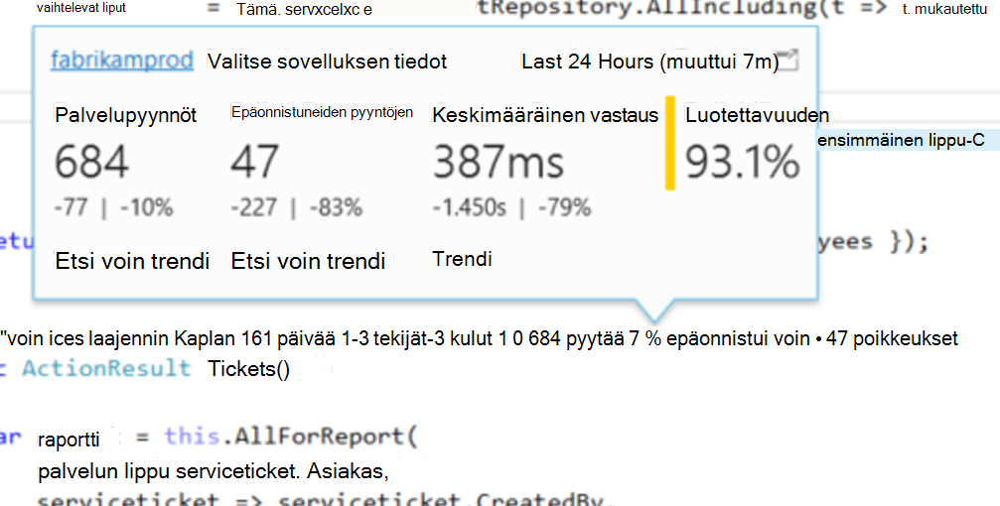
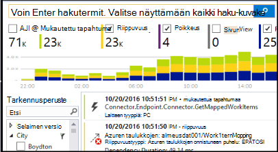
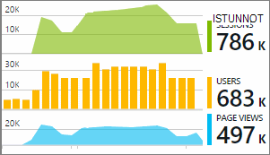

<properties 
    pageTitle="Hakemuksen tiedot telemetriatietojen-Visual Studio CodeLens | Microsoft Azure" 
    description="Voit siirtyä nopeasti hakemuksen tiedot pyynnön ja poikkeuksen kanssa CodeLens Visual Studiossa telemetriatietojen." 
    services="application-insights" 
    documentationCenter=".net"
    authors="numberbycolors" 
    manager="douge"/>

<tags 
    ms.service="application-insights" 
    ms.workload="tbd" 
    ms.tgt_pltfrm="ibiza" 
    ms.devlang="na" 
    ms.topic="get-started-article" 
    ms.date="08/30/2016" 
    ms.author="daviste"/>
    
# Hakemuksen tiedot telemetriatietojen Visual Studio CodeLens:

Menetelmien web app-koodiin voidaan lisätä huomautuksia ja telemetriatietojen tietoja suorituksenaikainen poikkeukset ja Pyydä vastaus kertaa. Jos asennat [Visual Studio sovelluksen tiedot](app-insights-overview.md) -sovelluksessa, telemetriatietojen näkyy Visual Studio [CodeLens](https://msdn.microsoft.com/library/dn269218.aspx) - kutakin funktiota, jos olet tottunut tarkastelua hyödyllisiä tietoja, kuten määrän sijoittaa funktio on viittaus tai viimeksi muokannut sitä henkilö yläreunassa huomautukset.

> [AZURE.NOTE] Sovelluksen tiedot-CodeLens on käytettävissä Visual Studio 2015 Update 3 ja uudempi versio, tai [Analytics Kehitystyökalut tunniste](https://visualstudiogallery.msdn.microsoft.com/82367b81-3f97-4de1-bbf1-eaf52ddc635a)uusimman version kanssa. CodeLens on käytettävissä Visual Studio Enterprise- ja Professional-versioissa.

## Löydät sovelluksen tiedot-tiedot

Etsi sovelluksen tiedot-web-sovelluksen julkisen pyynnön menetelmistä CodeLens ilmaisimien telemetriatietojen. CodeLens ilmaisimet yllä menetelmä ja C# ja Visual Basic-koodin muut ilmoitukset. Jos sovelluksen havainnollistamisen tiedot ovat käytettävissä menetelmän, näet ilmaisimet pyynnöt ja poikkeukset, kuten "100 pyytää, 1 % epäonnistui" tai "10 poikkeuksia." Valitse CodeLens-ilmaisin lisätietoja. 

> [AZURE.TIP] Hakemuksen tiedot pyytää ja poikkeuksen ilmaisimet saattaa kestää muutaman ylimääräisiä sekuntia ladata sen jälkeen, kun muut CodeLens ilmaisimet tulevat näkyviin.

## CodeLens poikkeukset

Poikkeus CodeLens ilmaisin näkyy asennuksen aikana tapahtuneista virheistä 24 tunnin aikana from määrä useimmin poikkeukset kyseisenä ajanjaksona served menetelmällä pyyntöä käsiteltäessä sovelluksen 15 poikkeusten määrä.

Saat lisätietoja valitsemalla Poikkeukset CodeLens ilmaisin:

* Prosentuaalisen muutoksen viimeisimmän 24 tunnin suhteessa edellisen 24 tunnin poikkeukset
* Valitse Siirry yliheittävä poikkeuksen funktiota lähdekoodin **Siirry koodi**
* Valitse **Etsi** kaikki esiintymät, tätä poikkeusta on tapahtunut 24 tunnin aikana kysely
* Valitse **trendi** tarkastelemaan trendi visualisoinnin esiintymät, tämä poikkeuksen 24 tunnin aikana
* Valitse **Näytä kaikki poikkeukset-sovelluksen** kysely, joka on tapahtunut 24 tunnin aikana kaikki poikkeukset
* Valita **Selaa poikkeuksen trendejä** trendi visualisoinnin kaikki poikkeuksia, joka on tapahtunut 24 tunnin aikana. 

> [AZURE.TIP] Jos "0 poikkeukset-kohdassa CodeLens, mutta tiedät pitäisi olla poikkeukset, tarkista, varmista, että oikea sovellus tiedot resurssin valitaan CodeLens. Valitse toiselle resurssille projektin Solution Explorerissa hiiren kakkospainikkeella ja valitse **hakemuksen tiedot > Valitse Telemetriatietojen lähteen**. CodeLens vain näytetään 15 useimmat usein esiintyvä poikkeukset Viimeiset 24 tuntia, jos poikkeuksen on 16 useimmin tai pienempi-sovelluksessa, näkyviin tulee "0 poikkeukset." ASP.NET-näkymistä poikkeukset eivät ehkä näy ohjauskoneen menetelmistä, joka on luotu nämä näkymät.

> [AZURE.TIP] Jos näet "? poikkeuksia"CodeLens, sinun on liitettävä Visual Studio Azure-tili tai Azure tilin tunnistetiedot on ehkä päättynyt. Kummassakin tapauksessa valitse "? Poikkeukset"ja valitse **Lisää tili...** Anna tunnistetiedot.

## CodeLens pyynnöt

Pyynnön CodeLens ilmaisin näkyy pyyntöjen määrä, joka on palvelee menetelmän Viimeiset 24 tuntia sekä nämä pyynnöt, joka epäonnistui prosentteina.

Saat lisätietoja valitsemalla pyynnöt CodeLens ilmaisin:

* Useita pyynnöt, epäonnistunut pyynnöt ja keskimääräinen vastauksen kertaa päälle verrattuna edellisen 24 tunnin Viimeiset 24 tuntia absoluuttisen ja prosentti muutokset
* Luotettavuutta menetelmällä laskettu pyynnöt, jotka eivät läpäise 24 tunnin aikana ei prosentteina
* Valitse **Etsi** pyyntöjä tai epäonnistui kyselyn kaikki 24 tunnin aikana on tapahtunut (epäonnistunut) pyynnöt
* Valitse **trendi** voit tarkastella pyyntöjä, epäonnistuneiden pyyntöjen tai keskimääräinen vastauksen kertaa trendi visualisoinnin 24 tunnin aikana.
* Valitse sovelluksen tiedot-resurssin nimi CodeLens tietonäkymään voit muuttaa mitä resurssi on CodeLens tietojen lähteen vasemmassa yläkulmassa.

## Seuraavat vaiheet

||
|---|---
|**[Hakemuksen tiedot Visual Studiossa käsitteleminen](app-insights-visual-studio.md)** Etsi telemetriatietojen, CodeLens tiedot ja määrittää sovelluksen tiedot. Kaikki sisällä Visual Studio. |
|**[Lisää tietoja](app-insights-asp-net-more.md)** Seurata käyttöä, käytettävyys, riippuvuudet, poikkeukset. Integroi jäljittää kirjaaminen kehysten kohteesta. Kirjoita mukautetun telemetriatietojen. | 
|**[Sovelluksen tiedot-portaalin käyttäminen](app-insights-dashboards.md)** Raporttinäkymien, diagnostiikka- ja analyyttisen tehokkaita työkaluja, ilmoitukset-sovellus ja telemetriatietojen live riippuvuuden kartan Vie. |
