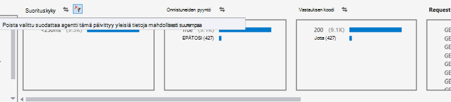

<properties 
    pageTitle="Visual Studio suuntausten analysoiminen | Microsoft Azure" 
    description="Analysoi, visualisoiminen ja tutkiminen suuntausten sovelluksen tiedot-telemetriatietojen Visual Studiossa." 
    services="application-insights" 
    documentationCenter=".net"
    authors="numberbycolors" 
    manager="douge"/>

<tags 
    ms.service="application-insights" 
    ms.workload="tbd" 
    ms.tgt_pltfrm="ibiza" 
    ms.devlang="na" 
    ms.topic="get-started-article" 
    ms.date="10/25/2016" 
    ms.author="daviste"/>
    
# Visual Studio suuntausten analysoiminen

Hakemuksen tiedot trendejä työkalun valitseminen puolestaan Visualisoi, kuinka sovelluksen tärkeitä telemetriatietojen tapahtumat muuttuvat ajan kuluessa, voit helposti tunnistaa ongelmia ja poikkeamia. Kun linkität yksityiskohtaisempia vianmääritystiedot, trendejä auttavat sinua sovelluksen suorituskyvyn parantaminen ja etsiä poikkeukset syitä paljastaa tietoja mukautetun tapahtumista.

> [AZURE.NOTE] Hakemuksen tiedot trendejä on käytettävissä Visual Studio 2015 Update 3 ja uudempi versio, tai [Analytics Kehitystyökalut tunniste](https://visualstudiogallery.msdn.microsoft.com/82367b81-3f97-4de1-bbf1-eaf52ddc635a) kuvalla 5.209 ja uudempi versio.

## Avaa sovellus havainnollistamisen trendejä

Hakemuksen tiedot trendejä-ikkunan avaaminen:

* Valitse sovelluksen tiedot-painiketta **Selaa Telemetriatietojen trendejä**tai
* Valitse projekti-pikavalikko **hakemuksen tiedot > Selaa Telemetriatietojen trendejä**, tai
* Visual Studio-valikossa Valitse **Näytä > muut Windows > hakemuksen tiedot trendejä**.

Näyttöön tulee kehote valita resurssi. **Valitse resurssi**, kirjautuminen Azure-tilauksella, ja valitse sitten sovelluksen tiedot-resurssi, jonka haluat analysoida telemetriatietojen trendejä luettelosta.

## Valitse trendianalyysin avulla

Aloita valitsemalla jokin viisi yleisiä trendi analyysien kunkin viimeisen 24 tunnin analysoitaessa tiedot:

* **Investigate suorituskykyongelmia server-pyyntöjen** - palveluun, pyyntöihin ryhmitelty vastauksen ajat
* **Palvelimen pyynnöt analysoi virheet** - palveluun, pyyntöihin ryhmitelty HTTP vastauksen koodi
* **Tutkia sovelluksen poikkeukset** - palvelua, poikkeuksia ryhmitelty poikkeustyyppi
* **Tarkista sovelluksen riippuvuudet suorituskyky** - Services-palvelun kutsuu ryhmitelty vastauksen ajat
* **Tarkasta mukautetut tapahtumat** - palvelun olet määrittänyt mukautetut tapahtumat ryhmitelty tapahtumatyyppi.

Näiden valmiita analyysien on saatavissa myöhemmin trendejä-ikkunan vasemmassa yläkulmassa **Näytä yleisiä liitetiedostotyyppejä analyysin telemetriatietojen** -painiketta.

## Visualisoi trendit sovelluksessa

Hakemuksen tiedot trendejä Luo aika sarjan visualisoinnin sinua sovelluksen telemetriatietojen. Kunkin aika sarjan visualisointi näyttää yhden telemetriatietojen, ryhmitelty, telemetriatietojen yhden ominaisuuden päälle joitakin aikavälin tyyppi. Haluat esimerkiksi tarkastella palvelimen pyyntöjä, ryhmitelty maittain, josta ne ovat peräisin, viimeisen 24 tunnin päälle. Tässä esimerkissä kunkin kupla-visualisoinnin edustavat joitakin maa/alue palvelimen tarjouspyyntöjen määrä tunnin aikana.

Säädä minkälaisia telemetriatietojen tarkastelet ikkunan yläosassa ohjausobjektien avulla. Valitse ensin telemetriatietojen tyypit, jotka haluat muuttaa:

* **Telemetriatietojen tyyppi** - palvelimen pyynnöt, poikkeukset, depdendencies tai mukautetut tapahtumat
* **Aikaväli** - viestinnästä viimeisen 30 minuuttia viimeisen 3 päivän ajalta
* **Group By** - poikkeuksen tyyppi, ongelman tunnuksen maa/alue tai Lisää.

Valitse **Analysoi Telemetriatietojen** Suorita kysely.

Siirtyminen Kuplat visualisoinnin:

* Valitse kupla, joka päivittää yhteenvetojen vain tietyn ajanjakson aikana on tapahtunut tapahtumat-ikkunan alareunassa suodattimet
* Kaksoisnapsauta kupla, siirry hakutyökalun ja tarkastella kaikkia yksittäisiä telemetriatietojen tapahtumat, jotka kyseisen ajanjakson aikana
* CTRL-näppäintä kupla, poista valinta visualisoinnin.

> [AZURE.TIP] Trendien ja Etsi tools toimivat yhdessä ja auttavat pinpoint syitä kesken telemetriatietojen tapahtumien tuhansia palvelun ongelmista. Esimerkiksi jos yksi iltapäivällä asiakkaille Huomaa sovelluksen parhaillaan vähemmän vastaa, aloittaa trendejä. Analysoi pyyntöihin palveluun päälle edellisten useita tunteja vastausajan Ryhmittelyperuste. Tarkistaa, onko kuluisi suuri klusterin hidas pyyntöihin. Kaksoisnapsauta kyseisen kupla Siirry hakutyökalun suodatettuna pyynnön tapahtumat. Tuloksista voit tutustua nämä pyynnöt sisällön ja siirry yhdistävää voit ratkaista ongelman koodi.

## Suodatin

Tutustu tarkempia trendien suodattimen ohjausobjektit ikkunan alareunassa. Ota suodatin käyttöön napsauttamalla sen nimeä. Voit liikkua kätevästi tuttuihin trendejä, jotka voivat piilottaminen tietyn dimension, että telemetriatietojen eri erikoissuodattimien välillä. Jos suodattimen yhden dimension poikkeustyyppi, kuten muiden dimensioiden suodattimet ovat napsautettava, vaikka ne näkyvät harmaana itsestään. Jos haluat poistaa-suodattimen, napsauta sitä sitten uudelleen. Valitse useita suodattimia samaan dimension painamalla näppäinyhdistelmää CTRL-näppäintä.

Jos haluat käyttää useita suodattimia? 

1. Ensimmäinen suodatinta. 
2. Napsauttamalla ensimmäisen suodattimen dimension nimen **valitun suodattimet ja kyselyn uudelleen** -painiketta. Tämä uudelleen kyselyn oman telemetriatietojen vain tapahtumat, jotka vastaavat ensimmäisen suodattimen. 
3. Toisen suodattimen. 
4. Toista Etsi oman telemetriatietojen tietyn alijoukot trendejä. Esimerkiksi palvelimen pyynnöt nimeltä "GET aloitus/indeksi- _ja_ , saksa _ja_ että vastaanotettu vastaus 500-koodi on peräisin. 

Jos haluat poistaa – voit käyttää suodattimia, napsauta dimension **poistaa valitun suodattimet ja kyselyn uudelleen** -painiketta.

## Etsi poikkeamia

Trendien työkalun korostaa tapahtumia, jotka ovat erheellisiin verrattuna muihin saman aikasarjalle kuplien Kuplat. Valitse näkymälaji-valikko **-määrät ajan aikajakson (Korosta poikkeamia)** tai **prosenttiosuudet aika aikajakson (Korosta poikkeamia)**. Punainen Kuplat ovat erheellisiin. Poikkeamia määritellään Kuplat laskee/prosentit 2.1 kertaa määrät ja prosenttiosuudet, jotka aiemman KESKIHAJONTAA yli kaksi aikajaksolle (48 tuntia Jos tarkastelet viimeisen 24 tunnin jne.).

> [AZURE.TIP] Korostuksen poikkeamia hyötyä etsiminen harha aikasarjalle pieni kuplien, jotka voivat muussa tapauksessa näyttää vastaavasti kokoa muutetaan.  

## Seuraavat vaiheet

||
|---|---
|**[Hakemuksen tiedot Visual Studiossa käsitteleminen](app-insights-visual-studio.md)** Etsi telemetriatietojen, CodeLens tiedot ja määrittää sovelluksen tiedot. Kaikki sisällä Visual Studio. |
|**[Lisää tietoja](app-insights-asp-net-more.md)** Seurata käyttöä, käytettävyys, riippuvuudet, poikkeukset. Integroi jäljittää kirjaaminen kehysten kohteesta. Kirjoita mukautetun telemetriatietojen. | 
|**[Sovelluksen tiedot-portaalin käyttäminen](app-insights-dashboards.md)** Raporttinäkymien, diagnostiikka- ja analyyttisen tehokkaita työkaluja, ilmoitukset-sovellus ja telemetriatietojen live riippuvuuden kartan Vie. |
