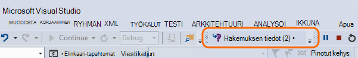
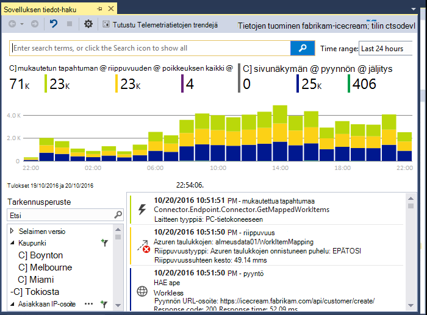
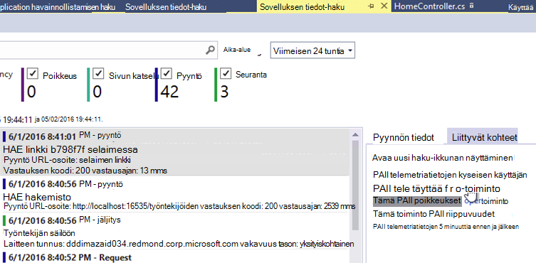
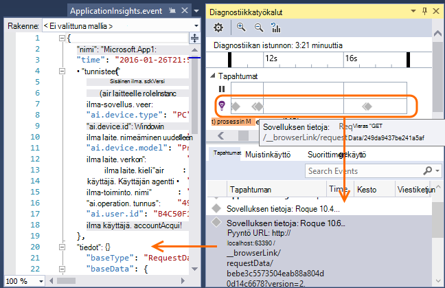
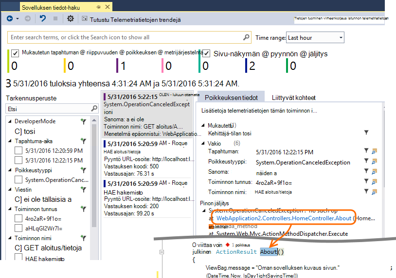
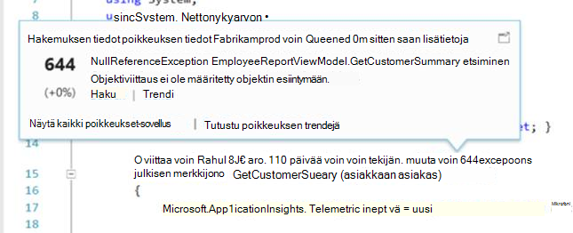
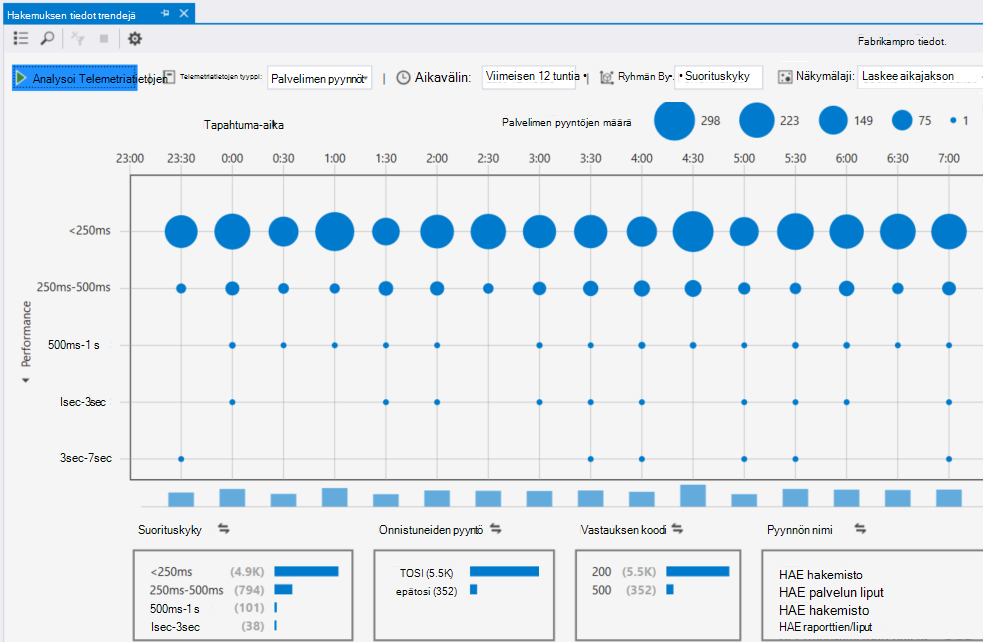

<properties 
    pageTitle="Visual Studio hakemuksen tiedot käyttäminen" 
    description="Suorituskyvyn analysointi ja diagnostiikka aikana virheenkorjaus ja tuotannon." 
    services="application-insights" 
    documentationCenter=".net"
    authors="alancameronwills" 
    manager="douge"/>

<tags 
    ms.service="application-insights" 
    ms.workload="tbd" 
    ms.tgt_pltfrm="ibiza" 
    ms.devlang="na" 
    ms.topic="get-started-article" 
    ms.date="06/21/2016" 
    ms.author="awills"/>

# Hakemuksen tiedot Visual Studiossa käsitteleminen

Visual Studiossa (2015 ja uudempi versio) voit analysoida suorituskykyä ja virheenkorjaus sekä tuotannon-ongelmien vianmääritys, käyttämällä telemetriatietojen [Visual Studio sovelluksen tiedot](app-insights-overview.md).

Jos et ole vielä [Asennettu sovelluksen tiedot-sovelluksen](app-insights-asp-net.md), tee se nyt.

## Projektin korjaaminen

Suorita sovellus F5-näppäintä ja kokeile,: Avaa Luo joitakin telemetriatietojen eri sivuille.

Visual Studiossa näet tapahtumat, jotka on kirjattu määrä.

Tällä painikkeella voit avata diagnostiikan haun. 

## Diagnostiikan haku

Etsi-ikkunassa näkyvät tapahtumat, jotka on kirjattu. (Jos olet kirjautunut Azure asentaessasi sovelluksen tietoja, voit voi etsiä saman tapahtumat-portaalissa.)

Tekstimuotoisen haku toimii kaikki tapahtumat kentät. Etsi esimerkiksi sivun; URL-Osoitteen osa tai ominaisuuden, kuten client paikkakunta; tai jäljitysloki esiintyy tietyt sanat.

Napsauttamalla mitä tahansa näet yksityiskohtaisia ominaisuuksia.

Voit myös avata voi selvittää epäonnistuneiden pyyntöjen tai poikkeuksia liittyvät kohteet-välilehti.

## Diagnostiikka-toiminnossa

Diagnostiikka-toiminnossa (Visual Studio 2015 tai uudempi) näyttää sovelluksen tiedot-palvelimen telemetriatietojen, kun se luodaan. Tämä toimii myös silloin, kun olet valinnut vain, jos haluat asentaa SDK-paketissa, niin muodostamisesta resurssin Azure-portaalissa.

## Poikkeukset

Jos sinulla on [määrittäminen poikkeuksien seurantaa](app-insights-asp-net-exceptions.md), poikkeuksen raporttien näkyy Etsi-ikkunassa. 

Valitse poikkeuksen pinon saamiseen. Jos sovelluksen koodi on avoinna Visual Studiossa, voit valita kautta pinon jäljitys-koodin haluamasi rivi.

Lisäksi koodin linssin rivillä kummassakin menetelmässä yläpuolella, näet poikkeukset kirjaamat sovelluksen tiedot-viimeisten 24 tunnin laskeminen.

## Paikallinen seuranta

(Valitse Visual Studio-2015 päivitys 2) Jos eivät ole määritetty lähettämään telemetriatietojen sovelluksen tiedot-portaaliin (niin, että ApplicationInsights.config ei ole instrumentation avainta) SDK diagnostiikka-ikkunassa näkyvät telemetriatietojen uusimmat muistin istunnosta. 

Tämä on toivottuja, jos olet jo julkaissut sovelluksen aiemman version. Et halua telemetriatietojen oman muistin istunnot saa sekoittaa telemetriatietojen julkaistun sovelluksen sovelluksen tiedot-portaalissa.

Se on hyötyä myös silloin, jos sinulla on joitakin [mukautetun telemetriatietojen](app-insights-api-custom-events-metrics.md) , jonka haluat korjata ennen lähettämistä telemetriatietojen portaaliin.

* *Ensimmäinen voin määritetty täysin sovelluksen tiedot lähetetään telemetriatietojen-portaaliin. Mutta nyt haluan nähdä telemetriatietojen Visual Studiossa.*

 * Etsi-ikkunassa asetukset on haun paikallisen Diagnostiikka, vaikka sovelluksen lähettää telemetriatietojen-portaaliin.
 * Lopeta telemetriatietojen on lähetetty-portaaliin, kommentoi pois rivi `<instrumentationkey>...` -ApplicationInsights.config. Kun olet valmis lähettämään telemetriatietojen portaaliin uudelleen, kommentointi sitä.

## Trendien

Trendien on työkalu kesäolympialaisten visualisointi, miten sovellus toimii ajan kuluessa. 

Valitse **Selaa Telemetriatietojen trendejä** sovelluksen tiedot-painike tai hakemuksen tiedot Etsi-ikkunassa. Valitse jokin viisi Yleiset kyselyt avulla pääset alkuun. Voit analysoida eri tietojoukkoja telemetriatietojen sekä aikavälien ja muiden ominaisuuksien perusteella. 

Etsiminen poikkeamia tiedoista, valitsemalla jokin seuraavista poikkeavuuksista asetuksiin "näkymälaji-valikko. Suodatusasetusten ikkunan alareunassa helpottavat tiivistäminen-että telemetriatietojen tietyn alijoukot.

[Lisätietoja trendejä](app-insights-visual-studio-trends.md).

## Mitä seuraavaksi?

||
|---|---
|**[Lisää tietoja](app-insights-asp-net-more.md)** Seurata käyttöä, käytettävyys, riippuvuudet, poikkeukset. Integroi jäljittää kirjaaminen kehysten kohteesta. Kirjoita mukautetun telemetriatietojen. | 
|**[Sovelluksen tiedot-portaalin käyttäminen](app-insights-dashboards.md)** Raporttinäkymien, diagnostiikka- ja analyyttisen tehokkaita työkaluja, ilmoitukset-sovellus ja telemetriatietojen live riippuvuuden kartan Vie. |

 
