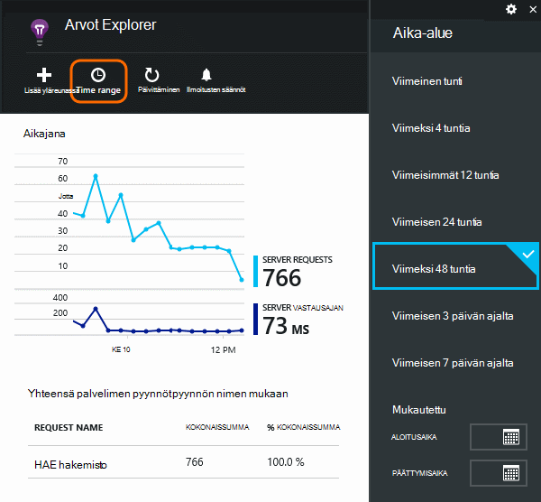
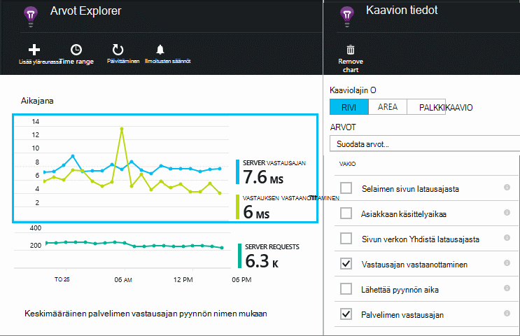
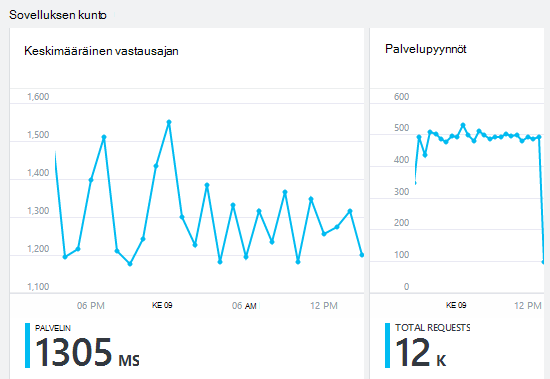
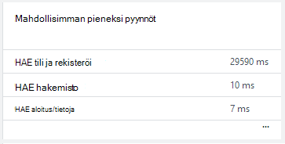
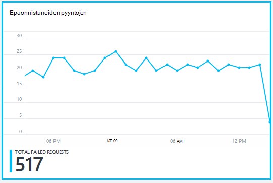
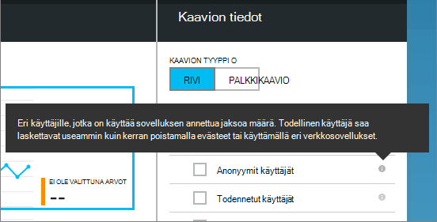
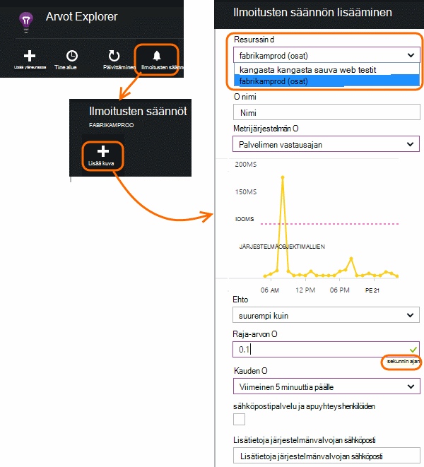

<properties 
    pageTitle="Seuraa sinua sovelluksen kunto ja käyttötapa ja hakemuksen tiedot" 
    description="Aloita sovelluksen tiedot. Analysoi käyttö, käytettävyys ja paikallisen tai Microsoft Azure-sovellusten suorituskykyä." 
    services="application-insights" 
    documentationCenter=""
    authors="alancameronwills" 
    manager="douge"/>

<tags 
    ms.service="application-insights" 
    ms.workload="tbd" 
    ms.tgt_pltfrm="ibiza" 
    ms.devlang="na" 
    ms.topic="article" 
    ms.date="11/25/2015" 
    ms.author="awills"/>
 
# Web-sovellusten suorituskyvyn seuranta

*Hakemuksen tiedot on esikatselu.*

Varmista, että sovelluksesi toimii hyvin ja tutustu nopeasti kaikki virheet. [Hakemuksen tiedot] [ start] kertoa kaikki suorituskykyongelmia ja poikkeukset ja etsiä ja syiden vianmäärityksen avulla.

Hakemuksen tiedot voit valvoa Java- ja ASP.NET web-sovellusten ja palveluiden, WCF-palveluiden. Ne voivat olla omissa tiloissa, näennäiskoneiden- tai Microsoft Azure-sivustoja. 

Asiakaspuolen sovelluksen tiedot voi kestää verkkosivuja ja monenlaisia laitteita, kuten iOS-, Android- ja Windows-kaupan sovellukset telemetriatietojen.

## Suorituskyvyn seurantaa määrittäminen

Jos et ole vielä lisännyt sovelluksen havainnollistamisen projektiin (eli jos se ei ole ApplicationInsights.config), valitse Aloita seuraavin tavoin:

* [ASP.NET web Apps-sovelluksista](app-insights-asp-net.md)
 * [Lisää poikkeus seuranta](app-insights-asp-net-exceptions.md)
 * [Lisää riippuvuuden seuranta](app-insights-monitor-performance-live-website-now.md)
* [J2EE web Apps-sovelluksista](app-insights-java-get-started.md)
 * [Lisää riippuvuuden seuranta](app-insights-java-agent.md)

## Suorituskyvyn mittarit tutustuminen

Siirry [Azure portaalin](https://portal.azure.com)hakemuksen tiedot resurssin, voit määrittää sovelluksen. Yhteenveto-sivu näyttää basic suorituskykytietoja:

Valitse mikä tahansa kaavio yksityiskohdat ja näet tulokset pidemmän. Napsauta esimerkiksi pyynnöt-ruutua ja valitse sitten aika-alue:

Napsauta kaaviota, voit valita, mitkä arvot, se näyttää, tai Lisää uusi kaavio ja valitse sen arvot:

> [AZURE.NOTE] **Poista kaikki arvot** , jos haluat nähdä koko valintaa, joka on käytettävissä. Määritetty ajoittuvat ryhmiä. Kun kaikki ryhmän jäsen on valittuna, vain muut jäsenet ryhmän näkyviin.

## Mitä se kaikki tarkoittaa? Suorituskyvyn ruudut ja raporteissa

Tällä suorituskyvyn mittarit, voit käyttää monenlaisia. Aloitetaan ne, jotka näkyvät oletusarvoisesti sovellusta-sivu.

### Palvelupyynnöt

HTTP-pyyntöjen tiettynä ajanjaksona määrä. Vertaa nähdäksesi, kuinka sovelluksen toimii kuormituksen kuin muissa raporteissa tulokset vaihtelee.

HTTP-pyyntöjen sisältää kaikki GET tai POST pyynnöt sivuja, tiedot ja kuvat.

Valitse Hanki laskee tietyn URL-ruutu.

### Keskimääräinen vastausajan

Mittaa pyytäminen web-sovelluksen ja palautetaan vastauksen kirjoittaminen välisen ajan.

Pisteet näyttää liukuvan keskiarvon. Jos luettelossa on paljon pyynnöt, ongelma saattaa olla osa, joka keskiarvon ilman ilmeisimmät piikin poiketa tai niitä kaavio.

Etsi epätavallisia päät. Toiminta, vastaus aikaa nousevat pyyntöjä nousu kanssa. Jos nousu on kohtuutonta, sovelluksen ehkä pallolla esimerkiksi suorittimen tai se käyttää palvelun kapasiteetin resurssirajoitukset.

Valitse Hanki kertaa tietyn URL-osoitteet-ruutu.

### Mahdollisimman pieneksi pyynnöt

Näyttää, mitä pyynnöt on ehkä suorituskyvyn säätö.

### Epäonnistuneiden pyyntöjen

Määrä, joka palautti aiheutetaan poikkeukset pyynnöt.

Tietojasi tietyn virheet-ruutua ja valitse yksittäisten pyynnön, saat sen tiedot. 

Yksittäisten tarkastukseen säilyttää vain edustava näyte virheet.

### Muita tietoja

Jos haluat nähdä muita tietoja, voit näyttää, napsauta kaaviota ja poista sitten kaikki Nähdäksesi käytettävissä kokonaan mittarit määrittäminen. Valitse (i) tarkastellaksesi kunkin metrijärjestelmä määritys.

Valitsemalla minkä tahansa metrijärjestelmä käytöstä muiden, jotka eivät voi näkyä samaan kaavioon.

## Ilmoitusten määrittäminen

Saat ilmoituksen sähköpostitse epätavallisia arvoista, mikä tahansa arvo, lisää ilmoituksen. Voit käyttää joko tilin järjestelmänvalvojille tai tietyn sähköpostiosoitteen sähköpostiviestin lähettäminen.

Resurssin ennen muiden ominaisuuksien määrittäminen. Älä valitse webtest resurssit, jos haluat määrittää ilmoituksia suorituskyvyn tai käyttö arvojen mukaisesti.

Varmista, ettet Huomaa yksiköiden, jossa sinua pyydetään antamaan raja-arvon.

*Lisää ilmoitus-painiketta ei näy.* – Tämä on ryhmän tili, joihin sinulla on vain luku-tilassa? Tilin järjestelmänvalvojalta.

## Ongelmien vianmäärityksessä

Seuraavassa on muutamia vinkkejä etsimis-ja ohjelmistossa suorituskykyongelmia.

* Määritä [web testit] [ availability] Jos haluat saada ilmoituksia, jos sivuston siirtyy tai vastaa virheellisesti tai hitaasti. 
* Vertaa pyynnön määrä ja muut arvot ovatko lataamaan liittyvät virheet tai hidas vastaus.
* [Lisää ja tee haku jäljitys lauseet] [ diagnostic] -koodin avulla pinpoint ongelmia.

## Seuraavat vaiheet

[Web-testien] [ availability] -web-pyynnöt lähetetään sovelluksen säännöllisin väliajoin eri puolilla maailmaa.

[Voit kerätä ja Etsi diagnostiikan jäljittää] [ diagnostic] - Lisää jäljittää kutsuja ja avulla voit paikantaa ongelmat tulokset eivät.

[Seurannan käyttö] [ usage] – Selvitä, miten käyttää sovelluksen.

[Vianmääritys] [ qna] - ja Q & A

## Video

[AZURE.VIDEO performance-monitoring-application-insights]

<!--Link references-->

[availability]: app-insights-monitor-web-app-availability.md
[diagnostic]: app-insights-diagnostic-search.md
[greenbrown]: app-insights-asp-net.md
[qna]: app-insights-troubleshoot-faq.md
[redfield]: app-insights-monitor-performance-live-website-now.md
[start]: app-insights-overview.md
[usage]: app-insights-web-track-usage.md

 
