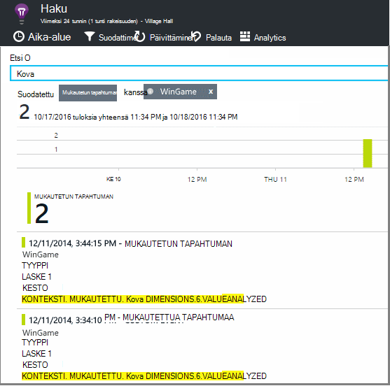

<properties 
    pageTitle="Web-sovellusten hakemuksen tiedot käyttöanalyysi" 
    description="Yleistä käyttöanalyysin web Apps-sovellusten kanssa hakemuksen tiedot" 
    services="application-insights" 
    documentationCenter=""
    authors="alancameronwills" 
    manager="douge"/>

<tags 
    ms.service="application-insights" 
    ms.workload="tbd" 
    ms.tgt_pltfrm="ibiza" 
    ms.devlang="na" 
    ms.topic="article" 
    ms.date="06/12/2016" 
    ms.author="awills"/>
 
# <a name="usage-analysis-for-web-applications-with-application-insights"></a>Web-sovellusten hakemuksen tiedot käyttöanalyysi

Tietää, miten käyttää sovelluksen avulla voit kehittäminen työsi keskittyä tilanteita, jotka ovat tärkeimpiä niihin ja käyttää tietoja kyselyjä, jotka kuin ohjeista Helpota tai vaikeaa saavuttamiseksi tavoitteista. 

Visual Studio hakemuksen tiedot on kahden tason käytön seuranta:

* **Käyttäjä, istunnon ja sivun tarkastella tietoja** - tarkoitettuun ruutuun ulos.  
* **Mukautettu telemetriatietojen** - [koodin kirjoittaminen] [ api] jäljittää käyttäjien lisääminen sovelluksen käyttökokemuksen kautta. 

## <a name="setting-up"></a>Asetusten määrittäminen

Avaa sovellus tiedot resurssin [Azure-portaalissa](https://portal.azure.com), valitse tyhjä selaimen sivun Lataa kaavion ja noudata asennusohjeita.

[Opi lisää](app-insights-javascript.md) 


## <a name="how-popular-is-my-web-application"></a>Miten Suositut on web-sovelluksen?

Kirjautuminen [Azure portal][portal], sovelluksen resurssin selaamalla ja valitse käyttö:


* **Käyttäjät:** Aikavälin kaavion eri aktiivinen käyttäjiä määrä. 
* **Istuntojen:** Istuntojen määrä
* **Page views** Laskee kutsuja trackPageView(), eli yleensä kerran jokaiselle sivulle.

Napsauta mitä tahansa kaavion yksityiskohdat. Huomaa, että voit muuttaa kaavion aikaväli.

### <a name="where-do-my-users-live"></a>Missä oma käyttäjät sijaitsevat?

Valitse käyttäjät-kaaviota, saat näkyviin tarkempia tietoja käyttö-sivu:


 
### <a name="what-browsers-or-operating-systems-do-they-use"></a>Mitä selaimia tai käyttöjärjestelmät ne käyttäminen

Tietojen ryhmitteleminen (segmentin) ominaisuuden, kuten selaimen, käyttöjärjestelmä tai kaupunki:


## <a name="sessions"></a>Istunnot

Istunto on ratkaisevan käsite-sovelluksen tiedot, jotka pyrkii yhdistää jokaisen telemetriatietojen tapahtuma - pyynnöt, sivun näkymät, poikkeukset, kuten tai mukautetut tapahtumat voit koodia itse - tietyn käyttäjäistunnon. 

RTF-kontekstitiedot kerätään tietoja istunnossa, kuten laitteen ominaisuuksien, geo sijainti, käyttöjärjestelmä ja niin edelleen.

Jos asiakkaan ja palvelimen soittimen ([ASP.NET] [ greenbrown] tai [J2EE][java]), SDK: T laajenevat istunnon tunnus asiakkaan ja palvelimen välillä, jotta voidaan korreloida tapahtumien molemmille puolille.

Kun [ongelmien][diagnostic], voit etsiä kaikki liity istuntoon, jossa virhe, mukaan lukien kaikki pyynnöt ja kaikki tapahtumat poikkeukset tai jäljittää, joka on kirjautunut telemetriatietojen.

Istunnot on hyvä mittayksikkö kontekstit, kuten laitteen, käyttöjärjestelmä tai sijainti suosion. Laitteen ryhmitelty istuntojen määrää näyttämällä esimerkiksi saat tarkempia määrä, kuinka usein laitteen käytetään, kun sovellus, kuin laskemalla sivun näkymät. Tämä on hyötyä syöte, minkä tahansa laitekohtaiset ongelman kiireellisyysjärjestys.


#### <a name="whats-a-session"></a>Tietoja istunnosta

Istunnon edustaa yhden kohdatessa käyttäjän ja sovelluksen välillä. Yksinkertaisin muodossaan istunnon avaamista sovelluksen käyttäjä alkaa ja on valmis, kun käyttäjä poistuu sovellus. Web-sovellusten oletusarvoisesti istunto päättyy 30 minuutin ajan kuluttua tai toiminnan 24 tunnin jälkeen. 

Voit muuttaa näitä oletusasetuksia Koodikatkelman muokkaaminen:

    <script type="text/javascript">
        var appInsights= ... { ... }({
            instrumentationKey: "...",
            sessionRenewalMs: 3600000,
            sessionExpirationMs: 172800000
        });

* `sessionRenewalMs`: Aika millisekunteina voimassa istunnon käyttäjän käyttämättömänä vuoksi. Oletusarvo: 30 minuuttia.
* `sessionExpirationMs`: Istunnon pituus millisekunteina. Jos käyttäjä on aktiivinen, tämän ajan kuluttua-istunnossa lasketaan. Oletusarvo: 24 tuntia.

**Istunnon kesto** on [metrijärjestelmä] [ metrics] , joka tallentaa tähän mennessä tehdyn istunnon ensimmäisen ja viimeisen telemetriatietojen-kohteiden välillä. (Se ei sisällä aikakatkaisuajan.)

**Istunnon Laske** tietyn aikavälin määritetään yksilöivä istuntojen joitakin aktiviteettiin määritetyn ajanjakson aikana määrä. Kun tarkastelet pitkä aikaväli, kuten päivittäisten istunnon Laske edellisen viikon, tämä on yleensä sama kuin istuntojen kokonaismäärä. 

Kun tutkiminen lyhentää aikavälin, kuten tunnin välein syyt, kestävät useita tuntia pitkän istunnon lasketaan kullekin tunnin, jossa istunnon aikana aktiivisena. 

## <a name="users-and-user-counts"></a>Käyttäjien ja käyttäjän arvo


Kunkin käyttäjän istuntoon on liitetty yksilöllinen käyttäjätunnus. 

Oletusarvon mukaan käyttäjä tunnistetaan sijoittamalla eväste. Käyttäjä, joka käyttää useita selaimet tai laitteiden lasketaan useita kertoja. (Mutta Katso [todennetut käyttäjät](#authenticated-users))


**Käyttäjän Laske** metrijärjestelmä tietyn aikavälin määritellään käyttäjien lukumäärä tallennettujen aktiviteettiin määritetyn ajanjakson aikana. Tuloksena käyttäjät, joilla on pitkä istuntojen saattaa käsitellään useita kertoja, kun olet aikavälin siten, että syyt on pienempi kuin tunnin tai niin.

**Uudet käyttäjät** laskee käyttäjät, joiden ensimmäinen istuntojen sovelluksen tapahtui määritetyn ajanjakson aikana. Jos käytössä on oletustapa, laskee käyttäjien evästeet, valitse tämä kuuluvat myös käyttäjille, jotka olet poistanut niiden evästeet tai käyttävien uuden laitteen tai selaimen käyttää sovelluksen ensimmäisen kerran.


### <a name="authenticated-users"></a>Todennetut käyttäjät

Jos web-sovelluksen avulla käyttäjät voivat kirjautua sisään, saat tarkempia Laske antamalla yksilöllinen käyttäjätunnus sovelluksen tiedot. Se ei ole henkilön nimi tai tunnus, jota käytetään sovelluksen. Kun sovellus on määritetty käyttäjälle, käytettävä koodi:


*Asiakastietokoneen JavaScript*

      appInsights.setAuthenticatedUserContext(userId);

Jos sovelluksen groups käyttäjien tileille, voit myös siirtää tilin tunnus. 

      appInsights.setAuthenticatedUserContext(userId, accountId);

Käyttäjä- ja tunnukset ei saa olla välilyöntejä tai merkkejä`,;=|`


Voit luoda kaavion **Todennetut käyttäjät** ja - **tilien** [arvot explorer](app-insights-metrics-explorer.md). 

## <a name="synthetic-traffic"></a>Synteettiset liikenne

Synteettiset liikenne sisältää pyynnöt käytettävyys ja lataa kokeet, hakureille ja muut käyttäjäagenttien. 

Sovelluksen tiedot yritystä pyrkii automaattisesti selvittää ja luokita synteettistä liikenteen ja merkitse se oikein. Useimmissa tapauksissa synteettistä liikenne ei ole ongelma JavaScript SDK-paketissa, niin, että tämä toiminto ei sisälly käyttäjä- ja Laske-istunnon. 

Kuitenkin sovelluksen havainnollistamisen [web testejä]varten[availability], käyttäjätunnus on automaattisesti määritetty perustuvat POP-sijaintiin ja istunnon tunnus määritetään testin suorittaminen tunnuksen perusteella. Oletusarvon raportit, synteettiset liikenne suodatetaan oletusarvon mukaan sulkee pois nämä käyttäjät ja istuntoja. Kuitenkin kun synteettistä liikenne on lisätty, se saattaa aiheuttaa pieni Suurenna yleistä käyttäjät ja istunnon määrät.
 
## <a name="page-usage"></a>Sivun käyttö

Napsauttamalla saat lisää Zoomaa-version kanssa hajautuksen Suosituimmat sivut sivun näkymät-kaavion avulla:


 
Yllä olevassa esimerkissä on visualisointi n sivustosta. Siitä välittömästi näkyvissä:

* Edellisen viikon käyttö ei ole entistä parempi. Ehkäpä olemme kannattaa ottaa huomioon hakukoneoptimointi?
* Monta vähemmän henkilöt näkevät visualisointi n sivut kuin aloitussivulle. Miksi Microsoftin kotisivun ei herättää muiden visualisointi n toistaa?
* 'Crossword' on eniten käytetyt Ottelu. Olemme tulisi ilmoittaa prioriteetti uusia ideoita ja parannukset siellä.

## <a name="custom-tracking"></a>Mukautetun seuranta

Oletetaan, että oletetaan, että sen sijaan, että kunkin Ottelu käyttöönoton eri web-sivua, päätät refactor ne kaikki sovellukseen saman yhden-koodattu web-sivun Javascript toiminnot eniten. Tämän avulla käyttäjä voi siirtyä nopeasti yhden Ottelu väliltä tai on myös useita visualisointi n yhdelle sivulle. 

Mutta haluat silti sovelluksen havainnollistamisen kirjautua kuinka monta kertaa, kunkin Ottelu aukeaa, samalla tavalla kuin kun siirretyt eri web-sivuille. Tämä on helppoa: puhelun telemetriatietojen-moduulin lisääminen vain oman JavaScript haluamaasi tietueeseen, joka on avattu uuden 'sivun':

    appInsights.trackPageView(game.Name);

## <a name="custom-events"></a>Mukautetut tapahtumat

Kirjoita mukautetun telemetriatietojen kirjautua tiettyjä tapahtumia. Erityisesti yhden-sovelluksen kannattaa kuinka usein käyttäjän suorittaa tietyn toiminnot tai kertyy tiettyjä tavoitteet: 

    appInsights.trackEvent("GameEnd");

Jos esimerkiksi Kirjaudu napsauttamalla linkkiä:

    <a href="target.htm" onclick="appInsights.trackEvent('linkClick');return true;">my link</a>


## <a name="view-counts-of-custom-events"></a>Näytä määrät mukautetut tapahtumat

Avaa Resurssienhallinta arvot ja tapahtumien kaavion. Määritetään nimen mukaan:


## <a name="drill-into-specific-events"></a>Siirtyminen tiettyyn tapahtumat

Saat paremman käsityksen siitä, miten tyypillinen istunnon menee, haluat ehkä keskittyä tietyn käyttäjäistunnon, joka sisältää tietyn tyyppisiä tapahtuman. 

Tässä esimerkissä on koodattu mukautetun tapahtuman "NoGame", jota kutsutaan, jos käyttäjä kirjautuu käynnistämättä todella Ottelu. Miksi käyttäjän tehdään? Ehkäpä Jos olemme siirtyminen joitakin tiettyjä esiintymät, emme palautetaan virhe clue. 

Mukautetut tapahtumat vastaanotetut sovelluksen luetellaan nimi yhteenveto-sivu:


 
Tapahtuman halutut selaamalla ja valitse viimeisimmät tietyn esiintymä:


 
Katsotaan telemetriatietojen istunnon, jossa tietyn NoGame tapahtuma ilmeni. 


 
Oli poikkeuksia, jolloin käyttäjä ei voi toistaa joissakin virhe.
 
Emme voi suodattaa kaikenlaisia telemetriatietojen lukuun ottamatta sivun näkymät, tämän istunnon aikana:


 
Ja nyt näemme, että vain, jos haluat tarkistaa uusimman tulosten kirjautunut käyttäjä. Ehkäpä olemme kannattaa harkita, joka on helppo tehdä käyttäjän Tarinan kehittäminen. (Ja on olisi mukautetun tapahtuman raporttiin tietyn juttu toteutuessa.)

## <a name="filter-search-and-segment-your-data-with-properties"></a>Suodattaminen, Etsi ja määritetään tietojen ominaisuudet
Voit liittää haluamaansa tunnisteet ja numeerisia arvoja tapahtumat.
 

*Asiakastietokoneen JavaScript*

```JavaScript

    appInsights.trackEvent("WinGame",
        // String properties:
        {Game: currentGame.name, Difficulty: currentGame.difficulty},
        // Numeric measurements:
        {Score: currentGame.score, Opponents: currentGame.opponentCount}
    );
```

*C#-palvelimessa*

```C#

    // Set up some properties:
    var properties = new Dictionary <string, string> 
        {{"game", currentGame.Name}, {"difficulty", currentGame.Difficulty}};
    var measurements = new Dictionary <string, double>
        {{"Score", currentGame.Score}, {"Opponents", currentGame.OpponentCount}};

    // Send the event:
    telemetry.TrackEvent("WinGame", properties, measurements);
```

*VB-palvelimessa*

```VB

    ' Set up some properties:
    Dim properties = New Dictionary (Of String, String)
    properties.Add("game", currentGame.Name)
    properties.Add("difficulty", currentGame.Difficulty)

    Dim measurements = New Dictionary (Of String, Double)
    measurements.Add("Score", currentGame.Score)
    measurements.Add("Opponents", currentGame.OpponentCount)

    ' Send the event:
    telemetry.TrackEvent("WinGame", properties, measurements)
```

Liitä ominaisuudet sivun näkymät samalla tavalla:

*Asiakastietokoneen JavaScript*

```JS

    appInsights.trackPageView("Win", 
        url,
        {Game: currentGame.Name}, 
        {Score: currentGame.Score});
```

Diagnostiikan hakutoiminnossa tarkastella ominaisuuksia valitsemalla tapahtuman yksittäisen esiintymän kautta.


 
Tapahtuman esiintymien tietyn kiinteistöistä, joiden arvo hakukentän avulla.





## <a name="a--b-testing"></a>A | B testaaminen

Jos et tiedä ominaisuus muuttujan onnistuisi enemmän, Vapauta molempien on, että kunkin käytettävissä eri käyttäjille. Arvioivat onnistumista kunkin ja siirrä sitten yhdistetty versio.

Tätä tapaa, voit liittää eri tunnisteet kaikki telemetriatietojen, joka lähetetään kunkin sovelluksen-versiossa. Tämän voi tehdä määrittämällä aktiivisen TelemetryContext ominaisuudet. Nämä oletusominaisuudet lisätään viestiin telemetriatietojen, joka lähettää sovelluksen – et pelkästään mukautettuja viestejä, mutta myös vakio telemetriatietojen. 

Valitse sovelluksen tiedot-portaalissa voit sitten voi Suodata ja Ryhmittele (segmentin) tietojen tunnisteiden siten, että vertailla eri versioita.

*C#-palvelimessa*

```C#

    using Microsoft.ApplicationInsights.DataContracts;

    var context = new TelemetryContext();
    context.Properties["Game"] = currentGame.Name;
    var telemetry = new TelemetryClient(context);
    // Now all telemetry will automatically be sent with the context property:
    telemetry.TrackEvent("WinGame");
```

*VB-palvelimessa*

```VB

    Dim context = New TelemetryContext
    context.Properties("Game") = currentGame.Name
    Dim telemetry = New TelemetryClient(context)
    ' Now all telemetry will automatically be sent with the context property:
    telemetry.TrackEvent("WinGame")
```

Yksittäisten telemetriatietojen voit ohittaa oletusarvot.

Voit määrittää yleinen alustaja niin, että kaikki uudet TelemetryClients automaattisesi että kontekstissa.

```C#


    // Telemetry initializer class
    public class MyTelemetryInitializer : ITelemetryInitializer
    {
        public void Initialize (ITelemetry telemetry)
        {
            telemetry.Properties["AppVersion"] = "v2.1";
        }
    }
```

Valitse sovellus-alustaja, kuten Global.asax.cs:

```C#

    protected void Application_Start()
    {
        // ...
        TelemetryConfiguration.Active.TelemetryInitializers
        .Add(new MyTelemetryInitializer());
    }
```


## <a name="build---measure---learn"></a>Muodosta - mitta - tietoja

Kun analytics, siitä tulee kehittäminen jakson – ei vain jotakin tietoja-ikkuna, jonka avulla ratkaiseminen mielestäsi integroitu osa. Seuraavassa on vihjeitä:

* Määrittää sovelluksen tärkeimmistä arvo. Haluatko, että niin monta käyttäjää mahdollisimman tai mieluummin on pieni joukko erittäin käyttäjille? Haluatko vierailut tai myynti suurentaminen?
* Mittaa kunkin Tarinan suunnitteleminen. Kun uusi käyttäjä Tarinan luonnos tai toimintoa, tai päivittää aiemmin luodun suunnitelma aina mietittävä, miten haluat mitata muutos onnistuu. Kysy ennen coding käynnistyy, "mikä vaikutus tämä on Microsoftin arvojen mukaisesti, jos se toimii? Olemme Jäljitä minkä tahansa uusille tapahtumille?"
Ja, kun ominaisuus on käytettävissä, varmista, että analysointitietoja tarkastelemalla ja toimia tulokset. 
* Suhteiden avaimen metrijärjestelmä muita tietoja. Esimerkiksi jos lisäät "Suosikit"-toimintoa, jonka haluat tietää, kuinka usein käyttäjät lisäävät Suosikit. Mutta se on ehkä Lisää kiinnostavat tietää, kuinka usein ne tulevat takaisin niiden suosikkeihin. Ja tärkeintä, asiakkaat, jotka käyttävät Suosikit kädessä ostaa lisää tuote?
* Kanarian testaamiseen. Määritä ominaisuus-valitsin, jonka avulla voit luoda uuden toiminnon vain joidenkin käyttäjien nähtävissä. Hakemuksen tiedot avulla voit nähdä, onko uutta toimintoa käytetään olet suunnitelluista tavalla. Muutosten tekeminen, ja vapauta se kaikille vastaanottajille.
* Keskustele käyttäjille! Analytics ei riitä sellaisenaan, mutta komplementtivirhefunktion ylläpito hyvä asiakassuhteen.


## <a name="references"></a>Viittaukset

* [-Ohjelmointirajapinnan käyttäminen yleiskatsaus][api]
* [JavaScript-Ohjelmointirajapinnan viittaus](https://github.com/Microsoft/ApplicationInsights-JS/blob/master/API-reference.md)

## <a name="video"></a>Video

> [AZURE.VIDEO usage-monitoring-application-insights]


<!--Link references-->

[api]: app-insights-api-custom-events-metrics.md
[availability]: app-insights-monitor-web-app-availability.md
[client]: app-insights-javascript.md
[diagnostic]: app-insights-diagnostic-search.md
[greenbrown]: app-insights-asp-net.md
[java]: app-insights-java-get-started.md
[metrics]: app-insights-metrics-explorer.md
[portal]: http://portal.azure.com/
[windows]: app-insights-windows-get-started.md

 
