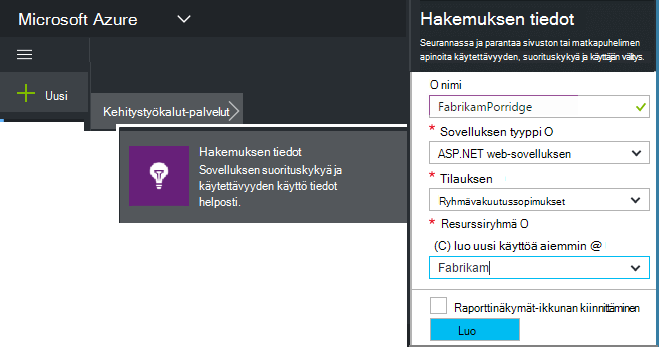
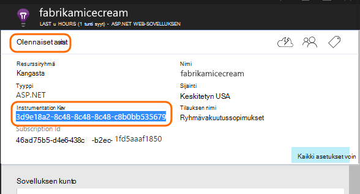
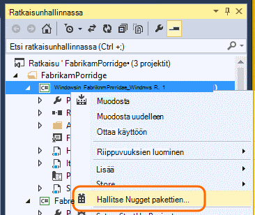
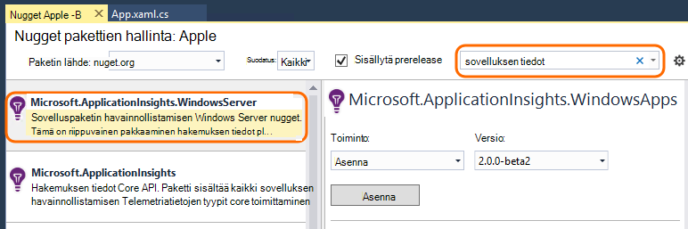
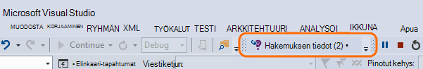
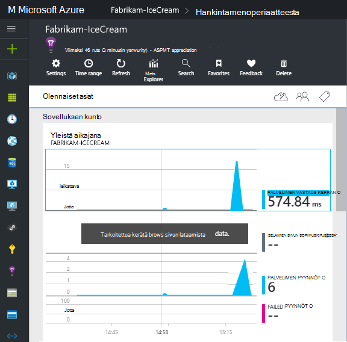
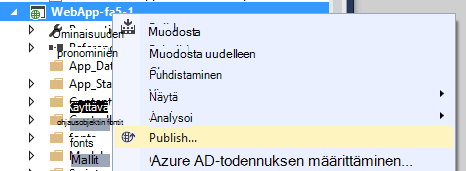

<properties
    pageTitle="Tietoja Windows sovelluspalveluja ja työntekijä roolit | Microsoft Azure"
    description="Lisää sovellus havainnollistamisen SDK manuaalisesti ASP.NET-sovelluksen käyttö, käytettävyys ja suorituskyvyn analysointia varten."
    services="application-insights"
    documentationCenter=".net"
    authors="alancameronwills"
    manager="douge"/>

<tags
    ms.service="application-insights"
    ms.workload="tbd"
    ms.tgt_pltfrm="ibiza"
    ms.devlang="na"
    ms.topic="get-started-article"
    ms.date="08/30/2016"
    ms.author="awills"/>

# Manuaalisesta sovelluksen havainnollistamisen ASP.NET 4-sovellukset

*Hakemuksen tiedot on esikatselu.*

[AZURE.INCLUDE [app-insights-selector-get-started](../../includes/app-insights-selector-get-started.md)]

Voit määrittää manuaalisesti [Visual Studio hakemuksen tiedot](app-insights-overview.md) seurannassa Windows services, työntekijä roolit ja ASP.NET-sovelluksia. Verkkosovelluksissa Manuaalinen määritys on vaihtoehtoinen Visual Studio tarjoamia [Automaattinen käyttöönottoa varten](app-insights-asp-net.md) .

Hakemuksen tiedot avulla voit selvittää asentamisongelmat ja suorituskyvyn seuranta ja live-sovelluksen käyttö.

#### Ennen aloittamista

Tarvitset:

* [Microsoft Azure](http://azure.com)-tilausta. Jos ryhmäsi tai organisaation on Azure-tilaus, omistaja voi lisätä voit, käyttämällä [Microsoft-tili](http://live.com).
* Visual Studio 2013 tai uudempi versio.

## 1. sovelluksen tiedot-resurssin luominen

Kirjautuminen [Azure portal](https://portal.azure.com/)ja luo uusi sovelluksen havainnollistamisen resurssi. Valitse ASP.NET sovelluksen tyyppi.

[Resurssin](app-insights-resources-roles-access-control.md) Azure-tietokannassa on erillisen palvelun. Resurssi on kohtaa, johon telemetriatietojen sovelluksestasi analysoida ja esittää sinulle.

Sovelluksen tyyppi määritysvaihtoehdoista asettaa oletussisältö resurssin näiden ja ominaisuudet näkyvät [Arvot](app-insights-metrics-explorer.md)Resurssienhallinnassa.

#### Kopioi Instrumentation avain

Resurssin yksilöivä avain ja asentaa sen pian SDK: ssa voidaan ohjata resurssin tiedot.

Luo uusi resurssi vain työn vaiheet ovat erinomainen tapa seurannan minkä tahansa sovelluksen käynnistäminen. Nyt voit lähettää tietoja siihen.

## 2. Asenna SDK-sovelluksessa

Asentaminen ja määrittäminen sovelluksen havainnollistamisen SDK vaihtelee sen mukaan, jonka parissa työskentelet ympäristössä. ASP.NET-sovellusten on helppoa.

1. Muokkaa Visual Studion web app-projektin NuGet-paketit.

    

2. Asenna sovellus havainnollistamisen SDK verkkosovelluksissa.

    

    *Muiden pakettien käyttäminen*

    Kyllä. Valitse Core Ohjelmointirajapinnan (Microsoft.ApplicationInsights), jos haluat lähettää oman telemetriatietojen Ohjelmointirajapinnan avulla. Windows Server-paketti sisältää automaattisesti Core Ohjelmointirajapinnan ja muiden pakettien, kuten suorituskyvyn laskuri sivustokokoelman ja riippuvuuden seuranta määrä. 

#### Tulevien SDK-versioiden päivittäminen

Olemme Vapauta SDK: N uusi versio aika.

Päivitä [SDK: N uusi versio](https://github.com/Microsoft/ApplicationInsights-dotnet-server/releases/), Avaa NuGet pakettien hallinta uudelleen ja suodattaa asennetuista paketeista. Valitse **Microsoft.ApplicationInsights.Web** ja valitse **Päivitä**.

Jos olet tehnyt kaikki mukautukset ApplicationInsights.config, tallentaa sen ennen päivittäminen ja yhdistää muutokset jälkeenpäin uuteen versioon.

## 3. Lähetä telemetriatietojen

**Jos olet asentanut core API-paketin:**

* Määrittää instrumentation avain koodi, kuten `main()`: 

    `TelemetryConfiguration.Active.InstrumentationKey = "`*key-tuotetunnuksen*`";` 

* [Kirjoita oman telemetriatietojen Ohjelmointirajapinnan käyttäminen](app-insights-api-custom-events-metrics.md#ikey).

**Jos olet asentanut sovelluksen tietoja muiden pakettien** voit halutessasi määrittää instrumentation käyttäjäavainten .config-tiedoston avulla:

* Muokkaa ApplicationInsights.config (joka on lisätty NuGet Asenna mukaan). Lisää lopetus-tunnisteen eteen:

    `<InstrumentationKey>`*instrumentation kopioimasi avaimen*`</InstrumentationKey>`

* Varmista, että ratkaisunhallinnassa ApplicationInsights.config ominaisuudet määritetään **luominen toiminnon = sisältöä, kopioi tulosteen kansioon = kopioi**.

## Projektin suorittaminen

Suorita sovellus ja kokeile **F5** avulla: Avaa Luo joitakin telemetriatietojen eri sivuille.

Visual Studiossa näet tapahtumat, jotka on lähetetty määrä.

## Näytä oman telemetriatietojen

Palaa [Azure portal](https://portal.azure.com/) ja Etsi sovellus tiedot resurssin.

Etsi yleiskuvaus kaavioiden tiedot. Ensimmäinen näet vain yksi tai kaksi pistettä. Esimerkki:

Napsauttamalla mitä tahansa kaavion saat näkyviin lisää arvot. [Lue lisää arvot.](app-insights-web-monitor-performance.md)

#### Tietoja?

* Sovelluksen avaaminen eri sivuille, niin, että se luo joitakin telemetriatietojen avulla.
* Avaa [Etsi](app-insights-diagnostic-search.md) -ruudun Nähdäksesi yksittäiset tapahtumat. Joskus kestää tapahtumien hieman samalla, kun se on pidempi tulee arvot putkijohto.
* Odota hetki ja valitsemalla **Päivitä**. Kaavioiden päivittää itse säännöllisesti, mutta voit päivittää manuaalisesti jos odotat sisäänpääsyä joitakin-tiedot näkyvät.
* Katso [vianmääritys](app-insights-troubleshoot-faq.md).

## Sovelluksen julkaiseminen

Nyt sovelluksen käyttöönotto-palvelimeen tai Azure ja katso saavutustasopisteet tiedot.

Kun suoritat virheenkorjaus-tilassa, telemetriatietojen on toimitettu kautta putkijohto, niin, että pitäisi näkyä muutamassa tiedot. Kun asennat sovelluksen Release kokoonpanossa, tietojen kasvaa hitaammin.

#### Kun julkaiset palvelimellesi tietoja?

Avaa palvelimen palomuurin porttien lähtevän tietoliikenteen:

+ `dc.services.visualstudio.com:443`
+ `f5.services.visualstudio.com:443`

#### Muodosta palvelimeen ongelmia?

Katso [Tämä vianmääritys kohde](app-insights-asp-net-troubleshoot-no-data.md#NuGetBuild).

> [AZURE.NOTE]Jos sovelluksen Luo telemetriatietojen paljon (ja käytät ASP.NET SDK-version 2.0.0-beta3 tai uudempi), mukautuvat esimerkkejä moduulin automaattisesti vähentää asema, joka lähetetään portaalin lähettämällä vain edustava luku tapahtumat. Tapahtumat, jotka liittyvät pyynnössä kuitenkin valittuna tai valitsematta ryhmänä ja siten, että voit siirtyä niihin liittyvät tapahtumat. 
> [Lue lisää esimerkkejä](app-insights-sampling.md).

## Seuraavat vaiheet

* Sovelluksen täydellinen 360 asteen näkymän [lisääminen Lisää telemetriatietojen](app-insights-asp-net-more.md) .

