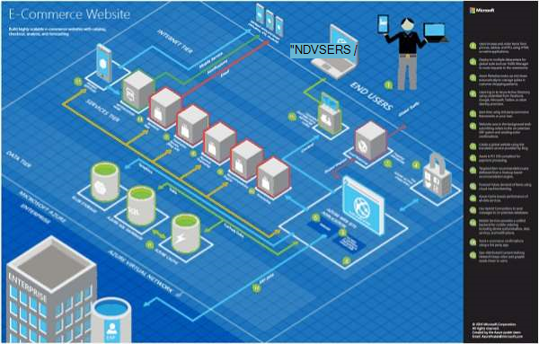

<properties 
    pageTitle="Microsoft Azure-arkkitehtuuri sovelluksen | Microsoft Azure" 
    description="Arkkitehtuuri yhteenveto, joka kattaa Yleiset rakenne-mallit" 
    services="" 
    documentationCenter="" 
    authors="Rboucher" 
    manager="jwhit" 
    editor="mattshel"/>

<tags 
    ms.service="multiple" 
    ms.workload="na" 
    ms.tgt_pltfrm="na" 
    ms.devlang="na" 
    ms.topic="article" 
    ms.date="09/13/2016" 
    ms.author="robb"/>

#Sovelluksen Microsoft Azure-arkkitehtuuri
Resurssit, jotka käyttävät Microsoft Azure sovellusten luomiseen. Tämä sisältää työkaluja, joiden avulla voit piirtää kaavioita kuvaamaan ohjelmistojärjestelmien visuaalisesti. 

##Rakenteen kuviot juliste

Microsoft kuvioiden ja käytännöistä on julkaistu kirjan [Cloud rakenne kuvioita](http://msdn.microsoft.com/library/dn568099.aspx) on käytettävissä MSDN- ja PDF-lataaminen. On myös suuri muoto-julisteen jossa luetellaan kaikki kuviot. 

##Microsoft arkkitehtuuri sertifikaatin kurssi

Microsoft on luonut tukevat Microsoft sertifikaatin koe 70-534 arkkitehtuuri-kurssin. Se on [saatavilla maksutta EDX.ORG](https://www.edx.org/course/architecting-microsoft-azure-solutions-microsoft-dev205x).  Se käyttää [3D Sinikopio Visio-malli](#3d-blueprint-visio-template). 

##Microsoft-ratkaisut

Microsoft julkaisee korkean tason [ratkaisu arkkitehtuureihin](http://aka.ms/azblueprints) esittää, kuinka luominen käyttämällä Microsoft-tuotteiden järjestelmien tietyntyyppiset joukko. 

Microsoft julkaistu aikaisemmin, toimintakaavioita, jossa Esimerkki arkkitehtuureihin joukko. Ne on korvattu mainittiin ratkaisu arkkitehtuureihin ja siten, että ne on ohjattu Sinikopio-linkkiä. Jos tarvitset edellisen toimintakaavioita materiaalien, jostain syystä, Määritä sähköposti [CnESymbols@microsoft.com](mailto:CnESymbols@microsoft.com) pyynnön mukana.   

[Cloud ja yrityksen merkistö](#Drawing-symbol-and-icon-sets)-osien avulla toimintakaavioita ja ratkaisu arkkitehtuureihin kaaviot.   

##3D Sinikopio Visio-malli

Nyt defunct [Microsoft arkkitehtuuri toimintakaavioita](http://aka.ms/azblueprints) 3D-versiot on alun perin luotu-Microsoft työkalu. Visio 2013 (ja uudempi versio)-mallin toimitetaan 5. elokuu 2015 osana [Microsoft-arkkitehtuuri sertifikaatin kurssin jakaa EDX.ORG](#microsoft-architecture-certification-course).

Malli on myös käytettävissä kurssin ulkopuolella. 

- [Näytä video koulutus](http://aka.ms/3dBlueprintTemplateVideo) ensimmäisen, jotta tiedät, mitä voit tehdä   
- Lataa [Microsoft 3d Sinikopio Visio-malli](http://aka.ms/3DBlueprintTemplate)
- Lataa [Cloud ja yrityksen symbolit](#drawing-symbol-and-icon-sets) käyttämään 3D-malli. 

Sähköpostin osoitteeseen [CnESymbols@microsoft.com](mailto:CnESymbols@microsoft.com) , jos sinulla ei vastattu koulutusmateriaalin tai jos haluat antaa palautetta. Mallia ei ole enää aktiivinen kehitteillä, mutta se on edelleen hyödyllinen ja asiaa, koska se voi käyttää mitä tahansa PNG- tai [pilvi ja yrityksen merkit](#drawing-symbol-and-icon-sets), jotka päivitetään.  

##Piirustuksen symboli ja kuvake 

[Tarkastele Visio ja symbolit koulutus video](http://aka.ms/CnESymbolsVideo) ja valitse sitten [Lataa pilveen ja yrityksen merkistö](http://aka.ms/CnESymbols) avulla voit luoda tekniset materiaalien, jotka kuvaavat Azure-, Windows Server-, SQL Server- ja lisää. Voit käyttää verkkoarkkitehtuurikaavioita, koulutusmateriaalin, esityksiä, taulukkonäkymissä, infographics, tiedotteet ja jopa 3 osapuolen kirjat symbolien Jos kirjan harjoittaa käyttäjiä käyttämään Microsoft-tuotteiden. Mutta niitä ei ole tarkoitettu käytettäviksi käyttöliittymien välillä.

CnE symbolit ovat Visio SVG ja PNG-muodossa. Lisäohjeita siitä, miten voit käyttää helposti käyttää symbolit PowerPointin sisältyvät joukkoon. 

Merkistön osana neljännesvuosittain, ja päivitetään, kun uusia palveluja on julkaistu. 

Lisää merkkejä Microsoft Officea ja Aiheeseen liittyvät tekniikat ovat käytettävissä [Microsoft Office Visio-kaavain](http://www.microsoft.com/en-us/download/details.aspx?id=35772), vaikka heillä ei ole optimoitu arkkitehtuuri kaavioita, kuten CnE on.   

**Palautetta:** Jos olet käyttänyt CnE symbolit, lyhyt 5 kysymys [kyselyn](http://aka.ms/azuresymbolssurveyv2) täyttö tai sähköpostia osoitteeseen [CnESymbols@microsoft.com](mailto:CnESymbols@microsoft.com) kysymyksiä ja ongelmia. Haluamme tietää, mitä ottaa huomioon, mukaan lukien positiivinen palautetta, jotta olemme näkevät Jatka sijoittamaan ne aikaa. 

##Arkkitehtuuri Infographics

Microsoft julkaisee useita arkkitehtuuri liittyvät julisteet/infographics. He ovat [Tosielämän Cloud sovellusten](https://azure.microsoft.com/documentation/infographics/building-real-world-cloud-apps/) ja [Skaalaus pilvipalveluihin](https://azure.microsoft.com/documentation/infographics/cloud-services/) . 

