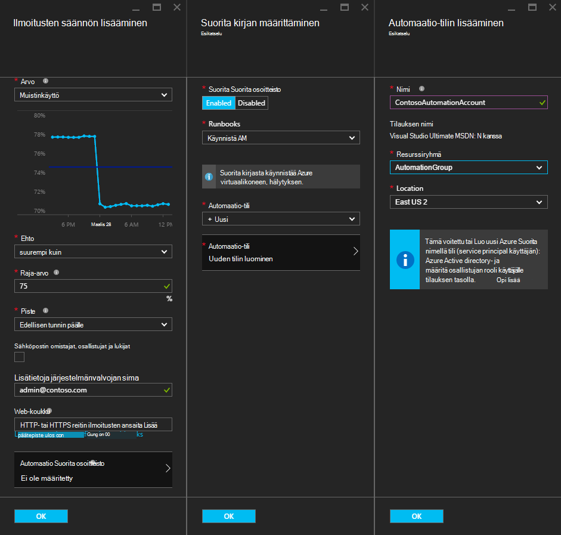
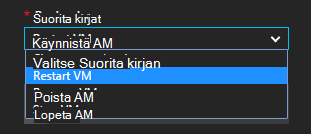
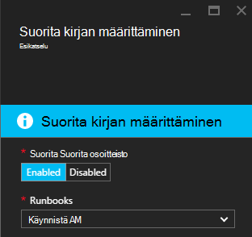
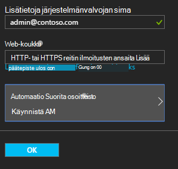

<properties
    pageTitle=" Riskien parantaminen Azure AM varoittaa automaatio Runbooks | Microsoft Azure"
    description="Tässä artikkelissa kerrotaan, miten Azure virtuaalikoneen ilmoitusten integrointi Azure automaatio runbooks ja riskien parantaminen ongelmat automaattisesti"
    services="automation"
    documentationCenter=""
    authors="mgoedtel"
    manager="jwhit"
    editor="tysonn" />    
<tags
    ms.service="automation"
    ms.devlang="na"
    ms.topic="article"
    ms.tgt_pltfrm="na"
    ms.workload="infrastructure-services"
    ms.date="06/14/2016"
    ms.author="csand;magoedte" />

# <a name="azure-automation-scenario---remediate-azure-vm-alerts"></a>Azure automaatio-skenaario – riskien Azure AM ilmoitusten parantaminen

Azure automaatio ja Azuren näennäiskoneiden on julkaistu uusi ominaisuus, jonka avulla voi suorittaa automaatio runbooks virtuaalikoneen (AM) ilmoitusten määrittäminen. Tämän uuden ominaisuuden avulla voit suorittaa automaattisesti vastauksena AM ilmoituksia, kuten uudelleenkäynnistyksen tai pysäyttää AM vakio korjaus.

Aiemmin AM hälytyksen luonnin aikana ehdit [määrittää automaatio-webhook](https://azure.microsoft.com/blog/using-azure-automation-to-take-actions-on-azure-alerts/) runbookin jotta voit suorittaa: n runbookin aina hälytyksen. Tämä edellyttää kuitenkin voit tehdä tarvittavat työt luominen: n runbookin, luomista varten n runbookin webhook ja kopioimalla ja liittämällä webhook hälytyksen luonnin aikana. Tämä uusi versio julkaistaan prosessi on helpompaa, koska voit valita runbookin suoraan luettelon hälytyksen luonnin aikana, ja voit valita, jolloin suorittaa: n runbookin tai luo tili helposti automaatio-tiliä.

Tässä artikkelissa esitellään, miten helppoa on Azure AM ilmoituksen ja automaatio-runbookin suoritetaan aina, kun ilmoituksen käynnistää määrittäminen. Esimerkkejä eri tilanteista ole uudelleenkäynnistyksen AM, kun muistinkäyttö joidenkin kynnysarvo vuoksi kanssa muistivuoto AM-sovellukseen tai pysähtyy AM, kun suorittimen Käyttäjäaika on kulunut alle 1 % edellisen tunnin ja ei ole käytössä. Myös kerromme, miten tärkeimmät automaatio-tilisi palvelun automaattinen luominen yksinkertaistaa Azure ilmoitusten korjaus runbooks käyttö.

## <a name="create-an-alert-on-a-vm"></a>Ilmoituksen luominen AM

Seuraavien toimien määrittäminen ilmoituksen käynnistää runbookin, kun sen raja on saavutettu.

>[AZURE.NOTE] Tässä versiossa on vain tuki V2 näennäiskoneiden ja tukea perinteinen VMs lisätään pian.  

1. Kirjaudu sisään Azure-portaaliin ja valitse **näennäiskoneiden**.  
2. Valitse jokin oman näennäiskoneiden.  Virtuaalikoneen dashboard-sivu tulee näkyviin ja sen oikean **asetukset** -sivu.  
3. Valitse **asetukset** -sivu seuranta-kohdassa **ilmoitusten säännöt**.
4. Valitse **Lisää ilmoitus** **ilmoitusten säännöt** -sivu.

Tämä avaa ylös **ilmoitusten säännön lisääminen** sivu, jossa voit määrittää ilmoituksen ehtoja ja valita vähintään yksi seuraavista vaihtoehdoista: sähköpostin lähettäminen toisen henkilön, webhook avulla välittäminen toiseen järjestelmään ilmoituksen ja/tai suorittaa automaatio-runbookin vastauksen yritetään riskien parantaminen ongelman.

## <a name="configure-a-runbook"></a>Määritä runbookin

Voit määrittää runbookin suorittamaan, kun AM ilmoitusten kynnysarvo täyttyy, valitsemalla **Automaattiset Runbookin**. Voit valita runbookin suorittamiseen ja suorittamiseen: n runbookin automaatio-tilin **määrittäminen runbookin** -sivu.



>[AZURE.NOTE] Tässä versiossa voit valita kolmesta runbooks, joka sisältää palvelun – uudelleen AM, Lopeta AM tai poistaa AM (poistaa sen).  Mahdollisuus valita muita runbooks tai jokin Omat runbooks on saatavana uuteen versioon.



Kun olet valinnut jokin kolmesta käytettävissä runbooks, **automaatio** kohdan avattavasta luettelosta tulee näkyviin, ja voit valita: n runbookin suoritetaan automaatio-tilin. Runbooks on suoritettava [automaatio-tili](automation-security-overview.md) , joka on Azure-tilaukseesi kontekstissa. Voit valita automaatio-tili, että olet jo luonut tai voit valita luodaan uusi automaatio-tili.

Runbooks, jotka ovat todentaa Azure käyttäen palvelua lyhennyksen. Jos haluat suorittaa: n runbookin aiemmin automaatio-tiliisi, emme luo automaattisesti palvelun pääasiallista puolestasi. Jos haluat luoda uuden automaatio-tilin, valitse Microsoft luo automaattisesti tili ja palvelun lyhennys. Kummassakin tapauksessa kaksi varat myös luodaan automaatio – tili nimeltä **AzureRunAsCertificate** varmenne-kohteiden ja nimetty **AzureRunAsConnection**yhteys-resurssi. Runbooks käyttämällä **AzureRunAsConnection** todentamismenetelmä Azure, jotta voit suorittaa vastaan AM hallinta-toiminnon.

>[AZURE.NOTE] Palvelun tilauksen laajuuden luodaan ja määritetään osallistujan rooli. Tämä rooli tarvitaan, jotta tili on oikeus suorittaa automaatio runbooks Azure VMs hallintaan.  Automaton tili ja/tai palvelun pääasiallista luominen on kertaluonteisen tapahtuman. Kun ne on luotu, voit käyttää kyseisen tilin toimimaan muiden Azure AM ilmoitusten runbooks.

Kun valitset **OK** ilmoituksen on määritetty ja jos valitsit vaihtoehto, jos haluat luoda uuden automaatio-tilin, se on luotu sekä palvelun pääasiallista.  Tämä voi kestää joitakin sekunteja suorittamiseen.  



Kun määritykset on tehty nimi: n runbookin näkyvät **ilmoitusten säännön lisääminen** -sivu tulee näkyviin.



Valitse **OK** **ilmoitusten säännön lisääminen** -sivu ja hälytyksen luodaan ja aktivoi virtuaalikoneen ollessa käynnissä.

### <a name="enable-or-disable-a-runbook"></a>Ota käyttöön tai poistaminen käytöstä runbookin

Jos sinulla määritetty ilmoituksen runbookin, voit poistaa sen käytöstä poistamatta runbookin-määritys. Näin voit säilyttää käynnissä ilmoituksen ja testaa ehkä joitakin hälytyksen ja sitten myöhemmin uudelleen käyttöön: n runbookin.

## <a name="create-a-runbook-that-works-with-an-azure-alert"></a>Runbookin tekee yhteistyötä Azure ilmoituksen luominen

Kun valitset runbookin osana Azure ilmoitusten sääntöjä,: n runbookin täytyy olla logiikan ei, se siirretään ilmoituksen tietojen hallintaan.  Kun runbookin on määritetty ilmoitusten sääntö, webhook luodaan runbookin; kyseisen webhook käytetään alkaa: n runbookin aina ilmoituksen käynnistää.  Todellinen puhelun aloittaminen: n runbookin on HTTP POST-pyynnön webhook URL-osoitteeseen. POST-pyynnön leipätekstissä JSON-rekisterissä objekti, joka sisältää hyödyllisiä ilmoituksen liittyvät ominaisuudet.  Kuten näet alla, ilmoitusten tiedot sisältävät tietoja, kuten subscriptionID, resourceGroupName tai resourceName resourceType.

### <a name="example-of-alert-data"></a>Ilmoitus-tiedot
```
{
    "WebhookName": "AzureAlertTest",
    "RequestBody": "{
    \"status\":\"Activated\",
    \"context\": {
        \"id\":\"/subscriptions/<subscriptionId>/resourceGroups/MyResourceGroup/providers/microsoft.insights/alertrules/AlertTest\",
        \"name\":\"AlertTest\",
        \"description\":\"\",
        \"condition\": {
            \"metricName\":\"CPU percentage guest OS\",
            \"metricUnit\":\"Percent\",
            \"metricValue\":\"4.26337916666667\",
            \"threshold\":\"1\",
            \"windowSize\":\"60\",
            \"timeAggregation\":\"Average\",
            \"operator\":\"GreaterThan\"},
        \"subscriptionId\":\<subscriptionID> \",
        \"resourceGroupName\":\"TestResourceGroup\",
        \"timestamp\":\"2016-04-24T23:19:50.1440170Z\",
        \"resourceName\":\"TestVM\",
        \"resourceType\":\"microsoft.compute/virtualmachines\",
        \"resourceRegion\":\"westus\",
        \"resourceId\":\"/subscriptions/<subscriptionId>/resourceGroups/TestResourceGroup/providers/Microsoft.Compute/virtualMachines/TestVM\",
        \"portalLink\":\"https://portal.azure.com/#resource/subscriptions/<subscriptionId>/resourceGroups/TestResourceGroup/providers/Microsoft.Compute/virtualMachines/TestVM\"
        },
    \"properties\":{}
    }",
    "RequestHeader": {
        "Connection": "Keep-Alive",
        "Host": "<webhookURL>"
    }
}
```

Kun automaatio webhook-palvelu vastaanottaa HTTP POST se hakee ilmoitusten tiedot ja välittää sen WebhookData runbookin syöteparametria n runbookin.  Alla on esimerkki runbookin, joka näyttää, miten WebhookData parametrin ja ilmoitusten tietojen hakeminen ja hallita Azure resurssi, joka hälytyksen sen avulla.

### <a name="example-runbook"></a>Esimerkki runbookin

```
#  This runbook will restart an ARM (V2) VM in response to an Azure VM alert.

[OutputType("PSAzureOperationResponse")]

param ( [object] $WebhookData )

if ($WebhookData)
{
    # Get the data object from WebhookData
    $WebhookBody = (ConvertFrom-Json -InputObject $WebhookData.RequestBody)

    # Assure that the alert status is 'Activated' (alert condition went from false to true)
    # and not 'Resolved' (alert condition went from true to false)
    if ($WebhookBody.status -eq "Activated")
    {
        # Get the info needed to identify the VM
        $AlertContext = [object] $WebhookBody.context
        $ResourceName = $AlertContext.resourceName
        $ResourceType = $AlertContext.resourceType
        $ResourceGroupName = $AlertContext.resourceGroupName
        $SubId = $AlertContext.subscriptionId

        # Assure that this is the expected resource type
        Write-Verbose "ResourceType: $ResourceType"
        if ($ResourceType -eq "microsoft.compute/virtualmachines")
        {
            # This is an ARM (V2) VM

            # Authenticate to Azure with service principal and certificate
            $ConnectionAssetName = "AzureRunAsConnection"
            $Conn = Get-AutomationConnection -Name $ConnectionAssetName
            if ($Conn -eq $null) {
                throw "Could not retrieve connection asset: $ConnectionAssetName. Check that this asset exists in the Automation account."
            }
            Add-AzureRMAccount -ServicePrincipal -Tenant $Conn.TenantID -ApplicationId $Conn.ApplicationID -CertificateThumbprint $Conn.CertificateThumbprint | Write-Verbose
            Set-AzureRmContext -SubscriptionId $SubId -ErrorAction Stop | Write-Verbose

            # Restart the VM
            Restart-AzureRmVM -Name $ResourceName -ResourceGroupName $ResourceGroupName
        } else {
            Write-Error "$ResourceType is not a supported resource type for this runbook."
        }
    } else {
        # The alert status was not 'Activated' so no action taken
        Write-Verbose ("No action taken. Alert status: " + $WebhookBody.status)
    }
} else {
    Write-Error "This runbook is meant to be started from an Azure alert only."
}
```

## <a name="summary"></a>Yhteenveto

Kun määrität ilmoituksen Azure-AM, sinun on nyt mahdollisuus määrittää helposti automaatio-runbookin Suorita korjaus toimenpide automaattisesti, kun ilmoituksen. Tässä versiossa voit valita runbooks uudelleen, Lopeta tai poistaa AM ilmoitusten skenaarion mukaan. Tämä on vasta alkua käyttöönottoon skenaariot, jossa voit hallita toiminnot (ilmoitus, vianmääritysohjeita on korjaus), jotka otetaan automaattisesti, kun ilmoituksen.

## <a name="next-steps"></a>Seuraavat vaiheet

- Graafinen runbooks aloittaminen-kohdassa [Oma ensimmäisen graafinen runbookin](automation-first-runbook-graphical.md)
- Aloita PowerShell työnkulun runbooks, katso [ensimmäinen PowerShell työnkulun-runbookin](automation-first-runbook-textual.md)
- Lisätietoja runbookin sekä niiden eduista ja rajoituksista on artikkelissa [Azure automaatio runbookin tiedostotyypit](automation-runbook-types.md)
