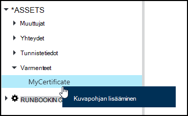
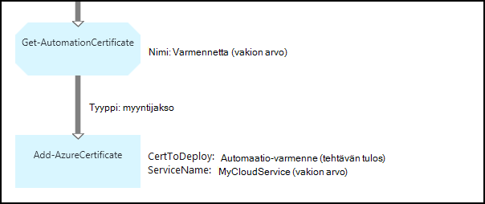

<properties 
   pageTitle="Varmenteen Azure automaatio kohteita | Microsoft Azure"
   description="Varmenteiden voi enintään tallentaa suojatusti Azure automaatio, jotta niitä voi käyttää runbooks tai DSC määrityksiä todennetaan Azure ja kolmannen osapuolen resurssit.  Tässä artikkelissa kerrotaan varmenteet ja niiden lisäämisestä käsitellä sekä tekstiä että graafinen authoring tiedot."
   services="automation"
   documentationCenter=""
   authors="mgoedtel"
   manager="stevenka"
   editor="tysonn" />
<tags 
   ms.service="automation"
   ms.devlang="na"
   ms.topic="article"
   ms.tgt_pltfrm="na"
   ms.workload="infrastructure-services"
   ms.date="02/23/2016"
   ms.author="magoedte;bwren" />

# Varmenteen kohteita Azure automaatio

Varmenteiden voi enintään tallentaa suojatusti Azure automaatio, jotta niitä voi käyttää runbooks tai käyttämällä **Hae AutomationCertificate** tehtävän DSC määrityksiä. Tämän avulla voit luoda runbooks ja DSC määritykset, jotka käyttävät varmenteiden todentamiseen tai lisää ne Azure tai kolmannen osapuolen resurssit.

>[AZURE.NOTE] Suojatun varat Azure automaatio-sisältävät tunnistetiedot, varmenteet, yhteydet ja salattuja muuttujat. Nämä resurssit ovat salataan ja tallennetaan yksilöivä tunnus, joka on luotu käyttämällä automaatio-tileille Azure automaatio. Avaimeen perusmuodon todistus salataan ja tallennetaan Azure automaatio. Ennen tallentamista suojatun resurssi-näppäintä automaatio-tili on purettu perusmuodon sertifikaatin avulla ja sitten kohteen salaamisessa käytettyä.

## Windows PowerShellin cmdlet-komennot

Seuraavassa taulukossa Cmdlet-komentoja käytetään luominen ja hallinta Windows PowerShellin automaatiota varmenteen resurssien. Toimitus [Azure PowerShell-moduulin](../powershell-install-configure.md) on käytettävissä automaatio runbooks ja DSC määritykset osana.

|Cmdlet-komennot|Kuvaus|
|:---|:---|
|[Hae AzureAutomationCertificate](http://msdn.microsoft.com/library/dn913765.aspx)|Hakee sertifikaatin tietoja. Voit hakea varmenteen itse vain Get-AutomationCertificate toiminnasta.|
|[Uusi AzureAutomationCertificate](http://msdn.microsoft.com/library/dn913764.aspx)|Tuo Azure automaatio uutta varmennetta.|
|[Poista - AzureAutomationCertificate](http://msdn.microsoft.com/library/dn913773.aspx)|Poistaa Azure automaatio varmenne.|
|[Set - AzureAutomationCertificate](http://msdn.microsoft.com/library/dn913763.aspx)|Määrittää ominaisuudet, mukaan lukien varmenne-tiedoston lataaminen ja asettamalla salasanan .pfx varmenne.|

## Voit käyttää varmenteet toiminnot

Seuraavassa taulukossa toimintoja käytetään käyttämään varmenteiden runbookin tai DSC määritys.

|Toiminnot|Kuvaus|
|:---|:---|
|Hae AutomationCertificate|Saa runbookin tai DSC määritysten käytettävä varmenne.|

>[AZURE.NOTE] Vältä muuttujien käyttäminen – Get-AutomationCertificate, koska tämä vaikeuttaen etsintää runbooks tai DSC määrityksiä väliset riippuvuudet ja suunnitteluvaiheessa kalusto-varmenteen nimi-parametrissa.

## Uuden varmenteen luominen

Kun luot uutta varmennetta, .cer- tai .pfx-tiedoston lataaminen Azure automaatio. Jos olet merkinnyt voi viedä sertifikaatti, valitse voit siirtää sen Azure automaatio varmenteen kaupan ulos. Jos sitä ei voi viedä, valitse se vain voidaan runbookin tai DSC määritysten allekirjoittamiseen.

### Voit luoda uutta varmennetta Azure perinteinen-portaalissa

1. Automaatio-tilisi valitsemalla **kalusto** ikkunan yläreunassa.
1. Ikkunan alareunassa valitsemalla **Lisää**.
1. Valitse **Lisää tunnistetiedot**.
2. Valitse **varmennetta** **Tunnistetietojen tyyppi** avattavasta valikosta.
3. Kirjoita varmenteen nimi **nimi** -ruutuun ja valitse sitten oikealle osoittavaa nuolta.
4. .Cer- tai .pfx-tiedosto selaamalla.  Jos valitset .pfx-tiedosto, Määritä salasanan ja onko se saa voi viedä.
1. Valitse Lataa sertifikaattitiedosto ja Tallenna sertifikaatin uuden kohteen vieressä.

### Voit luoda uutta varmennetta Azure-portaalissa

1. Automaatio-tililtä valitsemalla Avaa **kalusto** -sivu **kalusto** -osa.
1. Valitse **Varmenteet** -osaa, Avaa **Varmenteet** -sivu.
1. Valitse **Lisää varmenne** sivu yläreunassa.
2. Kirjoita varmenteen nimi **nimi** -ruutuun.
2. Valitse **Valitse tiedoston** .cer- tai .pfx-tiedosto selaamalla **varmenteen tiedoston lataaminen** -kohdassa.  Jos valitset .pfx-tiedosto, Määritä salasanan ja onko se saa voi viedä.
1. Valitse Tallenna sertifikaatin uuden kohteen **luominen** .

### Voit luoda uutta varmennetta Windows PowerShellin avulla

Esimerkki seuraavista komennoista näyttää, miten uusi automaatio varmenteen ja merkitsee vietäväksi. Tämä tuo aiemmin luotu .pfx-tiedosto.

    $certName = 'MyCertificate'
    $certPath = '.\MyCert.pfx'
    $certPwd = ConvertTo-SecureString -String 'P@$$w0rd' -AsPlainText -Force
    
    New-AzureAutomationCertificate -AutomationAccountName "MyAutomationAccount" -Name $certName -Path $certPath –Password $certPwd -Exportable

## Sertifikaatilla

Sinun on käytettävä **Get-AutomationCertificate** tehtävän käyttämään varmennetta. [Get-AzureAutomationCertificate](http://msdn.microsoft.com/library/dn913765.aspx) cmdlet-komento ei voi käyttää, koska se palauttaa tietoja varmenteen resurssi, mutta ei varmenne.

### Tekstimuotoinen runbookin Esimerkki

Seuraava esimerkki koodi näkyy pilvipalvelussa runbookin-varmenteen lisääminen. Tässä esimerkissä salasana haetaan salattuja Automaatiomuuttuja.

    $serviceName = 'MyCloudService'
    $cert = Get-AutomationCertificate -Name 'MyCertificate'
    $certPwd = Get-AutomationVariable –Name 'MyCertPassword'
    Add-AzureCertificate -ServiceName $serviceName -CertToDeploy $cert

### Graafisen runbookin Esimerkki

**Hae AutomationCertificate** lisääminen graafinen runbookin varmenteen graafinen editorin kirjasto-ruudussa hiiren kakkospainikkeella ja valitsemalla **Lisää Kuvapohjan**.

Seuraavassa kuvassa on esimerkki sertifikaatilla graafinen runbookin.  Tämä on sama Esimerkki varmenteen lisääminen pilvipalveluun tekstiä runbookin yllä.  

Tässä esimerkissä käytetään **UseConnectionObject** parametrin määrittäminen **Lähetä TwilioSMS** tehtävä, jota käytetään yhteyden objektin todennus-palveluun.  [Myyntijakso-linkki](automation-graphical-authoring-intro.md#links-and-workflow) on käytettävä tätä jälkeen järjestys-linkin palauttavat kokoelma sisältävä yksi objekti, joka Palvelutietoyhteyden parametri ei odottaa.

## Katso myös

- [Linkkien graafinen yhtä aikaa muiden kanssa](automation-graphical-authoring-intro.md#links-and-workflow) 
