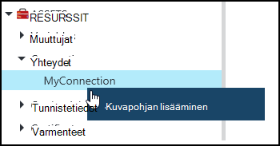
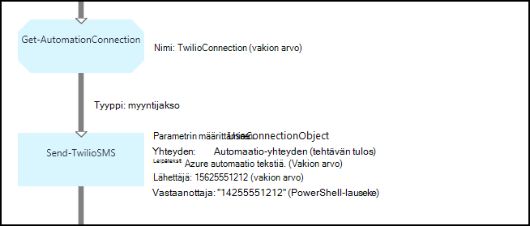

<properties 
   pageTitle="Yhteyden kohteita Azure automaatio | Microsoft Azure"
   description="Yhteyden kohteita Azure automaatio sisältää muodostamaan yhteyden ulkoiseen palveluun tai sovelluksen runbookin tai DSC määritysten tarvittavat tiedot. Tässä artikkelissa kerrotaan yhteydet ja miten voit käsitellä sekä tekstiä että graafinen authoring tietoja."
   services="automation"
   documentationCenter=""
   authors="bwren"
   manager="stevenka"
   editor="tysonn" />
<tags 
   ms.service="automation"
   ms.devlang="na"
   ms.topic="article"
   ms.tgt_pltfrm="na"
   ms.workload="infrastructure-services"
   ms.date="01/27/2016"
   ms.author="bwren" />

# Azure automaatio yhteyden kohteita

Automaatio-yhteyden resurssi on muodostettava yhteys ulkoiseen palveluun tai sovelluksen runbookin tai DSC määritysten tiedot. Tämä voi olla esimerkiksi käyttäjänimen ja salasanan lisäksi yhteyden tietoja, kuten URL-osoite tai portti todennusta varten tarvittavat tiedot. Yhteyden arvo pitää kaikki tietyn-sovelluksen sijaan luominen useita muuttujia yksi resurssi-yhteyden muodostamisesta ominaisuudet. Käyttäjä voi muokata yhteyden yhdessä paikassa arvot ja välittää runbookin tai yksittäinen parametri DSC määrittäminen yhteyden nimi. Yhteyden ominaisuudet, niitä voi käyttää runbookin tai DSC määritysten **Get-AutomationConnection** -toimintoa.

Kun luot yhteyden, on määritettävä *yhteyden tyyppi*. Yhteyden tyyppi on malli, joka määrittää ominaisuudet. Yhteys määrittää kullekin ominaisuudelle sen yhteystyyppi määritetyt arvot. Yhteystyypit lisätään Azure Automaatioapuohjelman integration moduuleissa tai luoda [Azure automaatio API](http://msdn.microsoft.com/library/azure/mt163818.aspx). Vain yhteyden tyypit, jotka ovat käytettävissä, kun luot yhteyden ovat asennettuna automaatio-tilillesi.

>[AZURE.NOTE] Suojatun varat Azure automaatio-sisältävät tunnistetiedot, varmenteet, yhteydet ja salattuja muuttujat. Nämä resurssit ovat salataan ja tallennetaan yksilöivä tunnus, joka on luotu käyttämällä automaatio-tileille Azure automaatio. Avaimeen perusmuodon todistus salataan ja tallennetaan Azure automaatio. Ennen tallentamista suojatun resurssi-näppäintä automaatio-tili on purettu perusmuodon sertifikaatin avulla ja sitten kohteen salaamisessa käytettyä.

## Windows PowerShellin cmdlet-komennot

Cmdlet-komentoja seuraavan taulukon avulla voit luoda ja hallita automaatio yhteydet Windows PowerShellin avulla. Toimitus [Azure PowerShell-moduulin](../powershell-install-configure.md) on käytettävissä automaatio runbooks ja DSC määritykset osana.

|Cmdlet-komento|Kuvaus|
|:---|:---|
|[Hae AzureAutomationConnection](http://msdn.microsoft.com/library/dn921828.aspx)|Hakee yhteyden. Sisältää hash-taulukko, jossa haluamasi yhteys kenttien arvoja.|
|[Uusi AzureAutomationConnection](http://msdn.microsoft.com/library/dn921825.aspx)|Luo uusi yhteys.|
|[Poista AzureAutomationConnection](http://msdn.microsoft.com/library/dn921827.aspx)|Poista olemassa oleva yhteys.|
|[Määritä AzureAutomationConnectionFieldValue](http://msdn.microsoft.com/library/dn921826.aspx)|Määrittää olemassa olevan yhteyden tietyn kentän arvon.|

## Toiminnot

Seuraavassa taulukossa toimintoja käytetään käyttämään runbookin tai DSC määritysten yhteydet.

|Toiminnot|Kuvaus|
|---|---|
|Hae AutomationConnection|Saa yhteyden avulla. Palauttaa hash-taulukko, jossa yhteyden ominaisuudet.|

>[AZURE.NOTE] Vältä muuttujien käyttäminen **Get-AutomationConnection** , koska tämä vaikeuttaen etsintää runbooks tai DSC-määrityksiä ja yhteyden varat väliset riippuvuudet suunnitteluvaiheessa nimi – parametrissa.

## Uuden yhteyden luominen

### Voit luoda uuden yhteyden Azure perinteinen-portaalissa

1. Automaatio-tilisi valitsemalla **kalusto** ikkunan yläreunassa.
1. Ikkunan alareunassa valitsemalla **Lisää**.
1. Valitse **Lisää yhteys**.
2. Valitse luotavan yhteystyyppi **Yhteyden tyyppi** avattavasta valikosta.  Ohjatun toiminnon esittää kyseisessä ominaisuudet.
1. Suorita ohjattu ja valitse valintaruutu, jos haluat tallentaa uuden yhteyden.

### Voit luoda uuden yhteyden Azure-portaalissa

1. Automaatio-tililtä valitsemalla Avaa **kalusto** -sivu **kalusto** -osa.
1. Napsauta **yhteydet** -osaa, Avaa **yhteydet** -sivu.
1. Valitse **Lisää yhteys** yläreunaan sivu.
2. Valitse luotavan yhteystyyppi **tyyppi** avattavasta valikosta. Lomakkeen esittää kyseisessä ominaisuudet.
1. Täytä lomake ja sitten **Luo** uusi yhteys Tallenna.

### Jos haluat luoda uuden yhteyden Windows PowerShellin avulla

Luo uusi yhteys Windows PowerShellin [Uusi AzureAutomationConnection](http://msdn.microsoft.com/library/dn921825.aspx) cmdlet-komennolla. Tämä cmdlet-komento on parametrin **ConnectionFieldValues** , odottaa [hash-taulukon](http://technet.microsoft.com/library/hh847780.aspx) arvojen määrittäminen kunkin yhteystyyppiä määrittämiä ominaisuuksia.

Esimerkki seuraavista komennoista luoda uuden yhteyden [Twilio](http://www.twilio.com) puhelin-palvelu, jonka avulla voit lähettää ja vastaanottaa tekstiviestejä, eli.  Esimerkki integrointi-moduuli, joka sisältää Twilio yhteystyyppi sisältyy [Komentosarjat](http://gallery.technet.microsoft.com/scriptcenter/Twilio-PowerShell-Module-8a8bfef8).  Tämä yhteystyyppi määrittää tilin SUOJAUSTUNNUS ja luvan käyttöoikeustietue, joiden on oltava Vahvista tilisi Twilio yhdistettäessä ominaisuudet.  On [tämän moduulin Lataa](http://gallery.technet.microsoft.com/scriptcenter/Twilio-PowerShell-Module-8a8bfef8) ja asenna se automaatio-tilisi toimimaan Tämä malli-koodin.

    $AccountSid = "DAf5fed830c6f8fac3235c5b9d58ed7ac5"
    $AuthToken  = "17d4dadfce74153d5853725143c52fd1"
    $FieldValues = @{"AccountSid" = $AccountSid;"AuthToken"=$AuthToken}

    New-AzureAutomationConnection -AutomationAccountName "MyAutomationAccount" -Name "TwilioConnection" -ConnectionTypeName "Twilio" -ConnectionFieldValues $FieldValues

## Runbookin tai DSC määritys-yhteyden avulla

Voit hakea yhteyden runbookin tai DSC kokoonpanon **Get-AutomationConnection** cmdlet-komento.  Tässä aktiviteetti hakee yhteyden eri kenttien arvot, ja palauttaa ne [hash-taulukko](http://go.microsoft.com/fwlink/?LinkID=324844) , joka voidaan sitten tarvittavat komennot runbookin tai DSC määrittämistä.

### Tekstimuotoinen runbookin Esimerkki
Esimerkki seuraavista komennoista näyttää, miten Tekstiviestin lähettäminen runbookin edellisen esimerkin Twilio-yhteyden avulla.  Lähetä TwilioSMS tehtävän käyttää tässä on parametrin kahdet, jokainen käyttää toista menetelmää todennustapa Twilio-palveluun.  Yksi käyttää connection-objekti ja toiseen käyttää yksittäisiä parametreja tilin SUOJAUSTUNNUS ja luvan tunnuksen.  Tässä esimerkissä on esitetty molemmilla tavoilla:

    $Con = Get-AutomationConnection -Name "TwilioConnection"
    $NumTo = "14255551212"
    $NumFrom = "15625551212"
    $Body = "Text from Azure Automation."

    #Send text with connection object.
    Send-TwilioSMS -Connection $Con -From $NumFrom -To $NumTo -Body $Body

    #Send text with connection properties.
    Send-TwilioSMS -AccountSid $Con.AccountSid -AuthToken $Con.AuthToken -From $NumFrom -To $NumTo -Body $Body

### Graafisen runbookin objektit

**Hae AutomationConnection** aktiviteetin lisääminen graafinen runbookin graafinen editorin yhteys kirjasto-ruudussa hiiren kakkospainikkeella ja valitsemalla **Lisää Kuvapohjan**.

Seuraavassa kuvassa on esimerkki graafinen runbookin-yhteyden avulla.  Näin voit käyttää Twilio tekstiä runbookin Tekstiviestin lähettäminen yllä edellisen esimerkin.  Tässä esimerkissä käytetään **UseConnectionObject** parametrin määrittäminen **Lähetä TwilioSMS** tehtävä, jota käytetään yhteyden objektin todennus-palveluun.  [Myyntijakso-linkki](automation-graphical-authoring-intro.md#links-and-workflow) käytetään tässä, koska Palvelutietoyhteyden parametri odottaa yhtenä objektina.

Syy PowerShell, lauseketta käytetään vakioarvo sijaan **Voit** -parametrin arvon on, että tämä parametri odottaa merkkijonon matriisista arvon tyyppi, niin, että voit lähettää lukujen kertominen.  PowerShell-lausekkeen avulla voit antaa yksittäisen arvon tai taulukko.

Alla olevassa kuvassa näkyy, sama kuin edellisessä esimerkissä, mutta **SpecifyConnectionFields** -parametrin arvo, joka käyttää odottaa AccountSid ja AuthToken parametrit on määritettävä yksitellen verrattuna avulla yhteyden objektin todennusta varten.  Tässä tapauksessa kentät yhteyden on määritetty sen sijaan, että itse objektiin.  

## Aiheeseen liittyviä artikkeleita

- [Linkkien graafinen yhtä aikaa muiden kanssa](automation-graphical-authoring-intro.md#links-and-workflow)
 
