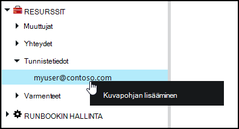
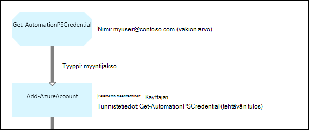

<properties 
   pageTitle="Tunnistetietojen Azure automaatio kohteita | Microsoft Azure"
   description="Azure automaatio tunnistetiedon kohteita sisältävät suojausvaltuudet, joiden avulla voidaan todentaa resurssien käyttää runbookin tai DSC määritysten mukaan. Tässä artikkelissa käsitellään tunnistetiedon varat luoda ja käyttää niitä runbookin tai DSC määritys."
   services="automation"
   documentationCenter=""
   authors="mgoedtel"
   manager="jwhit"
   editor="tysonn" />
<tags 
   ms.service="automation"
   ms.devlang="na"
   ms.topic="article"
   ms.tgt_pltfrm="na"
   ms.workload="infrastructure-services"
   ms.date="06/09/2016"
   ms.author="bwren" />

# Azure automaatio tunnistetiedon kohteita

Automaatio-tunnistetiedon resurssi pitää [PSCredential](http://msdn.microsoft.com/library/system.management.automation.pscredential) objekti, joka sisältää suojausvaltuudet, kuten käyttäjänimi ja salasana. Runbooks ja DSC määritykset voivat käyttää cmdlet-komennot, jotka hyväksyvät PSCredential-objektin todennusta varten tai ne voi poimia käyttäjänimi ja salasana PSCredential objektin antamaan joitakin sovelluksen tai palvelun todennusta. Ominaisuuksien olevan tunnistetiedon säilytetään suojatusti Azure automaatio ja niitä voi käyttää runbookin tai DSC määritysten [Get-AutomationPSCredential](http://msdn.microsoft.com/library/system.management.automation.pscredential.aspx) -toimintoa.

>[AZURE.NOTE] Suojatun varat Azure automaatio-sisältävät tunnistetiedot, varmenteet, yhteydet ja salattuja muuttujat. Nämä resurssit ovat salataan ja tallennetaan yksilöivä tunnus, joka on luotu käyttämällä automaatio-tileille Azure automaatio. Avaimeen perusmuodon todistus salataan ja tallennetaan Azure automaatio. Ennen tallentamista suojatun resurssi-näppäintä automaatio-tili on purettu perusmuodon sertifikaatin avulla ja sitten kohteen salaamisessa käytettyä. 

## Windows PowerShellin cmdlet-komennot

Seuraavassa taulukossa Cmdlet-komentoja käytetään luominen ja hallinta Windows PowerShellin automaatiota tunnistetiedon resurssien.  Toimitus [Azure PowerShell-moduulin](../powershell-install-configure.md) on käytettävissä automaatio runbooks ja DSC määritykset osana.

|Cmdlet-komennot|Kuvaus|
|:---|:---|
|[Hae AzureAutomationCredential](http://msdn.microsoft.com/library/dn913781.aspx)|Hakee tietoja tunnistetiedon resurssi. Voit hakea tunnistetiedon itse vain **Get-AutomationPSCredential** toiminnasta.|
|[Uusi AzureAutomationCredential](http://msdn.microsoft.com/library/azure/jj554330.aspx)|Luo uusi automaatio-tunnistetiedot.|
|[Poista - AzureAutomationCredential](http://msdn.microsoft.com/library/azure/jj554330.aspx)|Poistaa automaatio-tunnistetiedot.|
|[Set - AzureAutomationCredential](http://msdn.microsoft.com/library/azure/jj554330.aspx)|Määrittää olemassa olevan automaatio-tunnistetiedon ominaisuudet.|

## Runbookin toiminnot

Seuraavassa taulukossa toimintoja käytetään käyttämään tunnistetiedot runbookin ja DSC määrityksiä.

|Toiminnot|Kuvaus|
|:---|:---|
|Hae AutomationPSCredential|Saa tunnistetiedon runbookin tai DSC määritys. Palauttaa [System.Management.Automation.PSCredential](http://msdn.microsoft.com/library/system.management.automation.pscredential) objektin.|

>[AZURE.NOTE] Vältä muuttujien käyttäminen Get-AutomationPSCredential, koska tämä vaikeuttaen etsintää runbooks tai DSC määrityksiä väliset riippuvuudet ja tunnistetietojen varat suunnitteluvaiheessa nimi – parametrissa.

## Uusi tunnistetiedon kohteiden luominen

### Voit luoda uuden tunnistetiedon resurssi Azure perinteinen-portaalissa

1. Automaatio-tilisi valitsemalla **kalusto** ikkunan yläreunassa.
1. Ikkunan alareunassa valitsemalla **Lisää**.
1. Valitse **Lisää tunnistetiedot**.
2. Valitse **PowerShell tunnistetiedon** **Tunnistetietojen tyyppi** avattavasta valikosta.
1. Suorita ohjattu ja valitse valintaruutu, jos haluat tallentaa uuden tunnistetieto.

### Voit luoda uuden tunnistetiedon resurssi Azure-portaalissa

1. Automaatio-tililtä valitsemalla Avaa **kalusto** -sivu **kalusto** -osa.
1. Valitse **tunnistetiedot** -osaa, Avaa **tunnistetiedot** -sivu.
1. Valitse **Lisää olevan tunnistetiedon** yläreunaan sivu.
1. Täytä lomake ja sitten **Luo** uusi tunnistetietojen tallentamiseen.

### Voit luoda uuden tunnistetiedon resurssi Windows PowerShellin avulla

Esimerkki seuraavista komennoista näyttää, miten voit luoda uuden automaatio-credential. PSCredential-objekti on luotu ensin käyttäjänimi ja salasana ja avulla luodaan credential resurssi. **Get Credential** cmdlet-komennon avulla voit vaihtoehtoisesti pyydetään kirjoittamaan käyttäjänimi ja salasana.

    $user = "MyDomain\MyUser"
    $pw = ConvertTo-SecureString "PassWord!" -AsPlainText -Force
    $cred = New-Object –TypeName System.Management.Automation.PSCredential –ArgumentList $user, $pw
    New-AzureAutomationCredential -AutomationAccountName "MyAutomationAccount" -Name "MyCredential" -Value $cred

## PowerShell-tunnistetietojen avulla

Voit hakea tunnistetiedon annetaan runbookin tai DSC määritysten **Get-AutomationPSCredential** -toimintoa. Palauttaa arvon [PSCredential objekti](http://msdn.microsoft.com/library/system.management.automation.pscredential.aspx) , jonka avulla tehtävän tai cmdlet-komento, joka edellyttää PSCredential parametrin. Voit myös hakea käyttämään yksitellen tunnistetiedon-objektin ominaisuudet. Objekti on käyttäjänimi ja suojattua salasanan ominaisuuden tai **GetNetworkCredential** menetelmän avulla voit palauttaa [NetworkCredential](http://msdn.microsoft.com/library/system.net.networkcredential.aspx) -objekti, joka antaa suojaamattoman version salasana.

### Tekstimuotoinen runbookin Esimerkki

Esimerkki seuraavista komennoista Näytä PowerShell-tunnistetiedon käyttämisestä runbookin. Tässä esimerkissä tunnistetieto haetaan ja muuttujien varattu sen käyttäjänimi ja salasana.

    $myCredential = Get-AutomationPSCredential -Name 'MyCredential'
    $userName = $myCredential.UserName
    $securePassword = $myCredential.Password
    $password = $myCredential.GetNetworkCredential().Password

### Graafisen runbookin Esimerkki

**Hae AutomationPSCredential** aktiviteetin lisääminen graafinen runbookin tunnistetieto graafinen editorin kirjasto-ruudussa hiiren kakkospainikkeella ja valitsemalla **Lisää Kuvapohjan**.

Seuraavassa kuvassa on esimerkki olevan tunnistetiedon käyttäminen graafinen runbookin.  Tässä tapauksessa sitä käytetään antamaan runbookin Azure-resurssien käyttöoikeuksien kuvatulla tavalla [Todennetaan Runbooks Azure AD-käyttäjätilin](automation-sec-configure-aduser-account.md).  Ensimmäinen tehtävä hakee tunnistetiedot, jotka on käyttöoikeus Azure-tilaukseen.  **Lisää AzureAccount** tehtävän sitten käyttää tätä tunnistetiedon todennus toimintoja, jotka sisältyvät sen jälkeen.  [Myyntijakso-linkki](automation-graphical-authoring-intro.md#links-and-workflow) on tässä, koska **Get-AutomationPSCredential** odottaa yhtenä objektina.  

## DSC PowerShell-tunnistetiedon käyttäminen
Kun DSC käyttömahdollisuudet Azure automaatio-voi viitata käyttämällä **Hae AutomationPSCredential**credential kalusto-credential varat myös voidaan välittää kautta parametreja, tarvittaessa. Lisätietoja on artikkelissa [Azure automaatio DSC-määrityksiä Compiling](automation-dsc-compile.md#credential-assets).

## Seuraavat vaiheet

- Lisätietoja linkkien graafinen yhtä aikaa muiden kanssa, katso [linkit graafinen yhtä aikaa muiden kanssa](automation-graphical-authoring-intro.md#links-and-workflow)
- Eri todennusmenetelmät automaatio kanssa on artikkelissa [Azure automaatio suojaus](automation-security-overview.md)
- Graafinen runbooks aloittaminen-kohdassa [Oma ensimmäisen graafinen runbookin](automation-first-runbook-graphical.md)
- Aloita PowerShell työnkulun runbooks, katso [ensimmäinen PowerShell työnkulun-runbookin](automation-first-runbook-textual.md) 

 
