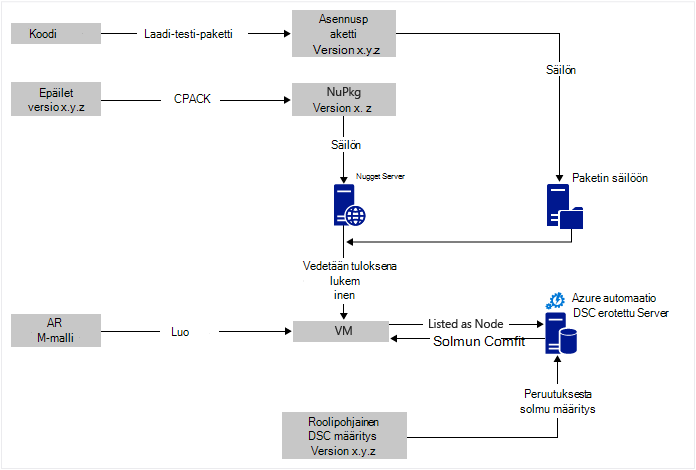

<properties
   pageTitle="Azure automaatio DSC jatkuva ympäristö, jonka Chocolatey | Microsoft Azure"
   description="Jatkuva DevOps-ympäristö käyttämällä Azure automaatio DSC ja Chocolatey pakettien hallinta.  Esimerkki, jossa on koko JSON ARM-malli ja PowerShell lähde."
   services="automation"
   documentationCenter=""
   authors="sebastus"
   manager="stevenka"
   editor=""/>

<tags
   ms.service="automation"
   ms.devlang="na"
   ms.topic="article"
   ms.tgt_pltfrm="vm-windows"
   ms.workload="na"
   ms.date="08/08/2016"
   ms.author="golive"/>

# Käyttöesimerkki: Jatkuva käyttöönoton näennäiskoneiden automaatio DSC ja Chocolatey

DevOps maailmaa on useita kohtia helpottamiseksi jatkuva integrointi myyntijakso-työkaluja.  Azure automaatio halutuksi tilan määritys (DSC) on Tervetuloa uusi lisäksi DevOps ryhmiä voidaan käyttää haluamasi asetukset.  Tässä artikkelissa esitellään Windows-tietokoneessa-asetuksen määrittäminen jatkuva käyttöönoton (CD-levy).  Voit laajentaa tapa lisätä niin monta Windows-tietokoneissa tarpeen mukaan (web-sivusto, kuten)-roolin ja muita rooleille sieltä.

## Ylätasolla

Ole aivan vähän kyse tästä, mutta lähettäjä se voidaan jakaa kahden prosesseista huomioon: 

  - Koodin kirjoittamista sen testaamista, luominen ja pää- ja aliversiot versioiden asennuksen pakettien julkaiseminen. 
  - Luomisen ja ylläpidon VMs, jotka asennetaan ja suorittaa koodin paketit.  

Kun core näistä molemmista ovat paikoillaan, se on lyhyt vaiheessa voit päivittää automaattisesti kaikki tietyn AM käytössä, kun uusia versioita on luotu ja otettu käyttöön paketin.

## Osan yhteenveto

Paketin valvojat, kuten [piharakennus get](https://en.wikipedia.org/wiki/Advanced_Packaging_Tool) on melko tunnettujen Linux maailmanlaajuisesti, mutta ei ole paljon Windows maailmanlaajuisesti.  [Chocolatey](https://chocolatey.org/) on jostain asiasta ja aiheen Scott Hanselman [blogi](http://www.hanselman.com/blog/IsTheWindowsUserReadyForAptget.aspx) on hyvä esittely.  Sanottuna Chocolatey avulla voit asentaa paketteja keskitettyyn säilöön pakettien Windows-järjestelmää komentoriviltä.  Voit luoda ja hallita omia säilöön ja Chocolatey pakettien asentamisen säilöjen tietoihin, jotka voit määrittää haluamasi määrän.

Haluttu tilan määrittäminen (DSC) ([Yleiskatsaus](https://technet.microsoft.com/library/dn249912.aspx)) on PowerShell-työkalu, jonka avulla voit määritellä, jota haluat käyttää tietokoneen määritykset.  Esimerkiksi voit sanoa esimerkiksi "Haluan asentaa Chocolatey haluan IIS asennettuna haluan portti 80, jotka on avattu, haluan asennettu sivustoon 1.0.0 versio."  DSC paikallisen määritysten hallinta (pienin.yht.JAETTAVA) toteuttaa kyseisen määritys. DSC erotettu palvelimen pitää säilön tietokoneesi määritykset. PIENIN.yht.JAETTAVA jokaiseen tietokoneeseen Kuittaa säännöllisesti vastaako sen määritysten tallennetut määritykset. Se raportoi tila tai yrittävät tuoda koneen takaisin tallennetut määritykset tasausta. Voit muokata tallennetut määritykset aiheuttaa koneen tai koneet tulee apuviivoihin muutetut kokoonpanon määrittäminen salaus puretaan-palvelimeen.

Azure automaatio on Microsoft Azure, jonka avulla voit automatisoida eri tehtävien runbooks, solmut, tunnistetiedot, resurssien ja kohteita, kuten aikatauluja ja yleiset muuttujat hallitun palvelu. Azure automaatio DSC laajentaa tämän automaatio vain sisällytettävien PowerShell DSC työkalut.  Tässä on hyvä [Yleiskatsaus](automation-dsc-overview.md).

DSC resurssi on moduulin koodi, joka on tiettyjä ominaisuuksia, kuten hallinta verkko, Active Directory- tai SQL Server.  Chocolatey DSC resurssin tietää, kuinka (muun muassa) NuGet-palvelinta, pakettien lataaminen, asentaminen pakettien ja niin edelleen.  [PowerShell-valikoima](http://www.powershellgallery.com/packages?q=dsc+resources&prerelease=&sortOrder=package-title)on monia muita DSC resursseja.  Näitä moduuleja on asennettu Azure automaatio DSC erotettu palvelimen (jotka käyttäjä), jotta he voivat käyttää avulla perusasetukset.

ARM-mallien määritettäviä lisäämistapaa luoda infrastruktuuri - kohteita, kuten verkkoja, aliverkosta, verkkosuojaus ja reititys, ladata tasoitusmääritykset, NIC, VMs ja niin edelleen.  Tässä on [artikkelissa](../resource-manager-deployment-model.md) , joka vertaa ARM käyttöönoton mallin (määritettäviä) Azure Service Management (ASM tai perinteinen) ja käyttöönottomalli (välttämätöntä).  Ja toinen [artikkelissa](../virtual-machines/virtual-machines-windows-compare-deployment-models.md) tietoja core resurssin tarjoajien, suorittaminen, tallentamisesta ja verkkoon.

Yksi tärkeimmistä ARM-mallin ominaisuus on mahdollisuus asentaminen AM-tunniste AM, kun se on valmisteltu.  AM-tunniste on tietyt ominaisuudet, kuten on mukautettu komentosarja, virustorjuntaohjelmaa asentaminen tai DSC määritysten komentosarjan suorittaminen.  On monia muita AM tunnisteet.

## Nopea työmatkan kaavion ympärillä olevaa

Aloita alusta, kirjoita koodi, luominen ja testaa ja valitse sitten Luo asennuspaketin.  Chocolatey voit käsitellä erityyppisiä asennuksen paketteja, kuten MSI-MSU, ZIP.  Ja sinulla on täydet power PowerShellin varsinaiseen asennustyöhön tilanteeseen Chocolatey's alkuperäisen ominaisuudet eivät ole aivan ylöspäin.  Sijoittaa paketin suunnilleen tavoitettavissa – paketin säilö.  Käyttö tässä esimerkissä käytetään yleisen kansion Azure-blob-tallennustilan tilin, mutta se voi olla missä tahansa.  Chocolatey toimii grafiikkatiedostomuotoja NuGet palvelimiin ja muutamia muita paketin metatiedot hallintaa varten.  [Tässä artikkelissa](https://github.com/chocolatey/choco/wiki/How-To-Host-Feed) kuvataan vaihtoehdot.  Käyttö tässä esimerkissä käytetään NuGet.  Nuspec on metatietoa oman paketit.  Nuspec "kääntää" NuPkg's ja NuGet palvelimeen tallennettu.  Kun kokoonpanosi pyytää paketin nimelläsi ja viittaa NuGet palvelimeen, Chocolatey DSC resurssin (nyt AM) grabs paketin ja asentaa sen puolestasi.  Voit myös pyytää paketin tietyn version.

Vasen alaosassa kuvan on Azure resurssien hallinta (ARM)-malli.  Käyttö tässä esimerkissä AM-tunniste Rekisteröi solmu AM Azure automaatio DSC salaus puretaan-palvelimen kanssa (eli salaus puretaan-palvelin).  Määritykset tallennetaan salaus puretaan palvelimeen.  Kyllä, se tallennetaan kahdesti: kerran pelkkänä tekstinä ja kun käännetty MOF-tiedostona (niille, jotka lisätietoja työryhmästä.)  Valitse-portaalissa MOF on "solmu kokoonpano" (eikä vain "määritys").  On Palvelutietojen, joka liittyy solmu, joten solmu tietävät sen asetukset.  Tietoja alla Näytä solmu kokoonpanon määrittäminen solmun.

Takia teet jo ylä-tai se bittinen.  Luominen nuspec, kääntäminen ja se tallennetaan NuGet palvelin on pieni asian.  Ja hallitset jo VMs.  Ottaen seuraavaksi jatkuva käyttöönotto edellyttää (kerran) erotettu-palvelimen asetusten määrittämisestä, että solmujen rekisteröimistä sitä (kerran), ja luominen ja tallentaminen määritystä (aluksi).  Päivitä sitten paketit päivitetty ja ottaa käyttöön säilöön, määritys ja solmun kokoonpanossa (Toista tarvittaessa) erotettu Serverissä.

Jos aloitat ei ARM-malli, joka on myös OK.  On suunniteltu helpottamaan rekisteröidä oman VMs salaus puretaan palvelin ja kaikki muut PowerShellin cmdlet-komennot. Lisätietoja on tässä artikkelissa: [Onboarding koneet mukaan Azure automaatio DSC hallintaa varten](automation-dsc-onboarding.md)

## Vaihe 1: Salaus puretaan server- ja automaatiofunktiot tilin määrittäminen

Todennettu (Lisää AzureRmAccount) PowerShell-komennon rivillä: (voi kestää muutaman minuutin aikana salaus puretaan palvelin on määritetty)

    New-AzureRmResourceGroup –Name MY-AUTOMATION-RG –Location MY-RG-LOCATION-IN-QUOTES
    New-AzureRmAutomationAccount –ResourceGroupName MY-AUTOMATION-RG –Location MY-RG-LOCATION-IN-QUOTES –Name MY-AUTOMATION-ACCOUNT 

Automaatio-tilisi voit sijoittaa mihin tahansa seuraavilla alueilla (eli sijainti): itä US 2, Etelä keskitetyn US, US gov – Virginia, Länsi Europe, varaaja Aasian, japani Itä, keskitetty Intia ja Australia varaaja.

## Vaihe 2: AM tunniste mukautukset ARM-malliin

AM rekisteröinti (käyttämällä PowerShell DSC AM-tunniste) annettu [Azure pikaopas mallin](https://github.com/Azure/azure-quickstart-templates/tree/master/dsc-extension-azure-automation-pullserver)tiedot.  Tässä vaiheessa Rekisteröi uusi AM DSC solmujen luettelo salaus puretaan-palvelimen kanssa.  Tämä rekisteröinti osa on määrittäminen käytettäväksi solmu solmu-määritys.  Solmun määritysten ei ole vielä erotettu-palvelimessa niin Peruuta vaiheessa 4 on, johon tämä tapahtuu ensimmäisen kerran.  Mutta tässä vaiheessa 2 tarvitse päättänyt solmun nimi sekä nimi määritykset.  Käyttö tässä esimerkissä solmu on 'isvbox' ja 'ISVBoxConfig' määritysten.  Jotta solmun määritysten nimi (lisätä erikseen DeploymentTemplate.json) on "ISVBoxConfig.isvbox".  

## Vaihe 3: Pakollinen DSC resurssien lisääminen salaus puretaan palvelimeen

PowerShell-valikoima on mittalaitteilla asentaa DSC resurssien Azure automaatio-tilillesi.  Siirry resurssi ja valitse "Käyttöönotto ja Azure automaatio"-painiketta.

Toinen tapa lisättiin äskettäin Azure-portaaliin avulla voit hakea uuden moduuleissa tai Päivitä aiemmin moduulit. Vahvista automaattisen automaatio tilin resurssi, kalusto-ruutu ja lopuksi moduulit-ruutu.  Selaa valikoimassa-kuvakkeen avulla voit moduulit valikoiman luettelossa, siirtyä tietojen alirakenteeseen ja tuoda kädessä automaatio-tilillesi. Tämä on erinomainen tapa pitää yhteyttä moduulit aina ajan tasalla. Ja tuontitoimintoa tarkistaa riippuvuuksia muissa moduuleissa varmistaa ei saa synkronoitu.

Tai on manuaalisen lähestymistavan.  PowerShell-integroinnin moduuli Windows-tietokoneessa kansiorakenne poikkeaa hieman olettaa Azure-automaatio kansiorakenne.  Tämä edellyttää hieman tweaking osaltasi.  Mutta ei ole vaikeaa, ja se tehdään vain kerran kullekin resurssille (paitsi jos haluat päivittää tulevaisuudessa.)  Lisätietoja PowerShell-integroinnin moduulit authoring artikkeli: [Azure Automaatioapuohjelman Integration moduulit yhtä aikaa muiden kanssa](https://azure.microsoft.com/blog/authoring-integration-modules-for-azure-automation/)

-   Asenna moduuli, jolla on työasemalle, seuraavasti:
    -   Asenna [Windows Management Framework, v5](http://aka.ms/wmf5latest) (ei tarvita Windows 10: ssä)
    -   `Install-Module –Name MODULE-NAME`< – grabs moduulin PowerShell-valikoimasta 
-   Kopioi moduulin kansiota `c:\Program Files\WindowsPowerShell\Modules\MODULE-NAME` temp-kansioon 
-   Mallit ja ohjeet poistaminen pääkansio 
-   Zip-pääkansion nimeäminen ZIP-tiedoston täsmälleen sama kuin kansio 
-   Sijoittaa tavoitettavissa HTTP-sijaintiin, kuten Blob-objektien tallennustilaan Azure-tallennustilan tilin ZIP-tiedoston.
-   Suorita tämä PowerShell:

        New-AzureRmAutomationModule `
            -ResourceGroupName MY-AUTOMATION-RG -AutomationAccountName MY-AUTOMATION-ACCOUNT `
            -Name MODULE-NAME –ContentLink "https://STORAGE-URI/CONTAINERNAME/MODULE-NAME.zip"
        

Sisältää esimerkiksi suorittaa seuraavia ohjeita cChoco ja xNetworking. Katso määräten käsittelyä varten cChoco [muistiinpanot](#notes) .

## Vaihe 4: Lisääminen solmu määritykset salaus puretaan palvelimeen

Ei ole mitään erityistä tietoja asetusten tuominen salaus puretaan palvelimen ja käännä ensimmäisen kerran.  Kaikki myöhemmin tuonti/kääntää saman kokoonpanon Etsi täsmälleen samat.  Aina, kun paketti päivittää eikä sinun tarvitse push tuotannon voit tehdä tämän vaiheen jälkeen varmistaa, että määritystiedosto on oikea – paketti uuden version mukaan lukien.  Näin kokoonpanotiedosto ja PowerShell:

ISVBoxConfig.ps1:

    Configuration ISVBoxConfig 
    { 
        Import-DscResource -ModuleName cChoco 
        Import-DscResource -ModuleName xNetworking
    
        Node "isvbox" {   
    
            cChocoInstaller installChoco 
            { 
                InstallDir = "C:\choco" 
            }
    
            WindowsFeature installIIS 
            { 
                Ensure="Present" 
                Name="Web-Server" 
            }
    
            xFirewall WebFirewallRule 
            { 
                Direction = "Inbound" 
                Name = "Web-Server-TCP-In" 
                DisplayName = "Web Server (TCP-In)" 
                Description = "IIS allow incoming web site traffic." 
                DisplayGroup = "IIS Incoming Traffic" 
                State = "Enabled" 
                Access = "Allow" 
                Protocol = "TCP" 
                LocalPort = "80" 
                Ensure = "Present" 
            }
    
            cChocoPackageInstaller trivialWeb 
            {            
                Name = "trivialweb" 
                Version = "1.0.0" 
                Source = “MY-NUGET-V2-SERVER-ADDRESS” 
                DependsOn = "[cChocoInstaller]installChoco", 
                "[WindowsFeature]installIIS" 
            } 
        }    
    }

Uusi-ConfigurationScript.ps1:

    Import-AzureRmAutomationDscConfiguration ` 
        -ResourceGroupName MY-AUTOMATION-RG –AutomationAccountName MY-AUTOMATION-ACCOUNT ` 
        -SourcePath C:\temp\AzureAutomationDsc\ISVBoxConfig.ps1 ` 
        -Published –Force
    
    $jobData = Start-AzureRmAutomationDscCompilationJob ` 
        -ResourceGroupName MY-AUTOMATION-RG –AutomationAccountName MY-AUTOMATION-ACCOUNT ` 
        -ConfigurationName ISVBoxConfig 
    
    $compilationJobId = $jobData.Id
    
    Get-AzureRmAutomationDscCompilationJob ` 
        -ResourceGroupName MY-AUTOMATION-RG –AutomationAccountName MY-AUTOMATION-ACCOUNT ` 
        -Id $compilationJobId

Nämä vaiheet johtaa uuden solmu määrityksen nimeltä "ISVBoxConfig.isvbox" markkinoille salaus puretaan palvelimeen.  Solmun määritysten nimi muodostanut nimellä "configurationName.nodeName".

## Vaihe 5: Luominen ja ylläpito paketin metatiedot

Pakkauksesta, jotka olet sijoittanut paketin säilön siirtäminen sinun on nuspec, joka kuvaa sitä.  Kyseisen nuspec on käännetty ja tallennettu NuGet palvelimellesi. Tätä prosessia on kuvattu [seuraavassa](http://docs.nuget.org/create/creating-and-publishing-a-package).  Voit käyttää MyGet.org NuGet palvelimeen.  Ne myydä palvelua, mutta se on starter tuote, joka on ilmainen.  Milloin NuGet.org löydät ohjeita oman NuGet palvelimen yksityinen-pakettien asentamista.

## Vaihe 6: Sitominen sitä ollenkaan

Aina kun versio välittää kysymysten ja vastausten ja hyväksytään käyttöönottoa varten pakkaus on luotu, nuspec ja nupkg päivitetään ja käyttöön NuGet palvelimessa.  Lisäksi määritys (vaihe 4 yllä) on päivitettävä sopimaan uuden version numeron.  Se on lähetetty salaus puretaan palvelimeen ja käännetty.  Siitä lähtien-valinta on VMs, jotka riippuvat päivitys ja asentaa sen, että määritykset.  Näiden päivitysten on yksinkertainen - vain viiva tai kaksi PowerShell.  Visual Studio ryhmän palvelujen jotkin niistä ovat EPS muodosta tehtäviin, joita voi olla ketjutettu yhdessä muodosta.  Tässä [artikkelissa](https://www.visualstudio.com/en-us/docs/alm-devops-feature-index#continuous-delivery) on lisätietoja.  Tämä [GitHub repo](https://github.com/Microsoft/vso-agent-tasks) tiedot eri käytettävissä muodosta tehtävät.

## Huomautuksia

Tässä esimerkissä käyttö alkaa AM yleisiä Windows Server 2012 R2 kuvasta Azure-valikoimasta.  Voit aloittaa kaikki tallennetut kuvasta ja sitten säätää tehosteasetuksilla DSC määrityksissä sieltä.  Kuitenkin määrityksistä, jotka on baked muuttaminen kuvaksi on hankala kuin päivitetään dynaamisesti käyttämällä DSC määritykset.

Sinun ei tarvitse käyttää tätä tapaa oman VMs ARM-malli ja AM tiedostotunnisteen avulla.  Ja että VMs ei tarvitse olla Azure kohdan CD-levylle hallinta.  Ei mitään, joita tarvitaan Chocolatey asennetaan ja pienin.yht.JAETTAVA määritettynä AM jotta tietää, missä salaus puretaan palvelin on.  

Kun päivität AM, joka on tuotannon-paketti, on otettava, AM kierto ulos samalla, kun päivitys on asennettu.  Miten teet tämän vaihtelee laajasti.  Esimerkiksi AM Azure-kuormituksen takana, jossa voit lisätä mukautetun tutkia.  Päivitettäessä AM on näytteenottimen päätepisteen palauttaa 400.  Säätää tehosteasetuksilla tarvittavat aiheuttaa muutoksen sisällä kokoonpanosi voivat olla kuin voi säätää tehosteasetuksilla voit siirtyä takaisin palauttaminen 200, kun päivitys on valmis.

Koko tietolähteen käyttö tässä esimerkissä on GitHub [Visual Studio projektin](https://github.com/sebastus/ARM/tree/master/CDIaaSVM) .

##Aiheeseen liittyviä artikkeleita##

- [Azure automaatio DSC yleiskatsaus] (automaatio-dsc-overview.md)
- [Azure automaatio DSC cmdlet-komennot] (https://msdn.microsoft.com/library/mt244122.aspx)
- [Onboarding Azure automaatio DSC hallitsemaan koneet] (automaatio-dsc-onboarding.md)
