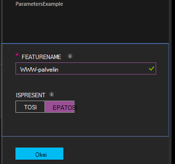

<properties 
   pageTitle="Käännös Azure automaatio DSC käyttömahdollisuudet | Microsoft Azure" 
   description="Yleistä voi kääntää toivottuja tilan määrittäminen (DSC) määrityksiä kahdella tavalla: Azure-portaalissa ja Windows PowerShellin avulla. " 
   services="automation" 
   documentationCenter="na" 
   authors="coreyp-at-msft" 
   manager="stevenka" 
   editor="tysonn"/>

<tags
   ms.service="automation"
   ms.devlang="na"
   ms.topic="article"
   ms.tgt_pltfrm="powershell"
   ms.workload="na" 
   ms.date="01/25/2016"
   ms.author="coreyp"/>
   
#Käännetään Azure automaatio DSC käyttömahdollisuudet#

Voit kääntää toivottuja tilan määrittäminen (DSC) määrityksiä Azure automaatio kanssa kahdella tavalla: Azure-portaalissa ja Windows PowerShellin avulla. Seuraavan taulukon avulla voit selvittää, mitä tapaa kaikkien ominaisuuksien käyttäminen: 

###Azure esikatselu-portaalissa###
- Yksinkertaisin tapa vuorovaikutteinen käyttöliittymää
- Yksinkertainen parametriarvoja antamaan lomake
- Helposti seuraamaan työn tila
- Access-todennus ja Azure kirjautuminen

###Windows PowerShellin###
- Soita komentoriviltä kanssa Windows PowerShellin cmdlet-komennot
- Voit lisätä Automaattinen ratkaisussa, jossa on useita vaiheita
- Yksinkertaisten ja monimutkaisten parametrin arvot
- Seurata projektin tila
- Asiakkaan tarvitaan, jotta PowerShellin cmdlet-komennot
- Välittää ConfigurationData
- Käännä määritykset, käyttää tunnistetiedot

Kun olet päättänyt kääntäminen menetelmän, voit noudattaa vastaaviin ohjeita voit käynnistää käännös.

##Käännös DSC määrityksen Azure-portaalissa##

1.  Automaatio-tilisi valitsemalla **määrityksiä**.
2.  Valitse määritys, voit avata sen sivu.
3.  Valitse **Käännä**.
4.  Määritystä ei ole parametreja, jos olet pyydetään vahvistamaan, Haluatko kääntää sitä. Jos kokoonpano on parametreja, **Käännä määritys** -sivu avautuu, jolloin voit antaa parametriarvot. Artikkelissa on lisätietoja jäljempänä <a href="#basic-parameters">**Basic parametrit**</a> -kohdassa Parametrit.
5.  **Kääntämisen työ** -sivu on avattuna, jotta voit seurata kääntäminen työn tilan ja sen syy sijoittaa Azure automaatio DSC erotettu palvelimen solmu-määrityksiä (MOF määritys-tiedostot).

##Käännös DSC määrityksen Windows PowerShellin avulla##

Voit käyttää [`Start-AzureRmAutomationDscCompilationJob`](https://msdn.microsoft.com/library/mt244118.aspx) Aloita käännetään Windows PowerShellin avulla. Seuraava näyte koodi käynnistyy kääntäminen kutsutaan **SampleConfig**DSC-määritys.

    Start-AzureRmAutomationDscCompilationJob -ResourceGroupName "MyResourceGroup" -AutomationAccountName "MyAutomationAccount" -ConfigurationName "SampleConfig" 
 
`Start-AzureRmAutomationDscCompilationJob`Palauttaa kääntäminen työn objektin, voit seurata sen tilaa. Voit käyttää tätä kääntäminen työn objekti, jossa on [`Get-AzureRmAutomationDscCompilationJob`](https://msdn.microsoft.com/library/mt244120.aspx) määrittämään kääntämisen, työn tilan ja [`Get-AzureRmAutomationDscCompilationJobOutput`](https://msdn.microsoft.com/library/mt244103.aspx) voit tarkastella sen virtaa (tulos). Seuraava esimerkki koodi kääntämisen **SampleConfig** -määritys käynnistyy, odottaa, kunnes se on valmis, ja näyttää sen virtaa.
    
    $CompilationJob = Start-AzureRmAutomationDscCompilationJob -ResourceGroupName "MyResourceGroup" -AutomationAccountName "MyAutomationAccount" -ConfigurationName "SampleConfig"
    
    while($CompilationJob.EndTime –eq $null -and $CompilationJob.Exception –eq $null)           
    {
        $CompilationJob = $CompilationJob | Get-AzureRmAutomationDscCompilationJob
        Start-Sleep -Seconds 3
    }
    
    $CompilationJob | Get-AzureRmAutomationDscCompilationJobOutput –Stream Any 

##Tärkeimmät parametrit##

DSC määritykset, kuten parametrin sisältötyypit ja ominaisuudet-parametrin ilmoituksen toimii samoja kuin Azure automaatio runbooks. Katso lisätietoja runbookin parametrit [Azure automaatio-runbookin alkaen](automation-starting-a-runbook.md) .

Seuraavassa esimerkissä kaksi parametria **FeatureName** ja **IsPresent**ominaisuudet **ParametersExample.sample** solmu määrityksessä luotu kääntämisen aikana arvot.

    Configuration ParametersExample
    {
        param(
            [Parameter(Mandatory=$true)]
    
            [string] $FeatureName,
    
            [Parameter(Mandatory=$true)]
            [boolean] $IsPresent
        )
    
        $EnsureString = "Present"
        if($IsPresent -eq $false)
        {
            $EnsureString = "Absent"
        }
    
        Node "sample"
        {
            WindowsFeature ($FeatureName + "Feature")
            {
                Ensure = $EnsureString
                Name = $FeatureName
            }
        }
    }

Voit kääntää DSC määritykset, jotka käyttävät basic parametrit Azure automaatio DSC portaalissa tai Azure PowerShellin avulla:

###Portal###

Portaalissa voit kirjoittaa parametriarvoja jälkeen valitsemalla **Käännä**.

###PowerShellin###

PowerShellin vaatii [hajautustaulukko](http://technet.microsoft.com/library/hh847780.aspx) jossa avain vastaa parametrin nimi ja arvo vastaa arvoa parametriarvo-parametrit.

    $Parameters = @{
            "FeatureName" = "Web-Server"
            "IsPresent" = $False
    }
    
    
    Start-AzureRmAutomationDscCompilationJob -ResourceGroupName "MyResourceGroup" -AutomationAccountName "MyAutomationAccount" -ConfigurationName "ParametersExample" -Parameters $Parameters 
    

Katso tietoja kulkeva PSCredentials parametreiksi <a href="#credential-assets">**Tunnistetiedon varat**</a> alla.

##ConfigurationData##

**ConfigurationData** voit erottaa rakenteellisia kokoonpano minkä tahansa ympäristössä tietty määritys PowerShell DSC-ohjelmalla. Katso lisätietoja **ConfigurationData** [erotat "Mitä" lähettäjä "Jos"-PowerShell DSC](http://blogs.msdn.com/b/powershell/archive/2014/01/09/continuous-deployment-using-dsc-with-minimal-change.aspx) .

>[AZURE.NOTE] Voit käyttää **ConfigurationData** muodostettaessa Azure automaatio DSC Azure PowerShellin avulla, mutta ei Azure portaalin.

Esimerkki DSC-määritysten käyttää **ConfigurationData** **$ConfigurationData** ja **$AllNodes** avainsanat kautta. Sinun on myös [ **xWebAdministration** moduulin](https://www.powershellgallery.com/packages/xWebAdministration/) tässä esimerkissä:

     Configuration ConfigurationDataSample
     {
        Import-DscResource -ModuleName xWebAdministration -Name MSFT_xWebsite
    
        Write-Verbose $ConfigurationData.NonNodeData.SomeMessage 
    
        Node $AllNodes.Where{$_.Role -eq "WebServer"}.NodeName
        {
            xWebsite Site
            {
                Name = $Node.SiteName
                PhysicalPath = $Node.SiteContents
                Ensure   = "Present"
            }
        }
    }

Voit kääntää DSC määritysten yläpuolella PowerShellin avulla. Alapuolella PowerShell lisää kaksi solmu käyttömahdollisuudet Azure automaatio DSC erotettu palvelimeen: **ConfigurationDataSample.MyVM1** ja **ConfigurationDataSample.MyVM3**:

    $ConfigData = @{
        AllNodes = @(
            @{
                NodeName = "MyVM1"
                Role = "WebServer"
            },
            @{
                NodeName = "MyVM2"
                Role = "SQLServer"
            },
            @{
                NodeName = "MyVM3"
                Role = "WebServer"
    
            }
    
        )
    
        NonNodeData = @{
            SomeMessage = "I love Azure Automation DSC!"
    
        }
    
    } 
    
    Start-AzureRmAutomationDscCompilationJob -ResourceGroupName "MyResourceGroup" -AutomationAccountName "MyAutomationAccount" -ConfigurationName "ConfigurationDataSample" -ConfigurationData $ConfigData

##Resurssit##

Kohteiden viittaukset ovat samat Azure automaatio DSC-määrityksiä ja runbooks. Lisätietoja on kohdassa:

- [Varmenteet](automation-certificates.md)
- [Yhteydet](automation-connections.md)
- [Tunnistetiedot](automation-credentials.md)
- [Muuttujat](automation-variables.md)

###Tunnistetietojen resurssit###
Kun DSC käyttömahdollisuudet Azure automaatio-voi viitata käyttämällä **Hae AzureRmAutomationCredential**tunnistetiedon kalusto-tunnistetiedon kalusto myös voidaan välittää parametreja kautta tarvittaessa. Jos määrityksen parametri **PSCredential** tyyppi, sinun on hyväksytty merkkijonon nimeä Azure automaatio tunnistetiedon sijoituksen PSCredential objektin sijaan, että parametrin arvo. Taustalla Azure automaatio tunnistetiedon kohteen nimi haettu ja välitetty työnkulkuun.

Pitäminen tunnistetiedot suojatun käyttömahdollisuudet solmu (MOF määritys-tiedostot) edellyttää solmun määritystiedostossa MOF tunnistetiedot salataan. Azure automaatio tulee tämä vaihe edelleen ja salaa koko MOF-tiedosto. Kuitenkin tällä hetkellä on näet PowerShell DSC se ei tunnistetietoja tuotettavasta vain teksti-solmu määritysten MOF luonnin aikana haittaa koska PowerShell DSC ei tiedä, että Azure automaatio voi salaaminen MOF koko tiedoston kääntäminen työn kautta sen luonnin jälkeen.

Voit kertoa PowerShell DSC, että se on turvallista tuotettavasta tekstimuodossa luotu solmu-määritysten käyttäminen <a href="#configurationdata">**ConfigurationData**</a>MOF tunnistetiedot. Kuinka monen `PSDscAllowPlainTextPassword = $true` kautta **ConfigurationData** solmu kunkin lohkon nimi, joka näkyy DSC-määritys ja tunnistetiedot.

Seuraavassa esimerkissä esitetään DSC määritys, joka käyttää automaatio-tunnistetiedon resurssi.

    Configuration CredentialSample
    {
       $Cred = Get-AzureRmAutomationCredential -Name "SomeCredentialAsset"
    
        Node $AllNodes.NodeName
        { 
            File ExampleFile
            { 
                SourcePath = "\\Server\share\path\file.ext" 
                DestinationPath = "C:\destinationPath" 
                Credential = $Cred 
            }
        }
    }

Voit kääntää DSC määritysten yläpuolella PowerShellin avulla. Alapuolella PowerShell lisää kaksi solmu käyttömahdollisuudet Azure automaatio DSC erotettu palvelimeen: **CredentialSample.MyVM1** ja **CredentialSample.MyVM2**.

    $ConfigData = @{
        AllNodes = @(
            @{
                NodeName = "*"
                PSDscAllowPlainTextPassword = $True
            },
            @{
                NodeName = "MyVM1"
            },
            @{
                NodeName = "MyVM2"
            }
        )
    }
    
    Start-AzureRmAutomationDscCompilationJob -ResourceGroupName "MyResourceGroup" -AutomationAccountName "MyAutomationAccount" -ConfigurationName "CredentialSample" -ConfigurationData $ConfigData
