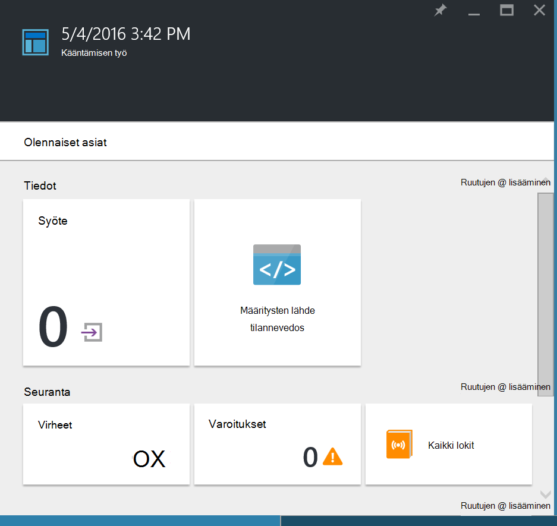
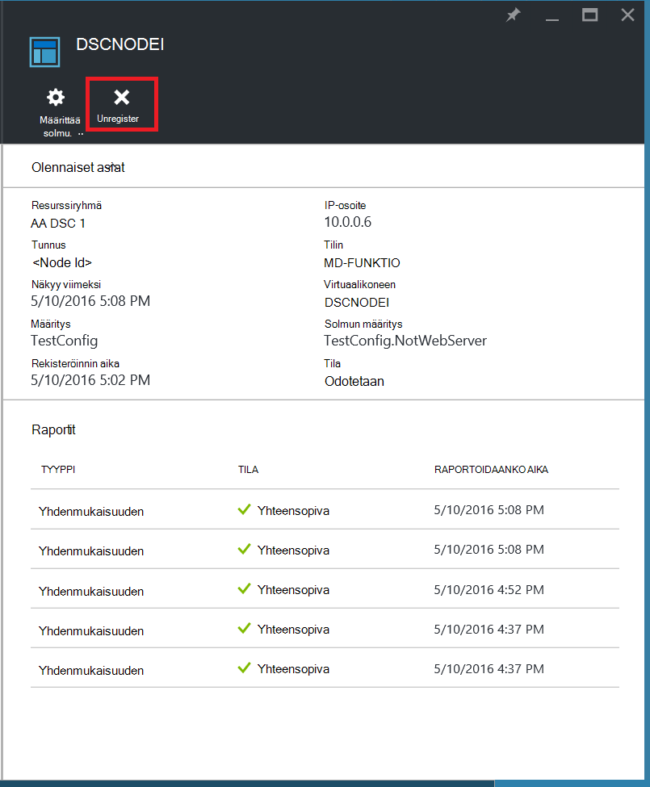

<properties
   pageTitle="Azure automaatio DSC käytön aloittaminen"
   description="SELITYS ja esimerkkejä yleisimpien toimintojen pikanäppäimet-Azure automaatio toivottuja tilan määrittäminen (DSC)"
   services="automation" 
   documentationCenter="na" 
   authors="eslesar" 
   manager="dongill" 
   editor="tysonn"/>

<tags
   ms.service="automation"
   ms.devlang="na"
   ms.topic="article"
   ms.tgt_pltfrm="powershell"
   ms.workload="na" 
   ms.date="06/06/2016"
   ms.author="magoedte;eslesar"/>
   

# <a name="getting-started-with-azure-automation-dsc"></a>Azure automaatio DSC käytön aloittaminen

Tässä ohjeaiheessa kerrotaan, kuinka voit tehdä yleisimpiä tehtäviä ja Azure automaatio toivottuja tilan määritys (DSC), kuten luominen, tuominen, ja kääntäminen määritykset, onboarding koneet, jos haluat hallita, ja raporttien tarkasteleminen. Yleiskuvaus Azure automaatio DSC mikä on artikkelissa [Azure automaatio DSC yleiskatsaus](automation-dsc-overview.md). DSC ohjeita artikkelissa [Windows PowerShellin toivottuja tilan määrittämisen yleiskatsaus](https://msdn.microsoft.com/PowerShell/dsc/overview).

Tämä artikkeli sisältää vaiheittaiset ohjeet Azure automaatio DSC avulla. Malli-ympäristössä, joka on jo määritetty ilman tämän artikkelin ohjeiden halutessasi voit käyttää [seuraavaa ARM-mallia](https://github.com/azureautomation/automation-packs/tree/master/102-sample-automation-setup). Tämän mallin määrittää valmiit Azure automaatio DSC-ympäristössä, mukaan lukien, joka hallitsee Azure automaatio DSC Azure-AM.
 
## <a name="prerequisites"></a>Edellytykset

Jos haluat suorittaa tämän artikkelin esimerkkejä, seuraavat tarvitaan:

- Azure automaatio-tili. Ohjeita Azure automaatio Suorita nimellä-tilin luominen on artikkelissa [Azure Suorita nimellä tilin](automation-sec-configure-azure-runas-account.md).
- Azure-Resurssienhallinta AM (ei perinteinen) käytössä Windows Server 2008 R2 tai uudempi versio. Ohjeita AM luomisesta on artikkelissa [Luo ensimmäinen Windows virtuaalikoneen Azure-portaalissa](../virtual-machines/virtual-machines-windows-hero-tutorial.md)

## <a name="creating-a-dsc-configuration"></a>DSC määrityksen luominen

Luodaan Yksinkertainen [DSC määritysten](https://msdn.microsoft.com/powershell/dsc/configurations) joka takaa, että tavoitettavuuden tai poissaolon, **WWW-palvelimien** Windows ominaisuuden (IIS), sen mukaan, miten voit määrittää solmujen.

1. Käynnistä Windows PowerShell ise: (tai tahansa tekstieditorilla).

2. Kirjoita seuraava teksti:

    ```powershell
    configuration TestConfig
    {
        Node WebServer
        {
            WindowsFeature IIS
            {
                Ensure               = 'Present'
                Name                 = 'Web-Server'
                IncludeAllSubFeature = $true

            }
        }

        Node NotWebServer
        {
            WindowsFeature IIS
            {
                Ensure               = 'Absent'
                Name                 = 'Web-Server'

            }
        }
        }
    ```
3. Tallenna tiedosto nimellä `TestConfig.ps1`.

Tässä määrityksessä tallenteita yksi resurssi solmu kunkin lohkon [WindowsFeature resurssi](https://msdn.microsoft.com/powershell/dsc/windowsfeatureresource), joka takaa, että tavoitettavuustietojen tai **WWW-palvelimien** -ominaisuus ei ole.

## <a name="importing-a-configuration-into-azure-automation"></a>Määrityksen tuominen Azure automaatio

Seuraavaksi on tuo määritykset automaatio-tili.

1. Kirjautuminen [Azure portal](https://portal.azure.com).

2. Valitse toiminto-valikosta **kaikki resurssit** ja sitten automaatio-tilisi nimi.

3. Valitse **Automaattiset tili** -sivu **DSC määrityksiä**.

4. Valitse **Lisää määrityksen** **DSC määritykset** -sivu.

5. Valitse **Tuontimääritys** -sivu `TestConfig.ps1` tiedosto tietokoneesta.
    
    
    

6. Valitse **OK**.

## <a name="viewing-a-configuration-in-azure-automation"></a>Azure automaatio määrityksen tarkasteleminen

Kun olet tuonut määrityksen, voit tarkastella sitä Azure-portaalissa.

1. Kirjautuminen [Azure portal](https://portal.azure.com).

2. Valitse toiminto-valikosta **kaikki resurssit** ja sitten automaatio-tilisi nimi.

3. Valitse **Automaattiset tili** -sivu **DSC käyttömahdollisuudet**

4. Valitse **DSC määritykset** , sivu **TestConfig** (tämä on nimi tuomasi edellisessä määritys).

5. Valitse **Näytä määritysten lähde** **TestConfig määritys** -sivu.

    
    
    **TestConfig määritys lähde** -sivu avautuu ja näyttää määrityksen PowerShell-koodi.
    
## <a name="compiling-a-configuration-in-azure-automation"></a>Käännös Azure automaatio-määritys

Ennen kuin voit käyttää solmu haluttu tila, DSC kokoonpanon määrittäminen valtion on vähintään yksi solmu käyttömahdollisuudet (MOF asiakirja) käännetään, ja sijoitettu automaatio DSC erotettu palvelimen. Katso tarkempia kuvauksen käännetään Azure automaatio DSC määritykset, [käännetään Azure automaatio DSC määrityksiä](automation-dsc-compile.md). Saat lisätietoja käännetään käyttömahdollisuudet [DSC määrityksiä](https://msdn.microsoft.com/PowerShell/DSC/configurations).

1. Kirjautuminen [Azure portal](https://portal.azure.com).

2. Valitse toiminto-valikosta **kaikki resurssit** ja sitten automaatio-tilisi nimi.

3. Valitse **Automaattiset tili** -sivu **DSC käyttömahdollisuudet**

4. Valitse **DSC määritykset** , sivu **TestConfig** (aiemmin tuodun määritysten nimi).

5. Valitse **TestConfig määritys** -sivu **Käännä**ja valitse sitten **Kyllä**. Kääntämisen työn käynnistyy.
    
    
    
> [AZURE.NOTE] Azure automaatio-määrityksen käännöstä, se tunnistus automaattisesti luotu solmu kokoonpanoa MOF salaus puretaan palvelimeen.

## <a name="viewing-a-compilation-job"></a>Kääntämisen projektin tarkasteleminen

Kun olet käynnistänyt kooste, voit tarkastella sitä **määritys** -sivu **kääntäminen työt** -ruudussa. **Kääntämisen työt** -ruutu on käynnissä, valmis ja töiden epäonnistui. Kun avaat kääntäminen työ-sivu, se näyttää tietoja, mukaan lukien mahdolliset virheet tai varoitukset havaitsi työn, syöteparametrit käyttää määrittäminen ja kääntäminen lokit.

1. Kirjautuminen [Azure portal](https://portal.azure.com).

2. Valitse toiminto-valikosta **kaikki resurssit** ja sitten automaatio-tilisi nimi.

3. Valitse **Automaattiset tili** -sivu **DSC määrityksiä**.

4. Valitse **DSC määritykset** , sivu **TestConfig** (aiemmin tuotujen määritysten nimi).

5. Valitse **TestConfig määritys** -sivu **kääntäminen työt** -ruudun mihin tahansa luettelossa työt. **Kääntämisen työ** -sivu avautuu, jossa on päivämäärä, jolloin kääntäminen työ on käynnistetty.

    
  
6. Napsauta mitä tahansa ruutua, kun haluat nähdä muita tietoja työn **Kääntäminen työ** -sivu.

## <a name="viewing-node-configurations"></a>Solmun käyttömahdollisuudet tarkasteleminen

Kääntämisen työn onnistumiseen Luo vähintään yksi uusi solmu-määrityksiä. Solmu-määritys on MOF asiakirja, jossa on otettu käyttöön salaus puretaan palvelimeen ja vedetään ja käyttää vähintään yhden solmujen. Voit tarkastella solmu-määrityksiä automaatio-tilisi **DSC solmu määritykset** -sivu. Solmu-määritys on nimi, jossa lomakkeen *ConfigurationName*. *NodeName*.

1. Kirjautuminen [Azure portal](https://portal.azure.com).

2. Valitse toiminto-valikosta **kaikki resurssit** ja sitten automaatio-tilisi nimi.

3. Valitse **Automaattiset tili** -sivu **DSC solmu määrityksiä**.

    
    
## <a name="onboarding-an-azure-vm-for-management-with-azure-automation-dsc"></a>Onboarding Azure AM hallinnan Azure automaatio DSC kanssa

Azure automaatio DSC avulla voit hallita Azure VMs (perinteinen ja Resurssienhallinta), paikallisen VMs, Linux koneet, sisältyy AWS VMs ja paikallisen fyysisten laitteiden. Tässä aiheessa kerrotaan kuinka määrän vain Azure Resurssienhallinta VMs. Lisätietoja onboarding muuntyyppisten koneet, artikkelissa [Onboarding koneet mukaan Azure automaatio DSC hallintaa varten](automation-dsc-onboarding.md).

### <a name="to-onboard-an-azure-resource-manager-vm-for-management-by-azure-automation-dsc"></a>Ottaa määrän Azure Resurssienhallinta-AM mukaan Azure automaatio DSC hallintaa varten

1. Kirjautuminen [Azure portal](https://portal.azure.com).

2. Valitse toiminto-valikosta **kaikki resurssit** ja sitten automaatio-tilisi nimi.

3. Valitse **DSC solmujen** **automaatio-tili** -sivu.

4. Valitse **Lisää Azure AM** **DSC solmut** -sivu.

    

5. Valitse **Lisää Azure VMs** -sivu **valitsemalla näennäiskoneiden, määrän**.

6. **Valitse VMs** -sivu, valitse haluamasi määrän AM ja valitsemalla **OK**.

    >[AZURE.IMPORTANT] Tämä on oltava käynnissä Windows Server 2008 R2 Azure Resurssienhallinta AM tai uudempi versio.
    
7. Valitse **Määritä rekisteröintitietojen** **Azure VMs lisääminen** -sivu.

8. Kirjoita **rekisteröinti** -sivu solmu määritykset AM **Solmu määritysten nimi** -ruutuun haluamasi nimi. Tämä on oltava täsmälleen samat solmu määrityksen automaatio-tilisi nimi. Nimen antaminen tässä vaiheessa on valinnainen. Voit muuttaa varattujen solmu-määritysten jälkeen onboarding solmu.
Tarkista **Tarvittaessa Käynnistä tietokone uudelleen solmu**ja valitse sitten **OK**.
    
    
    
    Määrittämäsi solmu määritysten käytetään AM **Määritysten tilassa korkojakso**määritetyin aikavälein ja AM tarkistaa päivitykset solmu työnkulkuun **Päivitä korkojakso**määritetyin aikavälein. Saat lisätietoja siitä, miten näitä arvoja käytetään [määrittäminen paikallista määritysten hallinta](https://msdn.microsoft.com/PowerShell/DSC/metaConfig).
    
9. Valitse **Luo** **Azure VMs lisääminen** -sivu.

Azure alkaa onboarding AM prosessi. Kun on valmis, AM näkyy automaatio-tilin **DSC solmut** -sivu.

## <a name="viewing-the-list-of-dsc-nodes"></a>DSC solmujen luettelon tarkasteleminen

Voit tarkastella luetteloa kaikissa tietokoneissa, jotka on onboarded hallinnan automaatio-tilisi **DSC solmut** -sivu.

1. Kirjautuminen [Azure portal](https://portal.azure.com).

2. Valitse toiminto-valikosta **kaikki resurssit** ja sitten automaatio-tilisi nimi.

3. Valitse **DSC solmujen** **automaatio-tili** -sivu.

## <a name="viewing-reports-for-dsc-nodes"></a>DSC solmujen raporttien tarkasteleminen

Aina, kun Azure automaatio DSC suorittaa yhdenmukaisuuden tarkistuksen hallitun solmun solmu lähettää tilaraportin salaus puretaan palvelimeen. Voit tarkastella raportteja, solmun sivu.

1. Kirjautuminen [Azure portal](https://portal.azure.com).

2. Valitse toiminto-valikosta **kaikki resurssit** ja sitten automaatio-tilisi nimi.

3. Valitse **DSC solmujen** **automaatio-tili** -sivu.

4. **Raportit** -ruutu napsauttamalla mihin tahansa raportit-luettelossa.

    

Yksittäisten raportin sivu, valitse näet vastaavan yhdenmukaisuuden Tarkista seuraavat tilatiedot:

- Raportti-tila, vai solmu on "Compliant"-määritys "Epäonnistui" solmu on "Ei ole yhteensopiva" (kun solmu on **applyandmonitor** -tilassa ja tietokoneessa ei ole haluamaasi tilassa).
- Alkamisajan määrittäminen yhdenmukaisuuden-valintaruutu.
- Tarkista yhdenmukaisuuden yhteensä runtime.
- Yhdenmukaisuuden tarkistuksen tyyppi.
- Mahdolliset virheet, kuten virhekoodi ja virhesanoma. 
- DSC resursseja käytetään määritykset ja tilan kullekin resurssille (onko solmu on kyseiselle resurssille halutussa tilassa), voit napsauttaa painiketta saat tarkempia tietoja kyseiselle resurssille kullekin resurssille.
- Nimi, IP-osoite ja solmun kokoonpano tila.

Voit myös napsauttaa **Näytä raaka raportti** todellinen tiedot, jotka solmu lähettää palvelimeen. Lisätietoja tietojen käyttämisestä on artikkelissa [DSC raporttipalvelin](https://msdn.microsoft.com/powershell/dsc/reportserver).

Voi kestää jonkin aikaa, kun solmu on onboarded, ennen kuin ensimmäinen raportti on käytettävissä. Voit joutua odottamaan ensimmäinen raportti enintään 30 minuuttia sen jälkeen, kun siirtyvät solmu.

## <a name="reassigning-a-node-to-a-different-node-configuration"></a>Määrittämällä eri solmu kokoonpanon solmu

Voit määrittää eri solmu-määritys kuin alun perin määritetty näkymän solmu.

1. Kirjautuminen [Azure portal](https://portal.azure.com).

2. Valitse toiminto-valikosta **kaikki resurssit** ja sitten automaatio-tilisi nimi.

3. Valitse **DSC solmujen** **automaatio-tili** -sivu.

4. Valitse uudelleenmääritettävät solmun nimi **DSC solmut** -sivu.

5. Valitse kyseisen solmun sivu **määrittää solmu**.

    

6. Valitse **Määrittää solmu määritys** -sivu, johon haluat määrittää solmun solmu konfigurointi ja valitse sitten **OK**.

    
    
## <a name="unregistering-a-node"></a>Rekisteröintiä solmu

Jos et enää halua Azure automaatio DSC hallinnoi solmu, se voi unregister.

1. Kirjautuminen [Azure portal](https://portal.azure.com).

2. Valitse toiminto-valikosta **kaikki resurssit** ja sitten automaatio-tilisi nimi.

3. Valitse **DSC solmujen** **automaatio-tili** -sivu.

4. Valitse **DSC solmut** -sivu haluat unregister solmun nimi.

5. Valitse **Poista**kyseisen solmun sivu.

    

## <a name="related-articles"></a>Aiheeseen liittyviä artikkeleita
* [Azure automaatio DSC yleiskatsaus](automation-dsc-overview.md)
* [Onboarding koneet mukaan Azure automaatio DSC hallintaa varten](automation-dsc-onboarding.md)
* [Windows PowerShellin toivottuja tilan määrittämisen yleiskatsaus](https://msdn.microsoft.com/powershell/dsc/overview)
* [Azure automaatio DSC cmdlet-komennot](https://msdn.microsoft.com/library/mt244122.aspx)
* [Azure automaatio DSC hinnat](https://azure.microsoft.com/pricing/details/automation/)

