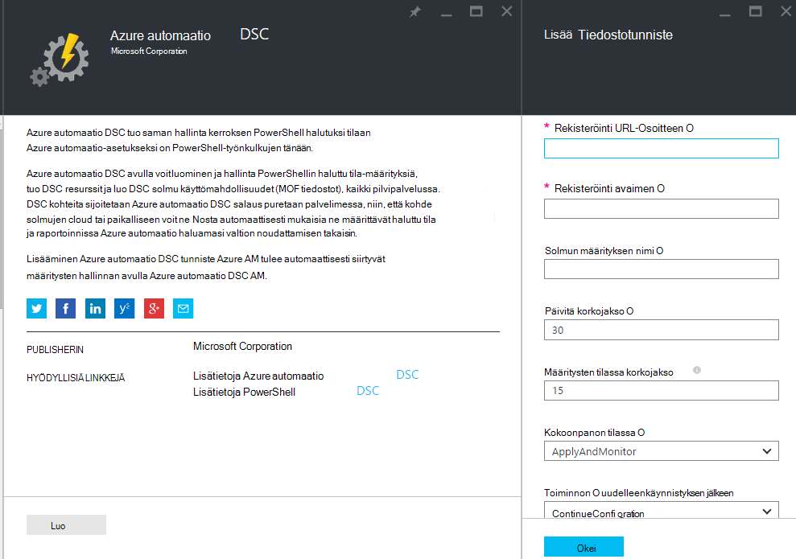
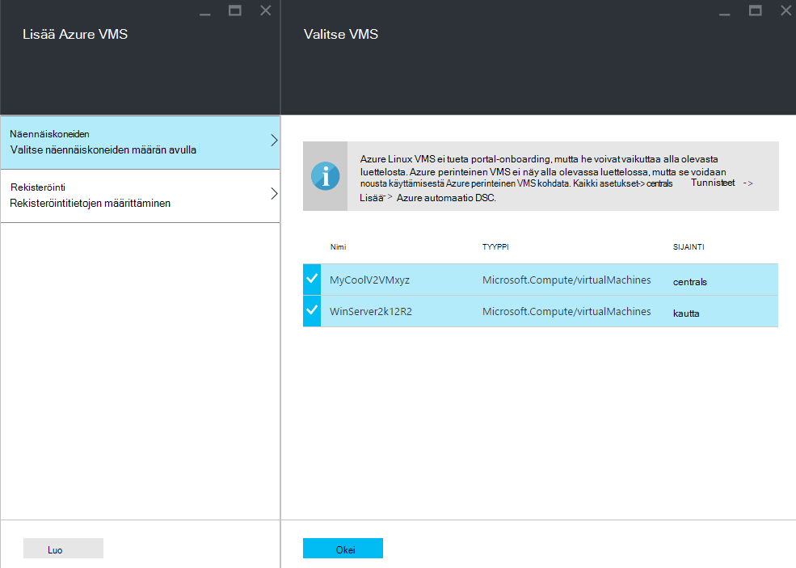
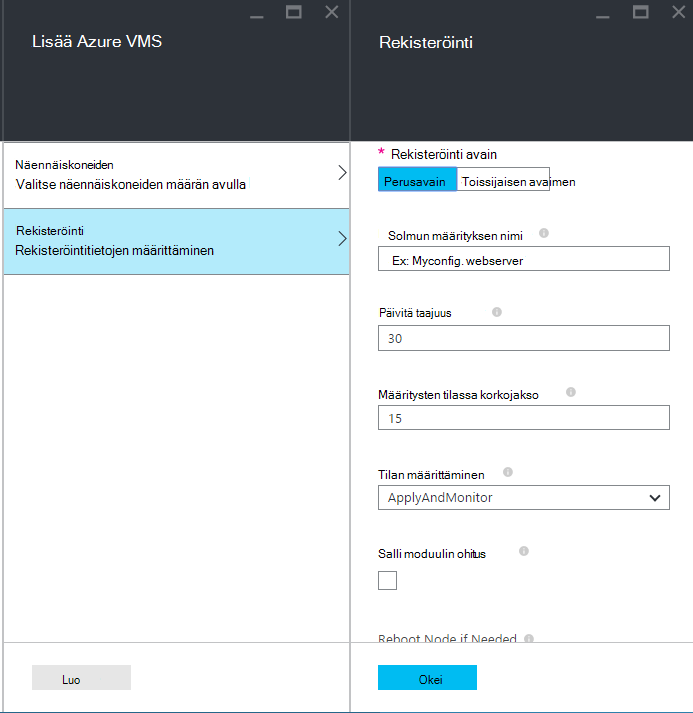
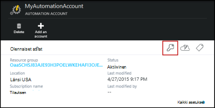
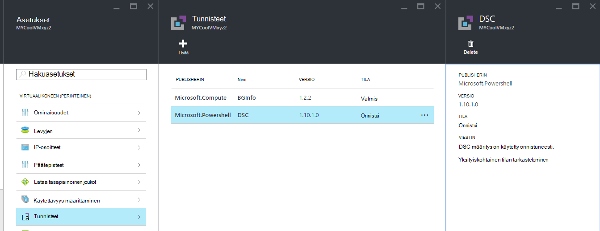

<properties 
   pageTitle="Azure automaatio DSC hallitsemaan Onboarding fyysinen ja virtuaalinen tietokoneissa | Microsoft Azure" 
   description="Azure automaatio DSC johdolle koneet: n määrittäminen" 
   services="automation" 
   documentationCenter="dev-center-name" 
   authors="coreyp-at-msft" 
   manager="stevenka" 
   editor="tysonn"/>

<tags
   ms.service="automation"
   ms.devlang="NA"
   ms.topic="article"
   ms.tgt_pltfrm="powershell"
   ms.workload="TBD" 
   ms.date="04/22/2016"
   ms.author="coreyp"/>

# Onboarding koneet mukaan Azure automaatio DSC hallintaa varten

## Miksi varustetut Azure automaatio DSC hallinta

Kuten [PowerShell toivottuja tilan määrittäminen](https://technet.microsoft.com/library/dn249912.aspx)Azure automaatio toivottuja tilan määrittäminen on yksinkertaisen mutta tehokkaan, määritysten hallinta-palvelu DSC solmujen (fyysisiä ja näennäiskoneiden) minkä tahansa cloud tai paikalliseen joten. Sen avulla skaalattavuus kautta tuhansia koneet nopeasti ja helposti keskitetyn, suojattu sijainnista. Voit helposti määrän koneet, määritä niiden määritettäviä määritykset ja raportit, joissa näkyy kunkin koneen on yhteensopivuuden määrittämäsi haluamasi tilaan. Azure automaatio DSC hallinta kerros on DSC Azure automaatio hallinta kerroksen ominaisuudet PowerShell-komentosarjojen. Toisin sanoen samalla tavalla kuin Azure Automation auttaa hallitsemaan PowerShell-komentosarjojen, valitse se myös avulla voit hallita DSC määrityksiä. Lisätietoja Azure automaatio DSC eduista on artikkelissa [Azure automaatio DSC yleiskatsaus](automation-dsc-overview.md). 

Azure automaatio DSC avulla voidaan hallita eri tietokoneissa:

*    Azure-virtuaalikoneissa (perinteinen)
*    Azure-virtuaalikoneissa
*    Näennäiskoneiden sisältyy Amazon Web Services (AWS)
*    Fyysinen virtual Windows koneet paikallisen, tai pilvipohjaisia kuin Azure/sisältyy AWS
*    Fyysinen virtual Linux koneet paikallisen, Azure tai pilvipohjaisia kuin Azure

Lisäksi jos et ole valmis hallitsemaan kokoonpanossa pilvestä, Azure automaatio DSC voi käyttää myös vain raportin päätepiste. Näin voit määrittää (painallus) – DSC paikallisen uudet määritykset ja tarkastele rich raportointi Azure automaatio haluamasi valtion solmu noudattamisen.

Seuraavissa osissa, kuinka voit siirtyvät erityyppisiin Azure automaatio DSC machine.

## Azure-virtuaalikoneissa (perinteinen)

Azure automaatio DSC avulla voit helposti määrän Azure-virtuaalikoneissa (perinteinen) Azure portal-tai PowerShell määritystenhallintaa varten. Näytä Lisäasetukset ja ilman järjestelmänvalvoja tarvitsee remote kyselyjä AM Azure AM toivottuja tilan määritys-tunniste Rekisteröi AM Azure automaatio DSC. Koska Azure AM toivottuja tilan määritys-tunniste suoritetaan asynkronisesti ohjeita noudattamalla voit seurata sen edistymistä tai vianmääritys on tarkoitettu [**vianmääritys Azure virtuaalikoneen onboarding**](#troubleshooting-azure-virtual-machine-onboarding) -osassa.

### Azure portal

[Azure-portaali](http://portal.azure.com/)valitsemalla **Selaa** -> **näennäiskoneiden (perinteinen)**. Valitse haluamasi määrän Windows AM. Valitse virtual machine dashboard-sivu, **kaikki asetukset** -> **tunnisteet** -> **Lisää** -> **Azure automaatio DSC** -> **luominen**. Kirjoita tarvittavat Käytä tapaus, automaatio-tilin rekisteröiminen-näppäintä ja rekisteröinti URL-osoite ja voit myös solmun kokoonpanossa AM varaaminen [PowerShell DSC paikallinen määritysten hallinta-arvot](https://msdn.microsoft.com/powershell/dsc/metaconfig4) .

Voit etsiä rekisteröinnin URL-osoite ja automaatio avain tilin siirtyvät machine-kohdassa [**suojattu rekisteröinti**](#secure-registration) on kuvattu.

### PowerShellin

    # log in to both Azure Service Management and Azure Resource Manager
    Add-AzureAccount
    Add-AzureRmAccount
    
    # fill in correct values for your VM/Automation account here
    $VMName = ""
    $ServiceName = ""
    $AutomationAccountName = ""
    $AutomationAccountResourceGroup = ""

    # fill in the name of a Node Configuration in Azure Automation DSC, for this VM to conform to
    $NodeConfigName = ""

    # get Azure Automation DSC registration info
    $Account = Get-AzureRmAutomationAccount -ResourceGroupName $AutomationAccountResourceGroup -Name $AutomationAccountName
    $RegistrationInfo = $Account | Get-AzureRmAutomationRegistrationInfo

    # use the DSC extension to onboard the VM for management with Azure Automation DSC
    $VM = Get-AzureVM -Name $VMName -ServiceName $ServiceName
    
    $PublicConfiguration = ConvertTo-Json -Depth 8 @{
      SasToken = ""
      ModulesUrl = "https://eus2oaasibizamarketprod1.blob.core.windows.net/automationdscpreview/RegistrationMetaConfigV2.zip"
      ConfigurationFunction = "RegistrationMetaConfigV2.ps1\RegistrationMetaConfigV2"

    # update these PowerShell DSC Local Configuration Manager defaults if they do not match your use case.
    # See https://technet.microsoft.com/library/dn249922.aspx?f=255&MSPPError=-2147217396 for more details
     Properties = @{
        RegistrationKey = @{
          UserName = 'notused'
          Password = 'PrivateSettingsRef:RegistrationKey'
        }
        RegistrationUrl = $RegistrationInfo.Endpoint
        NodeConfigurationName = $NodeConfigName
        ConfigurationMode = "ApplyAndMonitor"
        ConfigurationModeFrequencyMins = 15
        RefreshFrequencyMins = 30
        RebootNodeIfNeeded = $False
        ActionAfterReboot = "ContinueConfiguration"
        AllowModuleOverwrite = $False
      }
    }

    $PrivateConfiguration = ConvertTo-Json -Depth 8 @{
      Items = @{
         RegistrationKey = $RegistrationInfo.PrimaryKey
      }
    }
    
    $VM = Set-AzureVMExtension `
     -VM $vm `
     -Publisher Microsoft.Powershell `
     -ExtensionName DSC `
     -Version 2.19 `
     -PublicConfiguration $PublicConfiguration `
     -PrivateConfiguration $PrivateConfiguration `
     -ForceUpdate

    $VM | Update-AzureVM

## Azure-virtuaalikoneissa

Azure automaatio DSC avulla voit helposti määrän Azuren näennäiskoneiden määritysten hallinnan Azure portal, Azure Resurssienhallinta malleja tai PowerShellin avulla. Näytä Lisäasetukset ja ilman järjestelmänvalvoja tarvitsee remote kyselyjä AM Azure AM toivottuja tilan määritys-tunniste Rekisteröi AM Azure automaatio DSC. Koska Azure AM toivottuja tilan määritys-tunniste suoritetaan asynkronisesti ohjeita noudattamalla voit seurata sen edistymistä tai vianmääritys on tarkoitettu [**vianmääritys Azure virtuaalikoneen onboarding**](#troubleshooting-azure-virtual-machine-onboarding) -osassa.

### Azure portal

Siirry [Azure portal](https://portal.azure.com/)haluamaasi määrän näennäiskoneiden Azure automaatio-tili. Valitse Automaattiset Raporttinäkymät-ikkunan tilin **DSC solmujen** -> **Lisää Azure AM**.

Valitse **Valitse näennäiskoneiden, määrän**, vähintään yksi Azuren näennäiskoneiden, määrän.

Kirjoita **Määritä rekisteröintitietojen**edellyttämiä Käytä tapaus ja halutessasi solmun kokoonpanossa AM liittäminen [PowerShell DSC paikallinen määritysten hallinta-arvot](https://msdn.microsoft.com/powershell/dsc/metaconfig4) .

 
### Azure Resurssienhallinta-mallit

Azure-virtuaalikoneissa voidaan ottaa käyttöön ja onboarded, Azure automaatio DSC Azure Resurssienhallinta malleja kautta. Artikkelissa [määrittäminen AM DSC tunniste ja Azure automaatio DSC kautta](https://azure.microsoft.com/documentation/templates/dsc-extension-azure-automation-pullserver/) , esimerkiksi mallin kyseisen onboards aiemmin AM, voit Azure automaatio DSC. Voit etsiä rekisteröinti-näppäintä ja rekisteröinti URL-osoite on otettava syötteeksi tämän mallin kohdassa [**suojattu rekisteröinti**](#secure-registration) on kuvattu.

### PowerShellin

[Rekisteröi AzureRmAutomationDscNode](https://msdn.microsoft.com/library/mt603833.aspx) cmdlet-komennon avulla voidaan määrän näennäiskoneiden Azure-portaalissa PowerShellin kautta.

## Näennäiskoneiden sisältyy Amazon Web Services (AWS)

Voit helposti määrän mukaan Azure automaatio DSC sisältyy AWS DSC työkalujen käyttäminen kokoonpanohallintaa Amazon verkkopalvelut näennäiskoneiden. Voit lukea lisää työkalujen [tähän](https://blogs.msdn.microsoft.com/powershell/2016/04/20/aws-dsc-toolkit/).

## Fyysinen virtual Windows koneet paikallisen, tai pilvipohjaisia kuin Azure/sisältyy AWS

Paikallisen Windows-tietokoneissa ja Windows-Azure paveikslėlis (kuten Amazon Web Services)-tietokoneissa voi olla myös onboarded Azure automaatio DSC, kunhan heillä on lähtevä yhteys Internetiin, seuraavien ohjeiden avulla:

1. Varmista, että [WMF 5](http://aka.ms/wmf5latest) uusin versio on asennettu haluamasi määrän Azure automaatio DSC tietokoneissa.
2. Noudata kohdassa [**luodaan DSC metaconfigurations**](#generating-dsc-metaconfigurations) alla luomiseen tarvittavia DSC metaconfigurations sisältävä kansio.
3. Käytä etäyhteyden PowerShell DSC metaconfiguration koneet, jonka haluat määrän. **Tämä komento suoritetaan tietokoneessa on oltava asennettuna [WMF 5](http://aka.ms/wmf5latest) uusimman version**:

    `Set-DscLocalConfigurationManager -Path C:\Users\joe\Desktop\DscMetaConfigs -ComputerName MyServer1, MyServer2`

4. Jos et voi käyttää PowerShell DSC metaconfigurations etäyhteyden välityksellä, kopioi metaconfigurations kansio vaiheessa 2 jokaisen tietokoneen tiedostojen määrän. Valitse Soita **Määrittäminen DscLocalConfigurationManager** paikallisesti jokaiseen tietokoneeseen, määrän.
5. Azure kautta tai Cmdlet-komentoja, varmista, että koneet määrän nyt näkyvät DSC solmujen rekisteröity Azure automaatio-tilisi avulla.

## Fyysinen virtual Linux koneet paikallisen, Azure tai pilvipohjaisia kuin Azure

Paikallisen Linux koneet, Linux koneet Azure-tietokannassa ja Linux koneet--Azure paveikslėlis voi olla myös onboarded Azure automaatio DSC, kunhan heillä on lähtevä yhteys Internetiin, seuraavien ohjeiden avulla:

1. Varmista, että [DSC Linux agentti](http://www.microsoft.com/download/details.aspx?id=49150) uusin versio on asennettu haluamasi määrän Azure automaatio DSC tietokoneissa.

2. Jos [PowerShell DSC paikallinen hallintatoiminto oletusasetusten](https://msdn.microsoft.com/powershell/dsc/metaconfig4) vastaavat Käyttötapaus ja haluat ottaa määrän koneet siten, että ne **sekä hyödyntää raportoi Azure automaatio DSC** :

    *    Kunkin Linux-laitteeseen, Azure automaatio DSC määrän käyttää Register.py määrän käyttämällä PowerShell DSC paikallinen määritysten hallinta-oletusarvot:

        `/opt/microsoft/dsc/Scripts/Register.py <Automation account registration key> <Automation account registration URL>`

    *    Etsi automaatio-tilisi rekisteröinti-näppäintä ja rekisteröinti URL-osoite, on kohdassa [**suojatun rekisteröinti**](#secure-registration) alla.

    Jos oletusasetukset PowerShell DSC paikallinen määritysten hallinta **ei** Käytä tapaus, tai haluat määrän koneet siten, että vain raportoivat Azure automaatio DSC vastine **Älä** Tee mutta siitä ei erotettu määritysten tai PowerShell-moduuleja, toistamalla vaiheet 3 – 6. Muussa tapauksessa siirry suoraan vaiheeseen 6.

3.  Noudata alla luomiseen tarvittavia DSC metaconfigurations kansio [**luodaan DSC metaconfigurations**](#generating-dsc-metaconfigurations) -osassa.
4.  Etäyhteydellä koskevat PowerShell DSC metaconfiguration koneet, jonka haluat määrän:
        
        $SecurePass = ConvertTo-SecureString -String "<root password>" -AsPlainText -Force
        $Cred = New-Object System.Management.Automation.PSCredential "root", $SecurePass
        $Opt = New-CimSessionOption -UseSsl -SkipCACheck -SkipCNCheck -SkipRevocationCheck

        # need a CimSession for each Linux machine to onboard
        
        $Session = New-CimSession -Credential $Cred -ComputerName <your Linux machine> -Port 5986 -Authentication basic -SessionOption $Opt
        
        Set-DscLocalConfigurationManager -CimSession $Session –Path C:\Users\joe\Desktop\DscMetaConfigs
    
Tämä komento suoritetaan tietokoneessa on oltava asennettuna [WMF 5](http://aka.ms/wmf5latest) uusimman version.

5.  Jos et voi käyttää PowerShell DSC metaconfigurations etänä kunkin Linux-tietokoneeseen, voit kopioida, vastaavat vaiheessa 5 sivulle Linux machine-kansiosta, että koneen metaconfiguration. Valitse Soita `SetDscLocalConfigurationManager.py` paikallisesti Linux jokaiseen tietokoneeseen haluat ottaa määrän Azure automaatio DSC:

    `/opt/microsoft/dsc/Scripts/SetDscLocalConfigurationManager.py –configurationmof <path to metaconfiguration file>`

6.  Azure kautta tai Cmdlet-komentoja, varmista, että koneet määrän nyt näkyvät DSC solmujen rekisteröity Azure automaatio-tilisi avulla.

##DSC metaconfigurations luotaessa
Jos haluat yhdistyvät toisten tietokantajärjestelmien määrän konetta Azure automaatio DSC DSC metaconfiguration voidaan luodaan, kun, kertoo DSC-agentti tietokoneeseen, voit noutaa ja/tai raportin Azure automaatio DSC. DSC metaconfigurations Azure automaatio DSC, voi luoda käyttämällä PowerShell DSC määritysten tai Azure automaatio PowerShellin cmdlet-komennot.

**Huomautus:** DSC metaconfigurations sisältää tietoja tarvitaan voit määrän machine automaatio tilin hallinta. Varmista, että suojaa oikein minkä tahansa DSC metaconfigurations, voit luoda tai poistaa niitä käytön jälkeen.

###DSC-määritysten käyttäminen
1.  Avaa tietokoneen paikallisen ympäristön PowerShell ise: järjestelmänvalvojana. Tietokoneessa on oltava asennettuna [WMF 5](http://aka.ms/wmf5latest) uusimman version.

2.  Kopioi seuraava komentosarja paikallisesti. Tämä komentosarja sisältää PowerShell DSC määrityksen metaconfigurations ja komennon käyttö metaconfiguration luomisen luomista varten.
    
        # The DSC configuration that will generate metaconfigurations
        [DscLocalConfigurationManager()]
        Configuration DscMetaConfigs 
        { 
            param 
            ( 
                [Parameter(Mandatory=$True)] 
                [String]$RegistrationUrl,
         
                [Parameter(Mandatory=$True)] 
                [String]$RegistrationKey,

                [Parameter(Mandatory=$True)] 
                [String[]]$ComputerName,

                [Int]$RefreshFrequencyMins = 30, 
            
                [Int]$ConfigurationModeFrequencyMins = 15, 
            
                [String]$ConfigurationMode = "ApplyAndMonitor", 
            
                [String]$NodeConfigurationName,

                [Boolean]$RebootNodeIfNeeded= $False,

                [String]$ActionAfterReboot = "ContinueConfiguration",

                [Boolean]$AllowModuleOverwrite = $False,

                [Boolean]$ReportOnly
            )

    
            if(!$NodeConfigurationName -or $NodeConfigurationName -eq "") 
            { 
                $ConfigurationNames = $null 
            } 
            else 
            { 
                $ConfigurationNames = @($NodeConfigurationName) 
            }

            if($ReportOnly)
            {
               $RefreshMode = "PUSH"
            }
            else
            {
               $RefreshMode = "PULL"
            }

            Node $ComputerName
            {

                Settings 
                { 
                    RefreshFrequencyMins = $RefreshFrequencyMins 
                    RefreshMode = $RefreshMode 
                    ConfigurationMode = $ConfigurationMode 
                    AllowModuleOverwrite = $AllowModuleOverwrite 
                    RebootNodeIfNeeded = $RebootNodeIfNeeded 
                    ActionAfterReboot = $ActionAfterReboot 
                    ConfigurationModeFrequencyMins = $ConfigurationModeFrequencyMins 
                }

                if(!$ReportOnly)
                {
                   ConfigurationRepositoryWeb AzureAutomationDSC 
                    { 
                        ServerUrl = $RegistrationUrl 
                        RegistrationKey = $RegistrationKey 
                        ConfigurationNames = $ConfigurationNames 
                    }

                    ResourceRepositoryWeb AzureAutomationDSC 
                    { 
                       ServerUrl = $RegistrationUrl 
                       RegistrationKey = $RegistrationKey 
                    }
                }

                ReportServerWeb AzureAutomationDSC 
                { 
                    ServerUrl = $RegistrationUrl 
                    RegistrationKey = $RegistrationKey 
                }
            } 
        }
        
        # Create the metaconfigurations
        # TODO: edit the below as needed for your use case
        $Params = @{
             RegistrationUrl = '<fill me in>';
             RegistrationKey = '<fill me in>';
             ComputerName = @('<some VM to onboard>', '<some other VM to onboard>');
             NodeConfigurationName = 'SimpleConfig.webserver';
             RefreshFrequencyMins = 30;
             ConfigurationModeFrequencyMins = 15;
             RebootNodeIfNeeded = $False;
             AllowModuleOverwrite = $False;
             ConfigurationMode = 'ApplyAndMonitor';
             ActionAfterReboot = 'ContinueConfiguration';
             ReportOnly = $False;  # Set to $True to have machines only report to AA DSC but not pull from it
        }
        
        # Use PowerShell splatting to pass parameters to the DSC configuration being invoked
        # For more info about splatting, run: Get-Help -Name about_Splatting
        DscMetaConfigs @Params

3.  Täytä automaatio-tilisi sekä määrän koneet nimet rekisteröinti-näppäintä ja URL-osoite. Kaikki muut parametrit ovat valinnaisia. Etsi automaatio-tilisi rekisteröinti-näppäintä ja rekisteröinti URL-osoite, on kohdassa [**suojatun rekisteröinti**](#secure-registration) alla.

4.  Jos haluat raportin Azure automaatio DSC DSC tilan tietoja, mutta ei tuoda määritysten tai PowerShell-moduuleja koneet, **ReportOnly** -parametrin arvoksi true.

5.  Komentosarjan suorittaminen Pitäisi nyt olla kansio nimeltä **DscMetaConfigs** toimimasta hakemistoa PowerShell DSC metaconfigurations koneet määrän, joka sisältää.

###Azure automaatio cmdlet-komentojen käyttäminen
Jos PowerShell DSC paikallinen määritysten hallinta-oletusasetusten vastaavat Käyttötapaus ja haluat määrän koneet siten, että sekä hyödyntää ja raportoi Azure automaatio DSC Azure automaatio cmdlet-komennot on yksinkertaistettu keinot luonnissa tarvittavat DSC metaconfigurations:

1.  Avaa tietokoneen paikallisen ympäristön PowerShell console tai PowerShell ise: järjestelmänvalvojana.

2.  Yhdistä ja Azure Resurssienhallinta käyttämällä **Lisää AzureRmAccount**

3.  Lataa PowerShell DSC metaconfigurations tietokoneissa haluamasi määrän, automaatio-tili, johon haluat solmujen määrän:

        # Define the parameters for Get-AzureRmAutomationDscOnboardingMetaconfig using PowerShell Splatting
        $Params = @{
            ResourceGroupName = 'ContosoResources'; # The name of the ARM Resource Group that contains your Azure Automation Account
            AutomationAccountName = 'ContosoAutomation'; # The name of the Azure Automation Account where you want a node on-boarded to
            ComputerName = @('web01', 'web02', 'sql01'); # The names of the computers that the meta configuration will be generated for
            OutputFolder = "$env:UserProfile\Desktop\";
        }
        
        # Use PowerShell splatting to pass parameters to the Azure Automation cmdlet being invoked
        # For more info about splatting, run: Get-Help -Name about_Splatting
        Get-AzureRmAutomationDscOnboardingMetaconfig @Params

Sinulla pitäisi nyt ***DscMetaConfigs***, PowerShell DSC metaconfigurations koneet määrän, joka sisältää-nimiseen kansioon.

##Suojatun rekisteröinti

Koneet voit turvallisesti siirtyvät Azure automaatio-tilille, WMF 5 DSC rekisteröinti protokolla, joka sallii DSC solmu todentaa PowerShell DSC V2 erotettu tai raportointi-palvelinta (mukaan lukien Azure automaatio DSC) kautta. Solmun Rekisteröi palvelin **Rekisteröinti URL-osoite**, todennustapa **rekisteröinti avaimen**avulla. Rekisteröinnin aikana DSC-solmu ja DSC salaus puretaan ja Reporting server neuvottelemalla solmu, jos haluat käyttää palvelimen jälkeistä todennusta yksilöllinen varmennetta. Tämä toimenpide estää onboarded solmujen tekeytyminen jokin toiseen, esimerkiksi jos solmu on ongelmia ja muunnettuna haitalliseksi. Rekisteröinnin jälkeen rekisteröinti-näppäin ei käytetä todennusta uudelleen ja solmu poistetaan.

Saat Azure esikatselu-portaalin **Hallinta näppäimet** -sivu-DSC rekisteröinti-protokollan tarvittavat tiedot. Avaa tämä sivu valitsemalla Avainkuvake **Essentials** -ruudun automaatio-tilille.

*    Rekisteröinti URL on URL-osoite-kenttään näppäimet hallinta-sivu.
*    Rekisteröinti avain on Access perusavain tai toissijaisen pikanäppäin näppäimet hallinta-sivu. Joko avainta voi käyttää.

Suojauksen automaatio-tilin ensisijainen ja toissijainen pikanäppäimet ne voidaan luoda uudelleen milloin tahansa (Valitse **Näppäimet hallinta** -sivu) voit estää tulevien solmu merkintöjen Edellinen-näppäimellä.

##Azure virtuaalikoneen onboarding vianmääritys

Azure automaatio DSC avulla voit helposti määrän Azure Windows VMs määritystenhallintaa varten. Näytä lisäasetukset Azure AM toivottuja tilan määritys-tunniste käytetään Rekisteröi AM Azure automaatio DSC. Koska Azure AM toivottuja tilan määritys-tunniste suoritetaan asynkronisesti, seurata sen edistymistä ja sen suorittamisen vianmääritys voi olla merkitystä. 

>[AZURE.NOTE] Mitä tahansa menetelmää onboarding Azure Windows-AM Azure automaatio DSC, Azure AM toivottuja tilan määritys-tunniste, voi kestää tunneiksi solmun näyttämään jopa Azure automaatio rekisteröity. Tällä Windows Management Framework 5.0-Azure AM DSC-tunniste, jota tarvitaan määrän mukaan AM asennuksen vuoksi, Azure automaatio DSC AM.

Vianmääritys tai tilan Azure AM toivottuja tilan määritys-tunniste, Azure-tietokannassa portal Siirry parhaillaan onboarded AM ja sitten Valitse **kaikki asetukset**-> -> **tunnisteet** -> **DSC**. Lisätietoja valitsemalla **Näytä yksityiskohtaiset tila**.

## Vanhentumisen ja reregistration

Kun kone DSC-solmu-Azure automaatio DSC, on useita syitä, miksi voit joutua solmun myöhemmin uudelleen:

* Kun, kukin solmu neuvottelee automaattisesti yksilöllinen varmenne, joka vuosi vanhentuu todennusta varten. PowerShell DSC rekisteröinti-protokollaa ei voi tällä hetkellä uusia varmenteet automaattisesti, kun ne lähenee vanheneminen, joten sinun täytyy Rekisteröi solmut vuoden ajan kuluttua. Ennen kuin reregistering, varmista, että kukin solmu on käynnissä Windows Management Framework 5.0 RTM. Jos solmun todennusvarmenne umpeutuu ja solmu ei ole rekisteröity-solmu voi pitää yhteyttä Azure automaatio ja merkitään "Unresponsive." Reregistration suorittaa 90 päivää tai pienempi varmenteen päättymisaika tai milloin tahansa jälkeen varmenteen päättymisaika, tuloksena on luotu ja käyttää uutta varmennetta.

* Jos haluat muuttaa [PowerShell DSC paikallinen määritysten hallinta-arvoja](https://msdn.microsoft.com/powershell/dsc/metaconfig4) , jotka olivat valittuina solmu, kuten ConfigurationMode ensimmäisen rekisteröinnin yhteydessä. Tällä hetkellä seuraavia DSC agentti arvoja voi muuttaa vain reregistration kautta. Ainoa poikkeus on määritetty solmun solmu määritys--tämä voidaan muuttaa Azure automaatio DSC suoraan.

Reregistration voidaan suorittaa rekisteröidyt solmu aluksi avulla onboarding menetelmien tässä asiakirjassa samalla tavalla. Sinun ei tarvitse unregister Azure automaatio DSC-solmu ennen reregistering sitä.

## Aiheeseen liittyviä artikkeleita
* [Azure automaatio DSC yleiskatsaus](automation-dsc-overview.md)
* [Azure automaatio DSC cmdlet-komennot](https://msdn.microsoft.com/library/mt244122.aspx)
* [Azure automaatio DSC hinnat](https://azure.microsoft.com/pricing/details/automation/)

