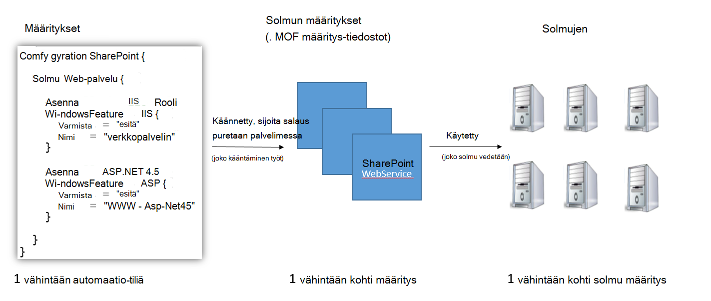

<properties 
   pageTitle="Azure automaatio DSC yleiskatsaus | Microsoft Azure" 
   description="Yleiskatsaus, Azure automaatio toivottuja tilan määrittäminen (DSC), sen ehtoja ja tunnetut ongelmat" 
   services="automation" 
   documentationCenter="dev-center-name" 
   authors="coreyp-at-msft" 
   manager="stevenka" 
   editor="tysonn"
   keywords="PowerShellin dsc, määritysten halutussa tilassa, powershell dsc azure"/>

<tags
   ms.service="automation"
   ms.devlang="NA"
   ms.topic="article"
   ms.tgt_pltfrm="powershell"
   ms.workload="TBD" 
   ms.date="05/10/2016"
   ms.author="magoedte;coreyp"/>

# Azure automaatio DSC yleiskatsaus #

##Mikä on Azure automaatio DSC?##
Asentaminen ja ylläpito palvelimia ja sovelluksen resurssit haluttu tila voi olla vaivalloista ja virhe voi enää. Kanssa Azure automaatio haluamasi tilan määrittäminen (DSC), voit johdonmukaisesti käyttöön, luotettavasti valvoa ja päivittää automaattisesti kaikki IT resurssien tasolla pilvestä haluttu tila. Rakennettu PowerShell DSC automaatio DSC voit tasata kokoonpanossa tietyn tila fyysisiä ja näennäiskoneiden (VMs) Windows-tai Linux- ja cloud tai paikalliseen. Voit ottaa jatkuva IT services toimituksen yhdenmukaisia ohjausobjektin kanssa ja nopean muuta hallitsemaan erilaisten hybrid IT-ympäristön vaivattomasti.

Azure automaatio DSC muodostaa een PowerShellin DSC antamaan entistäkin helpompaa määritysten hallintatoimintojen perustiedot päälle. Azure automaatio DSC tuo hallinta samalle tasolle [PowerShell toivottuja tilan määritys](https://msdn.microsoft.com/powershell/dsc/overview) kuin Azure automaatio tarjoaa PowerShell-komentosarjojen tänään.

Azure automaatio DSC mahdollistavat [luominen ja hallinta PowerShellin haluttu tila-määrityksiä](https://technet.microsoft.com/library/dn249918.aspx), tuo [DSC resurssit](https://technet.microsoft.com/library/dn282125.aspx)ja luo DSC solmu käyttömahdollisuudet (MOF tiedostot), kaikki pilvipalvelussa. DSC kohteita sijoitetaan Azure automaatio [DSC erotettu palvelimen](https://technet.microsoft.com/library/dn249913.aspx) niin, että cloud tai paikalliseen kohde solmujen (kuten fyysisiä ja näennäiskoneiden) voit ne Nosta automaattisesti mukainen ne määrittävät haluttu tila ja raportoinnissa takaisin Azure automaatio haluamasi valtion mukaisia.

Mieluummin katsominen lukeminen? Osoitteesta toukokuu 2015, kun Azure automaatio DSC ensin ilmoitettiin videon alapuolella. **Huomautus:** Vaikka käsitteitä ja elinkaari Tässä videossa käsitellään ovat oikein, Azure automaatio DSC on edennyt usein, koska tämä video on tallennettu. Se on nyt yleisesti saatavilla, on paljon laajemmat Käyttöliittymä Azure-portaalissa ja tukee useita uusia ominaisuuksia.

> [AZURE.VIDEO microsoft-ignite-2015-heterogeneous-configuration-management-using-microsoft-azure-automation]

## Azure automaatio DSC ehdot ##
### Määritys ###
PowerShellin DSC käyttöön uuden käsite, kutsutaan määrityksiä. Määrityksiä avulla voit määrittää syntaksi PowerShellin kautta ympäristön haluttu tila. DSC avulla voit määrittää ympäristösi, ensin määrittää Windows PowerShellin komentosarjan eston määritysten avainsana ja valitse sen perään sulkeisiin tunniste, valitse rajaa lohkon aaltosulkeet ({}) kanssa.

Määritysten lohkon voit määrittää solmu määritysten lohkot, jotka määrittävät uudet määritykset solmujen (tietokoneet), joka on oltava ympäristön määrittäminen määritetty täsmälleen samat. Tällä tavalla solmu määritysten edustaa "roolia" vähintään yksi solmujen olettaa. Solmun määritysten eston alkaa solmu-avainsana. Noudata tämän avainsanan rooli, joka voi olla muuttujan tai lausekkeen nimi. Rooli-nimen jälkeen rajaa solmu kokoonpanon estäminen aaltosulkeet {} avulla.

 
Solmun määritysten lohkon voit määrittää resurssin lohkot määrittämään tietyt DSC resurssit. Resurssin eston alkaa resurssin tunnus haluat määrittää, että lohkon ja sitten rintalappua {}, jos haluat rajata lohkon perään nimi.

Yksityiskohtaisempia tietoja määritys-avainsana,: [Tietoja määritysten avainsana toivottuja tilan määrityksessä](http://blogs.msdn.com/b/powershell/archive/2013/11/05/understanding-configuration-keyword-in-desired-state-configuration.aspx "Tietoja määritysten avainsana toivottuja tilan määrittäminen")

Käynnissä (kääntäminen) DSC määritysten tuottaa vähintään yksi DSC solmu määrityksiä (MOF tiedostot), jotka ovat DSC solmujen käyttää noudattamisen haluttu tila.

Azure automaatio DSC avulla voit tuoda, on ja käännä DSC käyttömahdollisuudet Azure-työkalujen, miten runbooks voidaan tuoda, samalla kirjoitti ja Azure automaatio aloittaminen.

>[AZURE.IMPORTANT] Määrityksen pitäisi olla vain yksi määritys lohkon, on sama nimi kuin määrittäminen Azure automaatio DSC. 

###Solmun määritys###

Kun DSC määritysten käännetään, vähintään yksi solmu määrityksiä on valmistettu solmu lohkot määrityksistä riippuen. Solmu-määritys on sama kuin "MOF" tai "määritysten asiakirjan" (Jos olet tutustunut PS DSC ehdot) ja edustaa "roolia", kuten webserver tai työntekijän, jonka toivottuja vähintään yksi solmujen olisi oletetaan, että tai yhteensopivuuden tarkistaminen. Solmun määritykset-Azure automaatio DSC nimet tukena "Määritysten Name.NodeConfigurationBlockName".

PS DSC solmujen muuttuvat tietoinen solmu käyttömahdollisuudet ne olisi yksinoikeuksia kautta DSC push ja salaus puretaan kautta. Azure automaatio DSC on riippuvainen DSC salaus puretaan menetelmä kohtaa, johon ne kannattaa käyttää Azure automaatio DSC solmujen pyynnön solmu käyttömahdollisuudet erotettu palvelimeen. Koska solmut tehdä pyynnön Azure automaatio DSC, solmujen voi olla palomuurien, on kaikki saapuvat portit suljettu, jne. Tarvitsemansa vain lähtevä yhteys Internetiin (joko suoraan tai välityspalvelimen kautta).

###Solmu###

DSC-solmu on tietokoneen, joka sisältää sen määritysten hallinnassa on käytössä DSC. Tämä voi johtua Windows- tai Linux Azure AM paikallisen AM / fyysinen isännän tai tietokoneen toiseen julkisen pilvipohjaisia. Solmujen yksinoikeuksia solmu määrityksiä muuttuvat ja säilyttää ne määrittävät haluttu tila noudattaminen ja voit myös raportti takaisin reporting server configuration tilan ja haluttu tila ja yhteensopivuus.

Azure automaatio DSC helpottaa onboarding Azure automaatio DSC hallitsemaan solmujen ja sallii muuttaminen myönnetyt kunkin solmun palvelinpuolen-solmu tarkistaa palvelimen ohjeet se oletetaan, että eri rooli ja miten se on määritetty ja complaince tilan muuttaminen seuraavan kerran se olisi raportoida vastaan vastaamaan solmu-määritys.

###Resurssi###
DSC resurssit ovat rakenneosien, joiden avulla voit määrittää Windows PowerShellin toivottuja tilan määrittäminen (DSC)-määritys. DSC sisältyy valmiin resurssit, kuten tiedostot ja kansiot, palvelimen ominaisuudet ja roolit, rekisteriasetukset, ympäristömuuttujat ja palvelut ja prosessien joukkoa. Lisätietoja täydellisestä luettelosta valmiita DSC resurssit ja niiden käyttämisestä on artikkelissa [Valmiita Windows PowerShellin toivottuja tilan määritys resurssit](https://technet.microsoft.com/library/dn249921.aspx).

DSC resursseja voi tuoda myös laajentaa valmiin DSC resurssien määrittäminen moduulit PowerShell osana. Muun kuin oletusarvoisen resursseja vedettävä alas DSC solmut DSC salaus puretaan palvelimesta, jos solmu tarkoitus on antaa solmu määrityksen sisältävät viittauksia resurssit. Lisätietoja mukautetuista resursseista luomisesta on ohjeaiheessa [Luominen mukautetun Windows PowerShellin toivottuja tilan määritys resurssit](https://technet.microsoft.com/library/dn249927.aspx).

Azure automaatio DSC mukana samat valmiin DSC resursseja kuin PS DSC. Lisäresursseja voidaan lisätä Azure automaatio DSC tuomalla PowerShell moduulit sisältävä Azure automaatio resurssit.

###Kääntämisen työ###
Azure automaatio DSC kääntäminen työ on esiintymä kääntäminen määrityksen, voit luoda yhden tai useamman solmu-määrityksiä. He ovat samalla Azure automaatio runbookin työt, sillä erotuksella, että ne eivät todellisuudessa Suorita mitä tahansa tehtävään, paitsi jos haluat luoda solmu määrityksiä. Minkä tahansa solmu-määrityksiä kääntäminen työn luomia sijoitetaan automaattisesti Azure automaatio DSC salaus puretaan palvelimessa ja korvaa solmu käyttömahdollisuudet aiemmissa versioissa, jos ne olemassa määritysten. Kääntämisen työn tuottamat solmu määrityksen nimi Vie muodossa "ConfigurationName.NodeConfigurationBlockName". Esimerkiksi käännös-määritysten alla Luo yksittäinen solmu nimeltä "MyConfiguration.webserver" määrityksen

>[AZURE.NOTE] Runbooks, kuten voi julkaista määrityksiä. Tämä ei liity laajennettujen DSC kohteiden Azure automaatio DSC salaus puretaan palvelimeen. Kääntämisen työt aiheuttaa DSC sijoittaa Azure automaatio DSC salaus puretaan palvelimessa. Saat lisätietoja Azure automaatio "julkaiseminen" [julkaiseminen Runbookin](https://msdn.microsoft.com/library/dn903765.aspx).

##Azure automaatio DSC elinkaari##
Tyhjä automaatio-tilistä siirtymällä oikein määritetyn solmujen hallitun joukko käsittää joukon prosesseja määritykset, poistamalla näiden määritysten solmu määritykset ja onboarding solmujen Azure automaatio DSC ja solmu näiden määritysten määrittäminen. Seuraavassa kaaviossa on kuvattu Azure automaatio DSC elinkaari:

Seuraavassa kuvassa on kuvattu yksityiskohtaiset vaiheittaisiin ohjeisiin siirtymistä DSC elinkaaren. Se sisältää eri tavoin määrityksen tuodaan, ja Azure automaatio solmujen paikallisen-koneen tukemaan suodatukset eri osien välillä ja DSC varten tarvittavat komponentit käyttöön. 

     

##Kompastuskiviä / tunnetut ongelmat:##

- Päivitystä WMF 5 RTM, jos tietokoneessa on jo rekisteröity Azure automaatio DSC solmun unregister Azure automaatio DSC- ja rekisteröi se WMF 5 RTM päivityksen jälkeen.

- Azure automaatio DSC ei tue osittain tai koosteen DSC käyttömahdollisuudet tällä hetkellä. Kuitenkin DSC koosteen resursseja voidaan tuoda ja käyttää Azure automaatio DSC määrityksiä samalla tavalla kuin paikallisen powershellissä-määritys uudelleen käyttöön.

- WMF 5 uusimman version on oltava asennettuna voivat pitää yhteyttä Azure automaatio Windows PowerShellin DSC-agentti. Linux PowerShell DSC-agentti uusimman version on oltava asennettuna Linux voivan Azure automaatio yhteydessä.

- Perinteinen PowerShell DSC salaus puretaan palvelimen odottaa moduulin kulkee salaus puretaan palvelimessa olevaan muoto sijoitetaan **ModuleName_Version.zip "**. Azure automaatio odottaa PowerShell moduulit tuomista nimillä **ModuleName.zip**muodossa. Katso lisätietoja [rajaamisesta on blogikirjoituksessa](https://azure.microsoft.com/blog/2014/12/15/authoring-integration-modules-for-azure-automation/) tarvitsee moduulin tuominen Azure automaatio integrointi moduuli. 

- Tuotu Azure automaatio PowerShell-moduulit ei voi olla .doc ja .docx-tiedostoja. Jotkin PowerShell-moduulit sisältävä DSC resurssit sisältävät tiedostot ohjeen tarkoituksiin. Nämä tiedostot on poistettava moduuleista, ennen kuin Azure automaatio tuominen.

- Kun solmu on ensin rekisteröity Azure automaatio-tilillä tai solmun muutetaan yhdistetään eri solmu määritysten palvelinpuolen, sen tila on "Compliant", vaikka solmun tila ei ole itse asiassa standardien kanssa se on nyt yhdistetty solmu-määritys. Solmun suorittaa sen ensimmäisen salaus puretaan ja lähettää sen ensimmäinen raportti rekisteröinti tai solmu kokoonpanon määritys muutoksen jälkeen, kun solmun tila voidaan luottaa.

- Kun onboarding Azure Windows-AM hallinnan mukaan Azure automaatio DSC käyttämällä suoraa onboarding Microsoftin tavoilla, voi kestää tunneiksi näytettäväksi Azure automaatio DSC solmun AM varten. Tällä Windows Management Framework 5.0-Azure AM DSC-tunniste, jota tarvitaan määrän mukaan AM asennuksen vuoksi, Azure automaatio DSC AM.

- Kun, kukin solmu neuvottelee automaattisesti yksilöllinen varmenne, joka vuosi vanhentuu todennusta varten. Tällä hetkellä PowerShell DSC rekisteröinti-protokollaa ei voi automaattisesti todistusten uusimista ne lähenee vanheneminen, joten sinun täytyy Rekisteröi solmut vuoden ajan kuluttua. Ennen kuin reregistering, varmista, että kukin solmu on käynnissä Windows Management Framework 5.0 RTM. Jos solmun todennusvarmenne umpeutuu ja solmu ei ole rekisteröity-solmu voi pitää yhteyttä Azure automaatio ja merkitään "Unresponsive." Reregistration suoritetaan solmun rekisteröity alun perin samalla tavalla. Reregistration suorittaa 90 päivää tai pienempi varmenteen päättymisaika tai milloin tahansa jälkeen varmenteen päättymisaika, tuloksena on luotu ja käyttää uutta varmennetta.

- Päivitystä WMF 5 RTM, jos tietokoneessa on jo rekisteröity Azure automaatio DSC solmun unregister Azure automaatio DSC- ja rekisteröi se WMF 5 RTM päivityksen jälkeen. Ennen kuin reregistering, poista $env:windir\system32\configuration\DSCEngineCache.mof-tiedosto.

- PowerShell DSC cmdlet-komennot eivät ehkä toimi, jos WMF 5 RTM asennetaan WMF 5 tuotannon esikatselu päälle. Voit korjata ongelman varten suorittamalla seuraavan komennon laajennettuja PowerShell-istunnossa (Suorita järjestelmänvalvojana):`mofcomp $env:windir\system32\wbem\DscCoreConfProv.mof`
 

##Aiheeseen liittyviä artikkeleita##

- [Onboarding Azure automaatio DSC hallitsemaan koneet] (.. /Automation/Automation-DSC-onboarding.MD)
- [Kääntäminen Azure automaatio DSC käyttömahdollisuudet] (.. /Automation/Automation-DSC-Compile.MD)
- [Azure automaatio DSC cmdlet-komennot] (https://msdn.microsoft.com/library/mt244122.aspx)
- [Azure automaatio DSC hinnoittelua] (https://azure.microsoft.com/pricing/details/automation/)
- [IaaS VMs käyttämällä Azure automaatio DSC jatkuva käyttöönottoa ja Chocolatey] (automaatio-dsc-cd-chocolatey.md)
