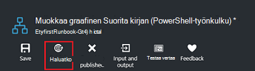
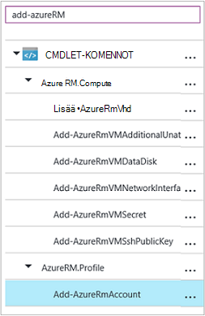
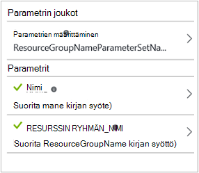

<properties
    pageTitle="Oma Azure automaatio ensimmäisen graafinen runbookin | Microsoft Azure"
    description="Opetusohjelma, joka opastaa sinua luonti-testaaminen ja julkaiseminen on yksinkertainen graafinen runbookin."
    services="automation"
    documentationCenter=""
    authors="mgoedtel"
    manager="jwhit"
    editor=""
    keywords="runbookin, runbookin malli, runbookin automaatio, azure runbookin"/>
<tags
    ms.service="automation"
    ms.workload="tbd"
    ms.tgt_pltfrm="na"
    ms.devlang="na"
    ms.topic="get-started-article"
    ms.date="07/06/2016"
    ms.author="magoedte;bwren"/>

# <a name="my-first-graphical-runbook"></a>Oma ensimmäisen graafinen runbookin

> [AZURE.SELECTOR] - [Graafisen](automation-first-runbook-graphical.md) - [PowerShell](automation-first-runbook-textual-PowerShell.md) - [PowerShell-työnkulku](automation-first-runbook-textual.md)

Tässä opetusohjelmassa esitellään [Graafinen runbookin](automation-runbook-types.md#graphical-runbooks) Azure automaatio luomista.  Asetetaan ensin yksinkertainen runbookin, jossa on Testaa ja Julkaise, kun kerromme runbookin työn tilan seuraaminen.  Valitse muokkaamalla hallittavan todella Azure resurssien runbookin alkaen tällöin Azure virtuaalikoneen.  Olemme Tee: n runbookin tehokkaamman lisäämällä runbookin parametrit ja ehdollinen linkkejä.

## <a name="prerequisites"></a>Edellytykset

Jotta voit suorittaa tässä opetusohjelmassa, sinun on seuraavasti.

-   Azure tilaus.  Jos jokin ei ole vielä, voit [aktivoida MSDN-tilaaja edut](https://azure.microsoft.com/pricing/member-offers/msdn-benefits-details/) tai <a href="/pricing/free-account/" target="_blank"> [rekisteröityä maksuttoman tilin](https://azure.microsoft.com/free/).
-   [Azure Suorita nimellä tilin](automation-sec-configure-azure-runas-account.md) : n runbookin ja Azure resurssien todennusta.  Tällä tilillä on oikeus aloittaa ja lopettaa virtuaalikoneen.
-   Azure virtual machine.  Lopeta ja Käynnistä tämän tietokoneen, jotta se tulee tuotannon.


## <a name="step-1---create-new-runbook"></a>Vaihe 1 - Luo uusi runbookin

Asetetaan ensin luomalla yksinkertaisen runbookin, tulostaa tekstiä *Hei maailma*.

1.  Avaa Azure-portaaliin, automaatio-tilillesi.  
    Automaatio-tili-sivu tutustutaan Pikakatselu resursseista tähän tiliin.  On jo joitakin resurssit.  Useimmat ne ovat moduulit, jotka sisältyvät automaattisesti uuden automaatio-tilin.  On myös oltava tunnistetiedon resurssi, joka on kuvattu [edellytykset](#prerequisites).
2.  Valitse Avaa runbooks luettelo **Runbooks** -ruutu.<br> 
3.  Luo uusi runbookin valitsemalla **Lisää runbookin** -painiketta ja **Luo uusi runbookin**.
4.  Anna: n runbookin *MyFirstRunbook graafinen*nimi.
5.  Tässä tapauksessa emme aiot luoda [Graafinen runbookin](automation-graphical-authoring-intro.md) **graafiset** valitseminen niin **Runbookin tyyppi**.<br> <br>
6.  Valitse **Luo** Luo: n runbookin ja avaa graafinen editorissa.

## <a name="step-2---add-activities-to-the-runbook"></a>Vaihe 2: n runbookin toimintojen lisääminen

Kirjaston ohjausobjektin vasemmassa reunassa editorin avulla voit valita Toiminnot, voit lisätä oman runbookin.  Seuraavaksi voit lisätä voidaan siirtää: n runbookin tekstin **Kirjoittaminen tulosteen** cmdlet-komento.

1.  Kirjaston, ohjausobjektin napsauttamalla Etsi-tekstiruutuun ja kirjoita **Kirjoitus-tulokset**.  Hakutulokset näkyvät jäljempänä. <br> 
2.  Siirry luettelon loppuun.  Voit joko **Kirjoitus-tulokset** napsauttamalla hiiren kakkospainikkeella ja valita **lisääminen Kuvapohjan** tai valitse ellipsin cmdlet-kohdan vieressä ja valitse sitten **Lisää Kuvapohjan**.
3.  Valitse alusta **Kirjoitus-tulostus** -tehtävän.  Jonka avulla voit määrittää tehtävän määritysten hallinta-sivu avautuu.
4.  **Selitteen** oletusarvo cmdlet-komennon nimi, mutta emme voi muuttaa jokin Lisää helpossa muodossa. Vaihtaa sen *Kirjoittaa Hei maailma voidaan siirtää*.
5.  Valitse **Parametrit** -cmdlet-komennolla parametrien arvot.  
    Jotkin cmdlet-komennot on useita, eikä sinun tarvitse Valitse, mihin haluat käyttää. Tässä tapauksessa **Kirjoita tulostus** on vain yksi parametrin määrittäminen, joten sinun ei tarvitse tehdä jokin. <br> 
6.  Valitse **InputObject** -parametri.  Tämä on parametri, jossa on määrittää teksti, joka lähettää tulostus-muodossa.
7.  Valitse **tietolähteen** avattavasta valikosta **PowerShell-lauseke**.  **Tietolähde** -valikko on eri lähteistä, joiden avulla voit täyttää parametrin arvon.  
    Voit käyttää tulosteen näistä lähteistä, kuten toiseen tehtävään, automaatio-resurssi tai PowerShell-lauseke.  Tässä tapauksessa vain haluat siirtää tekstin *Hei maailma*. Syy voidaan käyttää PowerShell-lauseketta ja määritä merkkijonon.
8.  Kirjoita **lauseke** -ruutuun *"Hei-maailman"* ja valitse **OK** kahdesti, kun haluat palata takaisin alusta.<br> 
9.  Tallenna: n runbookin valitsemalla **Tallenna**.<br> 

## <a name="step-3---test-the-runbook"></a>Vaihe 3: n runbookin testi

Ennen kuin on julkaista olla käytettävissä tuotannon runbookin, haluat testata ja varmistaa, että se toimii oikein.  Kun testaat runbookin, suorita sen **Luonnokset** -versio ja tarkastella sen Tulosta vuorovaikutteisesti.

1.  Valitse **Testaa ruudun** Avaa testi-sivu.<br> 
2.  Valitse Aloita testi **Käynnistä-painiketta** .  Tämä on oltava käytössä ainoa vaihtoehto.
3.  [Runbookin työn](automation-runbook-execution.md) luodaan ja sen tilana näkyy-ruudussa.  
    Työn tila alkaa kuin *jonossa* , joka ilmaisee, että se odottaa runbookin työntekijän pilveen ole käytettävissä.  Se sitten siirtyy *käynnistetään* kun työntekijä väittää työn ja *suorittamalla* , kun n runbookin todella käynnistyy.  
4.  Kun runbookin työ on valmis, tulos tulee näkyviin. Tässä tapauksessa emme pitäisi näkyä *Hei maailma*.<br> 
5.  Sulje palaa alusta testi-sivu.

## <a name="step-4---publish-and-start-the-runbook"></a>Vaihe 4 – Julkaise ja Käynnistä: n runbookin

Runbookin, jonka juuri luonut on edelleen luonnoksena. Julkaise se ennen kuin olemme voidaan suorittaa tuotannon annettava.  Kun julkaiset runbookin, korvaa aiemmin julkaistu versio luonnos-versiolla.  Tässä tapauksessa emme ole julkaistu versio vielä koska juuri luomaasi: n runbookin.

1.  Valitse **Julkaise** , jos haluat julkaista: n runbookin ja sitten **Kyllä** pyydettäessä.<br> 
2.  Jos siirryt vasemmalle: n runbookin tarkasteleminen **Runbooks** -sivu, se näkyy **Yhtä aikaa muiden kanssa tila** on **julkaistu**.
3.  Vieritä takaisin oikeuden tarkastella **MyFirstRunbook**sivu.  
    Yläreunassa vaihtoehtojen avulla, että aloittaa: n runbookin, Ajoita sen myöhemmin jonkin aikaa alkamaan tai luo [webhook](automation-webhooks.md) , jotta se voidaan aloittaa HTTP-puhelun kautta.
4.  Haluamme vain käynnistää: n runbookin niin Valitse **Käynnistä** ja valitse sitten **Kyllä** pyydettäessä.<br> 
5.  Työ-sivu avautuu runbookin, jonka juuri luonut projektille.  Olemme Sulje tämä sivu, mutta tässä tapauksessa emme jätä se avatuksi niin emme voi katsella projektin edistymisen.
6.  Työn tilana näkyy **Yhteenveto** ja käyttää vastineena tilat, joka on tuli kun testattu: n runbookin.<br> 
7.  Kun runbookin tila on *Valmis*, valitse **tulos**. **Tulostus** -sivu on auki ja näkyvissä Microsoftin *Hei maailma* -ruudussa.<br>   
8.  Sulje tulostus-sivu.
9.  Valitse **Kaikki lokit** Avaa runbookin työn virtaa-sivu.  Näemme olisi vain *Hei maailma* tulostus-muodossa, mutta tämä Näytä muut virtaa runbookin työlle, kuten yksityiskohtainen ja virheen, jos n runbookin kirjoittaa ne.<br> 
10. Sulje kaikki lokit-sivu ja palaa MyFirstRunbook sivu työ-sivu.
11. Valitse Avaa työt-sivu, tämä runbookin **työt** .  Tämä näyttää luettelon kaikista tämän runbookin luoma työt. Näemme on vain yksi työ, koska on vain suoritettiin työn kerran luettelossa.<br> 
12. Voit valita tämän työn Avaa sama työ-ruutu, jossa on tarkastellut olemme käynnistyessään: n runbookin.  Näin voit siirtyä takaisin aika ja tarkastella projektin, joka on luotu tietyn runbookin.

## <a name="step-5---create-variable-assets"></a>Vaihe 5 – luo muuttujan kalusto

Syy on testannut ja julkaista Microsoftin runbookin, mutta tähän mennessä se ei tee mitään hyötyä. Haluat sen Azure resurssien.  Ennen kuin olemme määrittää tarkistamiseen runbookin, pidä tilauksen tunnus ja viittaus sen jälkeen on määritys vaiheessa 6 alla tarkistamiseen tehtävän muuttujan luodaan.  Tilauksen yhteydessä maininta voit käsitellä välillä useita tilauksia.  Ennen kuin jatkat, kopioi siirtymisruudun luettelosta tilaukset-vaihtoehtoa tilauksen tunnus.  

1. Automaatio-tilit-sivu valitsemalla **kalusto** -ruutu ja **kalusto** -sivu avautuu.
2. Valitse kalusto-sivu **muuttujat** -ruutu.
3. Valitse **Lisää muuttujan**muuttujat-sivu.<br>
4. Kirjoita uuden muuttujan sivu, kirjoita **nimi** -ruutuun **AzureSubscriptionId** ja kirjoita **arvo** ruutuun tilauksen tunnus  Pidä *merkkijonon* **tyyppi** ja oletusarvo **salausta**.  
5. Valitse **Luo** muuttujan luomiseen.  


## <a name="step-6---add-authentication-to-manage-azure-resources"></a>Vaihe 6 – Lisää resurssien Azure-todennus

Nyt, kun on pitoon Microsoftin Tilaustunnus muuttuja, emme määrittäminen meidän runbookin tarkistamiseen, joihin viitataan [edellytykset](#prerequisites)Suorita nimellä tunnuksilla.  Olemme vakiomuotoa lisäämällä Azure Suorita nimellä yhteyden **varat** ja **Lisää AzureRMAccount** cmdlet alusta.  

1.  Avaa graafinen editori valitsemalla **Muokkaa** MyFirstRunbook-sivu.<br> 
2.  Microsoft ei enää tarvita **Kirjoittaa Hei maailma siirrettävät** , niin hiiren kakkospainikkeella ja valitsemalla **Poista**.
3.  Laajenna **yhteydet** ja lisää **AzureRunAsConnection** alusta valitsemalla **Lisää Kuvapohjan**kirjastoon, ohjausobjektin.
4.  Valitse alusta **AzureRunAsConnection** ja määritysten hallinta-ruudussa, kirjoita **otsikko** -tekstiruutuun **Hae Suorita kuin yhteyden** .  Tämä on yhteys 
5.  Kirjoita **Lisää AzureRmAccount** kirjasto-ohjausobjekti, Etsi-tekstiruutuun.
6.  Lisää **Lisää AzureRmAccount** alusta.<br> 
7.  Vie osoitin **Hae Suorita kuin yhteyden** ympyrän näkyy muodon alareunaan. Valitse ympyrä ja vedä nuolta **Lisää AzureRmAccount**.  Juuri luomasi nuoli on *linkki*.  : N runbookin käynnistyy **Hae Suorita kuin** yhteys ja suorita sitten **Lisää AzureRmAccount**.<br> 
8.  Kangasta Valitse **Lisää AzureRmAccount** ja määrityksessä hallita ruudun tyyppi **Azure kirjautuessasi** **otsikko** -tekstiruutuun.
9.  Valitse **Parametrit** ja tehtävän parametrin määritys-sivu tulee näkyviin. 
10.  **Lisää AzureRmAccount** on useita parametrin ehtojoukkoja, joten valitse ennen kuin voimme tarjota parametriarvot annettava.  **Parametrin arvo** ja valitse **ServicePrincipalCertificate** parametrin määrittäminen. 
11.  Kun olet valinnut parametrin määrittäminen, parametrit näkyvät parametrin määritys-sivu.  Valitse **APPLICATIONID**.<br> 
12.  Valitse **tehtävän tulosteen** **tietolähteen** parametriarvo-sivu ja valitse **Hae Suorita kuin yhteys** luettelosta **kentän polku** tekstiruutu haluamaasi **ApplicationId**, ja valitse sitten **OK**.  Olemme ovat määrittäminen ominaisuuden nimi kentän polun, koska tehtävän tulostaa objektin, jossa on useita ominaisuuksia.
13.  Valitse **CERTIFICATETHUMBPRINT**ja valitse parametriarvo-sivu **tehtävän tulosteen** **tietolähteeseen**.  Valitse **Hae Suorita kuin yhteys** luettelosta **kentän polku** tekstiruutu haluamaasi **CertificateThumbprint**, ja valitse sitten **OK**. 
14.  **SERVICEPRINCIPAL**, valitse ja valitse **ConstantValue** **tietolähteen**parametriarvo-sivu, valitse haluamasi asetus on **Tosi**ja valitse sitten **OK**.
15.  Valitse **TENANTID**ja valitse parametriarvo-sivu **tehtävän tulosteen** **tietolähteeseen**.  Valitse **Hae Suorita kuin yhteys** luettelosta **kentän polku** tekstiruutu haluamaasi **TenantId**, ja valitse sitten kahdesti **OK** .  
16.  Kirjoita **Määrittäminen AzureRmContext** kirjasto-ohjausobjekti, Etsi-tekstiruutuun.
17.  Lisää **Määritä AzureRmContext** alusta.
18.  Kangasta Valitse **Aseta AzureRmContext** ja hallita määrityksessä ruudun tyyppi **Määrittää Tilaustunnus** **otsikko** -tekstiruutuun.
19.  Valitse **Parametrit** ja tehtävän parametrin määritys-sivu tulee näkyviin. 
20. **Määritä AzureRmContext** on parametrin useita ehtojoukkoja, joten valitse ennen kuin voimme tarjota parametriarvot annettava.  **Parametrin arvo** ja valitse **SubscriptionId** parametrin määrittäminen.  
21.  Kun olet valinnut parametrin määrittäminen, parametrit näkyvät parametrin määritys-sivu.  Valitse **SubscriptionID**
22.  Valitse parametriarvo-sivu **Muuttujan resurssi** **tietolähteen** ja **AzureSubscriptionId** luettelosta ja valitse sitten kahdesti **OK** .   
23.  Vie osoitin **Azure kirjautuessasi** ympyrän näkyy muodon alareunaan. Valitse ympyrä ja vedä nuolta **Määritä Tilaustunnus**.


Oman runbookin pitäisi näyttää seuraavalta tässä vaiheessa: <br>

## <a name="step-7---add-activity-to-start-a-virtual-machine"></a>Vaihe 7 – Lisää tehtävä käynnistettäessä

**Käynnistä AzureRmVM** tehtävän, voit käynnistää virtual machine nyt lisäämme.  Voit valita minkä tahansa virtual machine Azure-tilaukseesi, ja nyt olemme on hardcoding, johon funktio kyselyjä-cmdlet-komennolla.

1. Kirjoita kirjaston-ohjausobjekti, **Käynnistä AzureRm** Etsi-tekstiruutuun.
2. **Käynnistä AzureRmVM** lisääminen alusta ja valitse sitten ja vedä se **Määrittää Tilaustunnus**alapuolella.
3. Vie osoitin **Määritä Tilaustunnus** ympyrän näkyy muodon alareunaan.  Valitse ympyrä ja vedä nuolta **Käynnistä AzureRmVM**. 
4.  Valitse **Käynnistä AzureRmVM**.  Valitse **Parametrit** ja **Parametrin arvo** voit tarkastella joukot **Käynnistä AzureRmVM**.  Valitse **ResourceGroupNameParameterSetName** parametria. Huomaa, että **ResourceGroupName** ja **nimi** on huutomerkki seuraava ne.  Tämä ilmaisee, että ne ovat pakollisia parametreja.  Huomaa, että molemmat toiminta merkkijonoarvoa.
5.  Valitse **nimi**.  Valitse **tietolähteen** ja kirjoita nimi lainausmerkeissä, tämä runbookin aloitetaan ja virtuaalikoneen tyyppi **PowerShell-lauseke** .  Valitse **OK**.<br>
6.  Valitse **ResourceGroupName**. Käytä **PowerShell lausekkeen** **tietolähteen** ja kirjoita nimi lainausmerkeissä ja resurssiryhmä tyyppi.  Valitse **OK**.<br> 
8.  Valitse testi-ruutu, jotta voimme testata: n runbookin.
9.  Valitse Aloita testi **Käynnistä-painiketta** .  Kun se on valmis, tarkista, että virtuaalikoneen aloitettiin.

Oman runbookin pitäisi näyttää seuraavalta tässä vaiheessa: <br>

## <a name="step-8---add-additional-input-parameters-to-the-runbook"></a>Vaihe 8 – Lisää muita syöteparametrit: n runbookin

Tutustu runbookin käynnistyy virtuaalikoneen tällä hetkellä resurssiryhmän, joka on määritetty **Käynnistä AzureRmVM** cmdlet-komento, mutta Microsoftin runbookin on hyödyllinen, jos emme voi määrittää sekä: n runbookin käynnistyksen yhteydessä.  On nyt lisätään kyseiseen toimintoja runbookin syöteparametrit.

1. Avaa graafinen editori valitsemalla **Muokkaa** **MyFirstRunbook** -ruudussa.
2. Valitse **ja** ja sitten **lisätä syötteen** Avaa Runbookin syöteparametria-ruutu.<br> 
3. Määritä *VMName* **nimi**.  Säilytä *merkkijonon* **tyyppi**, mutta muuttaa **pakollinen** *Kyllä*.  Valitse **OK**.
4. Luo toinen pakollinen syötteen parametrin nimeltä *ResourceGroupName* ja valitse **OK** ja sulje **ja** -ruudussa.<br> 
5. Valitse **Käynnistä AzureRmVM** tehtävä ja valitse sitten **Parametrit**.
6. Muuttaa **tietolähteen** **nimen** **Runbookin syöte** ja valitse sitten **VMName**.<br>
7. **Tietolähteen** muuttaminen **ResourceGroupName** **Runbookin syöte** ja valitse sitten **ResourceGroupName**.<br> 
8. Tallenna: n runbookin ja avaa testi-ruutu.  Huomaa, että arvot voidaan lisätä nyt kaksi syötteen muuttujat, joita käytetään testi.
9. Sulje Testaa-ruutu.
10. Valitse **Julkaise** : n runbookin uuden version julkaiseminen.
11. Lopeta virtuaalikoneen, jotka olet aloittanut edellisessä vaiheessa.
12. Valitse Aloita: n runbookin **Käynnistä-painiketta** .  Kirjoita **VMName** ja **ResourceGroupName** virtuaalikoneen, jotka aiot Käynnistä-painiketta.<br> 
13. Kun n runbookin on valmis, tarkista, että virtuaalikoneen aloitettiin.

## <a name="step-9---create-a-conditional-link"></a>Vaihe 9 – ehdollinen linkin luominen

Olemme Muokkaa: n runbookin nyt niin, että se vain yrittää käynnistää virtuaalikoneen, jos se ei jo ole käynnissä.  Olemme Tee tämä lisäämällä **Get-AzureRmVM** cmdlet-komento runbookin, jotka saavat virtuaalikoneen esiintymän tason tila. Valitse lisäämme nimeltä **Hae tila** PowerShell-koodi, onko virtuaalikoneen tilan käynnissä vai pysäytetty katkelma PowerShell työnkulun koodimoduuli.  **Hae tila** -moduulista ehdollinen linkin suoritetaan **Käynnistä AzureRmVM** vain, jos nykytilan käynnissä keskeytetään.  Olemme lopuksi siirtää viestin ilmoittaa, jos AM on käynnistetty tai käytä PowerShell kirjoitus-tulokset cmdlet-komento.

1. Avaa **MyFirstRunbook** graafinen editorissa.
2. Poista **Määritä Tilaustunnus** ja **Käynnistä AzureRmVM** välinen linkki napsauttamalla sitä ja painamalla sitten *Delete* -näppäintä.
3. Kirjoita kirjaston, ohjausobjektin **Get-AzureRm** Etsi-tekstiruutuun.
4. **Hae AzureRmVM** lisääminen alusta.
5. Valitse **Hae AzureRmVM** ja **Parametrin arvo** voit tarkastella joukot **Get-AzureRmVM**.  Valitse **GetVirtualMachineInResourceGroupNameParamSet** parametria.  Huomaa, että **ResourceGroupName** ja **nimi** on huutomerkki seuraava ne.  Tämä ilmaisee, että ne ovat pakollisia parametreja.  Huomaa, että molemmat toiminta merkkijonoarvoa.
6. Valitse **tietolähteen** **nimi**Valitse **Runbookin syöte** ja valitse sitten **VMName**.  Valitse **OK**.
7. Valitse **tietolähteen** **ResourceGroupName**Valitse **Runbookin syöte** ja valitse sitten **ResourceGroupName**.  Valitse **OK**.
8. Valitse **tietolähteen** **tila**-Valitse **vakion arvo** ja valitse sitten Valitse **Tosi**.  Valitse **OK**.  
9. Luo linkki **Määritä Tilaustunnus** **Get-AzureRmVM**.
10. Laajenna **Runbookin ohjausobjektin** kirjasto-kohtaa ja **koodin** lisääminen alusta.  
11. Linkin luominen **Get-AzureRmVM** **koodiin**.  
12. **Koodi** ja muuta otsikon määritys-ruudussa **Hae tila**.
13. Valitse **koodi** -parametrin ja **Code Editor** -sivu tulee näkyviin.  
14. Liitä koodieditorin koodi seuraavat katkelma:

     ```
     $StatusesJson = $ActivityOutput['Get-AzureRmVM'].StatusesText 
     $Statuses = ConvertFrom-Json $StatusesJson 
     $StatusOut ="" 
     foreach ($Status in $Statuses){ 
     if($Status.Code -eq "Powerstate/running"){$StatusOut = "running"} 
     elseif ($Status.Code -eq "Powerstate/deallocated") {$StatusOut = "stopped"} 
     } 
     $StatusOut 
     ```

15. Luo linkki **Hae** tilasta **Käynnistä AzureRmVM**.<br>   
16. Valitse linkki ja muuta määritys-ruudussa **Käytä ehtoon** **Kyllä**.   Huomaa linkki muuttuu katkoviiva osoittaa, että kohteen tehtävän suoritetaan vain, jos ehto ratkaisee tosi.  
17. Kirjoita **ehtolauseke** *$ActivityOutput ["Get Status"] - eq "Pysäytetään"*.  **Käynnistä AzureRmVM** nyt suoritetaan vain, jos virtuaalikoneen pysäytetään.
18. Laajenna **cmdlet-komentojen** ja **Microsoft.PowerShell.Utility**kirjasto-kohtaa.
19. **Kirjoita tulosteen** lisääminen alusta kahdesti.<br> 
20. **Kirjoita tulosteen** ensimmäiseen ohjausobjektiin **Parametrit** ja muuta **otsikon** arvon *ilmoittaa AM*alkuun.
21. Muuttaa **InputObject** **tietolähteen** **PowerShell-lauseke** , kirjoita lauseke *"$VMName on käynnistetty."*.
22. Valitse toinen **Kirjoitus-tulostus** -ohjausobjekti **Parametrit** ja **otsikon** arvon muuta *Ilmoittaa AM Käynnistä epäonnistui*
23. Muuttaa **InputObject** **tietolähteen** **PowerShell-lauseke** , kirjoita lauseke *"$VMName ei voitu käynnistää."*.
24. Luo linkki **Käynnistä AzureRmVM** **Ilmoittaa AM aloittaminen** ja **Ilmoita AM Käynnistä epäonnistui**.
25. Valitse linkki **Ilmoita AM** aloittaminen ja muuttaa **Käytä ehto** **Tosi**.
26. Kirjoita **ehtolauseke** *$ActivityOutput ["Käynnistä-AzureRmVM"]. IsSuccessStatusCode - eq $true*.  Kirjoita tulosteen ohjausobjektin nyt suoritetaan vain jos virtuaalikoneen on käynnistetty.
27. Valitse linkki **Ilmoita AM Käynnistä epäonnistui** ja muuta **Käytä ehto** **Tosi**.
28. Kirjoita **ehtolauseke** *$ActivityOutput ["Käynnistä-AzureRmVM"]. IsSuccessStatusCode - ne $true*.  Kirjoita tulosteen ohjausobjektin nyt suoritetaan vain, jos virtuaalikoneen ei ole käynnistetty onnistuneesti.
29. Tallenna: n runbookin ja avaa testi-ruutu.
30. Aloittaminen: n runbookin pysäytetty virtuaalikoneen ja tulisi alkaa.

## <a name="next-steps"></a>Seuraavat vaiheet

-   Lisätietoja graafinen yhtä aikaa muiden kanssa on artikkelissa [graafiset yhteiskäyttö Azure automaatio](automation-graphical-authoring-intro.md)
-   Aloita PowerShell runbooks-kohdassa [Omat ensimmäisen PowerShell-runbookin](automation-first-runbook-textual-powershell.md)
-   Aloita PowerShell työnkulun runbooks, katso [ensimmäinen PowerShell työnkulun-runbookin](automation-first-runbook-textual.md)
