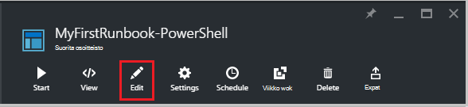

<properties
    pageTitle="Oma ensimmäisen PowerShell-runbookin Azure automaatio | Microsoft Azure"
    description="Opetusohjelma, joka opastaa sinua luonti-testaaminen ja julkaiseminen on yksinkertainen PowerShell-runbookin."
    services="automation"
    documentationCenter=""
    authors="mgoedtel"
    manager="jwhit"
    editor=""
    keywords="Azure powershell, powershell-komentosarjaa opetusohjelma, powershell automaatio"/>
<tags
    ms.service="automation"
    ms.workload="tbd"
    ms.tgt_pltfrm="na"
    ms.devlang="na"
    ms.topic="get-started-article"
    ms.date="07/19/2016"
    ms.author="magoedte;sngun"/>

# <a name="my-first-powershell-runbook"></a>Oma ensimmäisen PowerShell-runbookin

> [AZURE.SELECTOR] - [Graafisen](automation-first-runbook-graphical.md) - [PowerShell](automation-first-runbook-textual-PowerShell.md) - [PowerShell-työnkulku](automation-first-runbook-textual.md)  

Tässä opetusohjelmassa esitellään [PowerShell runbookin](automation-runbook-types.md#powershell-runbooks) Azure automaatio luomista. Asetetaan ensin yksinkertainen runbookin, jossa on Testaa ja Julkaise, kun kerromme runbookin työn tilan seuraaminen. Valitse muokkaamalla hallittavan todella Azure resurssien runbookin alkaen tällöin Azure virtuaalikoneen. Olemme Tee: n runbookin tehokkaamman lisäämällä runbookin parametreja.

## <a name="prerequisites"></a>Edellytykset

Jotta voit suorittaa tässä opetusohjelmassa, sinun on seuraavasti.

-   Azure tilaus. Jos jokin ei ole vielä, voit [aktivoida MSDN-tilaaja edut](https://azure.microsoft.com/pricing/member-offers/msdn-benefits-details/) tai <a href="/pricing/free-account/" target="_blank"> [rekisteröityä maksuttoman tilin](https://azure.microsoft.com/free/).
-   [Automaatio-tili](automation-security-overview.md) : n runbookin ja Azure resurssien todennusta.  Tällä tilillä on oikeus aloittaa ja lopettaa virtuaalikoneen.
-   Azure virtual machine. Lopeta ja Käynnistä tämän tietokoneen, jotta se tulee tuotannon.

## <a name="step-1---create-new-runbook"></a>Vaihe 1 - Luo uusi runbookin

Asetetaan ensin luomalla yksinkertaisen runbookin, tulostaa tekstiä *Hei maailma*.

1.  Avaa Azure-portaaliin, automaatio-tilillesi.  
    Automaatio-tili-sivu tutustutaan Pikakatselu resursseista tähän tiliin. On jo joitakin resurssit. Useimmat ne ovat moduulit, jotka sisältyvät automaattisesti uuden automaatio-tilin. On myös oltava tunnistetiedon resurssi, joka on kuvattu [edellytykset](#prerequisites).
2.  Valitse Avaa runbooks luettelo **Runbooks** -ruutu.  
      
3.  Luo uusi runbookin valitsemalla **Lisää runbookin** -painiketta ja **Luo uusi runbookin**.
4.  Anna: n runbookin *MyFirstRunbook PowerShell*-nimi.
5.  Tässä tapauksessa emme aiot luoda [PowerShell runbookin](automation-runbook-types.md#powershell-runbooks) **Powershell** valitseminen niin **Runbookin tyyppi**.  
      
6.  Valitse **Luo** Luo: n runbookin ja avaa tekstiä editorissa.

## <a name="step-2---add-code-to-the-runbook"></a>Vaihe 2 – koodin lisääminen: n runbookin

Voit joko koodi suoraan: n runbookin, tai voit valita cmdlet-komennot, runbooks ja varat kirjaston ohjausobjektista ja että ne lisätään runbookin kaikki liittyvät parametreilla. Näiden vaiheiden olemme kirjoittaa suoraan: n runbookin.

1.  Microsoftin runbookin on tällä hetkellä tyhjä tyyppi *Kirjoitus-tulokset "Hei."*.  
      
2.  Tallenna: n runbookin valitsemalla **Tallenna**.  
      

## <a name="step-3---test-the-runbook"></a>Vaihe 3: n runbookin testi

Ennen kuin on julkaista olla käytettävissä tuotannon runbookin, haluat testata ja varmistaa, että se toimii oikein. Kun testaat runbookin, suorita sen **Luonnokset** -versio ja tarkastella sen Tulosta vuorovaikutteisesti.

1.  Valitse **Testaa ruudun** Avaa testi-ruutu.  
      
2.  Valitse Aloita testi **Käynnistä-painiketta** . Tämä on oltava käytössä ainoa vaihtoehto.
3.  [Runbookin työn](automation-runbook-execution.md) luodaan ja sen tilan näkyviin.  
    Työn tila alkaa kuin *jonossa* , joka ilmaisee, että se odottaa pilveen runbookin työntekijä tulee käytettävissä. Se sitten siirtyy *käynnistetään* kun työntekijä väittää työn ja *suorittamalla* , kun n runbookin todella käynnistyy.  
4.  Kun runbookin työ on valmis, tulos tulee näkyviin. Tässä tapauksessa emme pitäisi näkyä *Hei maailma*  
      
5.  Sulje palaa alusta testi-ruutu.

## <a name="step-4---publish-and-start-the-runbook"></a>Vaihe 4 – Julkaise ja Käynnistä: n runbookin

Runbookin, jonka juuri luonut on edelleen luonnoksena. Julkaise se ennen kuin olemme voidaan suorittaa tuotannon annettava. Kun julkaiset runbookin, korvaa aiemmin julkaistu versio luonnos-versiolla. Tässä tapauksessa emme ole julkaistu versio vielä koska juuri luomaasi: n runbookin.

1.  Valitse **Julkaise** , jos haluat julkaista: n runbookin ja sitten **Kyllä** pyydettäessä.  
      
2.  Voit nyt tarkastella: n runbookin **Runbooks** -ruudussa Vierittää vasemmalle, jos se näkyy **Yhtä aikaa muiden kanssa tila** on **julkaistu**.
3.  Vieritä takaisin oikeuden tarkastella **MyFirstRunbook**PowerShell ruudussa.  
    Yläreunassa asetukset, jotta Käynnistä: n runbookin, tarkastella: n runbookin, Ajoita sen myöhemmin jonkin aikaa alkamaan tai luo [webhook](automation-webhooks.md) , jotta se voidaan aloittaa HTTP puhelun kautta.
4.  Haluamme vain käynnistää: n runbookin niin napsauttamalla **Käynnistä-painiketta** ja valitse **Ok** , kun Käynnistä Runbookin-sivu avautuu.  
      
5.  Työruutu avataan runbookin, jonka juuri luonut projektille. Olemme Sulje tämä ruutu, mutta tässä tapauksessa emme jätä se avatuksi niin emme voi katsella projektin edistymisen.
6.  Työn tilana näkyy **Yhteenveto** ja käyttää vastineena tilat, joka on tuli kun testattu: n runbookin.  
      
7.  Kun runbookin tila on *Valmis*, valitse **tulos**. Tulostus-ruutu on auki ja näkyvissä Microsoftin *Hei maailma*.  
    
8.  Sulje tulostus-ruutu.
9.  Valitse **Kaikki lokit** virtaa avaaminen runbookin projektille. Näemme olisi vain *Hei maailma* tulostus-muodossa, mutta tämä Näytä muut virtaa runbookin työlle, kuten yksityiskohtainen ja virheen, jos n runbookin kirjoittaa ne.  
      
10. Sulje virtaa-ruutu ja palaa MyFirstRunbook PowerShell-ruudussa työ-ruutu.
11. Valitse **työt** Avaa tämä runbookin työt-ruutu. Tämä näyttää luettelon kaikista tämän runbookin luoma työt. Näemme on vain yksi työ, koska on vain suoritettiin työn kerran luettelossa.  
      
12. Voit valita tämän työn Avaa sama työ-ruutu, jossa on tarkastellut olemme käynnistyessään: n runbookin. Näin voit siirtyä takaisin aika ja tarkastella projektin, joka on luotu tietyn runbookin.

## <a name="step-5---add-authentication-to-manage-azure-resources"></a>Vaihe 5 – Lisää resurssien Azure-todennus

Syy on testannut ja julkaista Microsoftin runbookin, mutta tähän mennessä se ei tee mitään hyötyä. Haluat sen Azure resurssien. Se voi tehdä mutta ellei on se todennetaan, joihin viitataan [edellytykset](#prerequisites)-tunnistetiedoilla. Olemme tehdä, **Lisää AzureRmAccount** cmdlet-komento.

1.  Avaa tekstiä editori valitsemalla **Muokkaa** MyFirstRunbook PowerShell-ruudussa.  
      
2.  Microsoft ei enää tarvita **Kirjoitus-tulostus** -rivin, joten siirry eteenpäin ja poista se.
3.  Kirjoita tai kopioi ja liitä seuraava koodi, joka käsittelee todennus tilisi automaatio Suorita nimellä:

    ```
     $Conn = Get-AutomationConnection -Name AzureRunAsConnection 
     Add-AzureRMAccount -ServicePrincipal -Tenant $Conn.TenantID `
     -ApplicationId $Conn.ApplicationID -CertificateThumbprint $Conn.CertificateThumbprint
    ``` 
<br>
4.  Valitse **Testaa ruutu** , jotta voimme testata: n runbookin.
5.  Valitse Aloita testi **Käynnistä-painiketta** . Kun se on valmis, näyttöön tulee tulosteen samalla seuraavat, jossa on näkyvissä perustiedot-tililtä. Tämä tarkoittaa, että tunnistetieto on kelvollinen. <br> 

## <a name="step-6---add-code-to-start-a-virtual-machine"></a>Vaihe 6 – Aloita virtual machine-koodin lisääminen

Nyt kun meidän runbookin todentaa Microsoftin Azure tilaukseen, on hallita resursseja. Lisäämme komennon käynnistettäessä. Voit valita minkä tahansa virtual machine Azure-tilaukseesi, ja nyt olemme on hardcoding, johon funktio kyselyjä-cmdlet-komennolla.

1.  Perään *Lisää AzureRmAccount* *Käynnistä AzureRmVM-nimen "VMName" - ResourceGroupName 'NameofResourceGroup'* nimelle ja aloita virtuaalikoneen resurssiryhmä nimi.  
    
    ```
     $Conn = Get-AutomationConnection -Name AzureRunAsConnection 
     Add-AzureRMAccount -ServicePrincipal -Tenant $Conn.TenantID `
     -ApplicationID $Conn.ApplicationID -CertificateThumbprint $Conn.CertificateThumbprint 
     Start-AzureRmVM -Name 'VMName' -ResourceGroupName 'ResourceGroupName'
     ```
<br>
2.  Tallenna: n runbookin ja valitse sitten **ruudun Testaa** , niin, että olemme voit kokeilla sitä.
3.  Valitse Aloita testi **Käynnistä-painiketta** . Kun se on valmis, tarkista, että virtuaalikoneen aloitettiin.

## <a name="step-7---add-an-input-parameter-to-the-runbook"></a>Vaihe 7 – syöteparametria lisääminen: n runbookin

Tutustu runbookin tällä hetkellä käynnistyy virtuaalisen koneen, että olemme: n runbookin englanninkielisissä, mutta se olla hyödyllisempi Jos olemme määrittää virtuaalikoneen, jos n runbookin aloitetaan. On nyt lisätään kyseiseen toimintoja runbookin syöteparametrit.

1.  Lisää parametrit *VMName* ja *ResourceGroupName* : n runbookin ja muuttujia käyttäminen **Käynnistä AzureRmVM** cmdlet-komento, kuten alla olevassa esimerkissä.  
    
    ```
    Param(
       [string]$VMName,
       [string]$ResourceGroupName
    )
     $Conn = Get-AutomationConnection -Name AzureRunAsConnection 
     Add-AzureRMAccount -ServicePrincipal -Tenant $Conn.TenantID `
     -ApplicationID $Conn.ApplicationID -CertificateThumbprint $Conn.CertificateThumbprint 
     Start-AzureRmVM -Name $VMName -ResourceGroupName $ResourceGroupName
     ```
<br> 
2.  Tallenna: n runbookin ja avaa testi-ruutu. Huomaa, että arvot voidaan lisätä nyt kaksi syötteen muuttujat, joita käytetään testi.
3.  Sulje Testaa-ruutu.
4.  Valitse **Julkaise** : n runbookin uuden version julkaiseminen.
5.  Lopeta virtuaalikoneen, jotka olet aloittanut edellisessä vaiheessa.
6.  Valitse Aloita: n runbookin **Käynnistä-painiketta** . Kirjoita **VMName** ja **ResourceGroupName** virtuaalikoneen, jotka aiot Käynnistä-painiketta.  
      
7.  Kun n runbookin on valmis, tarkista, että virtuaalikoneen aloitettiin.

## <a name="differences-from-powershell-workflow"></a>Erot PowerShell-työnkulusta

PowerShellin runbooks on samat elinkaari, ominaisuuksia ja PowerShell työnkulun runbooks hallintaa, mutta sillä on joitakin eroja ja rajoitukset:

1.  PowerShellin runbooks suorittaa nopean verrattuna PowerShell työnkulun runbooks kuin hänellä ei ole kääntäminen vaihe.
2.  PowerShell-työnkulun runbooks tukea tarkistuspisteet, käyttämällä tarkistuspisteet, PowerShell työnkulun runbooks voit jatkaa: n runbookin minkä tahansa pisteestä olisi PowerShell runbooks vain palauttaa alusta.
3.  PowerShell-työnkulun runbooks tukevat rinnakkais- ja suorittamisen olisi komentoja vain suorittaa PowerShell runbooks peräkkäin.
4.  Työnkulun PowerShell-runbookin aktiviteetin, komennon tai komentosarjan eston voi olla oma runspace olisi-PowerShell-runbookin kaikki komentosarjan suorittaa yhteen runspace. On myös joitakin [syntaktisia erot](https://technet.microsoft.com/magazine/dn151046.aspx) alkuperäisen PowerShell-runbookin ja PowerShell työnkulun runbookin välillä.

## <a name="next-steps"></a>Seuraavat vaiheet

-   Graafinen runbooks aloittaminen-kohdassa [Oma ensimmäisen graafinen runbookin](automation-first-runbook-graphical.md)
-   Aloita PowerShell työnkulun runbooks, katso [ensimmäinen PowerShell työnkulun-runbookin](automation-first-runbook-textual.md)
-   Lisätietoja runbookin sekä niiden eduista ja rajoituksista on artikkelissa [Azure automaatio runbookin tiedostotyypit](automation-runbook-types.md)
-   Lisätietoja PowerShell-komentosarjaa ominaisuus tuesta on kohdassa [alkuperäisen PowerShell-komentosarjaa Azure automaatio tuki](https://azure.microsoft.com/blog/announcing-powershell-script-support-azure-automation-2/)
