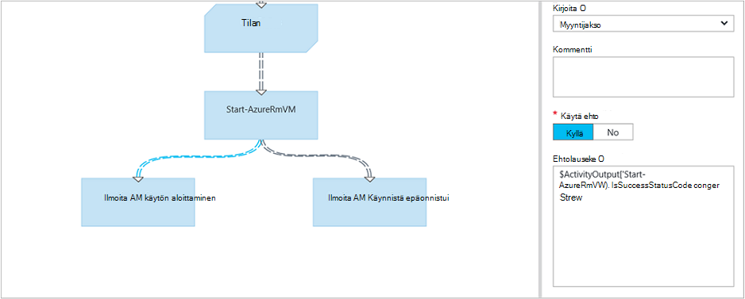

<properties 
    pageTitle="Graafisen yhteiskäyttö Azure automaatio | Microsoft Azure"
    description="Graafisen authoring avulla voit luoda runbooks Azure automatisointiin ilman koodia. Tässä artikkelissa Johdatus graafinen authoring ja aloita luominen graafinen runbookin tarvittavat tiedot."
    services="automation"   
    documentationCenter=""
    authors="mgoedtel"
    manager="jwhit"
    editor="tysonn" />
<tags 
    ms.service="automation"
    ms.devlang="na"
    ms.topic="article"
    ms.tgt_pltfrm="na"
    ms.workload="infrastructure-services"
    ms.date="06/03/2016"
    ms.author="magoedte;bwren" />

# Graafisen Azure automaatio yhteiskäyttö

## Johdanto

Graafisen julkaisu avulla voit luoda runbooks Azure automatisointiin ilman monimutkaisia pohjana Windows PowerShell- tai PowerShell työnkulun koodin. Toimintojen lisääminen alusta cmdlet-komennot ja runbooks kirjastosta, linkittää niitä toisiinsa ja Määritä työnkulun muodostamiseksi.  Jos ole koskaan käyttänyt System Center Orchestrator tai Service Management automaatio (SMA), valitse tämä pitäisi näyttää tuttuja.   

Tässä artikkelissa on esittely graafinen yhtä aikaa muiden kanssa ja haluat luoda graafisen runbookin Aloita käsitteitä.

## Graafisen runbooks

Kaikki runbooks Azure automaatio-ei Windows PowerShellin työnkulkuja.  Graafiset ja graafiset PowerShell-työnkulun runbooks Luo PowerShell-koodi, joka suoritetaan automaatio-työntekijöiden, mutta et voi tarkastella tai muokata sitä suoraan.  Graafisen runbookin voidaan muuntaa graafinen PowerShell-työnkulun runbookin ja päinvastoin, mutta niitä ei voi muuntaa tekstimuodossa runbookin. Olemassa olevan tekstimuotoinen runbookin ei voi tuoda graafinen editoriin.  

## Graafisen editorin yleiskatsaus

Voit avata graafinen editorin Azure-portaalissa luominen tai muokkaaminen graafinen runbookin.

Seuraavissa kohdissa kuvataan graafinen editorin ohjausobjektit.

### Piirtoalusta
Alusta on, jossa voit luoda oman runbookin.  Toimintojen lisääminen: n runbookin kirjaston ohjausobjektin solmujen ja liittää ne määrittäminen: n runbookin logiikan linkkejä.

Alusta alareunassa ohjausobjektien avulla voit lähentää ja loitontaa.

### Kirjaston hallinta

Kirjasto-ohjausobjekti on voit valita oman runbookin lisääminen [toimintoja](#activities) .  Voit lisätä ne alusta, jossa muodostetaan yhteys muita toimintoja.  Se sisältää neljä osaa, joka on kuvattu seuraavassa taulukossa.

| Osa | Kuvaus |
|:---|:---|
| Cmdlet-komennot | Sisältää kaikki Cmdlet-komentoja, joita voit käyttää omaa runbookin.  Cmdlet-komennot on järjestetty moduuli.  Kaikki, jotka ovat asentaneet automaatio-tilisi moduulit ovat käytettävissä.  |
| Runbooks |  Sisältää runbooks automaatio-tilillesi. Nämä runbooks voidaan lisätä lapsen runbooks käytettävä alusta. Vain runbooks core-tyyppi on sama kuin muokataan runbookin, näkyvät; Graafiset varten runbooks vain PowerShell-pohjainen runbooks ovat näkyvissä, aikana graafisia PowerShell-työnkulun runbooks vain PowerShell-työnkulku-pohjainen runbooks ovat näytössä.
| Resurssit | Sisältää [automaatio varat](http://msdn.microsoft.com/library/dn939988.aspx) voidaan käyttää käyttäjän runbookin automaatio-tilillesi.  Kun lisäät sijoituksen runbookin, se Lisää työnkulku-toiminto, joka saa valitun kohteen.  Kyseessä muuttujan kohteiden voit valita lisätäänkö aktiviteetin tai Hae muuttujan muuttuja.
| Runbookin hallinta | Sisältää runbookin ohjausobjektin toimintoja, jotka voidaan käyttää nykyistä runbookin. *Liitos* on useita syötteiden ja odota, kunnes kaikki ennen jatkamista työnkulun. *Koodi* -tehtävän suorittaa yhden tai useamman PowerShell tai PowerShell työnkulun koodin graafinen runbookin riippuen rivit.  Voit käyttää tässä aktiviteetti mukautettua koodia tai toimintoja, jotka on vaikea saavuttamiseksi ja muita toimintoja varten.|

### Määritysten hallinta

Määritys-ohjausobjekti on annetaan tiedot kangasta valitun objektin. Valitun objektin tyyppi, riippuu käytettävissä olevat ohjausobjektin ominaisuudet.  Kun valitset vaihtoehdon määritys-ohjausobjektin, se avautuu muita lavat jotta lisätietojen.

### Testi-ohjausobjekti

Testi-ohjausobjekti ei näytetä, kun graafinen editorin käynnistetään ensimmäisen kerran. Kun avaat voit vuorovaikutteisesti [testata graafinen runbookin](#graphical-runbook-procedures).  

## Graafisen runbookin menettelyt 

### Vieminen ja tuominen graafinen runbookin

Voit viedä vain graafinen runbookin julkaistusta versiosta.  Jos n runbookin ei vielä ole julkaistu, **Vie julkaistun** -painiketta eivät ole käytettävissä.  **Vie julkaistu** -painiketta napsautettaessa: n runbookin ladataan paikalliseen tietokoneeseen.  Tiedoston nimi vastaa *graphrunbook* tunniste runbookin nimeä.

Voit tuoda graafiset tai graafisen PowerShell-työnkulun runbookin tiedoston valitsemalla **Tuo** -vaihtoehto, kun lisäät runbookin.   Kun valitset tuotava tiedosto, voit säilyttää on sama **nimi** tai Anna uusi tunnus.  Runbookin tyyppi-kentässä näkyy runbookin tyypin, kun se sopimuksen merkityksellisiin valitun tiedoston ja yrität valita erilaisen, joka ei ole oikein, jos viestin näytetään katsomalla on mahdollisista ristiriidoista ja muunnoksen aikana saattaa olla syntaksivirheitä.  

### Graafisen runbookin testausta

Voit testata Azure-portaalissa runbookin luonnos-versiota, jätä n runbookin julkaistusta versiosta muuttumattomina tai voit testata uuden runbookin, ennen kuin se on julkaistu. Voit tarkistaa: n runbookin toimii oikein, ennen kuin korvaaminen julkaistusta versiosta. Kun testaat runbookin, luonnos runbookin on suoritettu ja se on suorittanut kaikki toiminnot on tehty. Ei ole Työhistoria luodaan, mutta tulos näkyy testin tulos-ruudussa. 

Testi-valinta runbookin, Avaa avaamalla runbookin muokkausta varten ja valitse sitten **testi-ruudussa** -painiketta.

Testi-ohjausobjektin pyytää syöteparametrit ja voit aloittaa: n runbookin valitsemalla **Käynnistä** -painiketta.

### Graafisen runbookin julkaiseminen

Azure automaatio kunkin runbookin on luonnos ja julkaistu versio. Vain julkaistu versio on saatavana suorittaminen ja luonnos-version voi muokata. Julkaistu versio ei vaikuta luonnos-versioon tehdyt muutokset. Kun luonnos-versio on valmis käytettäväksi, valitse voit julkaista sen, joka korvaa julkaistu versio luonnos-versiolla.

Voit julkaista graafinen runbookin avaamalla runbookin muokkausta ja valitsemalla sitten **Julkaise** -painikkeen.

Kun runbookin ei vielä ole julkaistu, se on tila on **Uusi**.  Kun se on julkaistu, se on tila on **julkaistu**.  Jos olet muokannut: n runbookin, kun se on julkaistu ja luonnos ja julkaistu-versiot ovat eri,: n runbookin tilana on **Muokkaa**.

 

Käytössä on myös asetus, jos haluat palata runbookin julkaistu-versioon.  Tämä ilmoittaa poissa: n runbookin on viimeksi julkaistu ja korvaa runbookin luonnos-versiota julkaistu versio tehdyt muutokset.

## Toiminnot

Hakukyselyn osat runbookin tulevat tehtävät.  Tehtävän voi olla PowerShell-cmdlet-komennon, lapsen runbookin tai työnkulun tehtävä.  Tehtävän lisääminen: n runbookin oikealle valitsemalla sen kirjaston ohjausobjektin ja valitsemalla **Lisää Kuvapohjan**.  Voit sitten napsauttamalla ja vetämällä tehtävän voit sijoittaa sen mihin tahansa, jotka haluat alusta.  Sijainti tehtävän kangasta ei vaikuta minkäänlaista runbookin toiminto.  Voit tehdä asettelun oman runbookin kuitenkin löydät parhaiten sopiva visualisointi sen toiminta. 

Valitse tehtävä kangasta sen ominaisuuksia ja parametrit paikallaan määritys-sivu.  Voit muuttaa tehtävän **otsikko** jotain, joka kuvaa sinulle.  Alkuperäinen cmdlet suoritetaan edelleen, riittää, että muutat sen nimi, jota käytetään graafinen-editorissa.  Otsikon on oltava yksilöivä: n runbookin. 

### Parametrin joukot

Parametrin määrittäminen määrittää pakolliset ja valinnaiset parametrit, hyväksyy tietyn cmdlet-komento arvoja.  Kaikki cmdlet-komennot on määritetty vähintään yksi parametri ja jotkin on useita.  Jos cmdlet-komento, on useita, sinun on valittava ennen kuin voit määrittää parametrit käytettävä.  Parametrin määrittäminen, joista voit valita riippuu, voit määrittää parametrit.  Voit muuttaa käyttämän tehtävän valitsemalla **Parametrin arvo** ja valitsemalla toisen parametrin määrittäminen.  Tässä tapauksessa parametriarvot, jonka määritit menetetään.

Seuraavassa esimerkissä Get-AzureRmVM cmdlet-komento on parametrin kolmea.  Et voi määrittää parametriarvot, ennen kuin valitset parametrin siirtämistä.  ListVirtualMachineInResourceGroupParamSet parametrin määrittäminen palauttavat kaikki näennäiskoneiden resurssiryhmä on, ja se on yksi valinnaisten parametrien.  GetVirtualMachineInResourceGroupParamSet on virtuaalikoneen palautettava ja on kaksi pakollinen ja yksi valinnaisten parametrien määrittäminen.

#### Parametriarvot

Jos määrität parametrin arvon, voit valita tietolähteen, voit selvittää, kuinka arvo erikseen.  Tietyn parametrin käytettävissä olevat tietolähteet riippuu parametrin kelvollisia arvoja.  Esimerkiksi Null eivät ole käytettävissä vaihtoehdon parametri, joka ei salli null-arvoja.

| Tietolähde | Kuvaus |
|:---|:---|
|Vakion arvo|Kirjoita parametrin arvo.  Tämä on vain käytettävissä seuraavia tietotyyppejä: Int32, Int64, merkkijono, totuusarvo, päivämäärä ja aika, Vaihda. |
|Tehtävän tulos|Toiminto, joka edeltää nykyisen tehtävän työnkulun tulosteen.  Kaikki kelvollinen tehtävät näkyvät.  Valitse juuri tulos käytettävät parametriarvo tehtävä.  Jos tehtävän tulostaa objektin, jossa on useita ominaisuuksia, voit kirjoittaa Kirjoita ominaisuuden nimi valittuasi tehtävän.|
|Runbookin syöte |Valitse runbookin syöteparametria syötteeksi tehtävän parametrin.|  
|Muuttujan resurssi|Valitse syötteeksi automaatio-muuttuja.|  
|Tunnistetietojen resurssi|Valitse Automaattiset tunnistetiedon syötteenä.|  
|Varmenteen resurssi|Valitse automaatio-sertifikaatin syötteenä.|  
|Yhteyden resurssi|Valitse automaatio-yhteyden syötteenä.| 
|PowerShell-lauseke|Määritä Yksinkertainen [PowerShell-lauseke](#powershell-expressions).  Lauseke lasketaan ennen tehtävän ja käyttää parametriarvo tulos.  Voit viitata aktiviteettia tai runbookin syöteparametria tulos muuttujat.|
|Ei ole määritetty|Poistaa kaikki arvot, jotka on aiemmin määritetty.|

#### Valinnaiset muut parametrit

Kaikki cmdlet-komennot on voi antaa muita parametreja.  Nämä ovat PowerShell yhteiset parametrit tai muita mukautettuja parametreja.  Näyttöön tulee tekstiruutu, johon voidaan lisätä parametreja PowerShell syntaksin.  Esimerkiksi käyttämään **yksityiskohtainen** yleisiä parametrin määrität **"-yksityiskohtainen: $True"**.

### Tehtävän uudelleen

**Uudelleen ongelman** avulla voit suorittaa useita kertoja, kunnes tietty ehto täyttyy, tehtävän muistuttava silmukan.  Voit käyttää toimintoja, jotka suoritetaan useita kertoja, on virhe voi enää tätä ominaisuutta ja voi on useampi kuin yksi yrittää mukaisesti tai testata tulosteen kelvollisia tietoja tehtävän tiedot.    

Kun otat tehtävän uudelleen, voit määrittää viiveen ja ehtoa.  Viive on aika (mitattuna sekunteina tai minuutteina): n runbookin odottaa, ennen kuin se suorittaa toiminnon uudelleen.  Jos ei viiveen ei määritetä, valitse tehtävä suoritetaan uudelleen heti, kun se on valmis. 

Yritä-ehto on PowerShell-lauseke, joka arvioidaan aina, kun suorittaa toiminnon jälkeen.  Jos lausekkeen korjaa TOSI, tehtävä suoritetaan uudelleen.  Jos lausekkeen korjaa EPÄTOSI sitten tehtävä ei voi käyttää uudelleen ja: n runbookin siirtyy seuraavaan tehtävään. 

Yritä ehto käyttää muuttujaan, jonka $RetryData, joka sisältää tehtävän uudelleenyritykset tietoja.  Tämä muuttuja on ominaisuudet seuraavan taulukon.

| Ominaisuus | Kuvaus |
|:--|:--|
| NumberOfAttempts | Kuinka monta kertaa tehtävä on suoritettu.              |
| Tulos           | Tehtävän viimeisin asennuksesta tulos.                    |
| TotalDuration    | Aikakatkaistu kulunut tehtävän aloitettiin ohjainta. |
| StartedAt        | Aika tehtävän aloitettiin UTC-muodossa.           |

Seuraavassa on esimerkkejä tehtävän uudelleen ehdot.

    # Run the activity exactly 10 times.
    $RetryData.NumberOfAttempts -ge 10 

    # Run the activity repeatedly until it produces any output.
    $RetryData.Output.Count -ge 1 

    # Run the activity repeatedly until 2 minutes has elapsed. 
    $RetryData.TotalDuration.TotalMinutes -ge 2

Kun määrität tehtävän uudelleen ehdon, tehtävän sisältää kaksi visuaalisilla muistuttamaan sinua.  Yksi esitetään tehtävän ja toinen on kun tarkistat tehtävän määritys.

### Työnkulun komentosarja-ohjausobjekti

Koodi-ohjausobjekti on erityinen tehtävä, jota voidaan käyttää PowerShell tai PowerShell työnkulun komentosarjan graafinen runbookin parhaillaan kirjoitti jotta toimintoja, jotka muuten ei ehkä ole käytettävissä riippuen.  Se ei voi hyväksyä parametreja, mutta se voi olla tehtävän tulostus ja runbookin syöttöparametrien.  Tehtävän tuloksen lisätään databus, ellei se ei lähtevän linkki jolloin tiedot lisätään: n runbookin tulos.

Esimerkiksi seuraava koodi suorittaa päivämäärän laskutoimituksia käyttämällä runbookin syötteen muuttujaan, jota kutsutaan $NumberOfDays.  Kuin tulos: n runbookin seuraavien toimintojen käytettävän lähettää sitten laskettu päivämäärä-aika.

    $DateTimeNow = (Get-Date).ToUniversalTime()
    $DateTimeStart = ($DateTimeNow).AddDays(-$NumberOfDays)}
    $DateTimeStart

## Linkit ja työnkulku

Graafisen runbookin **linkki** yhdistää kaksi toimintoja.  Se näkyy kangasta lähde tehtävästä kohde-toimintoon osoittava nuoli.  Toimintojen suorittaminen nuolen osoittamaan suuntaan käynnistäminen lähde tehtävän päätyttyä kohde-toimintoa.  

### Linkin luominen

Luo kaksi toimintoja valitsemalla lähde-toimintojen ja napsauttamalla muotoa alareunassa ympyrän välisen linkin.  Vedä kohde tehtävään ja vapauta nuolta.

Valitse linkki sen ominaisuuksien määrittäminen määritys-sivu.  Tämä sisältää linkkityyppi, joka on kuvattu seuraavassa taulukossa.

| Linkkityyppi | Kuvaus |
|:---|:---|
| Myyntijakso | Kohde-toimintojen suoritetaan kerran kunkin objektin tuloste lähde tehtävästä.  Tehtävän kohde ei toimi, jos lähde-tehtävä tulokset tuloksia.  Lähde-toiminnon tulos on käytettävissä objektina.  |
| Järjestys | Kohde-tehtävän suorittaa vain kerran.  Se saa matriisin objektien lähde-tehtävän.  Lähde-toiminnon tulos on käytettävissä objektien matriisina. |

### Toimintojen aloittaminen

Graafisen runbookin alku on toimintoja, joilla ei ole saapuvien linkki.  Tämä on usein vain yksi tehtävä, joka edustajana: n runbookin ensimmäinen tehtävä.  Jos useita tehtäviä ei ole saapuvien linkkiä,: n runbookin alkaa suorittamalla rinnakkain.  Se noudattaa linkkejä ja muita toimintoja käytetään, kun kukin on valmis.

### Ehdot

Määrittäessäsi ehdon linkin kohde tehtävän toimii vain, jos ehto ratkaisee tosi.  Yleensä käytetään $ActivityOutput muuttujan ehto noutaa lähde-toiminnon tulos.  

Myyntijakso-linkin ehdon yksittäistä objektia ja ehto arvioidaan kunkin objektin tuloste lähde-toiminnan mukaan.  Kohde-toimintojen suoritetaan kunkin objektin, joka täyttää ehdon.  Esimerkiksi kanssa lähde toiminnan Get-AzureRmVm, seuraavaa syntaksia voidaan ehdollinen myyntijakso-linkin hakeminen nimeltä *ryhmä1*resurssiryhmä vain näennäiskoneiden.  

    $ActivityOutput['Get Azure VMs'].Name -match "Group1"

Linkin sarjan ehto vain arvioidaan kerran jälkeen yksittäisen matriisin palautetaan, joka sisältää kaikki objektit tulosteen lähde-tehtävän.  Tästä syystä järjestys-linkki ei voi käyttää myyntijakso linkkiä suodattamista varten, mutta ainoastaan määräytyy riippumatta siitä, onko Seuraava tehtävä on suoritettu. Ottaa esimerkiksi seuraavat toiminnot joukko Käynnistä AM meidän runbookin.   
On kolme eri järjestyksessä linkkejä, jotka vahvistettavan arvot on annettu kaksi runbookin syöteparametria edustava AM ja resurssiryhmä nimi, jotta voit selvittää, joka on haluamasi toiminto, joka suoritetaan - yhden AM Käynnistä, kaikki VMs toimialuenimien-ryhmässä tai kaikki VMs-Tilauksen.  Yhteyden muodostaminen Azure ja Hae yksittäisen AM järjestys, linkin näin ehto logiikan:

    <# 
    Both VMName and ResourceGroupName runbook input parameters have values 
    #>
    (
    (($VMName -ne $null) -and ($VMName.Length -gt 0))
    ) -and (
    (($ResourceGroupName -ne $null) -and ($ResourceGroupName.Length -gt 0))
    )

Kun ehdollinen linkin, käytettävissä lähde tehtävästä muita toimintoja, haara tiedot suodatettu ehto.  Jos tehtävä on useita linkkejä lähdettä, haaroja toimintoihin käytettävissä olevien tietojen määräytyvät ehto kyseisen haara muodostaa linkin.

Esimerkiksi alla runbookin **Käynnistä AzureRmVm** -tehtävä alkaa kaikki näennäiskoneiden.  Siinä on kaksi ehdollinen linkkiä.  Ensimmäisen ehdollinen linkin käyttää lauseketta *$ActivityOutput ["Käynnistä-AzureRmVM"]. IsSuccessStatusCode - eq $true* suodattaminen Jos Käynnistä AzureRmVm tehtävän suorittaminen onnistui.  Toinen käyttää lauseketta *$ActivityOutput ["Käynnistä-AzureRmVM"]. IsSuccessStatusCode - ne $true* Jos Käynnistä AzureRmVm tehtävän ei voitu käynnistää virtuaalikoneen suodattamiseen.  

Toiminto, joka noudattaa ensimmäisen linkki ja Hae AzureVM tehtävän tulosteen vain saavat näennäiskoneiden, jotka on aloitettu suunnitellut aloittamispäivämäärät, jotka Get-AzureVM suoritettiin käyttää.  Toiminto, joka toisen linkin saavat vain näennäiskoneiden, joka on pysäytetty aikaa, Hae AzureVM on suoritettu.  Kolmas linkkiä toimintaa saavat kaikki näennäiskoneiden riippumatta niiden käytössä olevaan tilaan.

### Liitoskohtia

Liitos on erityisen toimintaa, odottaa, kunnes kaikki saapuvat haarat.  Näin voit suorittaa useita tehtäviä rinnakkain ja varmista, että kaikki on valmis ennen siirtymistä.

Kun liitos voi olla saapuvat linkit rajoittamaton määrä, enintään jokin linkitykset on putkijohto.  Ei ole saapuvien sarjan linkkien määrää on rajoitettu.  Sinulla on oikeus luoda yksi-moneen saapuvat linkit putkijohto ja Tallenna: n runbookin, mutta se ei onnistu, kun se suoritetaan.

Seuraavassa esimerkissä on osa runbookin, joka käynnistää näennäiskoneiden joukko ladattaessa korjaukset kyseiset koneet käytettäväksi samanaikaisesti.  Liitos avulla varmistetaan, että molemmat päivitysprosessit on suoritettu loppuun, ennen: n runbookin edelleen.

### Jaksot

Jakson ei, jos kohde tehtävän linkkejä takaisin lähde toimintaansa tai toiseen tehtävään, joka ilmestyy linkittää takaisin sen lähdesijainnissa.  Jaksot tällä hetkellä ei sallita graafinen yhtä aikaa muiden kanssa.  Jos oman runbookin on jakson, se tallennetaan oikein, mutta tulee virhesanoma, kun se suoritetaan.

### Toimintojen välinen tietojen jakaminen

Tiedot, jotka lähtevät linkki tehtävän mukaan tulosteen kirjoitetaan *databus* : n runbookin varten.  : N runbookin toimintaa käyttää tietoja databus täytä parametriarvot tai sisällyttää komentosarjoja.  Tehtävän voi käyttää tulosteen työnkulun edellinen toiminto.     

Miten tiedot kirjoitetaan databus määräytyy tehtävän linkin tyyppiä.  **Myyntijakso**tiedot ovat tulosteen Kerrannaiset objekteina.  **Sarjan** linkin tiedot ovat tulosteen matriisina.  Jos näkyvissä on vain yksi arvo, se on tulosteen yhden elementin matriisina.

Voit käyttää tietojen databus, käytä jotakin seuraavista tavoista.  Ensin käyttämän **Tehtävän tulostus** -tietolähteen täytä parametri toiseen tehtävään.  Jos tulos on objektin, voit määrittää yksittäisen ominaisuuden.

Voit myös hakea aktiviteetin **PowerShell lausekkeen** tietolähteen tai **Työnkulun komentosarja** -toimintojen ActivityOutput muuttujan tulos.  Jos tulos on objektin, voit määrittää yksittäisen ominaisuuden.  ActivityOutput muuttujat käyttämällä seuraavaa syntaksia.

    $ActivityOutput['Activity Label']
    $ActivityOutput['Activity Label'].PropertyName 

### Tarkistuspisteet

Voit määrittää [tarkistuspisteet](automation-powershell-workflow.md#checkpoints) graafinen PowerShell-työnkulun runbookin valitsemalla minkä tahansa tehtävän *tarkistuspiste runbookin* .  Tämä aiheuttaa tarkistuspisteen määrittämiseen, kun tehtävä on suoritettu.

Tarkistuspisteet on käytössä vain graafinen PowerShell-työnkulun runbooks, se ei ole käytettävissä graafinen runbooks.  Jos n runbookin käytetään Azure cmdlet-komennot, pitäisi seurata checkpointed toiminto, jossa Lisää AzureRMAccount niin, runbookin on hyllytetty ja käynnistää-Tämä tarkistuspiste toisen työntekijän käyttöön. 

## Todennustapa Azure resurssit

Azure automaatio Runbooks, Azure resurssien osalta Azure todennusta.  (Kutsutaan myös palveluna pääasiallista) uusi [Suorita nimellä tili](automation-sec-configure-azure-runas-account.md) -toiminto on oletustapa käyttämään Azure Resurssienhallinta resursseja tilaukseesi automaatio runbooks kanssa.  Tätä toimintoa voi lisätä graafinen runbookin lisäämällä **AzureRunAsConnection** yhteyden resurssi, jossa on käytössä PowerShell [Get-AutomationConnection](https://technet.microsoft.com/library/dn919922%28v=sc.16%29.aspx) cmdlet-komennosta ja [Lisää AzureRmAccount](https://msdn.microsoft.com/library/mt619267.aspx) cmdlet-komento, alusta. Tämä on esitelty seuraavan esimerkin mukaisesti.  
Hae Suorita kuin yhteyden tehtävän (eli Get-AutomationConnection), on määritetty vakioarvo tietolähde nimeltä AzureRunAsConnection.  
Seuraavaan tehtävään lisää-AzureRmAccount, Lisää: n runbookin todennetut Suorita nimellä tilin käyttöä varten. 
 
Parametrien **APPLICATIONID** **CERTIFICATETHUMBPRINT**ja **TENANTID** on määrittää kentän polku-ominaisuuden nimi, koska tehtävän tulostaa objektin, jossa on useita ominaisuuksia.  Muussa tapauksessa kun suoritat: n runbookin, se epäonnistuu yritetään suorittaa todennusta.  Tämä on tarvitset vähintään tarkistamiseen oman runbookin Suorita nimellä-tilin kanssa.

Jos haluat säilyttää aiempien versioiden yhteensopivuuden tilaajille, jotka olet luonut [Azure AD-käyttäjätilin](automation-sec-configure-aduser-account.md) avulla voit hallita Azure Service Management (ASM) tai Azure Resurssienhallinta resursseja automaatio-tili, tarkistamiseen menetelmä on [tunnistetiedon resurssi](http://msdn.microsoft.com/library/dn940015.aspx) , joka edustaa Active Directory-käyttäjän käytön Azure-tili ja lisää AzureAccount cmdlet-komento.

Voit lisätä tämän toiminnon graafinen runbookin tunnistetiedon kohteiden lisääminen Lisää AzureAccount tehtävän perään alusta.  Lisää AzureAccount käyttää tunnistetiedon tehtävän sen syöttö.  Tämä on esitelty seuraavan esimerkin mukaisesti.

Sinun on todentaa alussa: n runbookin ja kunkin tarkistuspisteen jälkeen.  Tämä tarkoittaa lisääminen yhteen Lisää AzureAccount aktiviteettia tarkistuspiste työnkulun minkä tahansa tehtävän jälkeen. Lisäksi tunnistetiedon aktiviteettia ei tarvita jälkeen voit käyttää samoja 

## Syötteen ja tulosteen Runbookin

### Runbookin syöte

Runbookin saattaa edellyttää syötteen käyttäjältä, milloin siirtymä aloitetaan palvelun Azure-portaalissa runbookin tai toisen runbookin, jos nykyisen rivin käytetään alle.
Esimerkiksi jos runbookin, joka luo virtual machine, joudut ehkä antamaan tietoja, kuten nimi virtuaalikoneen ja muut ominaisuudet aina, kun käynnistät: n runbookin.  

Syöte runbookin Hyväksy määrittämällä yhden tai useamman syötteen parametrit.  Annat arvoja näiden parametrien: n runbookin aloitetaan aina.  Käynnistyessä runbookin Azure-portaalissa se kehottaa sinua antamaan arvoja näiden n runbookin syöteparametrit.

Voit käyttää syöttöparametrien runbookin napsauttamalla työkalurivin runbookin **ja** -painiketta.  

 

**Ja** -ohjausobjekti, jossa voit muokata aiemmin syöteparametria tai luoda uuden valitsemalla **Lisää syöte**avautuu. 

Kunkin syöteparametria määritetään seuraavan taulukon ominaisuudet.

|Ominaisuus|Kuvaus|
|:---|:---|
| Nimi | Parametrin yksilöivä nimi.  Tämä voi sisältää vain alfa numeerista merkkiä, joten et voi olla välilyöntiä. |
| Kuvaus | Syöteparametria valinnainen kuvaus.  |
| Tyyppi | Odotettu parametriarvo tietotyyppi.  Azure-portaalissa on sopivan ohjausobjektin kunkin parametrin tietotyyppi kun tietojen kysely. |
| Pakollinen | Määrittää, onko arvo on annettava parametrin.  N runbookin ei voi aloittaa, jos et anna arvo pakollinen kullekin parametrille, joka ei ole määritetty oletusarvoa. |
| Oletusarvo | Määrittää, mikä arvo käytetään parametrille, jos jokin ei ole toimitettu.  Voivat olla Null tai tietyn arvon. |

### Runbookin tulostus

Toiminto, joka ei ole lähtevän linkki luoma tiedot lisätään [: n runbookin tulosteen](http://msdn.microsoft.com/library/azure/dn879148.aspx).  Tulos on tallennettu runbookin työhön ja voivat käyttää ylemmän tason runbookin, kun n runbookin käytetään alle.  

## PowerShell-lausekkeet

Graafisen authoring eduista tarjoaa mahdollisuuden luominen runbookin mahdollisimman vähän kokemusta PowerShell.  Tällä hetkellä sinun tarvitsee tietää PowerShellin vähän mutta täyttää tietyt [parametriarvot](#activities) ja [linkki](#links-and-workflow)suodatusehtojen.  Tässä osassa on lyhyt esittely kyseisille käyttäjille, jotka eivät välttämättä ole tuntee PowerShell-lausekkeet.  Tarkat tiedot PowerShellin on osoitteessa [komentosarjat Windows PowerShellin avulla](http://technet.microsoft.com/library/bb978526.aspx). 

### PowerShell-lausekkeen tietolähde

Voit käyttää tietolähteenä PowerShell-lauseketta Täytä [tehtävän parametrin](#activities) tuloksiin PowerShell-lisäkoodin arvo.  Tämä voi johtua koodi, joka suorittaa joitakin yksinkertaisia funktion tai useita rivejä, jotka suorittavat monimutkaisia logiikkaa yksirivinen.  Mitään Tulosta-komento, jota ei ole määritetty muuttujan siirretään parametriarvo. 

Esimerkiksi seuraava komento siirtää nykyisen päivämäärän. 

    Get-Date

Seuraavat komennot muodosta merkkijonon kuluvasta päivästä ja määrittää sen muuttuja.  Muuttujan sisältö lähetetään sitten tulos 

    $string = "The current date is " + (Get-Date)
    $string

Seuraavat komennot arvioi nykyisen päivämäärän ja palauttaa merkkijonon, joka ilmaisee, onko nykyisen päivän viikonlopun tai viikonpäivä. 

    $date = Get-Date
    if (($date.DayOfWeek = "Saturday") -or ($date.DayOfWeek = "Sunday")) { "Weekend" }
    else { "Weekday" }
    
 
### Tehtävän tulos

Edellinen tehtävä tulosteen käyttämisestä: n runbookin on käyttäminen $ActivityOutput muuttujan seuraavaa syntaksia.

    $ActivityOutput['Activity Label'].PropertyName

Esimerkiksi aktiviteetin ominaisuus, joka edellyttää virtual tietokoneen nimi voi olla missä tapauksessa voit käyttää seuraavaa lauseketta.

    $ActivityOutput['Get-AzureVm'].Name

Jos ominaisuus, joka vaaditaan virtuaalikoneen objekti sen sijaan, että vain ominaisuuden, jonka palauttavat koko objektin käyttämällä seuraavaa syntaksia.

    $ActivityOutput['Get-AzureVm']

Voit käyttää myös tehtävän tulosteen monimutkaisia lausekkeessa esimerkiksi seuraavia, joka yhdistää tekstin virtuaalikoneen nimi.

    "The computer name is " + $ActivityOutput['Get-AzureVm'].Name

### Ehdot

[Vertailuoperaattorit](https://technet.microsoft.com/library/hh847759.aspx) avulla voit verrata arvoja tai määrittää, jos arvo vastaa määritettyä mallia.  Vertailu palauttaa arvon $true tai $false.

Esimerkiksi seuraava ehto määrittää, onko tehtävän nimi *Hae AzureVM* -virtuaalikoneen tällä hetkellä *pysäytetty*. 

    $ActivityOutput["Get-AzureVM"].PowerState –eq "Stopped"

Seuraava ehto tarkistaa, onko samassa virtuaalikoneen minkä tahansa kuin *pysäytetty*-tilaan.

    $ActivityOutput["Get-AzureVM"].PowerState –ne "Stopped"

Voit liittyä useita ehtoja, käyttää [looginen operaattori](https://technet.microsoft.com/library/hh847789.aspx) , kuten **- ja** tai **- tai**.  Esimerkiksi seuraava ehto tarkistaa, onko samassa virtuaalikoneen edellisessä esimerkissä *pysäytetty* tai *lopettaminen*-tilaan.

    ($ActivityOutput["Get-AzureVM"].PowerState –eq "Stopped") -or ($ActivityOutput["Get-AzureVM"].PowerState –eq "Stopping") 

### Hashtables

[Hashtables](http://technet.microsoft.com/library/hh847780.aspx) ovat nimi-arvoa paria, jotka ovat palauttamista arvojoukon hyödyllisiä.  Tiettyjen toimintojen ominaisuudet voivat odottaa hajautustaulukko yksinkertainen arvo sijaan.  Voit myös nähdä hajautustaulukko sanastoa kutsutaan nimellä. 

Voit luoda Hajautustaulukkoa käyttäen seuraavaa syntaksia.  Hajautustaulukkoa voi olla mikä tahansa merkintöjen määrä, mutta jokainen määrittämän nimen ja arvon.

    @{ <name> = <value>; [<name> = <value> ] ...}

Esimerkiksi seuraava lauseke Luo tehtävä-parametri, jonka oletettu hajautustaulukko arvoilla internet-haun tietolähteen käytettävä hajautustaulukko.

    $query = "Azure Automation"
    $count = 10
    $h = @{'q'=$query; 'lr'='lang_ja';  'count'=$Count}
    $h

Seuraavassa esimerkissä aktiviteettia kutsutaan *Hae Twitter-yhteyden* tulosteen Hajautustaulukkoa täyttämiseen.

    @{'ApiKey'=$ActivityOutput['Get Twitter Connection'].ConsumerAPIKey;
      'ApiSecret'=$ActivityOutput['Get Twitter Connection'].ConsumerAPISecret;
      'AccessToken'=$ActivityOutput['Get Twitter Connection'].AccessToken;
      'AccessTokenSecret'=$ActivityOutput['Get Twitter Connection'].AccessTokenSecret}

## Seuraavat vaiheet

- Aloita PowerShell työnkulun runbooks, katso [ensimmäinen PowerShell työnkulun-runbookin](automation-first-runbook-textual.md) 
- Graafinen runbooks aloittaminen-kohdassa [Oma ensimmäisen graafinen runbookin](automation-first-runbook-graphical.md)
- Lisätietoja runbookin sekä niiden eduista ja rajoituksista on artikkelissa [Azure automaatio runbookin tiedostotyypit](automation-runbook-types.md)
- Miten tarkistamiseen automaatio Suorita nimellä-tilin avulla on artikkelissa [Määritä Azure Suorita kuin tili](automation-sec-configure-azure-runas-account.md)
 
