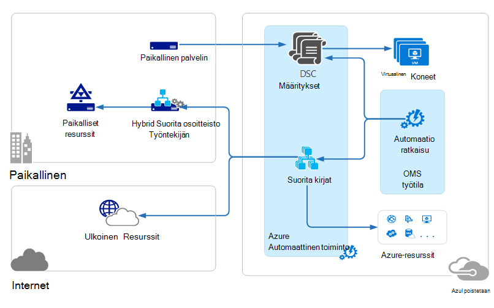
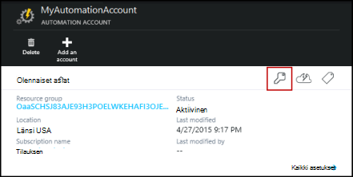
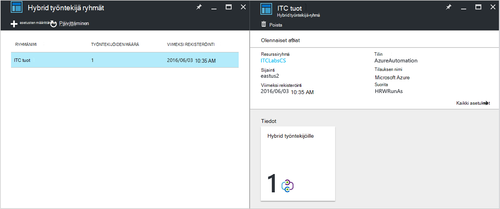
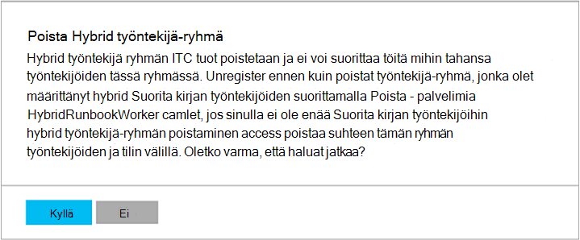

<properties
   pageTitle="Azure automaatio Hybrid Runbookin työntekijöiden | Microsoft Azure"
   description="Tässä artikkelissa on tietoja asentaminen ja käyttäminen Hybrid Runbookin työntekijä ominaisuus, jonka avulla voit suorittaa runbooks tietokoneissa paikallisten tietojen Centerissä Azure automaatio, eli."
   services="automation"
   documentationCenter=""
   authors="mgoedtel"
   manager="jwhit"
   editor="tysonn" />
<tags
   ms.service="automation"
   ms.devlang="na"
   ms.topic="article"
   ms.tgt_pltfrm="na"
   ms.workload="infrastructure-services"
   ms.date="10/14/2016"
   ms.author="bwren" />

# Azure automaatio Hybrid Runbookin työntekijöille

Azure automaatio Runbooks ei voi käyttää paikallisten tietojen Centerissä resursseja, koska ne suoritetaan Azure pilveen.  Azure automaatio Hybrid Runbookin työntekijä-toiminnon avulla voit suorittaa runbooks tietokoneissa, jotka sijaitsevat data Centerissä paikallisten resurssien hallinta. Runbooks tallennettujen ja hallitaan Azure automaatio ja sitten toimitettu vähintään yksi paikallisen koneet.  

Tämä toiminto on esitelty seuraavan kuvan mukaisesti.   

Voit määrittää yhteen tai useampaan tietokoneeseen, tiedot-Centerissä Hybrid Runbookin työntekijä edustajana ja suorittaa runbooks Azure automaatio.  Kunkin työntekijän vaatii Microsoft Management Agent yhteyden Microsoft toimintojen hallinta Suite ja Azure automaatio runbookin-ympäristön avulla.  Toimintojen hallinta Suite käytetään vain asentaa ja ylläpitää hallinta-agentti ja työntekijän toimintojen seurannassa.  Runbooks ja niiden suorittamiseen käsky toimittamisen tehdään Azure automaatio.

Ei ole saapuvien palomuurin vaatimukset tukemaan Hybrid Runbookin työntekijöiden. Paikallisessa tietokoneessa agentti käynnistää kaikki tietoliikenteen Azure automaatio pilveen. Runbookin käynnistyessään Azure automaatio Luo Ohje, joka noutaa agentti. Agentti sitten hakee: n runbookin ja parametreja ennen sen suorittamista.  Kaikki [resurssit](http://msdn.microsoft.com/library/dn939988.aspx) , joita Azure automaatio-runbookin käytetään myös noutaa.

>[AZURE.NOTE] Hybrid Runbookin työntekijöiden tällä hetkellä tue [DSC määrityksiä](automation-dsc-overview.md).

## Hybrid Runbookin työntekijä ryhmät

Jokainen Hybrid Runbookin työntekijä on, voit määrittää, kun olet asentanut agentti Hybrid Runbookin työntekijä-ryhmän jäsen.  Ryhmän voi olla yksi edustaja, mutta voit asentaa useita käyttäjäagenttien ryhmä, suuri käytettävyys.

Kun käynnistät runbookin Hybrid Runbookin työntekijä, määritä ryhmä, johon se suoritetaan.  Ryhmän jäsenet määrittää, mitkä työntekijä pyyntöä.  Et voi määrittää tietyn työntekijän.

## Hybrid Runbookin työntekijä vaatimukset

Määritä vähintään yksi suorittamaan hybrid runbookin töitä paikalliseen tietokoneeseen.  Tämän tietokoneen on täytettävä seuraavat:

- Windows Server 2012 tai uudempi
- Windows PowerShellin 4.0 tai uudempi
- Vähintään kaksi Sydämiä ja 4 gt RAM-muistia

Ota huomioon seuraavat suositukset hybrid työntekijöiden: 

- Määrittää useita hybrid työntekijöiden kunkin ryhmän suuren.  
- Hybrid työntekijät voivat olla Service Management automaatio tai System Center Orchestrator runbookin-palvelimiin.
- Kannattaa käyttää tietokoneen sijaitsevat lähellä automaatio-tilisi alue tai fyysisesti, koska projektin tiedot lähetetään takaisin Azure automaatio, kun työ on valmis.

>[AZURE.NOTE] Hybrid Runbookin työntekijän 7.2.11136.0 versio tukee tällä hetkellä yhteydessä välityspalvelimen osallistuvan PowerShell-komentosarjojen kautta.  Työnkulun PowerShell-komentosarjojen tuki on saatavana uuteen versioon.  

### Välityspalvelimen ja palomuurin asetusten määrittäminen

Muodosta yhteys ja rekisteröi Microsoft toimintojen hallinta Suite (OMS)-palvelussa paikallinen Hybrid Runbookin-työntekijän sen on oltava porttinumero ja URL-osoitteet seuraavalla tavalla.  Tämä on [portit ja URL-osoitteita tarvitaan Microsoft Agent seuranta](../log-analytics/log-analytics-proxy-firewall.md#configure-proxy-and-firewall-settings-with-the-microsoft-monitoring-agent) muodostaa OMS. Jos käytät välityspalvelinta agentti ja OMS-palvelun väliseen viestintään, tarvitset varmistaaksesi, että tarvittavat resurssit ovat käytettävissä. Jos käytät palomuuri käytön rajoittaminen Internetissä, haluat määrittää palomuurin käyttävän. 

Seuraavien tietojen luettelo portti- ja URL-osoitteet, joita tarvitaan Hybrid Runbookin työntekijä viestintä automaatio kanssa.

- Portti: Vain TCP 443 on pakollinen lähtevän Internet-yhteys
- Yleinen URL-osoite: *.azure-automation.net

Jos sinulla on määritetty tietyn alueen automaatio-tili ja haluat rajoittaa tietoliikenteen kyseisen alueelliseen palvelinkeskukseen, seuraavassa taulukossa on DNS-tietue kullekin alueelle.

|**Alue**|**DNS-tietue**|
|--------------|--------------|
|Etelä keskitetyn USA|scus jobruntimedata-tuot-su1.azure-automation.net|
|Yhdysvaltojen Itä 2|eus2 jobruntimedata-tuot-su1.azure-automation.net|
|Länsi Europe|Microsoft-jobruntimedata-tuot-su1.azure-automation.net|
|Pohjois-Eurooppa|Uusi jobruntimedata-tuot-su1.azure-automation.net|
|Kanada Keski|kopio jobruntimedata-tuot-su1.azure-automation.net|
|Etelä Itä-Aasian|meren jobruntimedata-tuot-su1.azure-automation.net|
|Keskitetyn Intia|CID jobruntimedata-tuot-su1.azure-automation.net|
|Japani Itä|jpe jobruntimedata-tuot-su1.azure-automation.net|
|Australia Etelä Itä|ietokannan jobruntimedata-tuot-su1.azure-automation.net|

## Hybrid Runbookin työntekijä asentaminen

Alla olevien ohjeiden kerrotaan, miten asennetaan ja määritetään Hybrid Runbookin työntekijä.  Suorittaa kaksi ensimmäistä vaihetta kerran automaatio-ympäristön ja toista sitten kunkin työntekijän tietokoneen annettuja ohjeita.

### 1. toimintojen hallinta Suite-työtilan luominen

Jos sinulla ei ole toimintojen hallinta Suite-työtila, luoda sitten sen [työtilan määrittäminen](https://technet.microsoft.com/library/mt484119.aspx)käyttämällä ohjeita. Voit käyttää aiemmin luodun työtilan, jos sinulla on jo jokin.

### 2. automaatio-ratkaisun lisääminen toimintojen hallinta Suite työtila

Ratkaisujen Lisää toimintoja toimintojen hallinta ohjelmistopakettiin.  Automaatio-ratkaisun Lisää toimintoja Azure automatisointiin, kuten Hybrid Runbookin työntekijä tuki.  Kun lisäät ratkaisun lisääminen työtilaan, se automaattisesti push-alaspäin työntekijä osat agent-tietokonetta, johon voit asentaa seuraavassa vaiheessa.

Noudata ohjeita, [Voit lisätä käyttämällä ratkaisuvalikoiman ratkaisun](../log-analytics/log-analytics-add-solutions.md) **automaatio** -ratkaisun lisääminen toimintojen hallinta Suite työtilan.

### 3. Asenna Microsoft Agent seuranta

Microsoft Agent seuranta yhdistää tietokoneita toimintojen hallinta ohjelmistopakettiin.  Kun agentti asentaminen paikalliseen tietokoneeseen ja yhdistä se työtilan, Hybrid Runbookin työntekijä varten tarvittavat komponentit automaattisesti Lataa.

Noudattamalla ohjeita [yhteyden Windows](../log-analytics/log-analytics-windows-agents.md) -tietokoneiden, loki Analytics agentti asentaminen paikalliseen tietokoneeseen.  Toista tämä prosessi useiden työntekijöiden lisääminen ympäristön useissa tietokoneissa.

Kun agentti on yhdistetty toimintojen hallinta ohjelmistopakettiin, se merkitään **Yhdistetty lähteet** -välilehden toiminnot Management Suite **asetukset** -ruudun.  Voit varmistaa, että agentti on oikein ladannut automaatio-ratkaisun osoittaa kansio nimeltä **AzureAutomationFiles** C:\Program Files\Microsoft seuranta Agent\Agent.  Vahvista Hybrid Runbookin työntekijälle versiossa, voit siirtyä C:\Program Files\Microsoft seuranta Agent\Agent\AzureAutomation\ ja Huomautus \\ *versio* alikansio.   

### 4. Asenna runbookin-ympäristön ja Azure automaatio yhdistäminen

Kun lisäät agentti toimintojen hallinta ohjelmistopakettiin, automaatio-ratkaisun Vie alaspäin **HybridRegistration** PowerShell-moduulin joka sisältää **Lisää HybridRunbookWorker** cmdlet-komento.  Asenna tietokoneeseen runbookin-ympäristön ja rekisteröitynyt Azure automaatio cmdlet avulla.

Avaa PowerShell-istunnon järjestelmänvalvoja-tilassa ja suorittamalla seuraavat komennot tuoda moduulia.

    cd "C:\Program Files\Microsoft Monitoring Agent\Agent\AzureAutomation\<version>\HybridRegistration"
    Import-Module HybridRegistration.psd1

Suorita sitten **Lisää HybridRunbookWorker** cmdlet-komennon käyttämällä seuraavaa syntaksia:

    Add-HybridRunbookWorker –Name <String> -EndPoint <Url> -Token <String>

Saat cmdlet- **Näppäimiä hallinta** -sivu Azure-portaalissa tarvittavat tiedot.  Avaa tämä sivu valitsemalla Avainkuvake, valitse osat-ruudussa automaatio-tilille.

- **Nimi** on Hybrid Runbookin työntekijä-ryhmän nimi. Jos tämä ryhmä on jo automaatio-tili, nykyisen tietokoneen lisätään siihen.  Jos sitä ei ole jo olemassa, valitse se lisätään.
- **Päätepisteen** on **Hallinta näppäimet** sivu **URL-osoite** -kenttään.
- **Suojaustunnuksen** on **Perusavain Access** - **Näppäimiä hallinta** -sivu.  

Käytä **-yksityiskohtainen** Vaihda **Lisää HybridRunbookWorker** vastaanottamaan yksityiskohtaisia tietoja asennuksen kanssa.

### 5. Asenna PowerShell-moduulit

Runbooks voit käyttää seuraavia toimintoja ja Azure automaatio-ympäristösi asennettu moduulit määritelty cmdlet-komennot.  Näitä moduuleja ei oteta automaattisesti käyttöön paikalliseen tietokoneeseen, joten sinun on asennettava ne manuaalisesti.  Poikkeus on Azure moduuli, jotka asennetaan oletusarvoisesti estää cmdlet-komennot Azure services ja toimintojen käyttämisen Azure automatisointiin.

Koska Hybrid Runbookin työntekijä-ominaisuus on ensisijainen hallittavan paikalliset resurssit, sinun on todennäköisesti asentaminen moduulit, jotka tukevat näitä resursseja.  Voit viitata [Asentaminen moduulit](http://msdn.microsoft.com/library/dd878350.aspx) Lisätietoja asentamisesta Windows PowerShell-moduuleja.

## Hybrid Runbookin työntekijä poistaminen

Voit poistaa yhden tai useamman Hybrid Runbookin työntekijöiden ryhmän tai poistaa ryhmän tarpeen mukaan.  Jos haluat poistaa Hybrid Runbookin työntekijä paikalliseen tietokoneeseen, Avaa PowerShell-istunnon järjestelmänvalvoja-tilassa ja suorittamalla seuraavan komennon - **Poista HybridRunbookWorker** cmdlet-komento.  Käytä **-yksityiskohtainen** siirtyminen poistaminen yksityiskohtainen loki. 

Tämä ei poista seuranta Microsoft Agent tietokoneesta, toiminnot ja Hybrid Runbookin Työntekijä-roolin määrittäminen.  

Poista ryhmä, sinun on ensin Hybrid Runbookin työntekijä poistaminen jokaisessa tietokoneessa, joka on näkyvissä aiemmin-komennolla ryhmän jäsen ja tee seuraavat toimet voit poistaa ryhmän.  

1. Avaa automaatio-tilin Azure-portaalissa.
2. **Hybrid työntekijä ryhmät** -ruutu ja valitse ryhmä, jonka haluat poistaa **Hybrid työntekijä ryhmät** -sivu.  Kun olet valinnut tietyn ryhmän, **Hybrid työntekijä ryhmän** ominaisuudet-sivu tulee näkyviin.     
3. Valitse valitun ryhmän ominaisuudet-sivu Valitse **Poista**.  Viestin näkyvät, jossa pyydetään vahvistamaan toiminnon, ja valitse **Kyllä** , jos olet varma, että haluat jatkaa.    Voi kestää joitakin sekunteja suorittamiseen ja **ilmoitukset** -kohdassa sen edistymistä voi seurata valikosta.  

## Hybrid Runbookin työntekijän runbooks käynnistäminen

[Aloitetaan Runbookin Azure automaatio-](automation-starting-a-runbook.md) kuvataan eri tapoja aloittamisen runbookin.  Hybrid Runbookin työntekijä Lisää **RunOn** -asetus, jossa voit määrittää Hybrid Runbookin työntekijä-ryhmän nimi.  Jos ryhmä on määritetty,: n runbookin on haettu ja kyseisen ryhmän työntekijöiden Suorita.  Jos tämä vaihtoehto ei ole määritetty, valitse se suoritetaan Azure automaatio normaalisti.

Kun käynnistät runbookin Azure-portaalissa, näyttöön tulee **Suorita** -vaihtoehto jossa voit valita **Azure** tai **Hybrid työntekijä**.  Jos valitset **Hybrid työntekijä**, sitten voit valita ryhmän avattava.

Käytä seuraava komento avulla voi aloittaa runbookin, nimeltä testi-Runbookin olevan Hybrid Runbookin työntekijä ryhmän nimeltä MyHybridGroup Windows PowerShellin **RunOn** parametria.

    Start-AzureRmAutomationRunbook –AutomationAccountName "MyAutomationAccount" –Name "Test-Runbook" -RunOn "MyHybridGroup"

>[AZURE.NOTE] **RunOn** -parametri on lisätty PowerShellin Microsoft Azure 0.9.1 versiossa **Käynnistä AzureAutomationRunbook** cmdlet-komento.  Kannattaa [ladata uusimman version](https://azure.microsoft.com/downloads/) , jos sinulla on aiemmin asennettu.  Tarvitset vain tämä versio asennetaan työasema, missä voit olla lähtien: n runbookin Windows PowerShell.  Ei tarvitse asentaa sitä työntekijä tietokoneessa, paitsi jos haluat aloittaa runbooks tietokoneesta.  Ei tällä hetkellä voi aloittaa runbookin-Hybrid Runbookin työntekijä kohteesta toiseen runbookin, koska tämä edellyttäisi uusin versio on asennettu automaatio-tilisi PowerShellin Azure.  Uusimman version päivitetään automaattisesti Azure automaatio- ja automaattisesti miten työntekijöiden pian.

## Runbookin käyttöoikeudet

Hybrid Runbookin työntekijä käytössä Runbooks ei voi käyttää samaa [menetelmää, jota käytetään yleensä runbooks todennustapa Azure resursseja](automation-configuring.md#configuring-authentication-to-azure-resources) , koska he pääsevät resurssien Azure ulkopuolella.  N runbookin joko antaa omassa todennusta paikalliset resurssit tai voit määrittää RunAs-tilin käyttäjän asiayhteyden kaikki runbooks varten.

### Runbookin todennus

Oletusarvoisesti runbooks suoritetaan paikallisen järjestelmätilin kontekstissa paikalliseen tietokoneeseen, joten ne on määritettävä omia resursseja, jotka he käyttävät todennusta.  

Voit käyttää [tunniste](http://msdn.microsoft.com/library/dn940015.aspx) - ja [sertifikaatin](http://msdn.microsoft.com/library/dn940013.aspx) varat oman runbookin suorittamalla cmdlet-komennot, jotta voit määrittää tunnistetiedot siten voi todentaa eri resursseihin.  Seuraavassa esimerkissä esitetään, joka käynnistää tietokoneen runbookin osa.  Se hakee tunnistetiedot tunnistetiedon käyttöomaisuus ja muuttujan resurssi tietokoneen nimi ja käyttää sitten seuraavat arvot ja Käynnistä tietokone cmdlet-komento.

    $Cred = Get-AzureRmAutomationCredential -ResourceGroupName "ResourceGroup01" -Name "MyCredential"
    $Computer = Get-AzureRmAutomationVariable -ResourceGroupName "ResourceGroup01" -Name  "ComputerName"

    Restart-Computer -ComputerName $Computer -Credential $Cred

Voit myös hyödyntää [InlineScript](automation-powershell-workflow.md#inline-script) , joiden avulla voit estää koodin suorittaminen toisessa tietokoneessa [PSCredential yleisiä parametrin](http://technet.microsoft.com/library/jj129719.aspx)tunnuksilla.

### RunAs-tili

Sen sijaan, että runbooks omia voi todentaa paikallisen resursseja, voit määrittää **RunAs** -tilin Hybrid työntekijä ryhmän.  Voit määrittää [tunnistetiedon resurssi](automation-credentials.md) , jolla on pääsy paikalliset resurssit ja kaikki runbooks suoritetaan näitä tunnistetietoja käytettäessä Hybrid Runbookin työntekijä-ryhmässä.  

Tunnistetiedon käyttäjänimi on oltava jokin seuraavista muodoista:

- toimialue\käyttäjänimi 
- username@domain
- käyttäjänimi (for paikallisen tietokoneen paikalliseen-tilit)

Määritä RunAs-tilin Hybrid työntekijä ryhmän seuraavien ohjeiden avulla:

1. Luo paikalliseen resurssien käytön [tunnistetiedon resurssi](automation-credentials.md) .
2. Avaa automaatio-tilin Azure-portaalissa.
2. Valitse **Hybrid työntekijä ryhmät** -ruutu ja valitse sitten haluamasi ryhmä.
3. Valitse **kaikki asetukset** ja sitten **Hybrid työntekijä ryhmäasetuksia**.
4. Muuttaa **suoritetaan** **oletusarvoinen** **Mukautettu**.
5. Valitse tunnistetieto ja valitse **Tallenna**.

## Hybrid Runbookin työntekijän runbooks luominen

Ei, jotka suoritetaan Azure automaatio ja mitkä Hybrid Runbookin työntekijä suorittaa runbooks rakenteen erotus ei ole. Runbooks, jota käytetään kunkin todennäköisesti vaihtelevat merkittävästi vaikka jälkeen runbooks Hybrid Runbookin työntekijän hallinnoi paikalliset resurssit data Centerissä yleensä, kun Azure automaatio runbooks yleensä resurssien Azure pilveen. 

Voit muokata runbookin Hybrid Runbookin työntekijän Azure automaatio, mutta saattaa olla ongelmia, jos yrität testaaminen: n runbookin editorissa.  Joka käyttää paikallisia resursseja, joita ei välttämättä asenneta Azure automaatio-ympäristösi jolloin PowerShell-moduulit testi epäonnistuu.  Jos asennat tarvittavat moduulit,: n runbookin suorittamalla, mutta sitä ei voi käyttää valmiiksi testin paikalliset resurssit.

## Valitse Hybrid Runbookin työntekijän runbooks vianmääritys

[Runbookin tulostus ja viestit](automation-runbook-output-and-messages.md) lähetetään Azure automaatio-hybrid työntekijöiden tavoin runbookin työt suorittaa pilveen.  Voit myös ottaa yksityiskohtainen ja edistymisen virtaa samalla tavalla kuin muiden runbooks yhteydessä.  

Lokit tallennetaan paikallisesti osoitteessa C:\ProgramData\Microsoft\System Center\Orchestrator\7.2\SMA\Sandboxes hybrid kunkin työntekijän.

Jos projektin yhteenveto näyttää tila on **Suspended**oman runbooks eivät ole completeing onnistuneesti, tutustu vianmääritysartikkeliin [Hybrid Runbookin työntekijä: runbookin työn lopettaa Suspended tilassa](automation-troubleshooting-hrw-runbook-terminates-suspended.md).   

## Palvelun hallinta automatisointi suhde

Voit suorittaa saman runbooks on paikallinen tietokeskuksen Azure Automation tukemat [Service Management automaatio (SMA)](https://technet.microsoft.com/library/dn469260.aspx) . SMA yleensä käyttöön ja Windows Azure-kielipaketti, kuten Windows Azure-paketti sisältää graafisessa käyttöliittymässä SMA hallintaa varten. Toisin kuin Azure automaatio SMA edellyttää paikallisen asennuksen, joka sisältää isännöimiseen API tietokannan sisältämään runbooks ja SMA määritykset ja Runbookin työntekijöiden suorittaa runbookin verkko-palvelimiin. Azure automaatio vaatii vain voit ylläpitää Hybrid Runbookin työntekijöiden paikallisen ympäristön ja tarjoaa nämä pilveen.

Jos olet aiemmin lisättyä käyttäjää SMA, voit siirtää oman runbooks Azure automaatio käyttämisestä Hybrid Runbookin työntekijä ilman muutoksia, oletetaan, että he tehdä omia resurssit kuin todennusta kuvattu [luominen runbooks Hybrid Runbookin työntekijälle](#creating-runbooks-for-hybrid-runbook-worker).  Palvelutili kontekstissa työntekijä joka toimittaa kyseisen todennus runbooks palvelimessa suoritettavat Runbooks SMA.

Voit tehdä seuraavat ehdot Azure automatisointi Hybrid Runbookin työntekijöiden tai palvelun hallinta automatisointi tarkoituksenmukaisempia tarpeen selvittäminen.

- SMA edellyttää paikallisen asennuksen pohjana osat, jotka ovat yhteydessä Windows Azure-paketti, jos graafinen hallintaliittymään tarvitaan. Paikallinen lisämateriaalia tarvitaan suurempi kuin Azure automaatio, joka on vain paikallisen runbookin työntekijöiden asennettuihin agentti ylläpito kustannuksia. Niistä hallitaan toimintojen hallinta ohjelmistopaketti pienenevillä edelleen ylläpito kustannukset.
- Azure automaatio tallentaa sen runbooks pilveen ja toimittaa paikallisen Hybrid Runbookin työntekijöille. Jos suojauskäytäntö ei salli tämän ongelman, valitse käytettävä SMA.
- System Center; sisältyy SMA ja edellyttää vuoksi System Center 2012 R2: n käyttöoikeuden. Azure automaatio perustuu Porrastettu tilauksen malli.
- Azure automaatio mukautettuja ominaisuuksia, kuten graafiset runbooks, jotka eivät ole käytettävissä SMA.

## Seuraavat vaiheet

- Lisätietoja eri tavat, joilla voidaan aloittaa runbookin, katso [käynnistäminen Azure automaatio-Runbookin](automation-starting-a-runbook.md)
- PowerShellin ja PowerShell työnkulun runbooks tekstiä editorilla Azure automaatio-käyttämisen eri ohjeita on artikkelissa [Azure automaatio-Runbookin muokkaaminen](automation-edit-textual-runbook.md)

 
