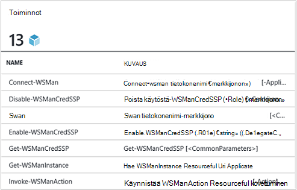
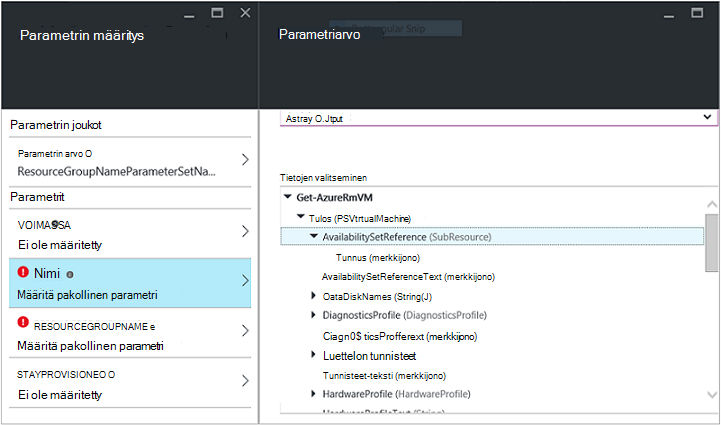
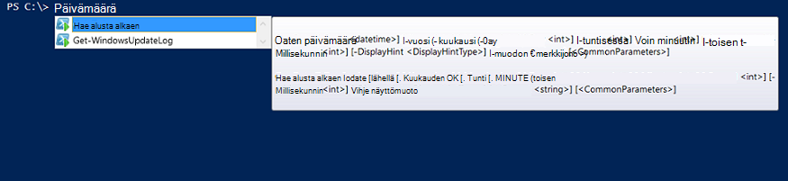

<properties
   pageTitle="Luo Azure automaatio-integroinnin moduuli | Microsoft Azure"
   description="Opetusohjelman, joka opastaa sinua Azure Automaatioapuohjelman integration moduulit luonti, testaus ja Esimerkki käyttö."
   services="automation"
   documentationCenter=""
   authors="mgoedtel"
   manager="jwhit"
   editor="" />

<tags
   ms.service="automation"
   ms.workload="tbd"
   ms.tgt_pltfrm="na"
   ms.devlang="na"
   ms.topic="get-started-article"
   ms.date="09/12/2016"
   ms.author="magoedte" />

# <a name="azure-automation-integration-modules"></a>Azure Automaatioapuohjelman Integration moduulit

PowerShellin on ratkaisevan tekniikka Azure automaatio takana. Koska Azure automaatio perustuu PowerShell-PowerShell-moduulit ovat Azure automaatio laajennettavuus-näppäintä. Tässä artikkelissa on opastaa sinua Azure automaatio käyttäminen PowerShell moduulit, jota kutsutaan "Integrointi moduulit" ja oman PowerShell-moduulit luomisen parhaat käytännöt Varmista, että ne toimivat integrointi moduulit sisällä Azure automaatio yksityiskohtia. 

## <a name="what-is-a-powershell-module"></a>Mikä on PowerShell-moduulin?

PowerShell-moduulin on joukko PowerShellin cmdlet-komennot, kuten **Get alusta alkaen** tai **Kopioi kohde**, joita voidaan käyttää PowerShell console-komentosarjoja, työnkulut, runbooks ja PowerShell DSC resurssit, kuten WindowsFeature tai tiedosto, joka voidaan käyttää PowerShell DSC määrityksiä. Kaikki PowerShell ominaisuudet näkyvät cmdlet-komennot ja DSC resurssit ja jokaisen cmdlet-komennon/DSC resurssin varmuuskopioidaan PowerShell-moduulin monta, jonka mukana PowerShell itse. Esimerkiksi **Get alusta alkaen** cmdlet-komento on osa Microsoft.PowerShell.Utility PowerShell-moduulin ja **Kopioi kohde** cmdlet-komento on osa Microsoft.PowerShell.Management PowerShell-moduulin ja PSDesiredStateConfiguration PowerShell-moduulin paketin DSC resurssi kuuluu. Molemmat nämä moduulit mukana PowerShell. Mutta monet PowerShell-moduulit Älä toimita PowerShell osana ja jaetaan sijaan System Center 2012 määritysten hallinta tai suuria PowerShell yhteisö paikat, kuten PowerShell-valikoiman ensimmäisen tai kolmannen osapuolen tuotteiden kanssa.  Moduulit on hyötyä, koska ne tehdä monimutkaisia tehtäviä yksinkertaisempi encapsulated toimintojen avulla.  Voit lukea lisää [PowerShell moduulit MSDN-sivuston](https://msdn.microsoft.com/library/dd878324%28v=vs.85%29.aspx). 

## <a name="what-is-an-azure-automation-integration-module"></a>Mikä on Azure Automaatioapuohjelman Integration-moduulin?

Integrointi-moduulia ei ole täysin erilainen kuin PowerShell-moduulin. Sen vain yhden Lisää tiedosto - Azure automaatio-yhteystyyppi, jota käytetään runbooks moduulin cmdlet-komennoista, joka määrittää metatietojen tiedoston myös sisältävä PowerShell moduuli. Valinnainen tiedoston vai ei, nämä PowerShell moduulit voi tuoda Azure automaatio saataville niiden cmdlet-komennot käytettäväksi runbooks ja DSC resursseille käytettäväksi DSC määrityksiä. Taustalla Azure automaatio tallentaa nämä moduulit ja lataa ne runbookin työn ja DSC-compiliation suoritusaika Azure automaatio hiekoittimien, jossa runbooks suoritetaan ja DSC käyttömahdollisuudet käännetään.  DSC resurssien moduuleissa sijoitetaan automaattisesti myös automaatio DSC salaus puretaan palvelimessa, niin, että vedetään mukaan koneet yritetään käyttää DSC määrityksiä.  Microsoft toimittaa PowerShellin Azure moduulit useita ulos avulla, jotta voit aloittaa automatisointi Azure hallinta heti, mutta voit helposti tuoda PowerShell moduulit jostakin järjestelmän, palvelun tai työkalun haluat integroida Azure automaatio-ruutuun. 

>[AZURE.NOTE] Tietyt moduulit toimitetaan nimellä "Yleinen moduulit" automaatio-palvelussa. Nämä yleiset moduulit ovat käytettävissä ulos valinta automaatio-tilin luominen, ja ne päivitetään joskus, joka vie ne automaattisesti automaatio-tiliisi. Jos et halua niitä automaattinen päivitetään, voit aina tuoda saman moduulin itse ja, jotka ohittavat kyseisen moduuli, jolla on toimitettava palvelun yleinen moduuli-versio. 

Muoto, jossa tuot integrointi moduuli-paketti on pakattu tiedosto, jonka nimi on sama kuin moduulin ja .zip-tunniste. Se sisältää Windows PowerShell-moduulin ja kaikki tukitiedostot, kuten tiedostojen tiedoston (.psd1), jos moduuli on sellainen.

Jos moduulin pitäisi näkyä Azure automaatio-yhteystyyppi, se täytyy olla myös tiedosto, jonka nimi *<ModuleName>*-Automation.json, joka määrittää yhteyden ominaisuudet. Tämä on sijoitettu pakattu .zip-tiedosto moduuli-kansiosta käsin json tiedoston ja "yhteyden-kentät sisältävät tarvittava järjestelmän tai palvelun moduulin edustaa. Tämä päätyvät luominen Azure automaatio yhteyden tyyppi. Kirjoittaa avulla voit määrittää kenttien nimet-tiedoston, ja onko kenttien on oltava salattuja ja / tai valinnainen tietoyhteyden moduulin. Seuraavassa on mallin json-tiedostomuodossa:

```
{ 
   "ConnectionFields": [
   {
      "IsEncrypted":  false,
      "IsOptional":  false,
      "Name":  "ComputerName",
      "TypeName":  "System.String"
   },
   {
      "IsEncrypted":  false,
      "IsOptional":  true,
      "Name":  "Username",
      "TypeName":  "System.String"
   },
   {
      "IsEncrypted":  true,
      "IsOptional":  false,
      "Name":  "Password",
   "TypeName":  "System.String"
   }],
   "ConnectionTypeName":  "DataProtectionManager",
   "IntegrationModuleName":  "DataProtectionManager"
}
```

Jos olet ottanut Service Management automaatio ja luonut integrointi moduulit pakettien automaatio-runbooks, tämä pitäisi näyttää varmasti tutulta sinulle. 


## <a name="authoring-best-practices"></a>Parhaiden käytäntöjen luominen

Vaikka integrointi moduulit ovat olennaisesti PowerShell-moduuleja, ei tarkoittaa emme ole käytännöt ympärille authoring ne joukko. Useita kohteita, suosittelemme, että pidät samalla authoring PowerShell-moduulin, jotta se hyödyllisimpiä Azure automaatio on edelleen. Joitakin näistä ovat Azure automaatio tietyn ja jotkin niistä ovat käteviä, jotta oman moduulit toimivat hyvin PowerShell-työnkulun, riippumatta siitä, onko käytössäsi automaatio. 

1. Sisällytä yhteenvedon, kuvaus ja Ohje URI-moduulin jokaisen cmdlet-komento. Voit määrittää PowerShell-cmdlet-komennot käyttäjä voi saada apua käyttämisestä **Ohjeiden etsiminen** cmdlet-komento tiettyjä ohjeita. Esimerkiksi näin siitä, miten voit määrittää yhteenvedon ja Ohje URI PowerShell-moduulin kirjoitettu .psm1 tiedoston.<br>  

    ```
    <#
        .SYNOPSIS
         Gets all outgoing phone numbers for this Twilio account 
    #>
    function Get-TwilioPhoneNumbers {
    [CmdletBinding(DefaultParameterSetName='SpecifyConnectionFields', `
    HelpUri='http://www.twilio.com/docs/api/rest/outgoing-caller-ids')]
    param(
       [Parameter(ParameterSetName='SpecifyConnectionFields', Mandatory=$true)]
       [ValidateNotNullOrEmpty()]
       [string]
       $AccountSid,

       [Parameter(ParameterSetName='SpecifyConnectionFields', Mandatory=$true)]
       [ValidateNotNullOrEmpty()]
       [string]
       $AuthToken,

       [Parameter(ParameterSetName='UseConnectionObject', Mandatory=$true)]
       [ValidateNotNullOrEmpty()]
       [Hashtable]
       $Connection
    )

    $cred = CreateTwilioCredential -Connection $Connection -AccountSid $AccountSid -AuthToken $AuthToken

    $uri = "$TWILIO_BASE_URL/Accounts/" + $cred.UserName + "/IncomingPhoneNumbers"
    
    $response = Invoke-RestMethod -Method Get -Uri $uri -Credential $cred

    $response.TwilioResponse.IncomingPhoneNumbers.IncomingPhoneNumber
    }
    ```
<br> 
Antamalla näitä tietoja ei näy vain tämän ohjeen avulla **Ohjeiden etsiminen** cmdlet-komento PowerShell console-tämän ohjeen toiminnoista Azure automaatio, esimerkiksi silloin, kun toimintojen lisääminen aikana runbookin yhtä aikaa muiden kanssa myös Näytä. Valitsemalla "Näytä lisätietoja artikkelista" Avaa ohjeen URI käyttämään Azure automaatio käytät selaimella toiseen välilehteen.<br>
2. Moduulin käytetään vastaan Etäjärjestelmä,. Se on sisällettävä integrointi moduuli-metatieto-tiedosto, joka määrittää, että Etäjärjestelmä, eli yhteystyyppiä yhdistäminen tarvittavat tiedot. b. Moduulin cmdlet-komento, joita pitäisi ottamisesta parametrina connection-objektin (yhteystyyppi kyseisen esiintymän).  
    Cmdlet-moduulin muuttuvat on helpompi käyttää Azure automaatio, jos sallit kulkeva objekti, jonka yhteyden-tyypin kenttiä parametrina-cmdlet-komennolla. Tätä tapaa, jolla käyttäjien ei tarvitse parametrien yhteyden kohteen yhdistäminen-cmdlet-komennolla vastaavat parametrit aina, kun ne kutsu cmdlet-komento. Runbookin esimerkin mukaan se käyttää Twilio yhteyden resurssi-kutsutaan CorpTwilio käyttää Twilio ja palauttaa kaikki puhelinnumerot-tilillä.  Ilmoitus siitä, miten se on yhdistettyjen kenttien yhteyden cmdlet-parametrien?<br>

    ```
    workflow Get-CorpTwilioPhones
    {
      $CorpTwilio = Get-AutomationConnection -Name 'CorpTwilio'
    
      Get-TwilioPhoneNumbers 
        -AccountSid $CorpTwilio.AccountSid  
        -AuthToken $CorptTwilio.AuthToken
    }
    ```
<br>
Entistä helpompaa ja paremmin asia tapa on suoraan kulkeva objektin cmdlet-

    ```
    workflow Get-CorpTwilioPhones
    {
      $CorpTwilio = Get-AutomationConnection -Name 'CorpTwilio'

      Get-TwilioPhoneNumbers -Connection $CorpTwilio
    }
    ```
<br>
Voit ottaa toiminta tältä oman cmdlet-komentojen avulla he voivat hyväksyä yhteyden objektin suoraan parametrina vain yhteyden kentät parametrien sijaan. Yleensä haluat määrittää kunkin-parametrin niin, että Käytä Azure automaatio käyttäjä voi soittaa oman cmdlet-komennot ilman luomisesta hajautustaulukko objektin edustajana. Parametrin määrittäminen **SpecifyConnectionFields** alla käytetään välittää yhteyden kenttäominaisuudet yksi kerrallaan. **UseConnectionObject** avulla voit välittää yhteyden suora kautta. Kuten näet, [Twilio PowerShell-moduulin](https://gallery.technet.microsoft.com/scriptcenter/Twilio-PowerShell-Module-8a8bfef8) Lähetä TwilioSMS cmdlet-komennon avulla kulkeva molemmilla tavoilla: 

    ```
    function Send-TwilioSMS {
      [CmdletBinding(DefaultParameterSetName='SpecifyConnectionFields', `
      HelpUri='http://www.twilio.com/docs/api/rest/sending-sms')]
      param(
         [Parameter(ParameterSetName='SpecifyConnectionFields', Mandatory=$true)]
         [ValidateNotNullOrEmpty()]
         [string]
         $AccountSid,

         [Parameter(ParameterSetName='SpecifyConnectionFields', Mandatory=$true)]
         [ValidateNotNullOrEmpty()]
         [string]
         $AuthToken,

         [Parameter(ParameterSetName='UseConnectionObject', Mandatory=$true)]
         [ValidateNotNullOrEmpty()]
         [Hashtable]
         $Connection

       )
    }
    ```
<br>
3. Määritä Tulostustyyppi kaikki cmdlet-komennot moduuli. Suunnittelunaikaiset IntelliSensen avulla voit määrittää cmdlet aikana yhtä aikaa muiden kanssa tulosteen ominaisuuksien määrittäminen cmdlet-komento, tulostus-tyypille avulla. Se on hyötyä aikana automaatio runbookin graafinen yhtä aikaa muiden kanssa, missä rakenne aika knowledge helposti käyttäjäkokemuksen moduulin kanssa-näppäintä.<br> <br> Tämä muistuttaa PowerShell ise: n tulos cmdlet-komento "Kirjoita eteenpäin" toimintoja eikä sinun tarvitse suorittaa.<br> <br>
4. Cmdlet-moduulissa ei olisi otettava monimutkaisia objektityypit parametrit. PowerShellin työnkulun poikkeaa PowerShell, se tallentaa monitasoisia tyyppejä sarjoitus muodossa. Primitiivityyppejä säilyvät kuin perusalkioiden, mutta monimutkaisia tietotyypit muunnetaan sarjoitus versiot, jotka ovat olennaisesti ominaisuuden pakkaaminen. Esimerkiksi jos olet käyttänyt **Get-prosessin** cmdlet-komento, runbookin (tai aihetta PowerShell työnkulun), se palauttavat objektin laji [Deserialized.System.Diagnostic.Process] ei odotettu [System.Diagnostic.Process] tyyppi. Tämä on samat-poistaa tyyppi, mutta mitään ominaisuuksia. Ja jos yrität siirtää arvoksi parametrina cmdlet-komento, jossa cmdlet odottaa parametrin [System.Diagnostic.Process]-arvo, saat seuraavan virheilmoituksen: *ei voi käsitellä argumentin muunnos parametrin "prosessi". Virhe: "tyyppi"Deserialized.System.Diagnostics.Process"Kirjoita"System.Diagnostics.Process""System.Diagnostics.Process (CcmExec)"-arvoa ei voi muuntaa.*   Tämä johtuu siitä on tyyppiristiriidan odotettu [System.Diagnostic.Process] tyyppi ja annetun [Deserialized.System.Diagnostic.Process]-tyypin välillä. Ongelman poistetaan varmistaaksesi moduulin cmdlet-komennot eivät tule parametrien monitasoisia tyyppejä. Seuraavassa on väärä tapaa, jolla voit tehdä sen.

    ```
    function Get-ProcessDescription {
      param (
            [System.Diagnostic.Process] $process
      )
      $process.Description
    }
    ``` 
<br>
Ja tässä on oikein, ottaen alkuperäisten, joka voidaan käyttää sisäisesti-cmdlet-komennolla voit käyttää monimutkaisia objekti ja käyttää sitä. Koska cmdlet suoritetaan PowerShell kontekstissa, ei PowerShell työnkulun sisällä cmdlet-komento $process ei ole [System.Diagnostic.Process] tyyppi on oikea.  

    ```
    function Get-ProcessDescription {
      param (
            [String] $processName
      )
      $process = Get-Process -Name $processName

      $process.Description
    }
    ```
<br>
Yhteyden kohteita runbooks ovat hashtables, jotka ovat monimutkaisia tyyppi, ja vielä nämä hashtables näyttävät siirretään cmdlet-komennot voivat niiden – Palvelutietoyhteyden parametri cast poikkeusta ei ole täysin, kanssa. Tarkalleen ottaen PowerShell Jotkin tiedostotyypit voivat määrittää oikein niiden sarjoitettu sarjoitus lomakkeen ja näin ollen voidaan välittää cmdlet-komentojen tuominen parametrien hyväksymällä muu kuin sarjoitus tyyppi. Hajautustaulukko on jokin seuraavista. Moduulin tekijä tyyppi pantava täytäntöön niin, että ne oikein voit poistaa myös mahdollista, mutta on joitakin kompromissien tehdä. Tyyppi on oletuskonstruktoria on, että kaikki sen ominaisuudet, jotka ovat julkisia ja PSTypeConverter. Kuitenkin jo määritetty kohdalla, jotka moduulin tekijä ei ole tällä ei voi "virheikkuna", joten voit välttää monitasoisia tyyppejä parametrien kaikki yhdessä suositus. Runbookin Authoring Vihje: Jos jotkin syy cmdlet-komennot haluat tehdä monimutkaisia tyyppiparametri tai käytät toisen käyttäjän moduuli, jolla monimutkaisia tyyppi-parametri, Vaihtoehtoinen menetelmä PowerShell työnkulun runbooks ja PowerShel työnkulkujen paikallisen powershellissä on rivitys cmdlet-komento, joka luo monimutkaisia tyyppi ja cmdlet-komento, joka käyttää InlineScript samaan toimintoon monimutkaisia tyyppi. InlineScript käynnistää sen sisällön PowerShell PowerShell työnkulun sijaan, koska luodaan monimutkaisia tyyppi cmdlet-komento tuottaa oikean laji ei sarjoitus monimutkaisia tyyppi.
5. Tee moduulin kaikki cmdlet-komennot tilattomien. PowerShell-työnkulkua käytetään jokaisen cmdlet-komennolla kutsutaan työnkulun eri istunnossa. Tämä tarkoittaa minkä tahansa cmdlet-komennot, jotka riippuvat istunnon tila luotu / muokannut muiden saman moduulin cmdlet-komennot eivät toimi PowerShell työnkulun runbooks.  Tässä on esimerkki siitä, mitä ei tehdä.

    ```
    $globalNum = 0
    function Set-GlobalNum {
       param(
           [int] $num
       )
      
       $globalNum = $num
    }
    function Get-GlobalNumTimesTwo {
       $output = $globalNum * 2
     
       $output
    }
    ```
<br>
6. Moduulin olisi sisälsi täysin Xcopy pysty-paketissa. Azure automaatio moduulit jaetaan automaatio-hiekoittimien runbooks täytyy suorittaa, koska ne on toimimaan ulkopuolisista host, ne ovat käytössä. Tämä tarkoittaa sitä, että sinun pitäisi zip-tiedostoon moduuli-pakkauksen siirtää sen toisen isännän saman tai uudempaa versiota PowerShell-versiolla ja se toimi normaalisti tuotaessa, jotka isännöivät PowerShell-ympäristöön. Jotta, ilmenee moduulin olisi ei vaihtelevat tiedostoista, jotka ulkopuolella moduuli-kansio (kansio, joka saa zip määrittäminen, kun tuodaan Azure automaatio) tai yksilöllinen rekisteriasetuksia isännän, kuten määrittää tuotteen asennuksen. Jos paras käytäntö ei seuraa-moduulia ei voi käyttää Azure automaatio.  

## <a name="next-steps"></a>Seuraavat vaiheet

- Aloita PowerShell työnkulun runbooks, katso [ensimmäinen PowerShell työnkulun-runbookin](automation-first-runbook-textual.md)
- Lisätietoja PowerShell-moduulit luomisesta on artikkelissa [Windows PowerShell-moduulin kirjoittaminen](https://msdn.microsoft.com/library/dd878310%28v=vs.85%29.aspx)