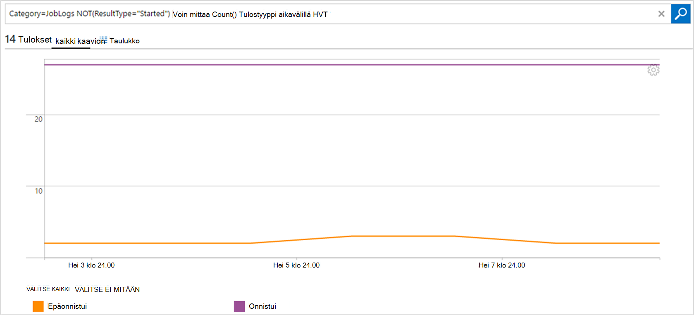

<properties
    pageTitle="Lähettää edelleen tilan ja työn virtaa automaatio Log Analytics (OMS) | Microsoft Azure"
    description="Tässä artikkelissa kerrotaan, miten voit lähettää tilan ja runbookin työn virtaa Microsoft toimintojen hallinta Suite Log analyysin aikana muita tietoja ja hallinta."
    services="automation"
    documentationCenter=""
    authors="MGoedtel"
    manager="jwhit"
    editor="tysonn" />
<tags
    ms.service="automation"
    ms.devlang="na"
    ms.topic="article"
    ms.tgt_pltfrm="na"
    ms.workload="infrastructure-services"
    ms.date="09/22/2016"
    ms.author="magoedte" />

# Lähettää edelleen tilan ja työn virtaa automaatio Log Analytics (OMS)

Automaatio lähettää runbookin projektin tila ja työn virtaa Microsoft toimintojen hallinta Suite (OMS) lokin Analytics-työtilassa.  Vaikka voit tarkastella näitä tietoja Azure-portaalissa tai PowerShellin avulla yksittäiset tilan tai kaikki työt tietyn automaatio-tilin, mitään advanced tukemaan toiminnalliset vaatimukset tarvitaan voit luoda mukautetun PowerShell-komentosarjojen.  Lokitiedoston Anaytics avulla voit nyt tehdä:

- Hae tietoja automaatio töihin 
- Käynnistimen sähköpostiin tai ilmoituksen perusteella runbookin-projektin tila (kuten epäonnistui tai keskeyttää) 
- Kirjoita tarkennettuja kyselyitä koko projektin virtaa 
- Yhdistää työt automaatio-tilien välillä 
- Oman Työhistoria visualisointi ajan mittaan     

## Käytön edellytykset ja käyttöönottoon liittyviä huomioita

Jos haluat lisätä automaatio-lokit Log Analytics, sinulla on oltava seuraavasti:

1. OMS-tilaus. Lisätietoja on artikkelissa [Log Analytics käytön aloittaminen](../log-analytics/log-analytics-get-started.md).  

    >[AZURE.NOTE]OMS työtilan ja automaatio tilin on oltava samaan Azure ‑tilaukseen, jotta määritysten toimii oikein. 
  
2. [Azure-tallennustilan tilin](../storage/storage-create-storage-account.md).  
   
    >[AZURE.NOTE]-Tallennustilan tilin *on* oltava samalla alueella automaatio-tiliksi. 
 
3. Azure PowerShell 1.0.8-versiolla tai uudempaa versiota ja toiminnallisia havainnollistamisen cmdlet-komennot. Tietoja tässä versiossa ja asennusohjeet Katso, [miten asennetaan ja määritetään PowerShellin Azure](../powershell-install-configure.md).
4. Azure diagnostiikka- ja Log Analytics PowerShell.  Katso lisätietoja tässä versiossa ja asennusohjeet, [Azure diagnostiikka- ja Log Analytics](https://www.powershellgallery.com/packages/AzureDiagnosticsAndLogAnalytics/0.1).  
5. Lataa PowerShell-komentosarjaa **Ota AzureDiagnostics.ps1** [PowerShell-valikoimassa](https://www.powershellgallery.com/packages/Enable-AzureDiagnostics/1.0/DisplayScript). Tämä komentosarja määritetään seuraavasti:
 - Tallennustilan tilin runbookin projektin tila ja stream tiedot automaatio-tili, voit määrittää pitoon.
 - Mahdollistavat tiedoista automaatio-tilisi tallennuspaikoista Azure Blob storage tilin JSON-muodossa.
 - Määritä tietojen keräämisen Blob storage tililtä OMS Log Analytics.
 - Ota käyttöön automaatio Log Analytics-ratkaisun OMS työtilan.   

**Ota käyttöön AzureDiagnostics.ps1** komentosarja edellyttää seuraavia parametreja suorituksen aikana:

- *AutomationAccountName* - automaatio-tilisi nimi
- *LogAnalyticsWorkspaceName* - OMS työtilan nimi

Arvojen etsiminen *AutomationAccountName*Azure-portaalissa automaatio-tilisi valitseminen **automaatio-tili** -sivu ja valitsemalla **kaikki asetukset.**  **Kaikki asetukset** -sivu- **Tilin asetukset** ja valitse **Ominaisuudet**.  Valitse **Ominaisuudet** -sivu nämä arvot muistiin.  .

## Asennuksen lokin Analytics-integrointi

1. Tietokoneeseen Käynnistä **Windows PowerShellin** **Aloitus** -näytössä.  
2. Siirry PowerShell komentorivin shell-kansio, joka sisältää komentosarja ladataan ja suorittaa sen muuttaminen parametrien arvot *- AutomationAccountName* ja *- LogAnalyticsWorkspaceName*.

    >[AZURE.NOTE] Voit pyydetään todentamismenetelmä Azure, kun suoritat komentosarjan.  Sinun **on** kirjauduttava sisään tilille, jolla on tilauksen valvojat-roolin jäsen ja muiden järjestelmänvalvojan tilauksen.   
    
        .\Enable-AzureDiagnostics -AutomationAccountName <NameofAutomationAccount> `
        -LogAnalyticsWorkspaceName <NameofOMSWorkspace> `

3. Kun olet suorittanut tämän komentosarjan pitäisi näkyä Log Analytics tietueiden noin 30 minuuttia sen jälkeen, kun uusi diagnostiikkatiedot kirjoitetaan tallennustilan.  Jos tietueita ei ole käytettävissä, kun tällä hetkellä viittaa vianmäärityksen [Blob-objektien tallennustilaan JSON](../log-analytics/log-analytics-azure-storage-json.md#troubleshooting-configuration-for-azure-diagnostics-written-to-blob-in-json)tiedostot.

### Tarkista määritykset

Vahvista komentosarja määritetty automaatio-tili ja OMS wokspace onnistuneesti, voit suorittaa seuraavat vaiheet powershellissä.  Ennen kuin teet näin, voit etsiä OMS työtilan nimi ja resurssiryhmän nimi, Azure-portaalista arvot siirtyminen Log Analytics (OMS) ja kirjaudu Analytics (OMS)-sivu Huomautus arvon **nimi** ja **Resurssiryhmä**.   Käytämme nämä kaksi arvoa, kun PowerShell-cmdlet-komennolla [Get-AzureRmOperationalInsightsStorageInsight](https://msdn.microsoft.com/library/mt603567.aspx)OMS työtilassa määritys tarkistetaan.

1.  Siirry Azure-portaalista tallennustilan asiakkaat ja Etsi seuraava tallennustilan tilin, joka käyttää nimeämiskäytäntöä - *AutomationAccountNameomsstorage*.  Sen jälkeen runbookin työ on valmis, pian jälkeenpäin pitäisi näkyä Blob säilöt luotu - **tiedot-lokit-joblogs** ja **tietoja-lokit-jobstreams**.  

2.  Suorita PowerShell-seuraavan PowerShell-koodin muuttaminen **ResourceGroupName** ja **WorkspaceName** , kopioida tai edellä parametrien arvot.  

    Kirjaudu sisään AzureRmAccount Get-AzureRmSubscription - SubscriptionName 'SubscriptionName' | Määritä AzureRmContext Get-AzureRmOperationalInsightsStorageInsight - ResourceGroupName "OMSResourceGroupName" "-työtilan"OMSWorkspaceName" 

    Tämä palauttaa määritetyn OMS työtilan tallennustilan-tietoja.  Haluat vahvistaa tallennustilan tietoja automaatio-tilille on määritetty aiemmin olemassa ja **tila** -objekti näkyy **OK**-arvo.  .

## Kirjaudu Analytics-tietueet

Automaatio Luo kahdentyyppisiä tietueita OMS säilö.

### Työn lokit

Ominaisuus | Kuvaus|
----------|----------|
Aika | Päivämäärä ja kellonaika, kun runbookin työ suoritetaan.|
resourceId | Määrittää resurssin lajin Azure.  Automaatio-arvo on n runbookin liittyvää automaatio-tiliä.|
operationName | Määrittää Azure suorittaa toiminnon.  Automaatio-arvo on työn.|
resultType | Runbookin projektin tila.  Mahdolliset arvot ovat: -Käytön aloittaminen -Stopped -Hyllytetty -Epäonnistui -Onnistui|
resultDescription | Tässä artikkelissa kuvataan runbookin työn tuloksen tila.  Mahdolliset arvot ovat: -Työ on aloitettu -Työ epäonnistui -Työ on valmistunut|
CorrelationId | GUID-tunnus, joka on runbookin työn korrelaatiotunnus.|
Luokka | Tietojen tyypin luokitus.  Automaatio-arvo on JobLogs.|
RunbookName | N runbookin nimi.|
Työn tunnus | GUID-tunnus, joka on runbookin työn tunnus.|
Soittajan |  Kuka aloitti toiminto.  Mahdolliset arvot ovat sähköpostiosoite- tai ajoitetuissa järjestelmän.|

### Työn virtaa
Ominaisuus | Kuvaus|
----------|----------|
Aika | Päivämäärä ja kellonaika, kun runbookin työ suoritetaan.|
resourceId | Määrittää resurssin lajin Azure.  Automaatio-arvo on n runbookin liittyvää automaatio-tiliä.|
operationName | Määrittää Azure suorittaa toiminnon.  Automaatio-arvo on työn.|
resultType | Runbookin projektin tila.  Mahdolliset arvot ovat: -Aktiivisuustila|
resultDescription | Sisältää: n runbookin-tulostus-muodossa.|
CorrelationId | GUID-tunnus, joka on runbookin työn korrelaatiotunnus.|
Luokka | Tietojen tyypin luokitus.  Automaatio-arvo on JobStreams.|
RunbookName | N runbookin nimi.|
Työn tunnus | GUID-tunnus, joka on runbookin työn tunnus.|
Soittajan | Kuka aloitti toiminto.  Mahdolliset arvot ovat sähköpostiosoite- tai ajoitetuissa järjestelmän.| 
StreamType | Työn stream tyyppi. Mahdolliset arvot ovat: -Käynnissä -Tulostus -Varoitus -Virhe -Korjaaminen -Yksityiskohtainen|

## Tarkasteleminen automaatio Kirjaa lokin Analytics 

Nyt kun olet aloittanut automaatio-työ lokit lähettäminen lokin Analytics, katsotaan, mitä voit tehdä näiden lokien OMS sisällä.   

### Lähetä sähköpostiviesti, kun runbookin työn epäonnistuu tai keskeyttää 

Jokin yläreunan asiakkaille pyytää on lähettämisen sähköposti- tai tekstiviestin, kun jokin menee vikaan runbookin työhön.   

Luo ilmoitusten sääntö, aloita luomalla log haun runbookin työn tietueista, jotka tulisi käynnistää ilmoituksen.  **Ilmoitus** -painike on käytettävissä, jotta voit luoda ja määrittää hälytyksen.

1.  Valitse **Log Etsi**OMS yleiskatsaus-sivulla.
2.  Luo lokitiedoston hakukyselyn ilmoituksen kirjoittamalla kyselyn kenttään seuraavassa: `Category=JobLogs (ResultType=Failed || ResultType=Suspended)`.  Voit myös Ryhmittelyperuste RunbookName avulla: `Category=JobLogs (ResultType=Failed || ResultType=Suspended) | measure Count() by RunbookName_s`.   
  
    Jos olet määrittänyt lokit useita automaatio-tili tai tilauksen lisääminen työtilaan, voit myös tarkastella kiinnostunut ryhmittely ilmoituksiasi merkitsemällä tai automaatio-tili.  Tilinimen Automation voidaan johtaa resurssikenttä JobLogs hakutoiminnolla.  

3.  Valitse **ilmoitus** sivun yläreunassa Avaa **Ilmoitusten säännön lisääminen** -ruutu.  Saat lisätietoja vaihtoehto, jos haluat määrittää ilmoituksen, [loki Analytics ilmoitukset](../log-analytics/log-analytics-alerts.md#creating-an-alert-rule).

### Etsi kaikissa projekteissa, jotka on valmis, virheitä esiintyi 

Lisäksi ilmoitat perään virheet, todennäköisesti haluat tietää, kun runbookin työ on ollut-lopetetaan virheen (PowerShell tuottaa virheen-muodossa, mutta ei lopetetaan virheet eivät aiheuta työtäsi keskeyttää tai epäonnistua).    

1. Valitse OMS-portaalissa **Log haku**.
2. Kirjoita kyselyn-kenttään `Category=JobStreams StreamType_s=Error | measure count() by JobId_g` ja valitse sitten **Etsi**.

### Näytä työn virtaa projektille  

Kun työ on virheenkorjaus, haluat ehkä tarkastelevat työn virtaa.  Alla olevassa kyselyssä näkyvät kaikki virtaa yhden projektin GUID-tunnus 2ebd22ea-e05e-4eb9 – 9d 76-d73cbd4356e0 kanssa:   

`Category=JobStreams JobId_g="2ebd22ea-e05e-4eb9-9d76-d73cbd4356e0" | sort TimeGenerated | select ResultDescription` 

### Historiallinen työn tilan tarkasteleminen 

Lopuksi haluamasi visualisointi oman Työhistoria ajan kuluessa.  Tämä kysely voit etsiä töiden tilan ajan kuluessa. 

`Category=JobLogs NOT(ResultType="started") | measure Count() by ResultType interval 1day`  
   

## Yhteenveto

Lähettämällä automaatio projektin tila ja stream tietojen Log Analytics saat ymmärtämään automaatio-töiden määrittämällä ilmoitukset ilmoittamaan, kun kyseessä on ongelma ja tarkennettuja kyselyitä avulla voit visualisoida runbookin tulokset mukautetun raporttinäkymien tilan, runbookin tilan, ja muut liittyvät avaimen ilmaisimet tai arvot.  Tämä auttaa toiminnallisia tietotyöntekijöiden ja osoite tapaukset nopeammin.  

## Seuraavat vaiheet

- Lue lisää eri hakukyselyt laatimiseen ja tarkista loki Analytics automaatio työn lokien artikkelissa [Log rajaamalla Log Analytics](../log-analytics/log-analytics-log-searches.md)
- Voit luoda ja tulostus ja virheilmoitukset noutaa runbooks on artikkelissa [Runbookin tulostus ja viestit](automation-runbook-output-and-messages.md) 
- Lisätietoja runbookin suorittamisen, kuinka voit valvoa runbookin projektien ja muiden teknisistä tiedoista on artikkelissa [runbookin Työn seuranta](automation-runbook-execution.md)
- Lisätietoja OMS Log analyysin ja sivustokokoelman tietolähteet-kohdassa [kerääminen Azure tallennustilan tiedot Log Analytics yleiskatsaus](../log-analytics/log-analytics-azure-storage.md)