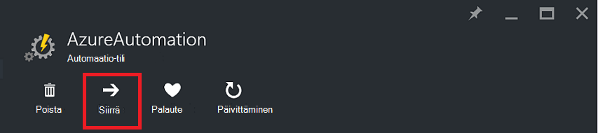
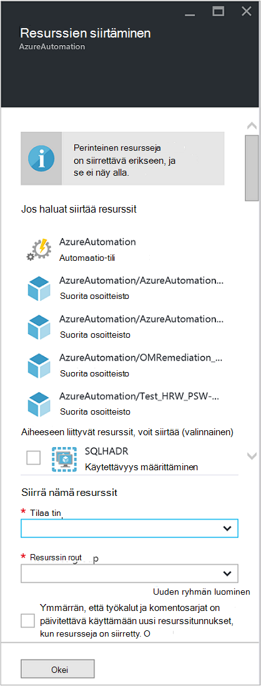

<properties
   pageTitle="Automaatio-tili ja resurssien | Microsoft Azure"
   description="Tässä artikkelissa käsitellään Siirry Azure automaatio ja niihin liittyvät resurssit automaatio tili yksi tilaus toiseen."
   services="automation"
   documentationCenter=""
   authors="MGoedtel"
   manager="jwhit"
   editor="tysonn" />
<tags
   ms.service="automation"
   ms.devlang="na"
   ms.topic="article"
   ms.tgt_pltfrm="na"
   ms.workload="infrastructure-services"
   ms.date="07/07/2016"
   ms.author="magoedte" />

# <a name="migrate-automation-account-and-resources"></a>Automaatio-tili ja resurssit

Automaatio-tilien ja sen liittyvät resurssit (eli resurssien, runbooks, moduulit, jne., jotka olet luonut Azure-portaalissa ja haluat siirtää resurssi-ryhmästä toiseen tai yksi tilaus toiseen) voit tehdä tämän helposti käytettävissä Azure-portaalissa [Resurssien siirtäminen](../resource-group-move-resources.md) -ominaisuudella. Kuitenkin ennen jatkamista toiminto ensin tarkistaa seuraavan [tarkistusluettelon ennen siirtämistä resurssit](../resource-group-move-resources.md#Checklist-before-moving-resources) ja lisäksi vain automaatio alla olevassa luettelossa.   

1.  Kohde-tilauksen/resurssiryhmä on oltava sama alue lähteenä.  Eli, automaatio-tilejä ei voi siirtää eri alueilla.
2.  Kun siirrät resurssit (esimerkiksi runbooks, työt, jne.), sekä lähde-ryhmän ja kohderyhmän lukitaan toiminnon toistaminen. Kirjoittaminen ja poista toimintojen torjuttavien ryhmät, ennen kuin siirtäminen on valmis.  
3.  Mikä tahansa runbooks tai muuttujia, jotka viittaavat resurssi tai tilauksen tunnus aiemmin tilauksesta, on päivitettävä, kun siirto on valmis.   


>[AZURE.NOTE] Tämä ominaisuus ei tue siirtäminen perinteinen automaatio resurssit.

## <a name="to-move-the-automation-account-using-the-portal"></a>Jos haluat siirtää portaalissa automaatio-tili

1. Automaatio-tililtä Valitse **Siirrä** yläreunaan sivu.<br> <br> 
2. **Siirtää resursseja** , sivu-Huomaa, että sen tuottamat automaatio-tilisi ja resurssin jäsen liittyvät resurssit.  Valitse **tilaus** ja **resurssiryhmä** avattavasta luettelosta tai valitse vaihtoehto, **Luo uusi resurssiryhmä** ja kirjoita uusi nimi resurssille ryhmän kenttään.  
3. Tarkista ja valitse sitten valintaruutu voit toki *ymmärtää työkalut ja komentosarjat on päivitettävä käyttämään uusi resurssi tunnukset, kun resursseja on siirretty* ja valitse sitten **OK**.<br> <br>   

Tämä toiminto kestää useita minuutteja.  **Ilmoitukset**, näyttöön tulee kunkin toiminto, joka suoritetaan - kelpoisuuden, siirto-tilassa ja lopuksi kun se on valmis.     

## <a name="to-move-the-automation-account-using-powershell"></a>Jos haluat siirtää PowerShell-automaatio-tilillä

Voit siirtää aiemmin automaatio resurssien toiseen resurssiryhmä tai tilauksen avulla tietty automaatio-tili ja valitse **Siirrä AzureRmResource** cmdlet-komento, siirrä suorittamiseen **Get-AzureRmResource** cmdlet-komento.

Ensimmäinen esimerkissä, voit siirtää automaatio-tilin uusi resurssiryhmä.

   ```
    $resource = Get-AzureRmResource -ResourceName "TestAutomationAccount" -ResourceGroupName "ResourceGroup01"
    Move-AzureRmResource -ResourceId $resource.ResourceId -DestinationResourceGroupName "NewResourceGroup"
   ``` 

Kun suoritat edellä olevassa esimerkissä koodi, ohjelma pyytää varmistaaksesi, jonka haluat suorittaa tämän toimenpiteen.  Kun valitsemalla **Kyllä** ja Salli Jatka komentosarjan, et vastaanota kaikki ilmoitukset samalla, kun se suorittaa siirron.  

Siirry Uusi tilaus sisältää *DestinationSubscriptionId* -parametrin arvo.

   ```
    $resource = Get-AzureRmResource -ResourceName "TestAutomationAccount" -ResourceGroupName "ResourceGroup01"
    Move-AzureRmResource -ResourceId $resource.ResourceId -DestinationResourceGroupName "NewResourceGroup" -DestinationSubscriptionId "SubscriptionId"
   ``` 

Edellisessä esimerkissä, jossa voit pyydetään vahvistamaan siirtäminen.  

## <a name="next-steps"></a>Seuraavat vaiheet

- Katso lisätietoja resurssien siirtämisestä uusi resurssiryhmä ja tilauksen [resurssien uusi resurssiryhmä tai-Tilaustani siirtäminen](../resource-group-move-resources.md)
- Lisätietoja Roolipohjainen käyttöoikeuksien valvonta Azure automaatio viitata [Roolipohjainen käyttöoikeuksien valvonta Azure automaatio](../automation/automation-role-based-access-control.md).
- Lisätietoja PowerShell cmdlet-komennot hallinta-tilauksesi on artikkelissa [Azure PowerShellin resurssien hallinta](../powershell-azure-resource-manager.md)
- Lisätietoja tilauksen hallintaan portaalin ominaisuuksista on artikkelissa [Azure-portaalissa voit hallita resursseja](../azure-portal/resource-group-portal.md). 
