<properties 
   pageTitle="Roolipohjainen käyttöoikeuksien valvonta Azure automaatio | Microsoft Azure"
   description="Roolipohjainen käyttöoikeuksien valvonta (RBAC) mahdollistaa Azure resurssien käyttöoikeushallinta. Tässä artikkelissa käsitellään Azure automaatio RBAC määrittäminen."
   services="automation"
   documentationCenter=""
   authors="mgoedtel"
   manager="jwhit"
   editor="tysonn"
   keywords="Automaattiset rbac Roolipohjainen käyttöoikeuksien valvonta azure rbac" />
<tags 
   ms.service="automation"
   ms.devlang="na"
   ms.topic="get-started-article"
   ms.tgt_pltfrm="na"
   ms.workload="infrastructure-services"
   ms.date="09/12/2016"
   ms.author="magoedte;sngun"/>

# Roolipohjainen käyttöoikeuksien valvonta Azure automaatio-

## Roolipohjainen käyttöoikeuksien valvonta

Roolipohjainen käyttöoikeuksien valvonta (RBAC) mahdollistaa Azure resurssien käyttöoikeushallinta. Käytä [RBAC](../active-directory/role-based-access-control-configure.md), voit eroteltava tehtäviä ryhmän ja myönnä access määrä käyttäjiä, ryhmiä ja sovelluksia, jotka he tarvitsevat Päivittäisten tehtävien suorittamiseen. Roolipohjainen käytön voi myöntää käyttäjille Azure portal sekä Azure komentorivin työkalut ja Azure hallinnan API.

## Automaatio-tilien RBAC

Azure automaatio-käyttöoikeus määrittämällä RBAC asianmukainen rooli käyttäjät, ryhmät ja sovellusten automaatio tilin alueessa. Automaatio-tilille tukemat valmiit roolit ovat seuraavat:  

|**Rooli** | **Kuvaus** |
|:--- |:---|
| Omistaja | Kaikki resurssit ja toiminnot, mukaan lukien estää muita käyttäjiä, ryhmät ja sovellusten automaatio-tilin hallinta käyttämisen automaatio-tilin käyttöoikeus antaa omistajan rooli. |
| Avustaja | Osallistujan rooli avulla voit hallita kaikki muu paitsi muokkaaminen muiden käyttäjien käyttöoikeudet automaatio-tiliin. |
| Lukija | Lukija avulla voit tarkastella kaikkien resurssien automaatio-tilin, mutta ei voi tehdä muutoksia.|
| Automaatio-operaattori | Automaatio-operaattoria rooli antaa toiminnallisia tehtäviä, kuten aloitus, Lopeta, keskeyttää, jatkaa ja Ajoita työt. Tällä roolilla on hyödyllinen, jos haluat suojata automaatio-tilin tunnistetiedot varat ja runbooks resurssien tarkastella tai muokata, mutta sallia silti suorittaa seuraavia runbooks organisaation jäsenille. |
| Käyttäjän Access-järjestelmänvalvoja | Accessin järjestelmänvalvoja-rooliin voit Azure automaatio-tileille käyttäjien käyttöoikeuksien hallinta. |

>[AZURE.NOTE] Et voi myöntää käyttöoikeuksia tietyn runbookin tai runbooks, vain resurssit ja toiminnot automaatio-tilin.  

Tässä artikkelissa käyttöösi selkeät Azure automaatio RBAC määrittämisestä. Ensin, mutta voit myöntää osallistuja, lukija, automaatio-operaattori ja käyttäjän käyttöoikeus järjestelmänvalvoja niin, että olemme voitto ennen myöntämistä kuka tahansa oikeudet automaatio-tiliin ymmärtää yksittäisiä oikeuksia tarkemmin.  Muuten se voi aiheuttaa odottamattomia tai ei-toivottujen vaikutukset.     

## Osallistujan roolin oikeudet

Seuraavassa taulukossa esitellään toiminnot, jotka voivat tehdä automaatio osallistujan rooli.

| **Resurssilaji** | **Luku** | **Kirjoittaminen** | **Poista** | **Muut toiminnot** |
|:--- |:---|:--- |:---|:--- |
| Azure automaatio-tili |  |  |  | | 
| Automaatio varmenteen resurssi |  |  |  | |
| Automaatio yhteyden resurssi |  |  |  | | 
| Automaatio yhteyden tyyppi resurssi |  |  |  | | 
| Automaatio tunnistetiedon resurssi |  |  |  | |
| Automaatio aikataulun resurssi |  |  |  | |
| Automaatio muuttujan resurssi |  |  |  | |
| Automaatio toivottuja tilan määrittäminen | | | |  |
| Hybrid Runbookin työntekijä resurssin laji |  | |  | | 
| Azure automaatio työ |  |  | |  | 
| Automaatio työn muodossa |  | | | | 
| Automaatio projektin aikataulua |  |  |  | |
| Automaatio-moduuli |  |  |  | |
| Azure automaatio Runbookin |  |  |  |  |
| Automaattiset Runbookin luonnos |  | | |  |
| Automaattiset Runbookin luonnos testi työ |  |  | |  | 
| Automaattiset Webhook |  |  |  |  |

## Lukija-roolin oikeudet

Seuraavassa taulukossa esitellään toiminnot, jotka voivat tehdä automaatio lukija-rooliin.

| **Resurssilaji** | **Luku** | **Kirjoittaminen** | **Poista** | **Muut toiminnot** |
|:--- |:---|:--- |:---|:--- |
| Perinteinen tilauksen järjestelmänvalvoja |  | | | 
| Lukitse hallinta |  | | | 
| Käyttöoikeudet |  | | |
| Provider toiminnot |  | | | 
| Roolimääritys |  | | | 
| Roolimääritys |  | | | 

## Automaatio operaattori roolin oikeudet

Seuraavassa taulukossa esitellään toiminnot, jotka voivat tehdä automaatio automaatio-operaattoria rooli.

| **Resurssilaji** | **Luku** | **Kirjoittaminen** | **Poista** | **Muut toiminnot** |
|:--- |:---|:--- |:---|:--- |
| Azure automaatio-tili |  | | | 
| Automaatio varmenteen resurssi | | | |
| Automaatio yhteyden resurssi | | | |
| Automaatio yhteyden tyyppi resurssi | | | |
| Automaatio tunnistetiedon resurssi | | | |
| Automaatio aikataulun resurssi |  |  | | |
| Automaatio muuttujan resurssi | | | |
| Automaatio toivottuja tilan määrittäminen | | | | |
| Hybrid Runbookin työntekijä resurssin laji | | | | | 
| Azure automaatio työ |  |  | |  | 
| Automaatio työn muodossa |  | | |  
| Automaatio projektin aikataulua |  |  | | |
| Automaatio-moduuli | | | |
| Azure automaatio Runbookin |  | | | |
| Automaattiset Runbookin luonnos | | | |
| Automaattiset Runbookin luonnos testi työ | | | |  
| Automaattiset Webhook | | | |

Lisätietoja [automaatio operaattori toimintojen](../active-directory/role-based-access-built-in-roles.md#automation-operator) luettelo automaatio-tili ja resursseja automaatio operaattori-roolin tukemat toiminnot.

## Käyttäjän Access järjestelmänvalvojan roolin oikeudet

Seuraavassa taulukossa esitellään toiminnot, jotka voivat tehdä automaatio Accessin järjestelmänvalvoja-rooliin.

| **Resurssilaji** | **Luku** | **Kirjoittaminen** | **Poista** | **Muut toiminnot** |
|:--- |:---|:--- |:---|:--- |
| Azure automaatio-tili |  | | | |
| Automaatio varmenteen resurssi |  | | | |
| Automaatio yhteyden resurssi |  | | | |
| Automaatio yhteyden tyyppi resurssi |  | | | |
| Automaatio tunnistetiedon resurssi |  | | | |
| Automaatio aikataulun resurssi |  | | | |
| Automaatio muuttujan resurssi |  | | | |
| Automaatio toivottuja tilan määrittäminen | | | | |
| Hybrid Runbookin työntekijä resurssin laji |  | | | | 
| Azure automaatio työ |  | | | | 
| Automaatio työn muodossa |  | | | | 
| Automaatio projektin aikataulua |  | | | |
| Automaatio-moduuli |  | | | |
| Azure automaatio Runbookin |  | | | |
| Automaattiset Runbookin luonnos |  | | | |
| Automaattiset Runbookin luonnos testi työ |  | | | | 
| Automaattiset Webhook |  | | |

## Määritä RBAC automaatio-tilisi Azure-portaalissa

1.  Kirjaudu sisään [Azure-portaalin](https://portal.azure.com/) ja avaa automaatio-tilisi automaatio-tilit-sivu.  

2.  Valitse **oikeassa yläkulmassa käyttöoikeuksia** . Tämä avaa **käyttäjät** -sivu, jossa voit lisätä uusia käyttäjiä, ryhmiä ja sovellusten automaatio-tilin hallinnointi ja tarkastella nykyisten roolit, joka on määritetty automaatio-tilille.  

      

>[AZURE.NOTE] Oletus-käyttäjänä **tilauksen järjestelmänvalvojien** on jo olemassa. Tilauksen järjestelmänvalvojat active directory-ryhmä sisältää palvelun Järjestelmänvalvojat ja co-administrator(s) Azure tilauksen. Palvelujen järjestelmänvalvoja on Azure tilaus ja resurssien omistajan, ja se on omistajan rooli perivät automaatio-tilien liian. Tämä tarkoittaa, että käyttöoikeudet on **peritty** **palvelun Järjestelmänvalvojat ja apuyhteyshenkilöiden** tilauksen ja se on **määritetty** kaikkien muiden käyttäjien. Valitse **tilauksen järjestelmänvalvojat** voit tarkastella tarkempia tietoja käyttöoikeudet.  

### Lisää uusi käyttäjä ja Määritä rooli

1.  Napsauta **Lisää access-sivu** , johon voit lisätä käyttäjän, ryhmän tai sovelluksen ja Määritä rooli **Lisää** käyttäjät-sivu.  

    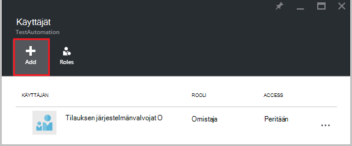  

2.  Valitse rooli luettelosta, käytettävissä olevat roolit. Olemme valitsee **lukija** , mutta voit valita minkä tahansa käytettävissä olevat valmiit roolit, joka tukee automaatio-tilin tai minkä tahansa mukautettu rooli, olet ehkä määrittänyt.  

    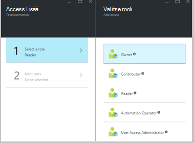  

3.  Valitse **Lisää käyttäjät** voivat avata **Lisää käyttäjiä** -sivu. Jos olet lisännyt käyttäjät, ryhmät tai Hallitse tilaustasi nämä käyttäjät on lueteltu ja niitä voi valita Lisää access-sovellukset. Jos kaikki käyttäjät, jotka on lueteltu ei ole tai jos kiinnostunut käyttäjän lisääminen ei ole luettelossa, valitse **Kutsu** Avaa **Kutsu Vieras** -sivu, jossa voit kutsua käyttäjä, jolla on esimerkiksi Outlook.com, OneDrive tai Xbox Live ID-tunnus kelvollinen Microsoft-tilin sähköpostin-osoite. Kun olet syöttänyt käyttäjän sähköpostiosoite, valitse **Valitse** käyttäjä ja valitse sitten **OK**. 

    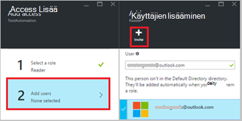  
 
    Raportissa pitäisi näkyä käyttäjä lisätty **lukijan** rooli **käyttäjät** -sivu.  

      

    Voit määrittää roolin käyttäjälle- **roolit** -sivu. 

1. Valitse **roolit** Avaa **roolit sivu**käyttäjät-sivu. Tämä sivu näet nimen rooli, käyttäjät ja ryhmät, roolin määrän.

    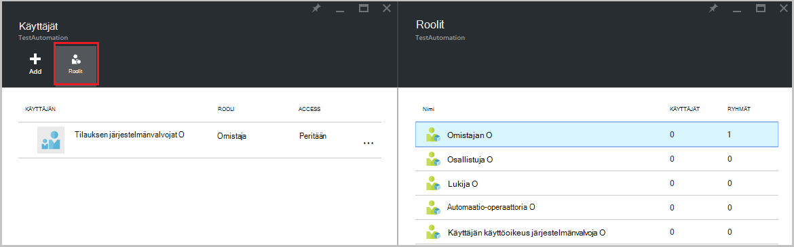  
   
    >[AZURE.NOTE] Roolipohjainen käyttöoikeuksien valvonta voi määrittää automaatio tilin taso ja ei mitään resurssin alla automaatio-tili.

    Voit määrittää useita rooli käyttäjän, ryhmän tai sovelluksen. Esimerkiksi jos lisäämme sekä **lukija** **Automaatio-operaattoria** -roolin käyttäjälle, valitse ne voi automaatio resurssien sekä suorittaa runbookin työt. Voit laajentaa olevaa avattavaa valikkoa roolit käyttäjä saa luettelon tarkasteleminen.  

    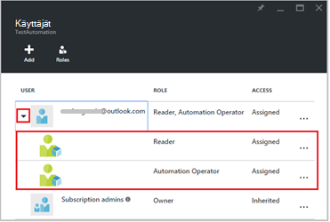  
 
### Käyttäjän poistaminen

Voit poistaa käyttäjän kuka hallitsee ei automaatio-tili tai joka ei enää toimi organisaation käyttöoikeus. Voit poistaa käyttäjän vaiheet ovat seuraavat: 

1.  Valitse **käyttäjät** -sivu, josta haluat poistaa roolimääritys.

2.  Napsauta **Poista** -painiketta tehtävän tiedot-sivu.

3.  Vahvista valitsemalla **Kyllä** poisto. 

    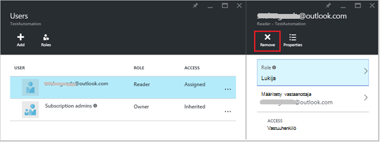  

## Rooli määritetty käyttäjä

Kun käyttäjä määrittää roolin kirjautuu sisään niiden automaatio-tili, he näkevät nyt omistajan tilin **Oletus hakemistoja**-luettelossa. Jotta voit tarkastella automaatio-tili, jolla ne on lisätty, ne on vaihdettava oletuskansio haltijan oletuskansio.  

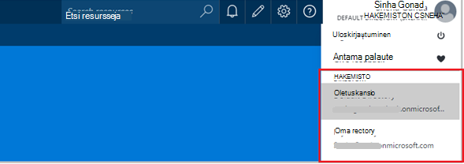  

### Automaatio operaattori roolin käyttäjäkokemus

Kun käyttäjä, jolla on määritetty automaatio-operaattoria roolin näkymien automaatio-tili, ne on varattu, voivat vain tarkastella runbooks, runbookin työt ja aikatauluja automaatio-tilille luodaan, mutta ei voi tarkastella niiden määrityksessä. Ne voit aloittaa, lopettaa, keskeyttää, jatkaa tai runbookin Työn ajoittaminen. Käyttäjä ei ole linkkejä muihin automaatio resursseihin, kuten käyttömahdollisuudet hybrid työntekijä ryhmille tai DSC solmujen.  

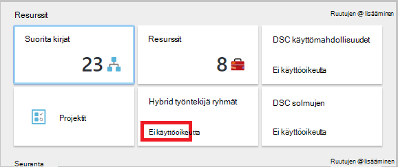  

Kun käyttäjä napsauttaa: n runbookin, lähteen tarkastelemaan tai muokkaamaan: n runbookin komentoja ei anneta, kun automaatio-operaattoria rooli ei salli niiden käyttämisen.  

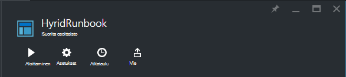  

Käyttäjä voi käyttää avulla voit tarkastella ja luoda aikatauluja, mutta se ei ole Accessin resurssi-tyypin.  

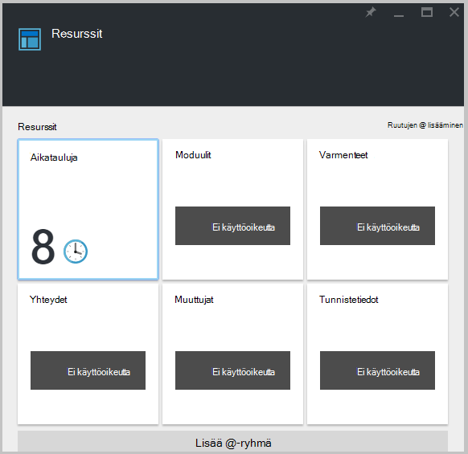  

Tämän käyttäjän myös ei ole oikeuden tarkastella runbookin liittyvät webhooks

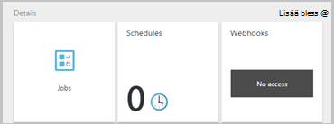  

## Automaatio-tilin käyttäminen PowerShellin Azure RBAC määrittäminen

Roolipohjainen käytön voidaan määrittää myös seuraavat [Azure PowerShell cmdlet-komentojen](../active-directory/role-based-access-control-manage-access-powershell.md)käyttäminen automaatio-tiliin.

• [Get-AzureRmRoleDefinition](https://msdn.microsoft.com/library/mt603792.aspx) on lueteltu kaikki käytettävissä olevat Azure Active Directory RBAC roolit. Voit **Name** -ominaisuutta sekä tämä komento Luetteloi kaikki toiminnot, jotka voivat tehdä tietyn roolin.  
    **Esimerkki:**  
    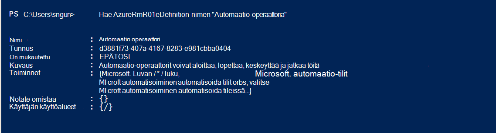  

• [Get-AzureRmRoleAssignment](https://msdn.microsoft.com/library/mt619413.aspx) luettelo Azure AD RBAC roolimäärityksiä määritetyllä alueella. Tämä komento palauttaa ilman parametreja, kaikki tilauksen suoritettuihin roolimäärityksiä. Käytä luettelon access-varauksista **ExpandPrincipalGroups** parametri määritetyn käyttäjän sekä ryhmiä käyttäjä kuuluu.  
    **Esimerkki:** Käytä seuraavaa komentoa luettelon kaikkien käyttäjien ja roolien automaatio-tilin.

    Get-AzureRMRoleAssignment -scope “/subscriptions/<SubscriptionID>/resourcegroups/<Resource Group Name>/Providers/Microsoft.Automation/automationAccounts/<Automation Account Name>” 

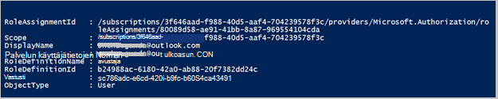

• [Uusi AzureRmRoleAssignment](https://msdn.microsoft.com/library/mt603580.aspx) access liittäminen käyttäjiä tai ryhmiä mahdollistavat tietyn laajuiset sovellukset.  
    **Esimerkki:** Seuraavalla komennolla automaatio tilin laajuuden käyttäjän "Automaatio-operaattoria"-roolin määrittäminen.

    New-AzureRmRoleAssignment -SignInName <sign-in Id of a user you wish to grant access> -RoleDefinitionName "Automation operator" -Scope “/subscriptions/<SubscriptionID>/resourcegroups/<Resource Group Name>/Providers/Microsoft.Automation/automationAccounts/<Automation Account Name>”  

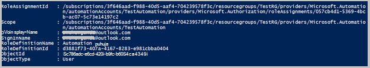

• Määritetyn käyttäjän, ryhmän tai sovelluksen access poistaa mahdollistavat tietyn laajuiset [Poista AzureRmRoleAssignment](https://msdn.microsoft.com/library/mt603781.aspx) avulla.  
    **Esimerkki:** Seuraavalla komennolla voit poistaa käyttäjän automaatio tilin laajuuden "Automaatio-operaattoria"-roolista.

    Remove-AzureRmRoleAssignment -SignInName <sign-in Id of a user you wish to remove> -RoleDefinitionName "Automation Operator" -Scope “/subscriptions/<SubscriptionID>/resourcegroups/<Resource Group Name>/Providers/Microsoft.Automation/automationAccounts/<Automation Account Name>”

Yllä olevassa esimerkissä korvaa **Kirjautuminen tunnus**, **tilauksen tunnus**, **resurssiryhmän nimi** ja **tilinimen Automation** tilitiedot. Valitse **Kyllä** , kun ohjelma pyytää vahvistamaan ennen jatkamista, voit poistaa käyttäjän roolimääritys.   

## Seuraavat vaiheet
-  Lisätietoja eri tavoin RBAC määrittämiseksi Azure automaatio on viitata [hallinta RBAC Azure PowerShellin avulla](../active-directory/role-based-access-control-manage-access-powershell.md).
- Lisätietoja eri tavoista käynnistää runbookin on artikkelissa [runbookin käynnistäminen](automation-starting-a-runbook.md)
- Lisätietoja eri runbookin tyypit viitata [Azure automaatio runbookin tyypit](automation-runbook-types.md)

