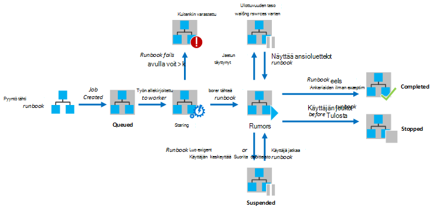
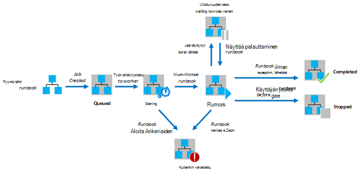

<properties
   pageTitle="Azure automaatio Runbookin suoritus"
   description="Tässä artikkelissa kuvataan runbookin Azure automaatio-käsittelyn tietoja."
   services="automation"
   documentationCenter=""
   authors="mgoedtel"
   manager="stevenka"
   editor="tysonn" />
<tags
   ms.service="automation"
   ms.devlang="na"
   ms.topic="article"
   ms.tgt_pltfrm="na"
   ms.workload="infrastructure-services"
   ms.date="03/21/2016"
   ms.author="bwren" />

# Azure automaatio Runbookin suoritus

Käynnistyessä runbookin Azure automaatio työn luodaan. Työ on runbookin yhdestä suorituksesta esiintymä. Azure automaatio-työntekijä määritetään kunkin suoritetaan. Kun työntekijöiden jakamat Azure useita tilejä, työt eri automaatio-tileiltä eristetään toisistaan. Hallita mitä työntekijä tulee palvelun työtäsi pyyntö ei ole.  Yksittäisen runbookin voi olla useita töitä käynnissä yhtä aikaa. Kun tarkastelet runbooks luettelo Azure-portaalissa, se sisältyviä viimeisen työn, jotka on aloitettu kunkin runbookin tilan. Voit tarkastella kunkin runbookin töiden luettelo jotta voit seurata kaikkien tilaa. Kuvaus eri projektin tila on kohdassa [Projektin tila](#job-statuses).

Seuraavassa kaaviossa on esitetty runbookin projektin elinkaaren [Graafinen runbooks](automation-runbook-types.md#graphical-runbooks) ja [PowerShell työnkulun runbooks](automation-runbook-types.md#powershell-workflow-runbooks).

Seuraavassa kaaviossa näkyy runbookin projektin elinkaaren [PowerShell runbooks](automation-runbook-types.md#powershell-runbooks).

Töiden hallita Azure resurssien käyttöä yhteyden muodostamisessa Azure tilauksen. Ne on resurssien käytön data Centerissä vain, jos ne ovat käytettävissä olevat julkiset pilveen.

## Työn tilat

Seuraavassa taulukossa on kuvattu eri tilat, jotka ovat mahdollisia projektille.

| Tila| Kuvaus|
|:---|:---|
|Valmis|Työ onnistui.|
|Epäonnistui| [Graafiset ja PowerShell työnkulun runbooks](automation-runbook-types.md): n runbookin epäonnistui Käännä.  [PowerShell-komentosarjaa runbooks](automation-runbook-types.md): n runbookin ei voitu käynnistää tai työn havaitsi poikkeuksen. |
|Epäonnistui, Odotetaan resursseja|Työ epäonnistui, koska se saavuttanut [osuus](#fairshare) rajan kolme kertaa ja aloittaa saman tarkistuspiste tai alusta alkaen: n runbookin aina, kun.|
|Jonossa|Työn odottaa resurssien automaatio-työntekijä tulee niin, että se voidaan aloittaa.|
|Aloittaminen|Työ on määritetty työntekijä ja järjestelmä on parhaillaan käynnistetään.|
|Jatkaminen|Järjestelmä on parhaillaan jatkaminen työ, kun se on keskeytetty.|
|Käynnissä|Työ on käynnissä.|
|Käynnissä, Odotetaan resursseja|Työ on poistettu, koska se [osuus](#fairshare) -enimmäismäärä on saavutettu. Se jatkuu pian sen viimeisen tarkistuspiste kohteesta.|
|Pysäytetty|Työn lopetettiin käyttäjän, ennen kuin se suoritettiin loppuun.|
|Pysäyttäminen|Järjestelmä on parhaillaan pysäyttäminen työn.|
|Hyllytetty|Työ on keskeytetty käyttäjän, järjestelmä tai: n runbookin-komennolla. Työn, joka on hyllytetty voi käynnistää uudelleen, ja sen viimeisen tarkistuspiste tai: n runbookin alkuun jos se ei ole tarkistuspisteet jatkaa. N runbookin vain keskeytetään järjestelmä kyseessä poikkeuksen. Oletusarvon mukaan ErrorActionPreference on määritetty **Jatka** merkitys, joka säilyttää, työn käytössä virheen. Jos tämä asetus muuttuja on määritetty **lopettavat** työn keskeyttää-virheen.  Koskee ainoastaan [graafiset ja PowerShell työnkulun runbooks](automation-runbook-types.md) .|
|Keskeyttäminen|Järjestelmä yrittää keskeyttää työn käyttäjän pyynnöstä. N runbookin tulee saavuttaa sen seuraava tarkistuspiste, ennen kuin sitä voidaan lykätä. Jos se on jo mennyt sen viimeisen tarkistuspiste, valitse se suorittaa loppuun ennen kuin sitä voidaan lykätä.  Koskee ainoastaan [graafiset ja PowerShell työnkulun runbooks](automation-runbook-types.md) .|

## Azure hallinta-portaalissa tilan tarkasteleminen

### Automaatio-koontinäyttö

Automaatio Raporttinäkymät-ikkunan näyttää kaikki runbooks tietyn automaatio-tilin yhteenveto. Se on myös tilin käyttö yleiskatsaus. Yhteenveto kaavio näyttää kaikki runbooks, joka kirjoittaa kukin tila päälle määrän päivinä tai tunteina yhteensä töiden määrä. Voit valita kaavion oikeassa yläkulmassa aikaväli. Aika-akseli kaavion muuttuu aikaväli, joka valitaan tyypin mukaan. Voit valita, näytetäänkö rivin tietyn tilan napsauttamalla näytön yläreunaan.

Seuraavien vaiheiden avulla voit näyttää automaatio Raporttinäkymät-ikkunan.

1. Azure hallinta-portaalissa Valitse **Automaattiset** ja valitse sitten automaatio-tilin nimi.
1. Valitse **koontinäyttö** -välilehti.

### Runbookin Raporttinäkymät-ikkunan

Runbookin raporttinäkymät-ikkuna näyttää yksittäisen runbookin yhteenvedon. Yhteenveto kaavio näyttää yhteensä työt, jotka kukin tila määrän päivinä tai tunteina kautta annetut runbookin määrä. Voit valita kaavion oikeassa yläkulmassa aikaväli. Aika-akseli kaavion muuttuu aikaväli, joka valitaan tyypin mukaan. Voit valita, näytetäänkö rivin tietyn tilan napsauttamalla näytön yläreunaan.

Seuraavien vaiheiden avulla voit näyttää Runbookin Raporttinäkymät-ikkunan.

1. Azure hallinta-portaalissa Valitse **Automaattiset** ja valitse sitten automaatio-tilin nimi.
1. Valitse nimi, runbookin.
1. Valitse **koontinäyttö** -välilehti.

### Projektin yhteenveto

Voit tarkastella luetteloa kaikista työt, jotka on luotu tietyn runbookin ja niiden viimeisin tila. Voit suodattaa tämän luettelon tilan mukaan ja päivämääräalueen, jotta työ viimeisin muutos. Napsauta sen yksityiskohtaiset tiedot ja tulos tarkasteleminen projektin nimeä. Työn yksityiskohtainen näkymä sisältää arvot, jotka on annettu kyseisen työn runbookin parametrit.

Seuraavien vaiheiden avulla voit tarkastella runbookin töiden.

1. Azure hallinta-portaalissa Valitse **Automaattiset** ja valitse sitten automaatio-tilin nimi.
1. Valitse nimi, runbookin.
1. Valitse **Projektit** -välilehti.
1. Valitse työn, voit tarkastella sen tiedot ja tulostus **Työ luotu** -sarake.

## Windows PowerShellin tilan hakeminen

[Hae AzureAutomationJob](http://msdn.microsoft.com/library/azure/dn690263.aspx) avulla voit hakea runbookin ja tietyn projektin tiedot luodaan työt. Jos aloitat runbookin Windows PowerShellin avulla [Käynnistä AzureAutomationRunbook](http://msdn.microsoft.com/library/azure/dn690259.aspx), se palauttavat tuloksen työn. Projektin tulosteen [Get-AzureAutomationJob](http://msdn.microsoft.com/library/azure/dn690263.aspx)tulosteen avulla.

Esimerkki seuraavista komennoista hakee otoksen runbookin viimeinen työ ja näyttää sen tila-arvoja sisältävät runbookin parametrit ja työn tuloste.

    $job = (Get-AzureAutomationJob –AutomationAccountName "MyAutomationAccount" –Name "Test-Runbook" | sort LastModifiedDate –desc)[0]
    $job.Status
    $job.JobParameters
    Get-AzureAutomationJobOutput –AutomationAccountName "MyAutomationAccount" -Id $job.Id –Stream Output

## Osuus

Resurssien jakaminen kesken kaikki runbooks pilveen, jotta Azure automaatio tilapäisesti apuohjelman projektille sen jälkeen, kun se on ollut käynnissä 3 tuntia.    [Graafiset](automation-runbook-types.md#graphical-runbooks) ja [PowerShell työnkulun](automation-runbook-types.md#powershell-workflow-runbooks) runbooks jatketaan niiden edellisen [tarkistuspisteen](http://technet.microsoft.com/library/dn469257.aspx#bk_Checkpoints)kohteesta. Tänä aikana työn siinä näkyvät tila on käytössä, Odotetaan resursseja. Jos n runbookin ei ole tarkistuspisteet tai työn ei ollut saavuttanut ensimmäisen tarkistuspiste ennen lataamista poistetaan, valitse se käynnistetään uudelleen alusta.  [PowerShellin](automation-runbook-types.md#powershell-runbooks) runbooks aina uudelleen alusta, koska ne eivät tue tarkistuspisteet.

>[AZURE.NOTE] Osuus rajoitus ei koske runbookin työt Hybrid Runbookin työntekijöiden suorittamista.

Jos n runbookin käynnistää uudelleen samaan tarkistuspiste tai: n runbookin alkuun kolme kertaa, se keskeytetään epäonnistui, Odotetaan resursseja tilassa. Näin voit suojata runbooks käynnissä toistaiseksi ilman on valmis, niitä ei ole voi tehdä sitä seuraavan tarkistuspiste ilman purettu uudelleen. Tällöin näyttöön tulee seuraava poikkeus virheen kanssa.

*Työn ei voi jatkaa käynnissä, koska se on toistuvasti poistaa saman tarkistuspiste. Varmista, että Runbookin ei suorittaa pitkiä ilman toteaa tilaan.*

Luodessasi runbookin varmistaa, että aikaa suorittaa tehtäviä välillä kaksi tarkistuspisteet enintään 3 tuntia. Voit joutua lisäämään tarkistuspisteet oman runbookin varmistaa, että se ei enimmäismäärä on saavutettu 3 tunnin tai jakaa pitkään käynnissä toimintoja. Oman runbookin voi esimerkiksi suorittaa uudelleenindeksointi SQL-tietokanta on suuri. Jos tämä yhdellä kertaa Suorita osuus rajoissa, sitten työn purettu ja käynnistetään uudelleen alusta. Voit tässä tapauksessa jakaa useita vaiheita, kuten uudelleenindeksointi yhden taulukon kerrallaan, uudelleenindeksointi toiminnon, ja sitten lisätä tarkistuspisteen kunkin toiminnon jälkeen niin, että työn voi jatkaa suorittamiseen edellisen toiminnon jälkeen.

## Seuraavat vaiheet

- [Tietojen runbookin Azure automaatio](automation-starting-a-runbook.md)
