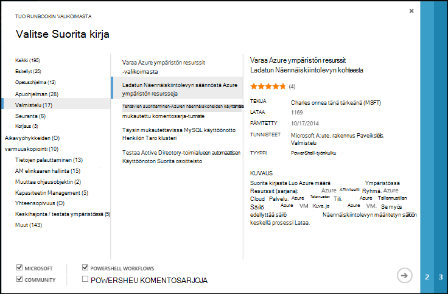
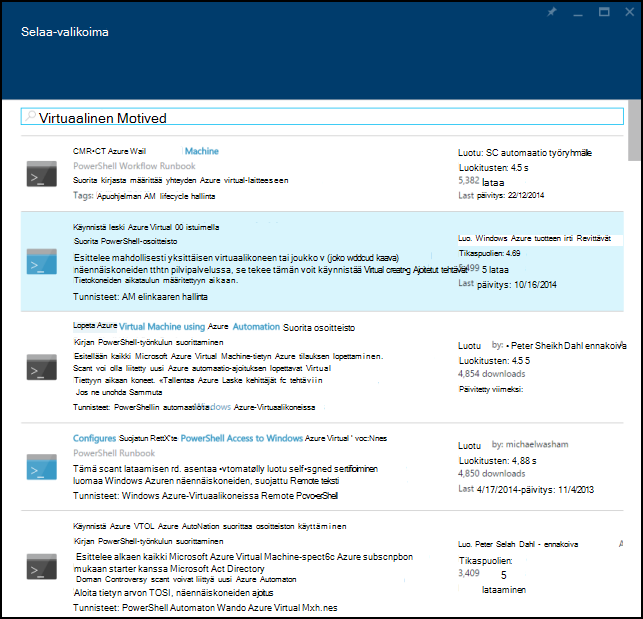
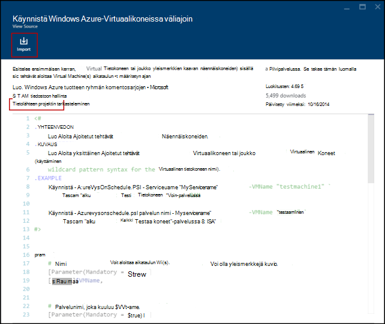
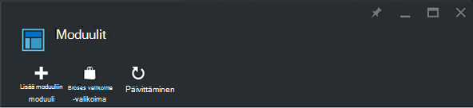
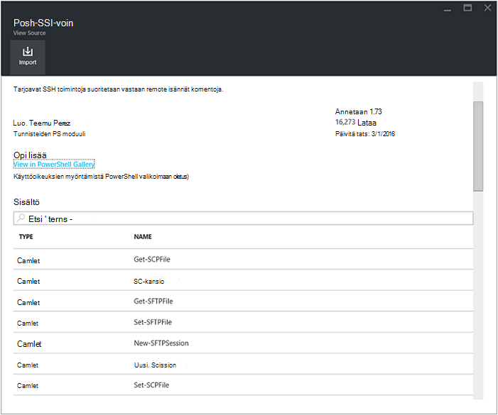
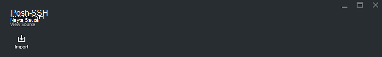
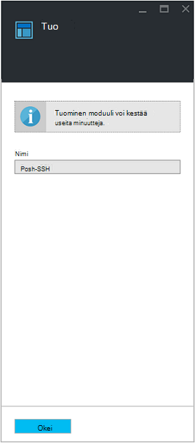

<properties
    pageTitle="Runbookin ja moduulin valikoimat Azure automatisointiin | Microsoft Azure"
    description="Runbooks ja moduulit Microsoftin ja yhteisön ovat käytettävissä, voit asentaa ja käyttää Azure automaatio-ympäristössä.  Tässä artikkelissa kuvataan, miten voit käyttää seuraavia resursseja ja edistää oman runbooks valikoimaan."
    services="automation"
    documentationCenter=""
    authors="mgoedtel"
    manager="jwhit"
    editor="tysonn" />
<tags
    ms.service="automation"
    ms.devlang="na"
    ms.topic="article"
    ms.tgt_pltfrm="na"
    ms.workload="infrastructure-services"
    ms.date="09/18/2016"
    ms.author="magoedte;bwren" />

# Azure automatisointiin Runbookin ja moduulin valikoimat

Ei tarvitse luoda omaa runbooks ja moduulit Azure automaatio-, voit käyttää erilaisia tilanteita, joissa on jo muodostettu Microsoft ja yhteisö.  Voit käyttää tilanteista sellaisenaan tai voit käyttää niitä lähtökohtana ja muokata niitä erityistarpeita varten.

Saat runbooks [Runbookin-valikoima](#runbooks-in-runbook-gallery) ja moduulit [PowerShell-valikoimassa](#modules-in-powerShell-gallery).  Voit myös osallistua yhteisöön jakamalla tilanteita, joissa voit kehittää.

## Runbooks Runbookin-valikoimassa

[Runbookin-valikoima](http://gallery.technet.microsoft.com/scriptcenter/site/search?f[0].Type=RootCategory&f[0].Value=WindowsAzure&f[1].Type=SubCategory&f[1].Value=WindowsAzure_automation&f[1].Text=Automation) sisältää useita runbooks Microsoftin ja yhteisön, voit tuoda Azure automaatio. Voit joko Lataa runbookin, jossa nykyisessä [TechNet-komentosarjat](http://gallery.technet.microsoft.com/)-valikoimasta tai voit tuoda runbooks suoraan Azure perinteinen portal tai Azure portal-valikoimasta.

Voit tuoda vain suoraan Runbookin valikoimasta Azure perinteinen kautta tai Azure portal avulla. Et voi suorittaa tämän funktion Windows PowerShellin avulla.

>[AZURE.NOTE] Mikä tahansa runbooks, että saat Runbookin valikoimasta ja erittäin varovainen ja asenna ne tuotantoympäristössä sisällön pitäisi kelpoisuuden. |

### Voit tuoda runbookin Runbookin valikoimasta Azure perinteinen-portaalissa

1. Azure-portaalissa valitsemalla **Uusi** **sovellus Services** **Automation**, **Runbookin**, **-Valikoima**.
2. Valitse luokka ja tarkastele liittyvät runbooks ja valitse runbookin tarkastella sen tietoja. Kun olet valinnut haluamasi runbookin, napsauta oikealle osoittavaa nuolta-painiketta.

    

3. Tarkista: n runbookin sisällön ja Huomaa kuvaus vaatimuksia. Valitse oikean nuolipainikkeen, kun olet valmis.
4. Kirjoita runbookin tiedot ja valitse sitten valintamerkki-painiketta. Runbookin nimi jo olla täytettynä.
5. N runbookin **Runbooks** -välilehdessä näkyvät automaatio-tilille.

### Voit tuoda runbookin Runbookin valikoimasta Azure-portaalissa

1. Avaa Azure-portaaliin, automaatio-tilillesi.
2. Valitse Avaa runbooks luettelo **Runbooks** -ruutu.
3. Napsauta **valikoiman Selaa** -painiketta.

    

4. Etsi valikoima kohde ja valitse se, jos haluat tarkastella sen tietoja.

    

4. Valitse **Näytä lähdeprojektissa** tarkastelemalla luettelokohdetta suoraan [TechNet Script Center](http://gallery.technet.microsoft.com/).
5. Voit tuoda kohteen, napsauttamalla sen tarkastella sen tietoja ja valitse sitten **Tuo** -painiketta.

    

6. Voit myös: n runbookin nimen muuttaminen ja valitse sitten **OK** , jos haluat tuoda: n runbookin.
5. N runbookin **Runbooks** -välilehdessä näkyvät automaatio-tilille.

### Runbookin lisääminen runbookin-valikoima

Microsoft suosittelee, että runbooks lisääminen, joista voi olla hyötyä muista asiakkaista Runbookin valikoimaan.  Voit lisätä [sen komentosarjan käyttöoikeudet lataamista](http://gallery.technet.microsoft.com/site/upload) ottaen huomioon seuraavat asiat runbookin.

- Sinun on määritettävä *Windows Azure* **luokan** ja **aliluokka** varten: n runbookin *automaatio* ohjatussa näyttäminen.  

- Lataus on oltava .ps1 tai .graphrunbook yhteen tiedostoon.  Jos n runbookin edellyttää moduulit, lapsen runbooks tai resurssit, sinun olisi luettelo esittämisen kuvaus ja kommentit-kohtaan: n runbookin.  Jos sinulla on useita runbooks edellyttävän tilanne, lataa kunkin erikseen ja luettelon kaikkien niiden kuvaukset liittyvät runbooks nimet. Varmista, että käytät samaa tunnistetta, niin, että ne näkyvät samaan luokkaan. Käyttäjän on Lue tietävän, että muut runbooks tarvitaan kuvaus skenaario, jota haluat käyttää.

- Lisätä tunnisteen "GraphicalPS", jos julkaiset **Graafinen runbookin** (ei graafinen työnkulun). 

- PowerShellin tai PowerShell työnkulun koodikatkelman lisääminen **Lisää koodiosassa** kuvakkeen kuvaus.

- Lataamisen yhteenveto näkyvät Runbookin valikoima tulokset, jotta pitäisi sisältää yksityiskohtaiset tiedot, jotka auttavat tunnistaa: n runbookin toimintoja käyttäjän.

- Määritä seuraavat tunnisteet yhden-kolmen lataus.  N runbookin näkyvät ohjatun luokat, jotka vastaavat sen tunnisteet.  Mahdolliset tunnisteet ei ole mainittu tässä ohitetaan ohjatussa. Jos et määritä vastaavia tunnisteita,: n runbookin kohdasta toisen luokan.

 - Varmuuskopiointi
 - Kapasiteetin hallinta
 - Muuttaa ohjausobjektin
 - Yhteensopivuus
 - Keskihajonta / testata ympäristöissä
 - Tietojen palauttaminen
 - Seuranta
 - Korjaaminen
 - Valmistelu
 - Korjaus
 - AM elinkaaren hallinta

- Automaatio päivittää valikoiman kerran tunnissa niin, että et näe toimintaan välittömästi.

## Moduulit PowerShell-valikoimassa

PowerShell-moduulit sisältää cmdlet-komennot, joita voit käyttää oman runbooks ja aiemmin, voit asentaa Azure automaatio moduulit ovat käytettävissä [PowerShell-valikoimassa](http://www.powershellgallery.com).  Voit käynnistää valikoiman Azure-portaalista ja asenna ne suoraan Azure automaatio tai voit ladata ja asentaa ne manuaalisesti.  Voit ladata ne, mutta ei voi asentaa moduulit suoraan Azure perinteinen portaalin asentaa ne aivan kuten muita moduuli.

### Voit tuoda moduuli Azure-portaalissa automaatio moduuli-valikoimasta

1. Avaa Azure-portaaliin, automaatio-tilillesi.
2. Valitse Avaa omaisuuden luettelon **kalusto** -ruutu.
3. Valitse Avaa luettelo moduuleista **Moduulit** -ruutu.
4. Valitse **valikoima Selaa** -painiketta ja Selaa valikoimassa sivu käynnistyy.

      
5. Kun on käynnistetty Selaa valikoima-sivu, voit hakea seuraavat kentät:

   - Moduulin nimi
   - Tunnisteet
   - Tekijä
   - Cmdlet-komennon/DSC resurssinimi

6. Etsi moduuli, jolla haluat muuttaa, ja valitse se voidaan tarkastella sen tietoja.  
Kun voit siirtyä tietyn moduulin, voit tarkastella lisätietoja moduuli, mukaan lukien linkin takaisin PowerShell-valikoimassa tietoja mahdollisesti vaaditut riippuvuudet, ja kaikki cmdlet-komennot ja/tai DSC resursseja, joka sisältää moduuli.

      

7. Voit asentaa moduulin suoraan Azure Automaatioapuohjelman valitsemalla **Tuo** -painike.

    

8. Kun napsautat tuo-painike, näet moduulin nimi, jota olet tuomassa. Jos kaikki riippuvuudet on asennettu, **OK** -painike ole aktiivinen. Puuttuu riippuvuudet, jos haluat tuoda ne ennen kuin voit tuoda moduuli.
9. Tuo valitsemalla **OK** -moduulissa ja käynnistää moduuli-sivu. Kun Azure automaatio tuo moduuli tiliisi, poimii metatietoa-moduulin ja Cmdlet-komentoja.

    

    Tämä saattaa kestää muutaman minuutin, koska tehtävätyypin tarvitsee purkaa.
10. Saat ilmoituksen, että moduulin otetaan käyttöön ja ilmoituksen, kun se on valmis.
11. Kun moduuli on tuotu, näkyviin tulee käytettävissä olevat toiminnot ja voit käyttää sen resursseja runbooks ja haluttu tilan määritys.

## Pyytää runbookin tai moduuli

Voit lähettää pyynnöt [Käyttäjän ääni](https://feedback.azure.com/forums/246290-azure-automation/).  Jos tarvitset Ohje runbookin kirjoittaminen tai sinulla on kysyttävää PowerShell, Lähetä Microsoftin [keskustelupalstalle](http://social.msdn.microsoft.com/Forums/windowsazure/en-US/home?forum=azureautomation&filter=alltypes&sort=lastpostdesc).

## Seuraavat vaiheet

- Aloita runbooks, katso [luominen tai tuominen Azure automaatio-runbookin](automation-creating-importing-runbook.md)
- PowerShellin ja PowerShell työnkulun erot runbooks kanssa on artikkelissa [Learning PowerShell-työnkulku](automation-powershell-workflow.md)
