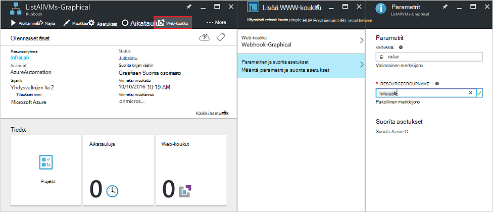

<properties
   pageTitle="Runbookin Lisää parametrit | Microsoft Azure"
   description="Runbookin syöteparametrit suurentaa runbooks joustavuutta avulla voit siirtää tietoja runbookin, kun se käynnistetään. Tässä artikkelissa kuvataan eri skenaarioissa syöteparametrit käytettyjen runbooks."
   services="automation"
   documentationCenter=""
   authors="MGoedtel"
   manager="jwhit"
   editor="tysonn" />
<tags
   ms.service="automation"
   ms.devlang="na"
   ms.topic="article"
   ms.tgt_pltfrm="na"
   ms.workload="infrastructure-services"
   ms.date="10/11/2016"
   ms.author="sngun"/>

# <a name="runbook-input-parameters"></a>Runbookin Syöteparametrit

Runbookin syöteparametrit suurentaa runbooks joustavuutta avulla voit siirtää sen tietoja, kun se käynnistetään. Parametrien Salli kohdistettu tietyissä skenaarioissa ja ympäristöissä runbookin toiminnoista. Tässä artikkelissa käyttöösi selkeät eri skenaarioissa syöteparametrit käytettyjen runbooks.

## <a name="configure-input-parameters"></a>Määritä syöteparametrit

Syöteparametrit voi määrittää PowerShell, PowerShell-työnkulku ja graafiset runbooks. Runbookin voi olla useita eri tietotyyppien parametrien tai parametreja ei ole lainkaan. Syöteparametrit voi olla pakollinen tai valinnainen ja voit määrittää valinnaisten parametrien oletusarvon. Voit määrittää arvot runbookin syöttöparametrien käynnistyskerralla kautta käytettävissä tavoilla. Näistä tavoista lisätä portaalin tai web-palvelu runbookin lähtien. Voit myös aloittaa yhden lapsen runbookin, jota kutsutaan toisen runbookin tekstiin.

## <a name="configure-input-parameters-in-powershell-and-powershell-workflow-runbooks"></a>Määritä syöteparametrit PowerShellistä ja PowerShell työnkulun runbooks

PowerShellin ja Azure automaatio- [PowerShell työnkulun runbooks](automation-first-runbook-textual.md) tukevat syöteparametrit, jotka on määritetty seuraavien määritteiden kautta.  

| **Ominaisuus** | **Kuvaus** |
|:--- |:---|
| Tyyppi | Pakollinen. Odotettu parametriarvo tietotyyppi. Mitä tahansa .NET on voimassa. |
| Nimi | Pakollinen. Parametrin nimi. Tämä on yksilöivä n runbookin ja voivat sisältää vain kirjaimia, numeroita tai alaviivoja. Se on alettava kirjaimella. |
| Pakollinen | Valinnainen. Määrittää, onko arvo on annettava parametrin. Jos määrität tämä **$true**, valitse arvo on annettava: n runbookin käynnistyksen yhteydessä. Voit määrittää tämän **$false**, jos arvo on valinnainen. |
| Oletusarvo | Valinnainen.  Määrittää arvon, jota käytetään parametrille, jos arvo ei siirretä n runbookin käynnistyksen yhteydessä. Oletusarvon voi määrittää mitään parametrille, ja tekee automaattisesti parametrin valinnainen pakollinen asetuksen arvosta huolimatta. |

Windows PowerShellin tukee syöteparametrit Lisää määritteiden kuin ne tässä luettelossa, kuten vahvistus-tunnukset, ja parametri asettaa. Kuitenkin Azure automaatio tukee tällä hetkellä vain yllä syöteparametrit.

Parametrin määritelmän etsiminen PowerShell työnkulun runbooks on seuraavat yleiset muotoa, missä useita parametreja on erotettu toisistaan pilkulla.

   ```
     Param
     (
         [Parameter (Mandatory= $true/$false)]
         [Type] Name1 = <Default value>,

         [Parameter (Mandatory= $true/$false)]
         [Type] Name2 = <Default value>
     )
   ```

>[AZURE.NOTE] Kun määrität parametreja, jos et määritä **pakollinen** määrite, valitse oletusarvoisesti parametrin katsotaan valinnainen. Myös, jos määrität parametrin oletusarvon PowerShell työnkulun runbooks, se käsitellään mukaan PowerShell valinnaisten parametrien riippumatta **pakollinen** määrite-arvo.

Esimerkkinä määrittäminen japanin syöttöparametrien PowerShell työnkulun runbookin, tulostaa yhden AM tai kaikki VMs resurssin ryhmän näennäiskoneiden tietoja. Tämä runbookin on kaksi parametria, kuten seuraavassa näyttökuvassa: nimi ja virtuaalikoneen resurssiryhmän nimi.


Tämä parametri määritelmää, parametrit **$VMName** ja **$resourceGroupName** ovat merkkijonomuotoisen yksinkertainen parametrit. Kuitenkin PowerShellistä ja PowerShell työnkulun runbooks tukevat kaikki yksinkertaisia ja monimutkaisia tietotyypeistä, kuten **objektin** tai **PSCredential** syöttöparametrien.

Jos yhteyttä runbookin on objektin syöteparametria, käytä PowerShell-hajautustaulukko kanssa (nimi-arvo) paria Välitä arvoa. Jos sinulla on seuraava parametri runbookin esimerkiksi:

     [Parameter (Mandatory = $true)]
     [object] $FullName

Sitten voit välittää parametrin seuraava arvo:

    @{"FirstName"="Joe";"MiddleName"="Bob";"LastName"="Smith"}


## <a name="configure-input-parameters-in-graphical-runbooks"></a>Määritä syöteparametrit graafinen runbooks

[Määritä graafinen runbookin](automation-first-runbook-graphical.md) syöteparametrit-luominen graafinen runbookin, tulostaa yhden AM tai kaikki VMs resurssin ryhmän näennäiskoneiden tietoja. Määrittämisestä runbookin koostuu kaksi tärkeimmät aktiviteetit, seuraavalla tavalla.

[**Todennetaan Runbooks Azure Suorita nimellä tilillä**](automation-sec-configure-azure-runas-account.md) Azure todentamismenetelmä.

[**Hae AzureRmVm**](https://msdn.microsoft.com/library/mt603718.aspx) saat näennäiskoneiden ominaisuudet.

[**Kirjoitus-tulostus**](https://technet.microsoft.com/library/hh849921.aspx) -toiminnon avulla voit siirtää näennäiskoneiden nimet. Tehtävän **Get-AzureRmVm** hyväksyy kaksi parametria, **virtuaalikoneen nimi** ja **resurssiryhmän nimi**. Koska nämä parametrit saattaa edellyttää eri arvoja aina, kun käynnistät: n runbookin, voit lisätä oman runbookin syöteparametrit. Näin voit lisätä syöteparametrit:

1. Valitse graafinen runbookin **Runbooks** -sivu ja valitse sitten [**Muokkaa**](automation-graphical-authoring-intro.md) sitä.

2. Valitse runbookin-editorin **ja** Avaa **lisätiedot ja tulostus** -sivu.

    

3. **Ja** -sivu näyttää, jotka on määritetty: n runbookin syöttöparametrien luettelon. Tämä sivu, voit lisätä uuden syöteparametria tai muokkaa aiemmin syöteparametria määrityksiä. Jos haluat lisätä uuden parametrin: n runbookin, valitse **Lisää syöte** Avaa **Runbookin syöteparametria** -sivu. Voit määrittää, seuraavat parametrit:

  	| **Ominaisuus** | **Kuvaus** |
  	|:--- |:---|
  	| Nimi | Pakollinen.  Parametrin nimi. Tämä on yksilöivä n runbookin ja voivat sisältää vain kirjaimia, numeroita tai alaviivoja. Se on alettava kirjaimella. |
  	| Kuvaus | Valinnainen. Kuvaus syöteparametria sisällöstä. |
  	| Tyyppi | Valinnainen. Tietotyyppi, jonka odotetaan parametriarvo. Tuetut parametrin ovat **merkkijono**, **Int32** **Int64**, **desimaaleja**, **totuusarvo**, **DateTime**tai **objektin**. Jos tietotyyppi ei ole valittu, oletusarvoisesti **merkkijono**. |
  	| Pakollinen | Valinnainen. Määrittää, onko arvo on annettava parametrin. Jos valitset **Kyllä**, valitse arvo on annettava: n runbookin käynnistyksen yhteydessä. Jos valitset **ei**, valitse arvo ei ole pakollinen kun: n runbookin on käynnissä ja oletusarvo on ehkä määritetty. |
  	| Oletusarvo | Valinnainen. Määrittää arvon, jota käytetään parametrille, jos arvo ei siirretä n runbookin käynnistyksen yhteydessä. Parametri, joka ei ole välttämätöntä voidaan määrittää oletusarvon. Jos haluat määrittää oletusarvon, valitse **Mukautettu**. Tätä arvoa käytetään, ellei toinen arvo on annettu: n runbookin käynnistyksen yhteydessä. Valitse **ei mitään** , jos et halua antaa minkä tahansa oletusarvo. |  

    

4. Luo kaksi parametria seuraavat ominaisuudet, joita käytetään **Get-AzureRmVm** toiminnan mukaan:

    - **Parametri 1:**
      - Nimi - VMName
      - Tyyppi - merkkijono
      - Pakollinen - ei

    - **Parametri 2:**
      - Nimi - resourceGroupName
      - Tyyppi - merkkijono
      - Pakollinen - ei
      - Oletusarvo - mukautettu
      - Mukautetun oletusarvo - \<, joka sisältää näennäiskoneiden resurssiryhmän nimi >

5. Kun olet lisännyt parametrit, valitse **OK**.  Voit nyt tarkastella niitä **syötteen ja tulosteen sivu**. Valitse **OK** uudelleen ja valitse sitten **Tallenna** ja **Julkaise** oman runbookin.

## <a name="assign-values-to-input-parameters-in-runbooks"></a>Määritä kirjaimilla runbooks parametrien arvot

Voit siirtää kirjaimilla runbooks seuraavissa tilanteissa parametrien arvot.

### <a name="start-a-runbook-and-assign-parameters"></a>Käynnistä runbookin ja Määritä parametrit

Runbookin voidaan aloittaa useilla eri tavoilla: palvelun Azure portaalissa webhook, suorittamalla PowerShell cmdlet-komennot, REST-ohjelmointirajapinnalla tai SDK. Alla käsiteltävät aiheet eri tavat alussa runbookin ja määrittämällä parametreja.

#### <a name="start-a-published-runbook-by-using-the-azure-portal-and-assign-parameters"></a>Azure-portaalissa julkaistun runbookin ratkaisuun ja parametrien määrittäminen

Kun [Käynnistä: n runbookin](automation-starting-a-runbook.md#starting-a-runbook-with-the-azure-portal), **Käynnistä Runbookin** -sivu avautuu ja voit määrittää juuri luomasi parametrien arvot.


Input-ruudun alla otsikko näet määritteitä, jotka on määritetty parametrin. Määritteet ovat pakolliset tai valinnaiset, tyyppi ja oletusarvo. Ohjeen selitteeseen parametrin nimen vieressä näet kaikki siihen täytyy tehdä päätöksiä parametrin syöttöarvojen tärkeimmät tiedot. Nämä tiedot sisältävät onko parametrin pakolliset tai valinnaiset. Se myös tyyppi ja oletusarvo (jos saatavilla) ja muut hyödyllisiä muistiinpanot.


>[AZURE.NOTE] Kirjoita kyselyparametri tukevat **tyhjän** merkkijonoarvot.  **[EmptyString]** kirjoittaminen syöteparametria-ruutuun hyväksytty tyhjän merkkijonon parametrin. Lisäksi tyyppi kyselyparametri eivät tue välitettävä **Null** -arvoja. Jos mikä tahansa arvo ei välitetään kyselymerkkijonon parametrin, valitse PowerShell tulkitsee Null.

#### <a name="start-a-published-runbook-by-using-powershell-cmdlets-and-assign-parameters"></a>Käynnistä julkaistun runbookin käyttämällä PowerShell cmdlet-komennot ja Määritä parametrit

  - **Azure resurssien hallinnan cmdlet-komennot:** Voit aloittaa automaatio-runbookin, joka on luotu käyttämällä [Käynnistä AzureRmAutomationRunbook](https://msdn.microsoft.com/library/mt603661.aspx)resurssiryhmä.

    **Esimerkki:**

   ```
    $params = @{“VMName”=”WSVMClassic”;”resourceGroupeName”=”WSVMClassicSG”}
 
    Start-AzureRmAutomationRunbook -AutomationAccountName “TestAutomation” -Name “Get-AzureVMGraphical” –ResourceGroupName $resourceGroupName -Parameters $params
   ```

  - **Azure hallinnan cmdlet-komennot:** Voit aloittaa automaatio-runbookin, joka on luotu käyttämällä [Käynnistä AzureAutomationRunbook](https://msdn.microsoft.com/library/dn690259.aspx)resurssin oletusryhmän.

    **Esimerkki:**

   ```
    $params = @{“VMName”=”WSVMClassic”; ”ServiceName”=”WSVMClassicSG”}

    Start-AzureAutomationRunbook -AutomationAccountName “TestAutomation” -Name “Get-AzureVMGraphical” -Parameters $params
   ```

>[AZURE.NOTE] Kun käynnistät käyttämällä PowerShell cmdlet-komennot, oletusarvo-parametri runbookin **MicrosoftApplicationManagementStartedBy** luodaan **PowerShell**-arvolla. Voit tarkastella parametriä **projektin tiedot** -sivu.  

#### <a name="start-a-runbook-by-using-an-sdk-and-assign-parameters"></a>Käynnistä runbookin SDK: N avulla ja määrittää parametrit

  - **Azure Resurssienhallinta menetelmää:** Voit aloittaa runbookin käyttämällä ohjelmointikieli SDK-paketissa. Alla on C# koodikatkelman aloittamisen automaatio-tilisi runbookin. Näet kaikki koodi on Microsoftin [GitHub säilöön](https://github.com/Azure/azure-sdk-for-net/blob/master/src/ResourceManagement/Automation/Automation.Tests/TestSupport/AutomationTestBase.cs).  

   ```
     public Job StartRunbook(string runbookName, IDictionary<string, string> parameters = null)
        {
          var response = AutomationClient.Jobs.Create(resourceGroupName, automationAccount, new JobCreateParameters
           {
              Properties = new JobCreateProperties
               {
                  Runbook = new RunbookAssociationProperty
                   {
                     Name = runbookName
                   },
                     Parameters = parameters
               }
           });
        return response.Job;
        }
   ```

  - **Azure hallinnan menetelmää:** Voit aloittaa runbookin käyttämällä ohjelmointikieli SDK-paketissa. Alla on C# koodikatkelman aloittamisen automaatio-tilisi runbookin. Näet kaikki koodi on Microsoftin [GitHub säilöön](https://github.com/Azure/azure-sdk-for-net/blob/master/src/ServiceManagement/Automation/Automation.Tests/TestSupport/AutomationTestBase.cs).

   ```      
    public Job StartRunbook(string runbookName, IDictionary<string, string> parameters = null)
      {
        var response = AutomationClient.Jobs.Create(automationAccount, new JobCreateParameters
      {
        Properties = new JobCreateProperties
           {
             Runbook = new RunbookAssociationProperty
           {
             Name = runbookName
                },
                  Parameters = parameters
                }
         });
        return response.Job;
      }
   ```

  Aloita tämä menetelmä runbookin parametrit, **VMName** ja **resourceGroupName**ja niiden arvojen sanaston luominen. Käynnistä: n runbookin. Alla on C#-koodikatkelman, saat kutsumista, joka on määritetty yläpuolella.

   ```
    IDictionary<string, string> RunbookParameters = new Dictionary<string, string>();

    // Add parameters to the dictionary.
    RunbookParameters.Add("VMName", "WSVMClassic");
    RunbookParameters.Add("resourceGroupName", "WSSC1");

    //Call the StartRunbook method with parameters
    StartRunbook(“Get-AzureVMGraphical”, RunbookParameters);
   ```

#### <a name="start-a-runbook-by-using-the-rest-api-and-assign-parameters"></a>Käynnistä runbookin REST-Ohjelmointirajapinnalla avulla ja Määritä parametrit

Runbookin työn voi luoda ja Azure automaatio REST API aloittaminen käyttämällä seuraavia pyynnön URI **valitseminen** -menetelmää.

    https://management.core.windows.net/<subscription-id>/cloudServices/<cloud-service-name>/resources/automation/~/automationAccounts/<automation-account-name>/jobs/<job-id>?api-version=2014-12-08`

Korvaa pyynnön URI seuraavat parametrit:

  - **Tilaustunnus:** Azure tilauksen käyttämällä.  
  - **cloud nimi:** Nimi, jossa pyynnön lähetetään pilvipalvelussa.  
  - **automaatio-tili-nimi:** Joka on määritetty pilvipalvelussa sisällä automaatio-tilisi nimi.  
  - **tunnus:** Työn GUID-tunnus. GUID powershellissä voidaan luoda käyttämällä **[GUID]::NewGuid(). ToString()** komento.

Välittää parametrit runbookin työ, jotta käyttämällä jotakin pyynnön. Vie JSON-muodossa annettu kaksi seuraavat ominaisuudet:

  - **Runbookin nimi:** Pakollinen. Aloita projektin runbookin nimi.  
  - **Runbookin parametrit:** Valinnainen. Sanasto (nimi-arvo)-parametrin luettelosta Muotoile missä nimen tulisi olla merkkijonon tyypin ja arvo voi olla mikä tahansa kelvollinen JSON-arvo.

Jos haluat aloittaa, joka on luotu aiemmin **VMName** ja **resourceGroupName** parametreiksi **Get-AzureVMTextual** runbookin, käytetään pyynnön tekstiin JSON-muoto.

   ```
    {
      "properties":{
        "runbook":{
        "name":"Get-AzureVMTextual"},
      "parameters":{
         "VMName":"WSVMClassic",
         "resourceGroupName":”WSCS1”}
        }
    }
   ```

HTTP-tilakoodin 201 palautetaan, jos työ on luotu. Lisätietoja vastauksen ylä- ja vastaus tekstiin viitata käyttämisestä on artikkelissa [runbookin työn luominen käyttämällä REST-Ohjelmointirajapinnalla.](https://msdn.microsoft.com/library/azure/mt163849.aspx)

### <a name="test-a-runbook-and-assign-parameters"></a>Testaa runbookin ja määrittää parametrit

Kun testi-asennustoiminnolla [Testaa yhteyttä runbookin luonnos-versiota](automation-testing-runbook.md) **testata** -sivu avautuu ja voit määrittää juuri luomasi parametrien arvot.


### <a name="link-a-schedule-to-a-runbook-and-assign-parameters"></a>Linkin runbookin aikataulun ja parametrien määrittäminen

Voit [linkittää aikataulun](automation-schedules.md) oman runbookin, siten, että: n runbookin alkaa tiettynä ajankohtana. Voit liittää syöteparametrit, kun luot aikataulun ja: n runbookin Käytä seuraavia arvoja, kun se käynnistetään aikataulun mukaan. Aikataulun voi tallentaa, ennen kuin kaikki pakolliset parametriarvot ovat käytettävissä.


### <a name="create-a-webhook-for-a-runbook-and-assign-parameters"></a>Luo webhook varten runbookin ja Määritä parametrit

Voit luoda oman runbookin [webhook](automation-webhooks.md) ja määrittää runbookin syöteparametrit. Et voi tallentaa webhook, kunnes kaikki pakolliset parametriarvot ovat käytettävissä.



Kun suoritat runbookin webhook **[Webhookdata](automation-webhooks.md#details-of-a-webhook)** on lähetetty, sekä syöteparametrit, jotka on määritetty ennalta määritettyjä syöteparametria avulla. Voit valita Laajenna lisätietoja **WebhookData** -parametrin.


## <a name="next-steps"></a>Seuraavat vaiheet

- Katso lisätietoja runbookin ja [Azure automaatio: runbookin syöte, tulostus ja sisäkkäisiä runbooks](https://azure.microsoft.com/blog/azure-automation-runbook-input-output-and-nested-runbooks/).
- Lisätietoja eri tavoista käynnistää runbookin on artikkelissa [alkaen runbookin](automation-starting-a-runbook.md).
- Jos haluat muokata tekstiä runbookin, viitata [muokkaaminen tekstiä runbooks](automation-edit-textual-runbook.md).
- Voit muokata graafinen runbookin viittaavat [graafiset yhteiskäyttö Azure automaatio](automation-graphical-authoring-intro.md).
