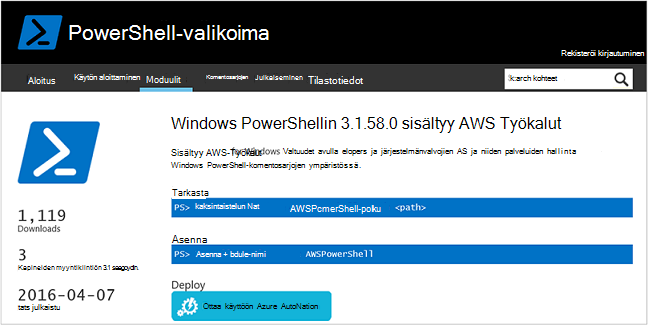
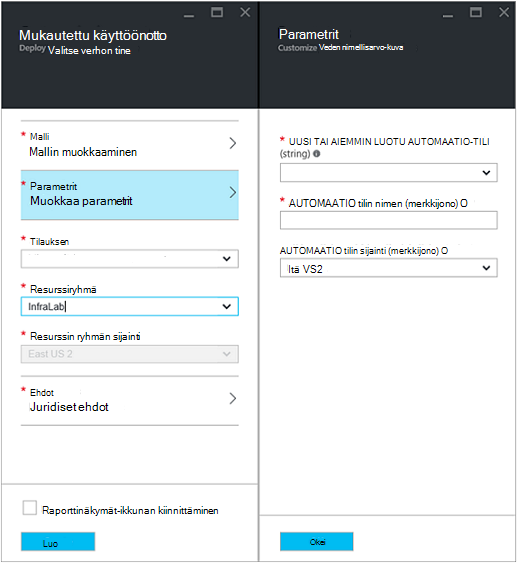
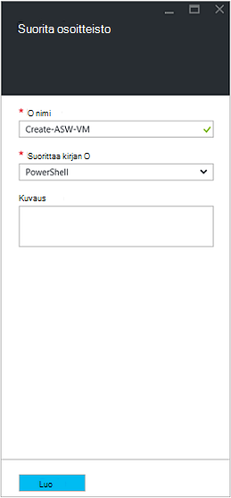
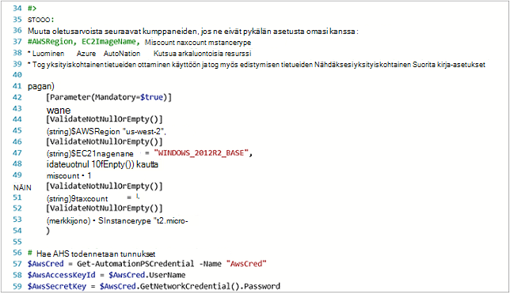
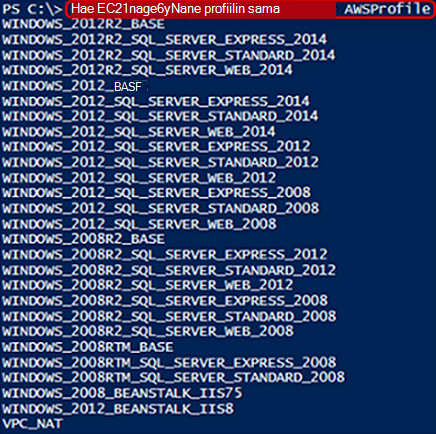
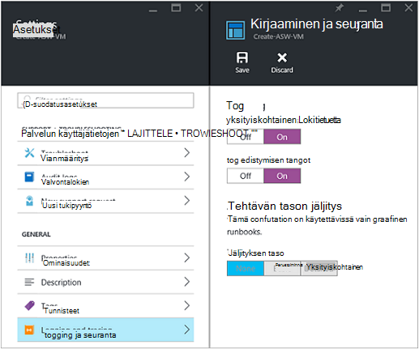
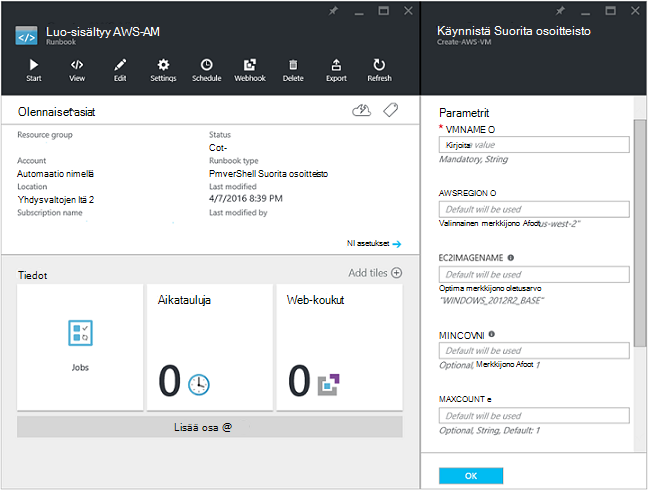
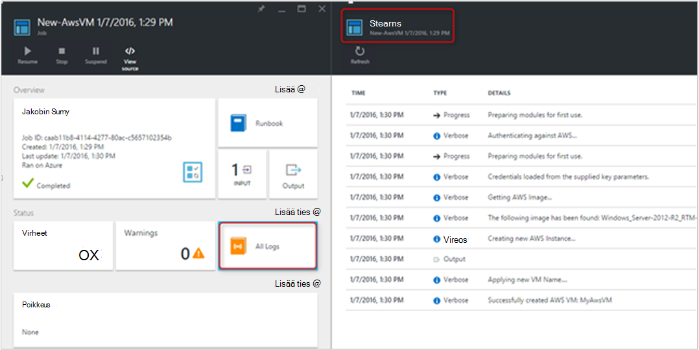
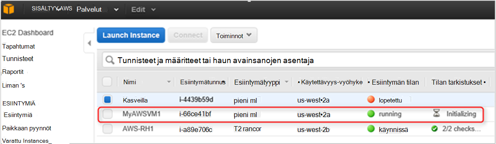

<properties
   pageTitle="Automaattinen käyttöönotto AM Amazon Web Services-palveluissa | Microsoft Azure"
   description="Tässä artikkelissa kerrotaan, miten Amazon Web Service-AM luonnin automatisoida Azure automaatio avulla"
   services="automation"
   documentationCenter=""
   authors="mgoedtel"
   manager="jwhit"
   editor="" />
<tags
   ms.service="automation"
   ms.devlang="na"
   ms.topic="article"
   ms.tgt_pltfrm="na"
   ms.workload="na"
   ms.date="08/17/2016"
   ms.author="tiandert; bwren" />

# <a name="azure-automation-scenario---provision-an-aws-virtual-machine"></a>Automaatio-skenaario Azure - säännöstä sisältyy AWS-virtuaalikoneen 

Tässä artikkelissa on näytetään, miten avulla voidaan hyödyntää Azure automaatio valmistella virtual kone tilaukseesi sisältyy Amazon Web Service (AWS) ja antaa kyseisen AM tietyn nimi – joka nimellä "tunnisteita AM" viittaa sisältyy AWS.

## <a name="prerequisites"></a>Edellytykset

Tässä artikkelissa tarkoitetaan haluat on Azure automaatio tili ja sisältyy AWS tilauksen. Lisätietoja Azure automaatio-tili ja määrittämisestä sisältyy AWS tilauksen tunnistetiedot ja tarkista [Käyttöoikeuksien määrittäminen Amazon Web Services](../automation/automation-sec-configure-aws-account.md).  Tämän tilin kannattaa luoda tai päivittää sisältyy AWS tilauksen tunnistetiedot ennen jatkamista, koska olemme viittaa seuraavien vaiheiden kuvissa tähän tiliin.


## <a name="deploy-amazon-web-services-powershell-module"></a>Amazon Web Services PowerShell-moduulin käyttöönotto

Tutustu AM valmistelu runbookin hyödyntää käyttää sisältyy AWS PowerShell-moduulin. Seuraavien toimien moduulin lisääminen automaatio-tilin, joka on määritetty sisältyy AWS tilauksen tunnistetiedot.  

1. Avaa verkkoselain ja siirry [PowerShell-valikoima](http://www.powershellgallery.com/packages/AWSPowerShell/) ja valitse **Ota käyttöön automaattiset Azure-painike**.<br> 

2. Avaat Azure-kirjautumissivulle ja sen jälkeen todennustapa, reititetään Azure-portaaliin ja näytetään seuraava sivu.<br> 

3. Valitse resurssiryhmän **Resurssiryhmä** avattavasta luettelosta ja valitse parametrit-sivu, anna seuraavat tiedot:
   * Valitse **aiemmin luotu** **Uusi tai aiemmin automaatio-tiliä (merkkijono)** avattavasta luettelosta.  
   * Kirjoita **Tilinimen Automation (merkkijono)** -ruutuun tarkka automaatio-tili, joka sisältää tunnistetiedot sisältyy AWS tilauksen nimi.  Esimerkiksi jos olet luonut on oma tili nimeltä **AWSAutomation**, valitse eli kirjoittamalla hakuruutuun.
   * Valitse haluamasi alue **Automaatio tilin sijainti** avattavasta luettelosta.

4. Kun olet tehnyt tarvittavat tiedot, valitse **Luo**.

    >[AZURE.NOTE]Kun vienti PowerShell-moduulin Azure automaatio, se on myös puretaan Cmdlet-komentoja ja nämä toiminnot eivät näy, ennen kuin moduulin kokonaan on päättynyt, tuominen ja puretaan Cmdlet-komentoja. Voi kestää muutaman minuutin kuluttua.  
<br>
5. Avaa Azure-portaaliin, automaatio-tilisi Viitattu vaiheessa 3.
6. **Kalusto** -ruutu ja **kalusto** -sivu, valitse **Moduulit** -ruutu.
7. Valitse **Moduulit** -sivu tulee näkyviin luettelon **AWSPowerShell** -moduulissa.

## <a name="create-aws-deploy-vm-runbook"></a>Luo sisältyy AWS käyttöönotto AM runbookin

Kun sisältyy AWS PowerShell-moduulin on otettu käyttöön, Microsoft nyt tuottaa runbookin automatisoida valmistelu virtual kone-sisältyy AWS käyttämällä PowerShell-komentosarjaa. Seuraavia ohjeita näytetään, miten voit hyödyntää alkuperäisen PowerShell-komentosarjaa Azure automaatio.  

>[AZURE.NOTE] Edelleen asetukset ja tiedot, jotka koskevat tämän komentosarjan käy [PowerShell-valikoimassa](https://www.powershellgallery.com/packages/New-AwsVM/DisplayScript).


1. Lataa PowerShell-komentosarjaa uusi AwsVM PowerShell-valikoimasta PowerShell-istunnon avaamista ja kirjoittamalla seuraavasti:<br>
   ```
   Save-Script -Name New-AwsVM -Path \<path\>
   ```
<br>
2. Azure-portaalista Avaa automaatio-tilisi ja valitse **Runbooks** -ruutu.  
3. Valitse **Lisää runbookin** **Runbooks** -sivu.
4. Valitse **Lisää runbookin** , sivu **Nopea luominen** (Luo uusi runbookin).
5. **Runbookin** ominaisuudet-sivu Kirjoita oman runbookin nimi-ruutuun nimi ja **Runbookin tyyppi** avattavasta luettelosta valitsemalla **PowerShell**, ja valitse sitten **Luo**.<br> 
6. Kun Muokkaa PowerShell Runbookin-sivu tulee näkyviin, kopioi ja liitä PowerShell-komentosarjaa: n runbookin luominen alusta.<br> <br>

    >[AZURE.NOTE] Huomaa seuraavat, kun käsittelet Esimerkki PowerShell-komentosarjaa:
    >
    > - N runbookin sisältää useita parametrien oletusarvot. Arvioi kaikki oletusarvot ja Päivitä tarvittaessa.
    > - Jos olet tallentanut sisältyy AWS tunnistetietoja kuin nimetty eri tavalla kuin **AWScred**credential-resurssi, sinun on päivitettävä komentosarja rivillä 57 vastaamaan vastaavasti.  
    > - Kun käsittelet sisältyy AWS CLI komennot PowerShellin, erityisesti kanssa tässä esimerkissä runbookin sisältyy AWS-alue on määritettävä. Muussa tapauksessa epäonnistuu Cmdlet-komentoja.  Tarkastele sisältyy AWS aiheen [Määritä sisältyy AWS alueen](http://docs.aws.amazon.com/powershell/latest/userguide/pstools-installing-specifying-region.html) PowerShell asiakirjan lisätietoja sisältyy AWS työkaluja.  
<br>
7. Noutaa kuva nimiluettelon sisältyy AWS tilauksesta, Käynnistä PowerShell ise: ja tuoda sisältyy AWS PowerShell-moduulin.  Todennetaan sisältyy AWS korvaamalla **Get-AutomationPSCredential** ise:-ympäristössä, jossa **AWScred = Get-tunnistetietojen**.  Tämä kehottaa sinua antamaan käyttäjätietosi ja voit antaa käyttäjänimi ja **Salaisuus pikanäppäin** omaan **Access Key-tunnuksen** salasana.  Katso alla oleva esimerkki:

        #Sample to get the AWS VM available images
        #Please provide the path where you have downloaded the AWS PowerShell module
        Import-Module AWSPowerShell
        $AwsRegion = "us-west-2"
        $AwsCred = Get-Credential
        $AwsAccessKeyId = $AwsCred.UserName
        $AwsSecretKey = $AwsCred.GetNetworkCredential().Password

        # Set up the environment to access AWS
        Set-AwsCredentials -AccessKey $AwsAccessKeyId -SecretKey $AwsSecretKey -StoreAs AWSProfile
        Set-DefaultAWSRegion -Region $AwsRegion

        Get-EC2ImageByName -ProfileName AWSProfile
   Seuraava tulos palautetaan:<br>
     
8. Kopioi ja Liitä kuva nimet jokin Automaatiomuuttuja kuin viitatun runbookin kuin **$InstanceType**. Koska tässä esimerkissä emme käyttämällä vapaa sisältyy AWS tasoisen tilauksen, **t2.micro** käytetään runbookin esimerkissä.
9. Tallenna: n runbookin ja valitse sitten **Julkaise** , jos haluat julkaista: n runbookin ja valitse sitten **Kyllä** pyydettäessä.


### <a name="testing-the-aws-vm-runbook"></a>Sisältyy AWS AM runbookin testausta
Ennen jatkamista kanssa: n runbookin testausta, annettava Tarkista muutama seikka. Tarkemmin:

   -  Todennustapa vastaan sisältyy AWS resurssi on luotu kutsuttu **AWScred** tai komentosarja on päivitetty viittaamaan tunnistetiedon resurssi nimi.  
   -  Sisältyy AWS PowerShell-moduulin on tuotu Azure automaatio
   -  Uusi runbookin on luotu ja parametriarvot on vahvistettu ja päivittää tarvittaessa
   -  **Yksityiskohtainen tietueet** ja halutessasi **edistymisen tietueet** runbookin **kirjaaminen ja seurannan** asetukset-kohdassa on määritetty **Kyllä**.<br> 

1. Haluamme: n runbookin, joten napsauttamalla **Käynnistä-painiketta** ja valitse **OK** , kun Käynnistä Runbookin-sivu avautuu.
2. Antaa **VMname**Runbookin aloittaminen-sivu.  Hyväksy oletusarvot, jotka valmiiksi komentosarjan aiemmin parametrit.  Valitse **OK** käynnistääksesi runbookin työn.<br> 
3. Työruutu avataan runbookin, jonka juuri luonut projektille. Sulje tässä ruudussa.
4. Emme voi tarkastella työn edistymistä ja näkymän tulosteen **virtaa** valitsemalla **Kaikki lokit** -ruutu runbookin työ-sivu.<br> 
5. Varmista, AM valmistellaan, kirjaudu sisältyy AWS Management Console, jos et ole tällä hetkellä ole kirjautunut.<br> 

## <a name="next-steps"></a>Seuraavat vaiheet
-   Graafinen runbooks aloittaminen-kohdassa [Oma ensimmäisen graafinen runbookin](automation-first-runbook-graphical.md)
-   Aloita PowerShell työnkulun runbooks, katso [ensimmäinen PowerShell työnkulun-runbookin](automation-first-runbook-textual.md)
-   Lisätietoja runbookin sekä niiden eduista ja rajoituksista on artikkelissa [Azure automaatio runbookin tiedostotyypit](automation-runbook-types.md)
-   Lisätietoja PowerShell-komentosarjaa ominaisuus tuesta on kohdassa [alkuperäisen PowerShell-komentosarjaa Azure automaatio tuki](https://azure.microsoft.com/blog/announcing-powershell-script-support-azure-automation-2/)
