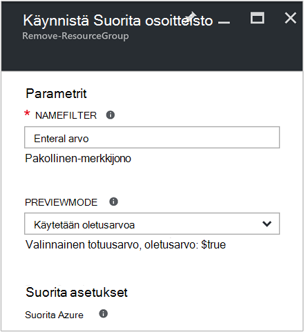
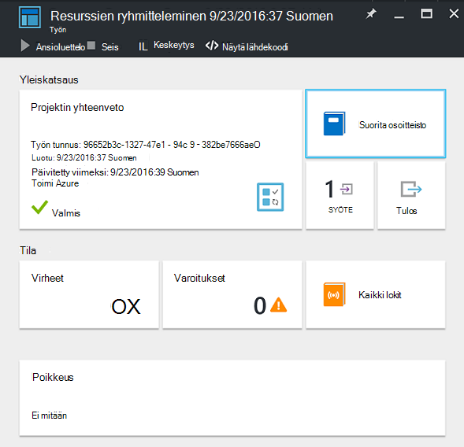
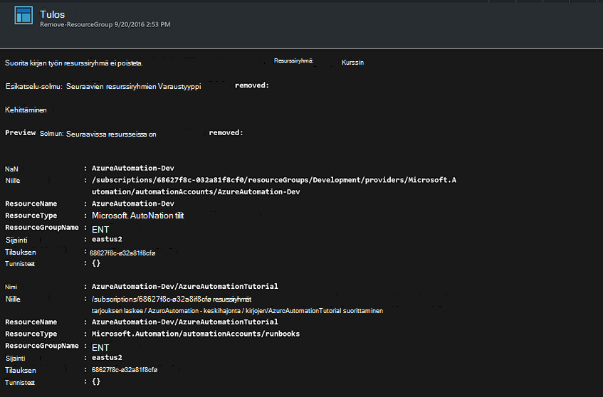

<properties
    pageTitle="Automatisoida resurssin ryhmien poistaminen | Microsoft Azure"
    description="PowerShell-työnkulun versio Azure automaatio-skenaario, mukaan lukien runbooks, jos haluat poistaa kaikki resurssiryhmät tilauksen."
    services="automation"
    documentationCenter=""
    authors="MGoedtel"
    manager="jwhit"
    editor=""
    />
<tags
    ms.service="automation"
    ms.workload="tbd"
    ms.tgt_pltfrm="na"
    ms.devlang="na"
    ms.topic="get-started-article"
    ms.date="09/26/2016"
    ms.author="magoedte"/>

# Azure automaatio - skenaario automatisoida resurssin ryhmien poistaminen

Monet asiakkaat luoda useita resurssiryhmä. Osaa voi käyttää tuotannon sovellusten hallintaan ja muiden voi käyttää kehitystä, testaus ja väliaikaisen ympäristöissä. Nämä resurssit käyttöönoton automatisointi on kuitenkaan, mutta ei voi resurssiryhmä-painikkeesta napsautuksella poistetaan käytöstä on toiseen. Voit nopeuttaa yleisiä hallinnan-toimintoa käyttämällä Azure automaatiota. Tämä on hyödyllinen, jos käsittelet Azure tilauksen, joka on käyttörajan jäsenen tarjous, kuten MSDN- tai Microsoft Partner Network Cloud Essentials-ohjelman kautta.

Tässä skenaariossa perustuu PowerShell-runbookin ja on tarkoitus poistaa resurssiryhmiä, jotka määrität tilauksesta. N runbookin oletusasetus on Testaa ennen kuin jatkat. Näin varmistat, että vahingossa ei poista resurssiryhmän ennen kuin voit ryhtyä tehnyt nämä vaiheet.   

## Aloittaminen skenaario

Tässä skenaariossa koostuu PowerShell-runbookin, jonka voit ladata [PowerShell-valikoimassa](https://www.powershellgallery.com/packages/Remove-ResourceGroup/1.0/DisplayScript). Voit myös tuoda ne suoraan [Runbookin valikoima](automation-runbook-gallery.md) Azure-portaalissa.  

Runbookin | Kuvaus|
----------|------------|
Poista ResourceGroup | Poistaa yhden tai useamman Azure resurssiryhmiä ja niihin liittyvät resurssit tilaus.  
 
Seuraavat syöteparametrit on määritetty tämä runbookin:

Parametri | Kuvaus|
----------|------------|
NameFilter (pakollinen) | Määrittää nimi suodattimen resurssiryhmiä, jotka aiot poistamisen. Voit siirtää useita arvoja CSV-luettelon avulla. Suodatinta ei tunnista isoja ja vastaa mitä tahansa resurssiryhmän, joka sisältää merkkijonon.|
PreviewMode (valinnainen) | Suorittaa runbookin Nähdäksesi milloin resurssin viestin poistetaan, mutta ei toimintoa. Oletusarvo on **Tosi,** Voit ehkäistä vahingossa yksi tai useampi: n runbookin välitetään resurssi-ryhmä.  

## Asenna ja määritä Tämä skenaario

### Edellytykset

Tämä runbookin todentaa [Azure Suorita nimellä-tilin](automation-sec-configure-azure-runas-account.md)avulla.    

### Asenna ja julkaista runbooks

Kun olet ladannut: n runbookin, voit tuoda sen [tuominen runbookin](automation-creating-importing-runbook.md#importing-a-runbook-from-a-file-into-Azure-Automation)proseduurien kuvatulla tavalla. Julkaise: n runbookin, kun se on tuotu onnistuneesti, automaatio-tilillesi.

## N runbookin avulla

Seuraavat vaiheet opastaa tämän runbookin ja sen toiminnasta tutustut Ohje suorittamista. Sinun vain voidaan testaaminen: n runbookin tässä esimerkissä poistaminen ei varsinaisesti resurssiryhmän.  

1. Azure-portaalista automaatio-tilisi ja valitse **Runbooks**.
2. Valitse **Poista ResourceGroup** runbookin ja **Käynnistä-painiketta**.
3. Kun käynnistät: n runbookin, **Käynnistä Runbookin** -sivu avautuu ja voit määrittää parametrit. Kirjoita resurssiryhmien nimet tilauksen, että voit käyttää testikäyttöön ja aiheuttaa vahinkoa ei, jos vahingossa.  

    >[AZURE.NOTE] Varmista, että **Previewmode** on määritetty **Tosi** , vältä poistamasta valitun resurssiryhmät.  **Huomaa** , että tämä runbookin ei poista, joka sisältää automaatio-tilin, jossa on käytössä tämän runbookin resurssiryhmä.  

4. Kun olet määrittänyt kaikki parametrin arvot, valitse **OK**ja: n runbookin jonossa suorittamista varten.  

Voit tarkastella tietoja **Poista ResourceGroup** runbookin työn Azure-portaalissa, valitse **työt** : n runbookin. Projektin yhteenveto näyttää syöttöparametrien ja lisäksi yleisiä tietoja työn ja poikkeukset on tapahtunut tulostus-muodossa.  .

**Projektin yhteenveto** sisältää tulostus, varoitus ja virhe virtaa viestejä. Valitse **tulostus** saat yksityiskohtaiset tulokset runbookin suorittamisen.  

## Seuraavat vaiheet

- Aloita oman runbookin luominen-kohdasta [luominen tai tuominen Azure automaatio-runbookin](automation-creating-importing-runbook.md).
- Runbooks PowerShell-työnkulun aloittaminen-kohdassa [Oma ensimmäisen työnkulun PowerShell-runbookin](automation-first-runbook-textual.md).
