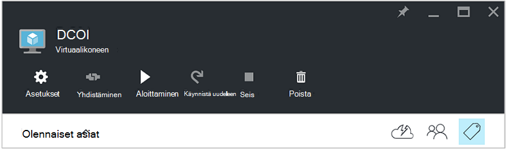

<properties
   pageTitle="JSON-muotoiset tunnisteiden avulla voit luoda aikataulun Azure AM käynnistys ja Sammuta | Microsoft Azure"
   description="Tässä artikkelissa esitellään JSON merkkijonot käyttämisestä tunnisteet voidaan automatisoida ajoituksen AM käynnistys-ja Sammuta."
   services="automation"
   documentationCenter=""
   authors="MGoedtel"
   manager="jwhit"
   editor="tysonn" />
<tags
   ms.service="automation"
   ms.devlang="na"
   ms.topic="article"
   ms.tgt_pltfrm="na"
   ms.workload="infrastructure-services"
   ms.date="07/18/2016"
   ms.author="magoedte;paulomarquesc" />

# Azure automaatio-skenaario: JSON-muotoiset tunnisteiden avulla voit luoda aikataulun Azure AM käynnistys ja sulkeminen

Asiakkaiden haluta ajoittaa käynnistys ja vähentää tilauksen kustannukset tai tukevat business ja tekniset vaatimukset näennäiskoneiden Sammuta.  

Seuraava tilanne avulla voit muodostaa automaattisen käynnistyksen ja että VMs Sammuta tunnisteen aikataulun resurssin ryhmittelytasolla tai Azure virtuaalikoneen tason avulla. Tämän aikataulun voi määrittää sunnuntaista lauantaihin käynnistyksen aikana ja Sammuta ajan.  

On myös ulos,-valmiilla vaihtoehtoja. Näitä ovat:
-  Automaattinen skaalaus-asetukset, joiden avulla skaalata sisään tai ulos [virtuaalikoneen skaalaus-vaihtoehdon avulla](../virtual-machine-scale-sets/virtual-machine-scale-sets-overview.md) .
- [DevTest harjoituksia](../devtest-lab/devtest-lab-overview.md) palvelun, joka on ajoituksen käynnistys-ja Sammuta sisäistä toimintoa.

Kuitenkin vaihtoehdoista tukevat vain tietyissä skenaarioissa ja ei voi käyttää VMs infrastruktuurin nimellä--palvelun (IaaS).   

Kun aikataulu-tunniste on lisätty resurssiryhmä, se otetaan käyttöön myös kaikki näennäiskoneiden resurssiryhmän sisällä. Jos aikataulun käytetään myös suoraan AM, viimeisen aikatauluun ohittaa seuraavassa järjestyksessä:

1.  Resurssiryhmä käytetty aikataulu
2.  Resurssiryhmä ja virtual machine resurssiryhmän aikataulu
3.  Käytetty virtual machine aikataulu

Tässä skenaariossa olennaisesti tulee JSON merkkijono, joka sisältää määritetyn muodon ja lisää sen arvona tunnisteen, kutsutaan aikataulu. Valitse runbookin on lueteltu kaikki resurssiryhmät ja näennäiskoneiden ja määrittää aikatauluja kunkin AM perustuvat lueteltujen varten. Seuraavaksi silmukat kautta VMs, joka on liitetty aikatauluja ja arvioi, mitä on otettava. Esimerkiksi se määrittää, mitä VMs täytyy olla pysäytetty, sulje tai ohitetaan.

Nämä runbooks todentaa [Azure Suorita nimellä-tilin](../automation/automation-sec-configure-azure-runas-account.md)avulla.

## Lataa skenaarion runbooks

Tässä skenaariossa koostuu neljä PowerShell työnkulun runbooks, jonka voit ladata [TechNet-galleria](https://gallery.technet.microsoft.com/Azure-Automation-Runbooks-84f0efc7) tai [GitHub](https://github.com/paulomarquesdacosta/azure-automation-scheduled-shutdown-and-startup) säilö tälle projektille.

Runbookin | Kuvaus
----------|----------
Testaa ResourceSchedule | Tarkistaa jokaisen virtuaalikoneen aikataulun ja suorittaa sulkeminen tai käynnistys aikataulun mukaan.
Lisää ResourceSchedule | Lisää aikataulun tunnisteen AM tai resurssi-ryhmään.
Päivitä ResourceSchedule | Muokkaa olemassa olevan aikataulun tunnisteen korvaamalla se uuden.
Poista ResourceSchedule | Poistaa AM tai resurssi ryhmän aikataulu-tunniste.

## Asenna ja määritä Tämä skenaario

### Asenna ja julkaista runbooks

Lataa runbooks, voit tuoda ne [luominen](automation-creating-importing-runbook.md#importing-a-runbook-from-a-file-into-Azure-Automation)tai tuominen runbookin-Azure automaatio kuvatulla tavalla.  Julkaise kunkin runbookin, kun se on tuotu onnistuneesti, automaatio-tilillesi.

### Aikataulun lisääminen testi ResourceSchedule runbookin

Testi ResourceSchedule runbookin aikataulua käyttöön seuraavasti. Tämä on runbookin, joka tarkistaa, mitkä näennäiskoneiden pitäisi olla aloittaminen, Sammuta tai vasemmalle on.

1. Azure-portaalista avata automaatio-tilisi ja valitse sitten **Runbooks** -ruutu.
2. Napsauta **Testi ResourceSchedule** , sivu **aikatauluja** -ruutua.
3. Valitse **Lisää aikataulun** **aikatauluja** -sivu.
4. Valitse **linkki oman runbookin aikataulun** **aikatauluja** -sivu. Valitse **Luo uuden aikataulun**.
5.  **Uuden aikataulun** -sivu, kirjoita tämä raporttimalli, kirjoita nimi esimerkiksi: *HourlyExecution*.
6. **Käynnistä**aikataulun tunti lisäys alkamisajan määrittäminen.
7. Valitse **Toistuminen**ja sitten **Toista jokaisen aikaväli**, valitse **1 tunti**.
8. Varmista, että **määrittäminen vanheneminen** on määritetty **ei**ja valitse sitten **Luo** , jos haluat tallentaa uuden aikataulun.
9. Valitse **Aikataulu Runbookin** asetukset-sivu **Parametrit ja suorita asetukset**. Kirjoita tilauksen **SubscriptionName** -kenttään nimi testi ResourceSchedule **Parametrit** -sivu.  Tämä on ainoa parametri, joka n: n runbookin.  Kun olet valmis, valitse **OK**.  

Runbookin aikataulun pitäisi näyttää seuraavalta, kun se on valmis:

 

## Muotoile JSON-merkkijono

Tämä ratkaisu lähinnä menee JSON merkkijonon määritetyssä muodossa kanssa ja lisää sen arvona tunnisteen nimi aikataulu. Valitse runbookin on lueteltu kaikki resurssiryhmät ja näennäiskoneiden ja tunnistaa kunkin virtuaalikoneen aikatauluja.

N runbookin silmukat päällä, joissa on liitetty aikatauluja näennäiskoneiden ja tarkistaa, mitä toimintoja on otettava. Seuraavassa on esimerkki ratkaisuja muotoilun:

    {
       "TzId": "Eastern Standard Time",
        "0": {  
           "S": "11",
           "E": "17"
        },
        "1": {
           "S": "9",
           "E": "19"
        },
        "2": {
           "S": "9",
           "E": "19"
        },
    }

Tässä on joitakin tämän rakenteen yksityiskohtaisia tietoja:

1. JSON-rakenteen muoto on optimoitu kiertää Azure yksittäinen tunniste arvon 256 merkin rajoittamista.

2. *TzId* edustaa virtuaalikoneen aikavyöhyke. Tämä tunnus voi saada käyttämällä lisätään tiedot TimeZoneInfo .NET-luokka PowerShell istunnon--**[System.TimeZoneInfo]: GetSystemTimeZones()**.

    

    - Viikonpäivät esitetään nollaa kuusi numeeriset arvot. Nolla-arvon on sama kuin sunnuntai.
    - **S** -määritteen esitetään alkamisajan ja sen arvo on 24 tunnin muodon.
    - End tai Sammuta aika esitetään **E** -määritteen ja sen arvo on 24 tunnin muodon.

    Jos **S** ja **E** määritteet kunkin arvo on nolla (0), virtuaalikoneen jää aikaa arvioinnin sen nykyisessä tilassa.   

3. Jos haluat ohittaa tietty päivä viikon arviointi ei lisätä osan, että viikonpäivä. Seuraavassa esimerkissä vain maanantai arvioidaan ja muut viikonpäivien oteta huomioon:

        {
          "TzId": "Eastern Standard Time",
           "1": {
             "S": "11",
             "E": "17"
           }
        }

## Tunnisteen resurssiryhmille tai VMs

Sulkeutumaan VMs haluat merkitä VMs tai resurssiryhmiä, missä ne sijaitsevat. Näennäiskoneiden, joka ei ole aikataulun tunnisteen ei lasketa. Siksi ne eivät ole aloitettu tai Sammuta.

Kahdella tunnisteen resurssiryhmille tai VMs tämän-ratkaisuun. Voit tehdä sen suoraan portaalin. Tai voit määrittää lisää ResourceSchedule, Päivitä ResourceSchedule ja poista ResourceSchedule runbooks.

### Tunnisteen portaalin kautta

Voit merkitä virtuaalikoneen tai resurssiryhmä-portaalissa seuraavasti:

1. JSON-merkkijono Litistä ja varmista, että ei ole välilyöntejä.  JSON-merkkijono pitäisi näyttää tältä:

        {"TzId":"Eastern Standard Time","0":{"S":"11","E":"17"},"1":{"S":"9","E":"19"},"2": {"S":"9","E":"19"},"3":{"S":"9","E":"19"},"4":{"S":"9","E":"19"},"5":{"S":"9","E":"19"},"6":{"S":"11","E":"17"}}

2. Valitse AM tai resurssien ryhmä, johon haluat käyttää tätä aikataulua **tunnisteet** -kuvaketta.

    
3. Tunnisteet on määritetty seuraavan avain/arvo-pari. Kirjoita **aikataulun** **avain** -kenttään ja liitä JSON merkkijonon **arvo** -kenttään. Valitse **Tallenna**. Uuden tunnisteen pitäisi nyt näkyä resurssin tunnisteluettelon.

### PowerShell-tunniste

Kaikki tuodut runbooks sisältää ohjeet komentosarja, joka kerrotaan, miten voit suorittaa suoraan PowerShell runbooks alussa. Voit osallistua Lisää ScheduleResource ja Päivitä ScheduleResource runbooks PowerShell. Voit tehdä tämän siirtämällä tarvittavat parametrit, joiden avulla voit luoda tai päivittää AM tai resurssi ryhmän ulkopuolella portaalin aikataulu-tunniste.  

Jos haluat luoda, lisääminen ja poistaminen tunnisteet powershellissä voit ensimmäisen tarvetta [varten Azure PowerShell-ympäristön määritys](../powershell-install-configure.md). Kun asennus on valmis, voit siirtyä seuraaviin vaiheisiin.

### Luo aikataulu-tunniste PowerShellin avulla

1. Avaa PowerShell-istunto. Käytä seuraavassa esimerkissä todentamismenetelmä tilisi Suorita nimellä ja määritä tilauksen:   

        Conn = Get-AutomationConnection -Name AzureRunAsConnection
        Add-AzureRMAccount -ServicePrincipal -Tenant $Conn.TenantID `
        -ApplicationId $Conn.ApplicationID -CertificateThumbprint $Conn.CertificateThumbprint
        Select-AzureRmSubscription -SubscriptionName "MySubscription"

2. Määritä aikataulun hash-taulukko. Tässä on esimerkki siitä, miten se rakennettu:

        $schedule= @{ "TzId"="Eastern Standard Time"; "0"= @{"S"="11";"E"="17"};"1"= @{"S"="9";"E"="19"};"2"= @{"S"="9";"E"="19"};"3"= @{"S"="9";"E"="19"};"4"= @{"S"="9";"E"="19"};"5"= @{"S"="9";"E"="19"};"6"= @{"S"="11";"E"="17"}}

3. Määritä parametrit, joita tarvitaan: n runbookin mukaan. Seuraavassa esimerkissä on ovat kohdistamisen AM:

        $params = @{"SubscriptionName"="MySubscription";"ResourceGroupName"="ResourceGroup01"; `
        "VmName"="VM01";"Schedule"=$schedule}

    Jos olet tunnisteiden resurssiryhmä, poistaa *VMName* -parametrin $params hash taulukoiden seuraavasti:

        $params = @{"SubscriptionName"="MySubscription";"ResourceGroupName"="ResourceGroup01"; `
        "Schedule"=$schedule}

4. Suorita seuraavat parametrit Luo aikataulu-tunniste Lisää ResourceSchedule runbookin:

        Start-AzureRmAutomationRunbook -Name "Add-ResourceSchedule" -Parameters $params `
        -AutomationAccountName "AutomationAccount" -ResourceGroupName "ResourceGroup01"

5. Voit päivittää resurssiryhmä tai virtuaalikoneen tunnisteen, suorita **Päivitys ResourceSchedule** runbookin seuraavilla parametreilla:

        Start-AzureRmAutomationRunbook -Name "Update-ResourceSchedule" -Parameters $params `
        -AutomationAccountName "AutomationAccount" -ResourceGroupName "ResourceGroup01"

### Poista aikataulu-tunniste PowerShellin avulla

1. Avaa PowerShell-istunnon ja suorita todentamismenetelmä tilisi Suorita nimellä ja voit valita sekä määrittää tilauksen seuraavasti:

        Conn = Get-AutomationConnection -Name AzureRunAsConnection
        Add-AzureRMAccount -ServicePrincipal -Tenant $Conn.TenantID `
        -ApplicationId $Conn.ApplicationID -CertificateThumbprint $Conn.CertificateThumbprint
        Select-AzureRmSubscription -SubscriptionName "MySubscription"

2. Määritä parametrit, joita tarvitaan: n runbookin mukaan. Seuraavassa esimerkissä on ovat kohdistamisen AM:

        $params = @{"SubscriptionName"="MySubscription";"ResourceGroupName"="ResourceGroup01" `
        ;"VmName"="VM01"}

    Jos poistat tunnisteen resurssiryhmä-poistaminen *VMName* -parametrin $params hash-taulukossa seuraavasti:

        $params = @{"SubscriptionName"="MySubscription";"ResourceGroupName"="ResourceGroup01"}

3. Suorita Poista ResourceSchedule runbookin Poista aikataulu-tunniste:

        Start-AzureRmAutomationRunbook -Name "Remove-ResourceSchedule" -Parameters $params `
        -AutomationAccountName "AutomationAccount" -ResourceGroupName "ResourceGroup01"

4. Voit päivittää resurssiryhmä tai virtuaalikoneen tunnisteen, suorita Poista ResourceSchedule runbookin seuraavilla parametreilla:

        Start-AzureRmAutomationRunbook -Name "Remove-ResourceSchedule" -Parameters $params `
        -AutomationAccountName "AutomationAccount" -ResourceGroupName "ResourceGroup01"

>[AZURE.NOTE] On suositeltavaa, että olet itse seurata nämä runbooks (ja virtuaalikoneen tilat) voit varmistaa, että näennäiskoneiden on suljettava alaspäin ja aloittaa vastaavasti.  

Voit tarkastella tietoja testi ResourceSchedule runbookin työn Azure-portaalissa, valitse: n runbookin **työt** -ruutu. Projektin yhteenveto näyttää syöttöparametrien ja tulostus-tietovirta lisäksi yleisiä tietoja työn ja poikkeukset, jos ne on tapahtunut.  

**Projektin yhteenveto** sisältää tulostus, varoitus ja virhe virtaa viestejä. Valitse Tarkastele yksityiskohtaista tuloksia runbookin suorittamisen **tulostus** -ruutu.

  

## Seuraavat vaiheet

-  Aloita työnkulku runbooks PowerShell-kohdassa [ensimmäisen PowerShell työnkulun-runbookin](automation-first-runbook-textual.md).
-  Lisätietoja runbookin tyypit ja niiden eduista ja rajoituksia, on artikkelissa [Azure automaatio runbookin tiedostotyypit](automation-runbook-types.md).
-  Lisätietoja PowerShell-komentosarjaa ominaisuuksia tuetaan on artikkelissa [Azure automaatio tuki alkuperäisen PowerShell-komentosarjaa](https://azure.microsoft.com/blog/announcing-powershell-script-support-azure-automation-2/).
-  Lisätietoja runbookin kirjaaminen ja tulos on artikkelissa [Runbookin tulostus ja Azure automaatio viestit](automation-runbook-output-and-messages.md).
-  Lisätietoja Azure Suorita nimellä-tilin ja niiden todennetaan oman runbooks sen avulla on artikkelissa [Tarkista runbooks Azure Suorita nimellä-tilillä](../automation/automation-sec-configure-azure-runas-account.md).
