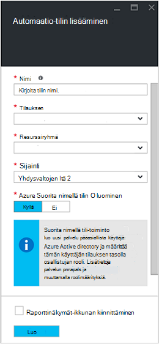
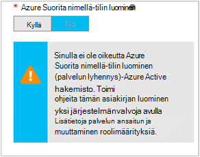

<properties
   pageTitle="Määritä Azure AD-käyttäjätilin | Microsoft Azure"
   description="Tässä artikkelissa käsitellään määrittäminen Azure automaatio, ARM ja ASM todennetaan runbooks Azure AD-käyttäjä tilin tunnistetiedot."
   services="automation"
   documentationCenter=""
   authors="MGoedtel"
   manager="jwhit"
   editor="tysonn"
   keywords="Azure active Directoryn käyttäjän azure hallinta-azure ad käyttäjätili" />
<tags
   ms.service="automation"
   ms.devlang="na"
   ms.topic="get-started-article"
   ms.tgt_pltfrm="na"
   ms.workload="infrastructure-services"
   ms.date="09/12/2016"
   ms.author="magoedte" />

# Todennetaan Runbooks Azure hallinnan ja resurssien hallinta

Tässä artikkelissa kuvataan, miten sinun on suoritettava Azure automaatio runbooks suorittaminen vasten Azure Service Management (ASM) tai Azure resurssien hallinta (ARM) resursseja Azure AD-käyttäjä-tilin määrittäminen.  Kun tämä on tuettu todennus-tunnistetiedot, että ARM-pohjainen runbooks edelleen, suositeltava tapa käyttää uuden Azure Suorita nimellä-tiliä.       

## Luo uusi Azure Active Directory-käyttäjän

1. Kirjaudu sisään Azure perinteinen portaalin Azure-tilausta haluat hallita palvelun järjestelmänvalvojana.
2. Valitse **Active Directory**ja valitse sitten organisaation hakemiston nimi.
3. Valitse **käyttäjät** -välilehti ja valitse **Lisää käyttäjä**komento-alueella.
4. Valitse **Kerro kyseisen käyttäjän tietoja** -sivulla **käyttäjän tyyppi**-kohdassa **uudelle käyttäjälle organisaatiossa**.
5. Kirjoita käyttäjänimi.  
6. Valitse kansionimi, joka on liitetty Azure Active Directory-sivulla tilaus.
7. Antaa **käyttäjäprofiili** -sivulla ensin ja viimeisen nimi, käyttäjäystävällinen nimi ja käyttäjän **roolit** -luettelosta.  Älä **Ota Monimenetelmäisen todentamisen**.
8. Huomautus käyttäjän koko nimi sekä väliaikaisella salasanallaan.
9. Valitse **Asetukset > järjestelmänvalvojat > Lisää**.
10. Kirjoita käyttäjä, jonka loit täydellinen käyttäjänimi.
11. Valitse tilaus, jonka haluat käyttäjä voi hallita.
12. Kirjaudu ulos Azure ja kirjaudu sitten takaisin sisään tilillä, juuri luomaasi. Voit pyydetään käyttäjän salasanan vaihtaminen.

## Automaatio-tilin luominen Azure perinteinen-portaalissa
Tässä osassa voit suorittaa Luo uusi Azure automaatio-tili, jota käytetään oman runbooks ASM ja ARM-tilassa resurssien hallinta Azure-portaalissa seuraavasti.  

>[AZURE.NOTE] Luotu perinteinen Azure-portaalissa automaatio-tilejä voi hallita Azure-perinteinen ja Azure Portal sekä joko joukko cmdlet-komennot. Kun tili on luotu, se ei ole merkitystä, miten voit luoda ja hallita tilin resurssit. Jos aiot Siirry Azure perinteinen-portaalin käyttäminen, sitten sitä pitäisi käyttää sijaan Azure-portaalin minkä tahansa automaatio-tilien luominen.

1. Kirjaudu sisään Azure perinteinen portaalin Azure-tilausta haluat hallita palvelun järjestelmänvalvojana.
2. Valitse **Automaattiset**.
3. Valitse **automaatio** -sivulla **Luo automaatio-tili**.
4. Kirjoita **Luo tili automaatio** -ruutuun uuden automaatio-tilin nimi ja avattavasta luettelosta **alue** .  
5. Valitse **OK** , jos haluat hyväksyä asetukset ja luo tili.
6. Sen luomisen jälkeen se merkitään **automaatio** -sivulla.
7. Valitse tili ja se tuo voit Dashboard-sivu.  
8. **Valitse Automaattiset raporttinäkymäsivu.**
9. Valitse **kalusto** -sivulla sijaitsevat sivun alareunassa **Lisää asetuksia** .
10. Valitse **Lisää asetuksia** -sivulla **Lisää tunnistetiedot**.
11. Valitse **Määritä tunnistetiedot** -sivulla **Tunnistetietojen tyyppi** avattavasta luettelosta **Windows PowerShellin tunnistetiedon** ja tunnistetiedon nimi.
12. **Määritä Credential** sivun seuraavanlaisen käyttäjänimi AD-käyttäjätilin luotu aiemmassa **Käyttäjänimi** -kenttään ja salasana **salasana** - ja **Vahvista salasana** -kenttiin. Valitse **OK** , Tallenna muutokset.

## Automaatio-tilin luominen Azure-portaalissa

Tässä osassa voit suorittaa Luo uusi Azure automaatio-tili, jota käytetään, kun runbooks hallinta resurssit ARM-tilassa Azure-portaalissa seuraavasti.  

1. Kirjaudu sisään Azure portaalin Azure-tilausta haluat hallita palvelun järjestelmänvalvojana.
2. Valitse **Automaattiset tilit**.
3. Valitse **Lisää**automaatio-tilit-sivu. 
2. Valitse **Lisää automaatio-tili** -sivu uusi automaatio-tilisi nimi **nimi** -ruutuun.
5. Jos sinulla on useita tilauksia, määrittää uuden tilin sekä uuteen tai aiemmin luotuun **resurssiryhmä** ja Azure palvelinkeskuksen **sijainnin**.
3. Valitse arvo **ei** **tilin luominen Azure Suorita nimellä** -vaihtoehto ja valitse **Luo** -painiketta.  

    >[AZURE.NOTE] Jos valitset Suorita nimellä-tilin luominen valitsemalla vaihtoehto **ei**ole, näyttöön tulee varoitussanoma- **Lisää automaatio-tili** -sivu.  Kun tili on luotu ja **osallistujan** roolin Valitse tilauksen, se ei ole vastaavan todennus-tunnistetietojen tilaukset hakemistopalvelun ja sen vuoksi, access ei ole resursseja tilaukseesi.  Tämä estää kaikki runbooks viittaava tällä tilillä ei voi todentaa ja tehtäviä vastaan ARM resursseja.

    

4. Kun Azure Luo automaatio-tilin, valitse **ilmoitukset** edistymistä voi seurata valikosta.

Kun tunnistetieto luominen on valmis, sinun on sitten tunnistetiedon resurssi, automaatio-tilin liitettävä aiemmin luotu AD-käyttäjätilin luominen.  Muista, että vain luomaasi automaatio-tili ja ei ole liitetty todennus jäsenyyden.  [Tunnistetiedon varat Azure automaatio-artikkelissa](../automation/automation-credentials.md#creating-a-new-credential) kuvattujen toimien ja kirjoita arvo muodossa **toimialue\käyttäjä** **käyttäjänimi** .

## Käytä tunnistetieto runbookin

Voit hakea runbookin, käyttämällä [Hae AutomationPSCredential](http://msdn.microsoft.com/library/dn940015.aspx) tehtävän tunnistetieto ja käyttää sitä sitten [Lisää AzureAccount](http://msdn.microsoft.com/library/azure/dn722528.aspx) muodostaa Azure-tilaukseen. Jos tunnistetieto on järjestelmänvalvojan oikeudet Azure useita tilauksia, [Valitse AzureSubscription](http://msdn.microsoft.com/library/dn495203.aspx) kannattaa käyttää myös Määritä oikea. Tämä on näkyvissä otoksessa Windows PowerShellin alla, joka näkyy yleensä useimmat Azure automaatio runbooks yläreunassa.

    $cred = Get-AutomationPSCredential –Name "myuseraccount.onmicrosoft.com"
    Add-AzureAccount –Credential $cred
    Select-AzureSubscription –SubscriptionName "My Subscription"

Toistamalla jälkeen kaikki [tarkistuspisteet](http://technet.microsoft.com/library/dn469257.aspx#bk_Checkpoints) viivat-kohdassa runbookin. Jos n runbookin on hyllytetty ja jatkaa sitten toisen työntekijän käyttöön, valitse se on suorittaa todennusta uudelleen.

## Seuraavat vaiheet
* Tarkista eri runbookin tyypit ja seuraavasta artikkelista [Azure automaatio runbookin tyypit](../automation/automation-runbook-types.md) oman runbooks luomisen vaiheet
