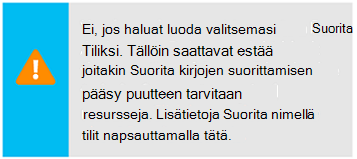

<properties
    pageTitle="Määritä Azure Suorita tiliksi | Microsoft Azure"
    description="Opetusohjelman, joka opastaa sinua suojauksen pääasiallista todennuksen Azure automaatio-luonti, testaus ja Esimerkki käyttöä."
    services="automation"
    documentationCenter=""
    authors="mgoedtel"
    manager="jwhit"
    editor=""
    keywords="Service käyttäjätunnuksen, setspn, azure todennus"/>
<tags
    ms.service="automation"
    ms.workload="tbd"
    ms.tgt_pltfrm="na"
    ms.devlang="na"
    ms.topic="get-started-article"
    ms.date="08/17/2016"
    ms.author="magoedte"/>

# Todennetaan Runbooks Azure Suorita nimellä-tilillä

Tässä ohjeaiheessa kerrotaan, kuinka Azure-ominaisuudella Suorita nimellä tilin tarkistamiseen runbooks hallinta resurssien Azure Resurssienhallinta tai Azure hallinta-portaalista automaatio-tilin määrittäminen.

Kun luot uuden automaatio-tilin Azure-portaalissa, se luo automaattisesti:

- Suorita tiliksi, joka luo uuden palvelun lyhennys Azure Active Directory-varmenne, ja määrittää avustaja Roolipohjainen käyttöoikeuksien hallinta (RBAC), jota käytetään Resurssienhallinta resurssien käyttäminen runbooks.   
- Perinteinen Suorita nimellä tilin hallinta-varmenne, jota käytetään Azure Service Management tai classic resurssien runbooks lataamalla.  

Tämä yksinkertaistaa ja avulla voit aloittaa nopeasti ja käyttöönottoon runbooks tukemaan automaatio tarpeitasi.      

Käytä Suorita nimellä ja perinteinen Suorita nimellä-tiliä, voit tehdä seuraavaa:

- Standardoitu lisäämistapaa todentamismenetelmä Azure, kun Azure Resurssienhallinta tai Azure hallinnan resurssien hallitseminen runbooks Azure-portaalissa.  
- Automatisoida yleinen runbooks määritetty Azure-ilmoitukset käyttöön.

>[AZURE.NOTE] Azure [ilmoitusten integrointi](../monitoring-and-diagnostics/insights-receive-alert-notifications.md) automaatio yleisen Runbooks kanssa tarvitaan automaatio-tilin, joka on määritetty käyttämään Suorita nimellä ja perinteinen Suorita nimellä tili. Voit automaatio-tili, joka on jo määritetty Suorita nimellä ja perinteinen Suorita nimellä-tili tai Luo uusi tunnus valitsemalla.

Syy, kuinka voit automaatio-tilin luominen Azure-portaalista, Päivitä PowerShellin automaatio-tili ja miten voi todentaa oman runbooks.

Ennen kuin olemme vakiomuotoa, on muutamia asioita, joita pitäisi ymmärtää ja huomioon ennen jatkamista.

1. Tämä ei vaikuta aiemmin luotu perinteinen tai resurssien hallinnan käyttöönottomalli automaatio-tilit.  
2. Tämä onnistuu vain automaatio-tileissä luotu palvelun Azure-portaalissa.  Yritetään luoda tili perinteinen-portaalista ei replikoida Suorita nimellä-tilin määrittäminen.
3. Jos sinulla on tällä hetkellä runbooks ja resurssien (eli aikatauluja, muuttujat, jne.) aiemmin luotu perinteinen resurssien ja haluat näiden runbooks todentamismenetelmä uuden perinteinen Suorita nimellä-tilin, sinun on siirtäminen uusi automaatio-tili tai päivittää aiemmin tilin käyttäminen PowerShell-komentosarjaa.  
4. Todennuksen uusi Suorita nimellä-tilin ja perinteinen Suorita kuin automaatio-tilin, sinun on muokattava käyttäjän aiemmin runbooks alla olevassa esimerkissä koodilla.  **Kirjoita Huomaa** , että Suorita nimellä-tili on todennustavaksi vastaan Resurssienhallinta resurssien pääasiallista sertifikaattiin perustuva-palvelu ja perinteinen Suorita nimellä-tilin avulla on vastaan hallinnan resurssien hallinta-varmenteen todennustapa.     

## Luo uusi automaatio-tili Azure-portaalista

Tässä osassa Suorita seuraavat vaiheet Azure automaatio uuden tilin luominen Azure-portaalista.  Tämä luo Suorita nimellä sekä perinteinen Suorita nimellä-tili.  

>[AZURE.NOTE] Suorittaa nämä vaiheet *on* käyttäjä voi tilauksen valvojat-roolin jäsen ja muiden järjestelmänvalvojan tilausta, mikä on myöntäminen tilaukseen käyttäjälle.  Käyttäjän on myös lisättävä oletukseksi, jotka käyttäjä-tilaukset Active Directory; tiliä ei tarvitse sellaisten roolin.

1. Kirjaudu sisään Azure-portaaliin tilille, jolla on tilauksen valvojat-roolin jäsen ja muiden tilauksen järjestelmänvalvoja.
2. Valitse **Automaattiset tilit**.
3. Valitse **Lisää**automaatio-tilit-sivu. 

    >[AZURE.NOTE]Jos näet seuraavan varoituksen: **Lisää automaatio-tili** -sivu, tämä on tilisi ei tilauksen valvojat-roolin jäsen ja Mää-järjestelmänvalvojan tilauksen. 

4. Valitse **Lisää automaatio-tili** -sivu uusi automaatio-tilisi nimi **nimi** -ruutuun.
5. Jos sinulla on useita tilauksia, Määritä uusi tili sekä uuteen tai aiemmin luotuun **resurssiryhmä** ja Azure palvelinkeskuksen **sijainnin**.
6. Tarkista arvo on **Kyllä** on valittuna **tilin luominen Azure Suorita nimellä** -vaihtoehto ja valitse **Luo** -painiketta.  

    >[AZURE.NOTE] Jos valitset Suorita nimellä-tilin luominen valitsemalla vaihtoehto **ei**ole, näyttöön tulee varoitussanoma- **Lisää automaatio-tili** -sivu.  Kun tili on luotu Azure-portaalissa, se ei ole vastaavan todennus-tunnistetiedot, että perinteinen tai Resurssienhallinta tilauksen hakemistopalvelu ja siksi ei voi käyttää resurssien-tilaukseesi.  Tämä estää kaikki runbooks viittaava tällä tilillä ei voi todentaa ja tehtäviä vastaan resurssit nämä käyttöönotto-malleissa.

    > 
Kun palvelun lyhennys ei ole luotu osallistujan rooli ei voi määrittää.

7. Kun Azure Luo automaatio-tilin, valitse **ilmoitukset** edistymistä voi seurata valikosta.

### Resurssit

Kun automaatio-tili on luotu, useita resursseja luodaan automaattisesti puolestasi.  Seuraavassa taulukossa on yhteenveto resurssien Suorita nimellä-tilille. 

Resurssi|Kuvaus
--------|-----------
AzureAutomationTutorial Runbookin|Esimerkki PowerShell runbookin, joka näytetään, miten tarkistamiseen Suorita nimellä-tilin avulla ja kaavan Resurssienhallinta resurssit.
AzureAutomationTutorialScript Runbookin|Esimerkki PowerShell runbookin, joka näytetään, miten tarkistamiseen Suorita nimellä-tilin avulla ja kaavan Resurssienhallinta resurssit.
AzureRunAsCertificate|Varmenteen resurssi automaattisesti luotu automaatio tilin luonnin aikana tai käyttämällä PowerShell-komentosarjaa alla aiemmin luotu tili.  Sen avulla voit todentamismenetelmä Azure niin, että voit hallita Azure Resurssienhallinta resurssien runbooks.  Tämä varmenne on yksivuotisen käyttöikä.
AzureRunAsConnection|Yhteyden resurssi automaattisesti luotu automaatio tilin luonnin aikana tai käyttämällä PowerShell-komentosarjaa alla aiemmin luotu tili.

Seuraavassa taulukossa on yhteenveto resurssien perinteinen Suorita nimellä-tilille. 

Resurssi|Kuvaus
--------|-----------
AzureClassicAutomationTutorial Runbookin|Esimerkki runbookin joka saa perinteinen VMs Tilauksen käyttämällä perinteinen Suorita kuin tiliä (varmenne) ja tulostaa sitten AM nimen ja tilan.
AzureClassicAutomationTutorial komentosarjan Runbookin|Esimerkki runbookin joka saa perinteinen VMs Tilauksen käyttämällä perinteinen Suorita kuin tiliä (varmenne) ja tulostaa sitten AM nimen ja tilan.
AzureClassicRunAsCertificate|Varmenteen resurssi luodaan automaattisesti, jota käytetään todentamismenetelmä Azure niin, että voit hallita Azure perinteinen resurssien runbooks.  Tämä varmenne on yksivuotisen käyttöikä.
AzureClassicRunAsConnection|Yhteyden resurssi luodaan automaattisesti, jota käytetään todentamismenetelmä Azure niin, että voit hallita Azure perinteinen resurssien runbooks.  

## Suorita nimellä-todennuksen varmistaminen

Olemme seuraava suorittaa pieni testi Vahvista voi todentaa onnistuneesti käyttämällä uutta Suorita nimellä-tiliä.     

1. Avaa aiemmin luotu automaatio-tilin Azure-portaalissa.  
2. Valitse Avaa runbooks luettelo **Runbooks** -ruutu.
3. Valitse **AzureAutomationTutorialScript** runbookin ja valitse sitten Aloita: n runbookin **Käynnistä-painiketta** .  Näyttöön tulee kehote tarkistetaan haluat aloittaa: n runbookin.
4. [Runbookin työn](automation-runbook-execution.md) luodaan sivu tulee näkyviin projektin ja **Projektin yhteenveto** -ruutu näkyy projektin tila.  
5. Työn tila alkaa kuin *jonossa* , joka ilmaisee, että se odottaa runbookin työntekijän pilveen ole käytettävissä. Se sitten siirtyy *käynnistetään* kun työntekijä väittää työn ja *suorittamalla* , kun n runbookin todella käynnistyy.  
6. Kun runbookin työ on valmis, emme pitäisi näkyä tila on **Valmis**.   
7. Saat yksityiskohtaiset tulokset: n runbookin valitsemalla **tulostus** -ruutu.
8. **Tulostus** -sivu pitäisi näkyä on onnistuneesti todennus ja palauttaa kaikki resursseja resurssiryhmän käytettävissä luettelo.
9. Sulje **tulostus** -sivu, palaa **Projektin yhteenveto** -sivu.
13. Sulje **Projektin yhteenveto** - ja vastaavan **AzureAutomationTutorialScript** runbookin-sivu.

## Perinteinen Suorita nimellä-todennuksen varmistaminen

Olemme seuraava suorittaa pieni testi Vahvista voi todentaa onnistuneesti käyttämällä uutta perinteinen Suorita nimellä-tiliä.     

1. Avaa aiemmin luotu automaatio-tilin Azure-portaalissa.  
2. Valitse Avaa runbooks luettelo **Runbooks** -ruutu.
3. Valitse **AzureClassicAutomationTutorialScript** runbookin ja valitse sitten Aloita: n runbookin **Käynnistä-painiketta** .  Näyttöön tulee kehote tarkistetaan haluat aloittaa: n runbookin.
4. [Runbookin työn](automation-runbook-execution.md) luodaan sivu tulee näkyviin projektin ja **Projektin yhteenveto** -ruutu näkyy projektin tila.  
5. Työn tila alkaa kuin *jonossa* , joka ilmaisee, että se odottaa runbookin työntekijän pilveen ole käytettävissä. Se sitten siirtyy *käynnistetään* kun työntekijä väittää työn ja *suorittamalla* , kun n runbookin todella käynnistyy.  
6. Kun runbookin työ on valmis, emme pitäisi näkyä tila on **Valmis**.   
7. Saat yksityiskohtaiset tulokset: n runbookin valitsemalla **tulostus** -ruutu.
8. **Tulostus** -sivu pitäisi näkyä on onnistuneesti todennus ja palauttaa kaikki perinteinen AM luettelo on tilaus.
9. Sulje **tulostus** -sivu, palaa **Projektin yhteenveto** -sivu.
13. Sulje **Projektin yhteenveto** - ja vastaavan **AzureClassicAutomationTutorialScript** runbookin-sivu.

## Päivitä tilin automaatio-PowerShellin avulla

Seuraavassa on antaa sinulle asetus, jos haluat päivittää aiemmin automaatio-tili, jos PowerShellin avulla:

1. Luotu automaatio-tiliä, mutta hylätty Suorita nimellä-tilin luominen
2. Sinulla on jo automaatio-tili, voit hallita Resurssienhallinta resursseja ja haluat päivittää sen sisällytetään runbookin todennustavaksi Suorita nimellä-tili
2. Sinulla on jo automaatio-tili, voit hallita perinteinen resursseja ja haluat päivittää käyttämään perinteinen Suorita uuden tilin luominen ja siirtäminen runbooks ja resurssien sijaan   

Ennen kuin jatkat, tarkista seuraavat:

1. Olet ladannut ja asentanut [Windows Management Framework (WMF) 4.0](https://www.microsoft.com/download/details.aspx?id=40855) , jos käytössäsi on Windows 7: ssä.   
    Jos käytössäsi on Windows Server 2012 R2, Windows Server 2012 Windows 2008 R2, Windows 8.1 tai Windows 7 SP1, [Windows Management Framework 5.0](https://www.microsoft.com/download/details.aspx?id=50395) on saatavilla.
2. Azure PowerShell 1.0. Tietoja tässä versiossa ja asennusohjeet Katso, [miten asennetaan ja määritetään PowerShellin Azure](../powershell-install-configure.md).
3. Olet luonut automaatio-tiliä.  Tämän tilin viitataan parametrien arvona – AutomationAccountName ja ApplicationDisplayName - sekä komentosarjoissa.

Hakee *SubscriptionID*, *ResourceGroup*ja *AutomationAccountName*arvot, jotka ovat pakollisia parametreja komentosarjojen Azure-portaalissa Valitse automaatio-tilisi **automaatio-tili** -sivu ja valitse **kaikki asetukset**.  **Kaikki asetukset** -sivu- **Tilin asetukset** ja valitse **Ominaisuudet**.  Valitse **Ominaisuudet** -sivu nämä arvot muistiin.    

### Suorita kuin tilin PowerShell-komentosarjaa luominen

PowerShell-komentosarjaa määritetään seuraavasti:

- Azure AD-sovellus, jossa todennetaan itse allekirjoitetun varmenteen luominen pääasiallista palvelutilin tämän sovelluksen Azure AD- ja määritetty osallistujan roolin (sen voi muuttaa omistaja tai muita rooli) nykyisen tilauksesi tämän tilin.  Lisätietoja Lue [Roolipohjainen käyttöoikeuksien valvonta Azure automaatio-](../automation/automation-role-based-access-control.md) artikkelissa.
- Automaatio varmenteen resurssi, määritettyyn automaatiofunktiot tilin nimi **AzureRunAsCertificate**, joka sisältää tärkeimmät palvelun käytettyä varmennetta.
- Automaatio-yhteyden annetaan määritettyyn automaatiofunktiot tilin nimi **AzureRunAsConnection**, joka sisältää applicationId, tenantId, subscriptionId ja varmenteen allekirjoitus.    

Seuraavia ohjeita opastaa komentosarjan suorittaminen loppuun.

1. Tallenna seuraavaa komentosarjaa tietokoneeseen.  Tässä esimerkissä tallentaa sen tiedoston nimi **Uusi AzureServicePrincipal.ps1**.  

        #Requires -RunAsAdministrator
        Param (
        [Parameter(Mandatory=$true)]
        [String] $ResourceGroup,

        [Parameter(Mandatory=$true)]
        [String] $AutomationAccountName,

        [Parameter(Mandatory=$true)]
        [String] $ApplicationDisplayName,

        [Parameter(Mandatory=$true)]
        [String] $SubscriptionId,

        [Parameter(Mandatory=$true)]
        [String] $CertPlainPassword,

        [Parameter(Mandatory=$false)]
        [int] $NoOfMonthsUntilExpired = 12
        )

        Login-AzureRmAccount
        Import-Module AzureRM.Resources
        Select-AzureRmSubscription -SubscriptionId $SubscriptionId

        $CurrentDate = Get-Date
        $EndDate = $CurrentDate.AddMonths($NoOfMonthsUntilExpired)
        $KeyId = (New-Guid).Guid
        $CertPath = Join-Path $env:TEMP ($ApplicationDisplayName + ".pfx")

        $Cert = New-SelfSignedCertificate -DnsName $ApplicationDisplayName -CertStoreLocation cert:\LocalMachine\My -KeyExportPolicy Exportable -Provider "Microsoft Enhanced RSA and AES Cryptographic Provider"

        $CertPassword = ConvertTo-SecureString $CertPlainPassword -AsPlainText -Force
        Export-PfxCertificate -Cert ("Cert:\localmachine\my\" + $Cert.Thumbprint) -FilePath $CertPath -Password $CertPassword -Force | Write-Verbose

        $PFXCert = New-Object -TypeName System.Security.Cryptography.X509Certificates.X509Certificate -ArgumentList @($CertPath, $CertPlainPassword)
        $KeyValue = [System.Convert]::ToBase64String($PFXCert.GetRawCertData())

        $KeyCredential = New-Object  Microsoft.Azure.Commands.Resources.Models.ActiveDirectory.PSADKeyCredential
        $KeyCredential.StartDate = $CurrentDate
        $KeyCredential.EndDate= $EndDate
        $KeyCredential.KeyId = $KeyId
        $KeyCredential.Type = "AsymmetricX509Cert"
        $KeyCredential.Usage = "Verify"
        $KeyCredential.Value = $KeyValue

        # Use Key credentials
        $Application = New-AzureRmADApplication -DisplayName $ApplicationDisplayName -HomePage ("http://" + $ApplicationDisplayName) -IdentifierUris ("http://" + $KeyId) -KeyCredentials $keyCredential

        New-AzureRMADServicePrincipal -ApplicationId $Application.ApplicationId | Write-Verbose
        Get-AzureRmADServicePrincipal | Where {$_.ApplicationId -eq $Application.ApplicationId} | Write-Verbose

        $NewRole = $null
        $Retries = 0;
        While ($NewRole -eq $null -and $Retries -le 6)
        {
           # Sleep here for a few seconds to allow the service principal application to become active (should only take a couple of seconds normally)
           Sleep 5
           New-AzureRMRoleAssignment -RoleDefinitionName Contributor -ServicePrincipalName $Application.ApplicationId | Write-Verbose -ErrorAction SilentlyContinue
           Sleep 10
           $NewRole = Get-AzureRMRoleAssignment -ServicePrincipalName $Application.ApplicationId -ErrorAction SilentlyContinue
           $Retries++;
        }

        # Get the tenant id for this subscription
        $SubscriptionInfo = Get-AzureRmSubscription -SubscriptionId $SubscriptionId
        $TenantID = $SubscriptionInfo | Select TenantId -First 1

        # Create the automation resources
        New-AzureRmAutomationCertificate -ResourceGroupName $ResourceGroup -AutomationAccountName $AutomationAccountName -Path $CertPath -Name AzureRunAsCertificate -Password $CertPassword -Exportable | write-verbose

        # Create a Automation connection asset named AzureRunAsConnection in the Automation account. This connection uses the service principal.
        $ConnectionAssetName = "AzureRunAsConnection"
        Remove-AzureRmAutomationConnection -ResourceGroupName $ResourceGroup -AutomationAccountName $AutomationAccountName -Name $ConnectionAssetName -Force -ErrorAction SilentlyContinue
        $ConnectionFieldValues = @{"ApplicationId" = $Application.ApplicationId; "TenantId" = $TenantID.TenantId; "CertificateThumbprint" = $Cert.Thumbprint; "SubscriptionId" = $SubscriptionId}
        New-AzureRmAutomationConnection -ResourceGroupName $ResourceGroup -AutomationAccountName $AutomationAccountName -Name $ConnectionAssetName -ConnectionTypeName AzureServicePrincipal -ConnectionFieldValues $ConnectionFieldValues

2. Tietokoneeseen Käynnistä **Windows PowerShell** **aloitusnäytön järjestelmänvalvojan oikeuksin** .
3. -Laajennettuja PowerShell komentorivin käyttöliittymä Siirry kansioon, joka sisältää vaiheessa 1 luomasi komentosarja ja suorita arvojen parametrien muuttaminen komentosarja *– ResourceGroup*, *- AutomationAccountName*, *- ApplicationDisplayName*, *- SubscriptionId*ja *- CertPlainPassword*. 

    >[AZURE.NOTE] Voit pyydetään todentamismenetelmä Azure, kun suoritat komentosarjan. Sinun on kirjauduttava sisään tilille, jolla on tilauksen valvojat-roolin jäsen ja Mää-järjestelmänvalvojan tilauksen.

        .\New-AzureServicePrincipal.ps1 -ResourceGroup <ResourceGroupName>
        -AutomationAccountName <NameofAutomationAccount> `
        -ApplicationDisplayName <DisplayNameofAutomationAccount> `
        -SubscriptionId <SubscriptionId> `
        -CertPlainPassword "<StrongPassword>"  
 

Sen jälkeen, kun komentosarja on suoritettu onnistuneesti, viitata [otoksen koodin](#sample-code-to-authenticate-with-resource-manager-resources) todentamismenetelmä Resurssienhallinta resurssit ja hyväksy tunnistetiedon asetukset seuraavia ohjeita.

### Perinteinen Suorita nimellä tilin PowerShell-komentosarjaa luominen

PowerShell-komentosarjaa määritetään seuraavasti:

- Automaatio varmenteen resurssi, määritettyyn automaatiofunktiot tilin nimi **AzureClassicRunAsCertificate**, joka sisältää todennetaan oman runbooks varmenne.
- Automaatio-yhteyden annetaan määritettyyn automaatiofunktiot tilin nimi **AzureClassicRunAsConnection**, joka sisältää subscriptionId ja sertifikaatin kohteiden nimet, tilauksen nimi.

Komentosarja hallinta itse allekirjoitetun varmenteen luominen ja tallenna se väliaikaiset tiedostot-kansio tietokoneessa käyttää PowerShell - istunnon *%USERPROFILE%\AppData\Local\Temp*käyttäjäprofiili-kohdassa.  Komentosarjojen suorittamisen jälkeen on lataaminen Azure hallinta-varmenteen hallinta-säilöön-tilausta, automaatio-tili on luotu.  Seuraavia ohjeita opastaa komentosarjan suorittaminen ja sertifikaatin lataamisessa.  

1. Tallenna seuraavaa komentosarjaa tietokoneeseen.  Tässä esimerkissä tallentaa sen tiedoston nimi **Uusi AzureClassicRunAsAccount.ps1**.

        #Requires -RunAsAdministrator
        Param (
        [Parameter(Mandatory=$true)]
        [String] $ResourceGroup,

        [Parameter(Mandatory=$true)]
        [String] $AutomationAccountName,

        [Parameter(Mandatory=$true)]
        [String] $ApplicationDisplayName,

        [Parameter(Mandatory=$true)]
        [String] $SubscriptionId,

        [Parameter(Mandatory=$true)]
        [String] $CertPlainPassword,

        [Parameter(Mandatory=$false)]
        [int] $NoOfMonthsUntilExpired = 12
        )

        Login-AzureRmAccount
        Import-Module AzureRM.Resources
        $Subscription = Select-AzureRmSubscription -SubscriptionId $SubscriptionId
        $SubscriptionName = $subscription.Subscription.SubscriptionName

        $CurrentDate = Get-Date
        $EndDate = $CurrentDate.AddMonths($NoOfMonthsUntilExpired)
        $KeyId = (New-Guid).Guid
        $CertPath = Join-Path $env:TEMP ($ApplicationDisplayName + ".pfx")
        $CertPathCer = Join-Path $env:TEMP ($ApplicationDisplayName + ".cer")

        $Cert = New-SelfSignedCertificate -DnsName $ApplicationDisplayName -CertStoreLocation cert:\LocalMachine\My -KeyExportPolicy Exportable -Provider "Microsoft Enhanced RSA and AES Cryptographic Provider"

        $CertPassword = ConvertTo-SecureString $CertPlainPassword -AsPlainText -Force
        Export-PfxCertificate -Cert ("Cert:\localmachine\my\" + $Cert.Thumbprint) -FilePath $CertPath -Password $CertPassword -Force | Write-Verbose
        Export-Certificate -Cert ("Cert:\localmachine\my\" + $Cert.Thumbprint) -FilePath $CertPathCer -Type CERT | Write-Verbose

        # Create the automation resources
        $ClassicCertificateAssetName = "AzureClassicRunAsCertificate"
        New-AzureRmAutomationCertificate -ResourceGroupName $ResourceGroup -AutomationAccountName $AutomationAccountName -Path $CertPath -Name $ClassicCertificateAssetName  -Password $CertPassword -Exportable | write-verbose

        # Create a Automation connection asset named AzureClassicRunAsConnection in the Automation account. This connection uses the ClassicCertificateAssetName.
        $ConnectionAssetName = "AzureClassicRunAsConnection"
        Remove-AzureRmAutomationConnection -ResourceGroupName $ResourceGroup -AutomationAccountName $AutomationAccountName -Name $ConnectionAssetName -Force -ErrorAction SilentlyContinue
        $ConnectionFieldValues = @{"SubscriptionName" = $SubscriptionName; "SubscriptionId" = $SubscriptionId; "CertificateAssetName" = $ClassicCertificateAssetName}
        New-AzureRmAutomationConnection -ResourceGroupName $ResourceGroup -AutomationAccountName $AutomationAccountName -Name $ConnectionAssetName -ConnectionTypeName AzureClassicCertificate -ConnectionFieldValues $ConnectionFieldValues

        Write-Host -ForegroundColor red "Please upload the cert $CertPathCer to the Management store by following the steps below."
        Write-Host -ForegroundColor red "Log in to the Microsoft Azure Management portal (https://manage.windowsazure.com) and select Settings -> Management Certificates."
        Write-Host -ForegroundColor red "Then click Upload and upload the certificate $CertPathCer"

2. Tietokoneeseen Käynnistä **Windows PowerShell** **aloitusnäytön järjestelmänvalvojan oikeuksin** .  
3. -Laajennettuja PowerShell komentorivin käyttöliittymä Siirry kansioon, joka sisältää vaiheessa 1 luomasi komentosarja ja suorita arvojen parametrien muuttaminen komentosarja *– ResourceGroup*, *- AutomationAccountName*, *- ApplicationDisplayName*, *- SubscriptionId*ja *- CertPlainPassword*. 

    >[AZURE.NOTE] Voit pyydetään todentamismenetelmä Azure, kun suoritat komentosarjan. Sinun on kirjauduttava sisään tilille, jolla on tilauksen valvojat-roolin jäsen ja Mää-järjestelmänvalvojan tilauksen.

        .\New-AzureClassicRunAsAccount.ps1 -ResourceGroup <ResourceGroupName>
        -AutomationAccountName <NameofAutomationAccount> `
        -ApplicationDisplayName <DisplayNameofAutomationAccount> `
        -SubscriptionId <SubscriptionId> `
        -CertPlainPassword "<StrongPassword>"

Sen jälkeen, kun komentosarja on suoritettu onnistuneesti, sinun on kopioi **profiilin tilapäiskansion** luotu varmenne.  Noudata ladataan [management API varmenteen](../azure-api-management-certs.md) Azure perinteinen portaalin ja sitten viitataan [otoksen koodi](#sample-code-to-authenticate-with-service-management-resources) tarkistaa tunnistetiedon määritysten hallinnan tiedoilla.

## Esimerkki koodin Resurssienhallinta resurssien todentamismenetelmä

Voit käyttää alla olevan päivitetyn sample code otettu **AzureAutomationTutorialScript** Esimerkki-runbookin todennetaan Suorita nimellä-tilin avulla voit hallita oman runbooks Resurssienhallinta resursseilla.   

    $connectionName = "AzureRunAsConnection"
    $SubId = Get-AutomationVariable -Name 'SubscriptionId'
    try
    {
       # Get the connection "AzureRunAsConnection "
       $servicePrincipalConnection=Get-AutomationConnection -Name $connectionName         

       "Logging in to Azure..."
       Add-AzureRmAccount `
         -ServicePrincipal `
         -TenantId $servicePrincipalConnection.TenantId `
         -ApplicationId $servicePrincipalConnection.ApplicationId `
         -CertificateThumbprint $servicePrincipalConnection.CertificateThumbprint
       "Setting context to a specific subscription"  
       Set-AzureRmContext -SubscriptionId $SubId             
    }
    catch {
        if (!$servicePrincipalConnection)
        {
           $ErrorMessage = "Connection $connectionName not found."
           throw $ErrorMessage
         } else{
            Write-Error -Message $_.Exception
            throw $_.Exception
         }
    }

Komentosarja sisältää kaksi Lisää rivejä-koodia tukevat viittaava tilauksen yhteydessä, jotta voit helposti käsitellä välillä useita tilauksia. Muuttujan resurssi, nimeltä SubscriptionId sisältää tilauksen tunnus, ja lisää AzureRmAccount cmdlet-lausekkeen jälkeen [määrittäminen AzureRmContext cmdlet-komento](https://msdn.microsoft.com/library/mt619263.aspx) on ilmaistu kanssa parametrin arvo *- SubscriptionId*. Jos muuttujan nimi on liian yleinen, voit muuttaa etuliitettä tai muita nimeämiskäytäntöä, jotta tiedostojasi on helpompi tunnistaa tarkoituksiisi muuttujan nimi. Vaihtoehtoisesti voit käyttää parametrin arvo - SubscriptionName - SubscriptionId sijaan vastaavan muuttujan kohteiden kanssa.  

Huomaa cmdlet-komento, runbookin - **Lisää AzureRmAccount**todennustapa käyttää *ServicePrincipalCertificate* parametrin määrittäminen.  Todentaa palvelun pääasiallista sertifikaatilla, ei tunnistetietoja.  

## Esimerkki koodin hallinnan resurssien todentamismenetelmä

Voit käyttää alla olevan päivitetyn sample code otettu **AzureClassicAutomationTutorialScript** Esimerkki-runbookin todennetaan perinteinen Suorita nimellä-tilin avulla voit hallita oman runbooks perinteinen resursseilla.

    $ConnectionAssetName = "AzureClassicRunAsConnection"
    # Get the connection
    $connection = Get-AutomationConnection -Name $connectionAssetName        

    # Authenticate to Azure with certificate
    Write-Verbose "Get connection asset: $ConnectionAssetName" -Verbose
    $Conn = Get-AutomationConnection -Name $ConnectionAssetName
    if ($Conn -eq $null)
    {
       throw "Could not retrieve connection asset: $ConnectionAssetName. Assure that this asset exists in the Automation account."
    }

    $CertificateAssetName = $Conn.CertificateAssetName
    Write-Verbose "Getting the certificate: $CertificateAssetName" -Verbose
    $AzureCert = Get-AutomationCertificate -Name $CertificateAssetName
    if ($AzureCert -eq $null)
    {
       throw "Could not retrieve certificate asset: $CertificateAssetName. Assure that this asset exists in the Automation account."
    }

    Write-Verbose "Authenticating to Azure with certificate." -Verbose
    Set-AzureSubscription -SubscriptionName $Conn.SubscriptionName -SubscriptionId $Conn.SubscriptionID -Certificate $AzureCert
    Select-AzureSubscription -SubscriptionId $Conn.SubscriptionID

## Seuraavat vaiheet

- Lisätietoja palvelun ansaitun viitata [sovelluksen ja palvelun lyhennys objekteja](../active-directory/active-directory-application-objects.md).
- Lisätietoja Roolipohjainen käyttöoikeuksien valvonta Azure automaatio viitata [Roolipohjainen käyttöoikeuksien valvonta Azure automaatio](../automation/automation-role-based-access-control.md).
- Lisätietoja varmenteiden ja Azure palvelujen viitata [Varmenteet yleistä Azure pilvipalveluihin](../cloud-services/cloud-services-certs-create.md)
