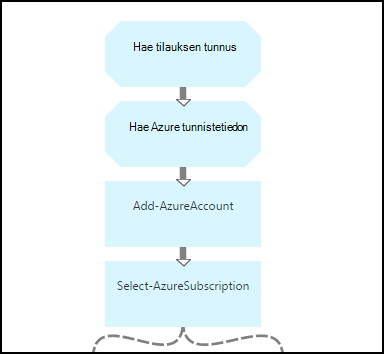

<properties 
    pageTitle="Käynnistäminen ja lopettaminen näennäiskoneiden - kaavion | Microsoft Azure"
    description="PowerShell-työnkulun versio, mukaan lukien runbooks aloittaa tai lopettaa perinteinen näennäiskoneiden Azure automaatio-skenaario."
    services="automation"
    documentationCenter=""
    authors="mgoedtel"
    manager="jwhit"
    editor="tysonn" />
<tags 
    ms.service="automation"
    ms.devlang="na"
    ms.topic="article"
    ms.tgt_pltfrm="na"
    ms.workload="infrastructure-services"
    ms.date="07/06/2016"
    ms.author="bwren" />

# Azure automaatio-skenaario - käynnistäminen ja näennäiskoneiden lopettaminen

Voit aloittaa ja lopettaa perinteinen näennäiskoneiden runbooks tässä Azure automaatio skenaariossa.  Tässä skenaariossa voit käyttää seuraavia toimia:  

- Käyttää sellaisenaan runbooks oman ympäristössä. 
- Muokkaa runbooks mukautettujen toimintojen suorittamiseen.  
- Kutsua toisen runbookin osana yleistä ratkaisu runbooks. 
- Määritä runbooks opetusohjelmat lisätietoja authoring käsitteitä runbookin. 

> [AZURE.SELECTOR]
- [Graafinen](automation-solution-startstopvm-graphical.md)
- [PowerShell-työnkulku](automation-solution-startstopvm-psworkflow.md)

Tämä on tässä skenaariossa graafinen runbookin-versio. Se on saatavilla myös käyttämällä [PowerShell työnkulun runbooks](automation-solution-startstopvm-psworkflow.md).

## Aloittaminen skenaario

Tämä vaihtoehto sisältää kaksi kaksi graafinen runbooks, jonka voi ladata seuraavista linkeistä.  Katso Tämä skenaario linkkejä PowerShell työnkulun runbooks [PowerShell-työnkulun version](automation-solution-startstopvm-psworkflow.md) .

| Runbookin | Linkki | Tyyppi | Kuvaus |
|:---|:---|:---|:---|
| StartAzureClassicVM | [Käynnistä Azure perinteinen AM graafinen Runbookin](https://gallery.technet.microsoft.com/scriptcenter/Start-Azure-Classic-VM-c6067b3d) | Graafinen | Aloittaa kaikki perinteinen näennäiskoneiden Azure tilaus tai kaikki näennäiskoneiden tietyn palvelun nimellä. |
| StopAzureClassicVM | [Lopeta Azure perinteinen AM graafinen Runbookin](https://gallery.technet.microsoft.com/scriptcenter/Stop-Azure-Classic-VM-397819bd) | Graafinen | Lopettaa kaikki näennäiskoneiden automaatio-tilin tai kaikki näennäiskoneiden tietyn palvelun nimellä.  |

## Asentaminen ja määrittäminen skenaario

### 1. runbooks asentaminen

Lataa runbooks voit tuoda ne ohjeen [Graafinen runbookin ohjeita](automation-graphical-authoring-intro.md#graphical-runbook-procedures).

### 2. Tarkista kuvaus ja vaatimukset
Runbooks sisältävät aktiviteettia kutsutaan **Lueminut** , joka sisältää kuvaus ja tarvittavat resurssit.  Voit tarkastella tiedot valitsemalla **Lueminut** -toimintojen ja **Työnkulun komentosarja** -parametrin.  Saat myös samat tiedot tästä artikkelista. 

### 3. resurssien määrittäminen
Runbooks edellyttää seuraavia kalusteet, joiden täytyy luoda ja lisätä haluamasi arvot.  Nimet ovat oletusarvon.  Voit käyttää kalusto eri nimillä, jos ne nimet, Määritä [Syöteparametrit](#using-the-runbooks) käynnistyessä: n runbookin.

| Kohteen tyyppi | Oletusnimi | Kuvaus |
|:---|:---|:---|:---|
| [Tunnistetietojen](automation-credentials.md) | AzureCredential | Sisältää tilille, jolla on oikeus aloittaa ja lopettaa näennäiskoneiden Azure tilauksen tunnistetiedot.  |
| [Muuttujan](automation-variables.md) | AzureSubscriptionId | Sisältää Tilaustunnus Azure tilauksen. |

## Skenaarion avulla

### Parametrit

Runbooks kunkin on seuraavia [Syöteparametrit](automation-starting-a-runbook.md#runbook-parameters).  Anna arvot pakollinen parametreja ja voit halutessasi kirjoittaa arvoja muiden parametrien tarpeen mukaan.

| Parametri | Tyyppi | Pakollinen | Kuvaus |
|:---|:---|:---|:---|
| Palvelun nimi | merkkijono | Ei | Jos arvo on annettu, kaikki kyseisen palvelun nimellä näennäiskoneiden on aloittaa tai pysäyttää.  Jos arvoa ei ole annettu, kaikki perinteinen näennäiskoneiden Azure tilauksen on aloittaa tai pysäyttää. |
| AzureSubscriptionIdAssetName | merkkijono | Ei | Sisältää [muuttujan resurssi](#installing-and-configuring-the-scenario) , joka sisältää Tilaustunnus Azure tilauksen nimi.  Jos et määritä arvo, *AzureSubscriptionId* käytetään.  |
| AzureCredentialAssetName | merkkijono | Ei | Sisältää [tunnistetiedon resurssi](#installing-and-configuring-the-scenario) , joka sisältää käyttämään runbookin tunnistetietojen nimen.  Jos et määritä arvo, *AzureCredential* käytetään.  |

### Aloitus runbooks

Voit käyttää tavoilla aloittamisen [runbookin Azure automaatio-](automation-starting-a-runbook.md) käynnistämiseen joko runbooks sisältö.

Esimerkki seuraavat komennot suoritetaan **StartAzureClassicVM** aloittaaksesi kaikki näennäiskoneiden palvelunimi *MyVMService*käyttämällä Windows PowerShell.

    $params = @{"ServiceName"="MyVMService"}
    Start-AzureAutomationRunbook –AutomationAccountName "MyAutomationAccount" –Name "StartAzureClassicVM" –Parameters $params

### Tulos

Runbooks on [tulosteen viestin](automation-runbook-output-and-messages.md) kunkin virtuaalikoneen, joka osoittaa, voit aloittaa tai lopettaa käsky lähetettiin onnistuneesti vai ei.  Voit etsiä tietyn merkkijonon kunkin runbookin tuloksen tulosteessa.  Seuraavassa taulukossa on lueteltu mahdollista tuloste merkkijonoja.

| Runbookin | Ehto | Viestin |
|:---|:---|:---|
| StartAzureClassicVM | Virtuaalikoneen on jo käytössä  | MyVM on jo käytössä |
| StartAzureClassicVM | Aloita pyyntö lähetettiin virtuaalikoneen | MyVM aloitettu |
| StartAzureClassicVM | Käynnistä-pyyntö virtuaalikoneen epäonnistui  | MyVM ei voitu käynnistää |
| StopAzureClassicVM | Virtuaalikoneen on jo käytössä  | MyVM jo pysäytetään |
| StopAzureClassicVM | Aloita pyyntö lähetettiin virtuaalikoneen | MyVM aloitettu |
| StopAzureClassicVM | Käynnistä-pyyntö virtuaalikoneen epäonnistui  | MyVM ei voitu käynnistää |

Seuraavassa on kuva käyttäen **StartAzureClassicVM** [lapsen runbookin](automation-child-runbooks.md) otoksen graafinen runbookin.  Tämä käyttää ehdollista linkit seuraavassa taulukossa.

| Linkki | Ehdot |
|:---|:---|
| Onnistui-linkki | $ActivityOutput ["StartAzureClassicVM"]-like "\* aloitettu"    |
| Virhe-linkki   | $ActivityOutput ["StartAzureClassicVM"]-notlike "\* aloitettu" |

## Erittelyn

Seuraavassa on tässä skenaariossa runbooks erittelyn.  Tämän toiminnon avulla voit mukauttaa runbooks tai juuri ja opi niiltä authoring automaatio-tekemät.
 

### Todennus

N runbookin käynnistyy Määritä [tunnistetiedot](automation-configuring.md#configuring-authentication-to-azure-resources) ja Azure tilauksen, jota käytetään: n runbookin muiden toimintojen kanssa.

Kaksi ensimmäistä toiminnot, **Hae Tilaustunnus** ja **Hae Azure tunnistetiedon**noutaa [resurssit](#installing-the-runbook) , joiden kaksi seuraavaa toimintojen avulla.  Näitä toimintoja voi määrittää suoraan varat, mutta ne on kohteiden nimet.  Koska olemme sallitaan käyttäjä voi määrittää ne nimet, [Syöteparametrit](#using-the-runbooks), annettava nämä toimet hakemiseen varat input-parametrin määrittämän nimellä.

**Lisää AzureAccount** määrittää tunnistetiedot, joita käytetään muiden: n runbookin.  Tunnistetietojen kohteen, se hakee **Hae Azure tunnistetieto** on oltava pääsy aloittaa ja lopettaa näennäiskoneiden Azure tilauksen.  **Valitse AzureSubscription** , joka käyttää tilauksen tunnus **Hae Tilaustunnus**mukaan on valittuna, jota käytetään tilauksen.

### Hae näennäiskoneiden

N runbookin täytyy määrittää, mitkä näennäiskoneiden työskentelee kanssa ja onko ne jo käynnistää tai pysäyttää (sen mukaan, runbookin).   Kaksi toimia noutaa VMs.  **Hae VMs-palvelun** suoritetaan, jos *palvelun nimi* syöteparametria varten: n runbookin sisältää arvon.  **Hae kaikki VMs** ovat käytössä, jos n runbookin *palvelun nimi* -syöteparametria ei sisällä arvoa.  Tämä logiikka suoritetaan ennen tehtävätyypin ehdollinen linkit.

Molempia toimintoja käyttämällä **Hae AzureVM** cmdlet-komento.  **Hae kaikki VMs** käyttää **ListAllVMs** -parametri palauttaa kaikki näennäiskoneiden.  **Hae VMs-palvelun** käyttää **GetVMByServiceAndVMName** parametrin sekä annetaan **palvelun nimi** syöteparametria **palvelun nimi** -parametrin.  

### Yhdistä VMs

**Yhdistä VMs** -toiminto on pakollinen antamaan syötteen **Käynnistä AzureVM** joka nimi ja aloita vm(s) palvelunimi.  Syötteen saattaa tulla **Hae kaikki VMs** tai **Hae VMs-palvelussa**, mutta **Käynnistä AzureVM** määrittää vain yksi tehtävä sen toimia.   

Skenaario on luotava **Yhdistäminen VMs** , joka suoritetaan, **Kirjoita tulosteen** cmdlet-komento.  **InputObject** parametrin kyseisen cmdlet-komento on PowerShell-lauseke, joka yhdistää syötteen edelliset kaksi tehtävät.  Vain yksi näistä toiminnoista suoritetaan, jolloin vain yhden joukon tulosteen odotetaan.  **Käynnistä AzureVM** käyttää kyseisen tulosteen sen syöteparametrit. 

### Aloita/Lopeta näennäiskoneiden

 

N runbookin riippuen seuraavat tehtävät yrittää käynnistää tai pysäyttää **Käynnistä AzureVM** tai **Pysäytä AzureVM**runbookin.  Tehtävän edeltää myyntijakso-linkin, koska se suoritetaan kerran kullekin objektille **Yhdistäminen VMs**palauttama.  Linkki edellytyksenä on, niin, että tehtävä voidaan suorittaa vain, jos virtuaalikoneen *RunningState* on *pysäytetty* , **Käynnistä AzureVM** ja *aloittaminen* **Stop AzureVM**varten. Jos tämä ehto ei täyty, sitten **Ilmoita jo aloittanut** tai **Ilmoittaa jo pysäytetty** suoritetaan lähettää viestin **Kirjoitus-tulokset**.

### Lähetä tulostus

 

: N runbookin viimeinen vaihe on lähettää tulosteen, onko kunkin virtuaalikoneen voit aloittaa tai lopettaa pyyntö lähetettiin onnistuneesti. On erillinen **Kirjoitus-tulokset** tehtävän, ja mikä niistä toimimaan ehdollinen linkit määrittäminen.  **Ilmoita AM aloittaa** tai **Ilmoittaa AM pysäyttää** suoritetaan, jos *OperationStatus* *onnistui*.  Jos *OperationStatus* on jokin muu arvo, valitse **Ilmoittaa epäonnistui Aloita** tai **Ilmoittaa epäonnistui Lopeta** suoritetaan.

## Seuraavat vaiheet

- [Graafisen Azure automaatio yhteiskäyttö](automation-graphical-authoring-intro.md)
- [Lapsen runbooks Azure automaatio-](automation-child-runbooks.md) 
- [Runbookin tulostus ja Azure Automaattiset viestien](automation-runbook-output-and-messages.md)