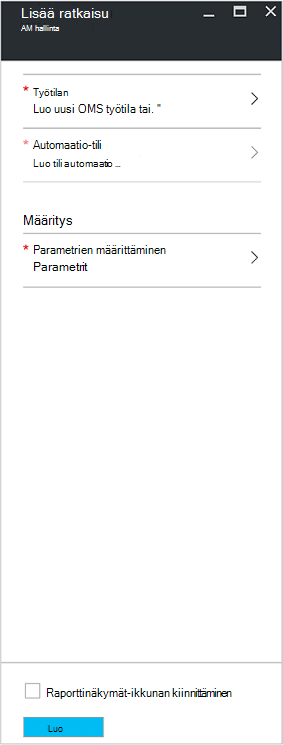
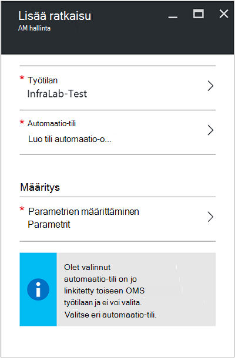
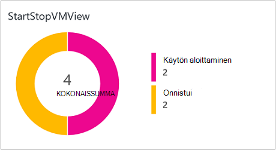
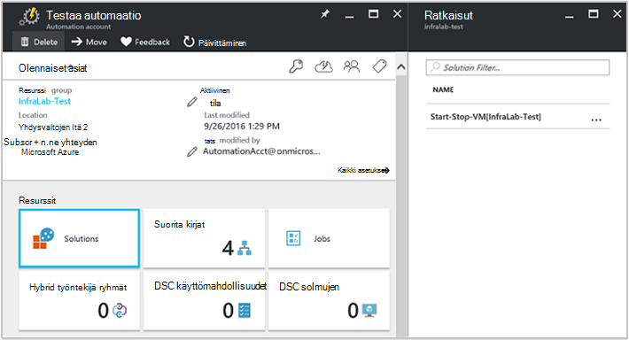
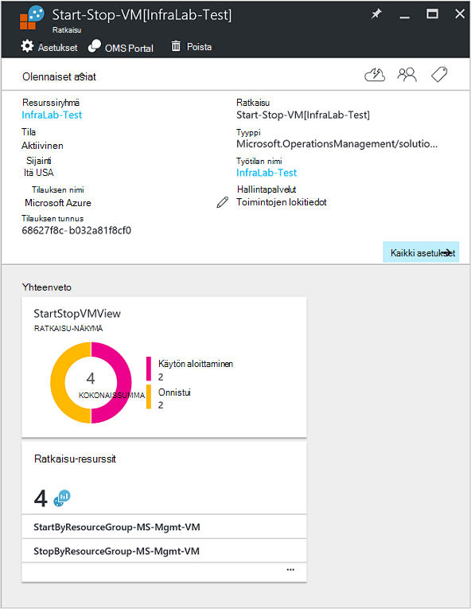

<properties
    pageTitle="Aloita/Lopeta VMs aikana off-hours [Esikatselu]-ratkaisun | Microsoft Azure"
    description="AM Management-ratkaisut aloittaa ja lopettaa Azure-Resurssienhallinta näennäiskoneiden aikataulun ja kun muutoksista seuranta Log Analytics."
    services="automation"
    documentationCenter=""
    authors="MGoedtel"
    manager="jwhit"
    editor=""
    />
<tags
    ms.service="automation"
    ms.workload="tbd"
    ms.tgt_pltfrm="na"
    ms.devlang="na"
    ms.topic="get-started-article"
    ms.date="10/07/2016"
    ms.author="magoedte"/>

# Aloita/Lopeta VMs aikana automaatio-ratkaisun off-hours [Esikatselu]

Aloita/Lopeta-VMs aikana off-hours [Esikatselu]-ratkaisun käynnistyy ja Azure Resurssienhallinta näennäiskoneiden lopettaa käyttäjän määrittämän aikataulun ja tarjoaa huomioon automaatio työt, jotka aloittaa ja lopettaa oman näennäiskoneiden kanssa OMS Log Analytics onnistuu.  

## Edellytykset

- Runbooks käsitellä [Azure Suorita nimellä tili](automation-sec-configure-azure-runas-account.md).  Suorita nimellä-tili on ensisijainen todentamismenetelmän, koska se käyttää sen sijaan, että salasana päättyy tai muuttuvat usein, että todennus.  

- Tämä ratkaisu vain hallita VMs, jotka ovat samassa tilauksen ja resurssiryhmä kuin automaatio-tilin sijainti.  

- Tämä ratkaisu otetaan käyttöön ainoastaan seuraavat Azure alueiden - Australia varaaja, Yhdysvaltojen Itä tai varaaja Aasian Länsi Europe.  Runbooks, joilla hallitaan AM aikatauluun kohdistaa VMs minkä tahansa alueella.  

- Jos haluat lähettää sähköposti-ilmoitukset, kun aloittamisesta ja lopettamisesta AM runbooks, tarvitaan Office 365 business-luokka-tilauksen.  

## Ratkaisun osat

Tämä ratkaisu koostuu on seuraavissa resursseissa, joka tuodaan ja lisätä automaatio-tiliisi.

### Runbooks

Runbookin | Kuvaus|
--------|------------|
CleanSolution-MS-hallintoraportointi-AM | Tämä runbookin poistaa kaikissa sisältyvissä resursseja ja aikatauluja, kun siirryt ratkaisun poistaminen tilauksesta.|  
SendMailO365-MS-hallintoraportointi | Tämä runbookin lähettää sähköpostia Office 365: n Exchange kautta.|
StartByResourceGroup-MS-hallintoraportointi-AM | Tämä runbookin eivät Käynnistä VMs (molemmat perinteinen ja ARM-pohjainen VMs), joka sijaitsee Azure resurssin jäsen annetusta luettelosta.
StopByResourceGroup-MS-hallintoraportointi-AM | Tämä runbookin on tarkoitettu lopettavat VMs (molemmat perinteinen ja ARM-pohjainen VMs), joka sijaitsee Azure resurssin jäsen annetusta luettelosta.|
 

### Muuttujat

Muuttujan | Kuvaus|
---------|------------|
**SendMailO365-MS-hallintoraportointi** Runbookin ||
SendMailO365-IsSendEmail-MS-hallintoraportointi | Määrittää, jos StartByResourceGroup-MS-hallintoraportointi-AM ja StopByResourceGroup-MS-hallintoraportointi-AM runbooks lähettää sähköposti-ilmoituksen valmistumisen.  Valitse **Tosi** käyttöön ja **Epätosi** sähköpostin ilmoitat poistaminen käytöstä. Oletusarvo on **Epätosi**.| 
**StartByResourceGroup-MS-hallintoraportointi-AM** Runbookin ||
StartByResourceGroup ExcludeList-MS-hallintoraportointi-AM | Kirjoita AM nimien hallinta-toiminnon; ulkopuolelle Erota nimet semi-colon(;) avulla. Arvojen salasanoissa eri merkeiksi ja yleismerkkien (tähti) tuetaan.|
StartByResourceGroup SendMailO365-EmailBodyPreFix-MS-hallintoraportointi | Teksti, joka lisätään sähköpostin viestin tekstin alkuun.|
StartByResourceGroup SendMailO365-EmailRunBookAccount-MS-hallintoraportointi | Määrittää, joka sisältää sähköpostin runbookin automaatio-tilin nimi.  **Älä muokkaa muuttuja.**|
StartByResourceGroup SendMailO365-EmailRunbookName-MS-hallintoraportointi | Määrittää sähköpostin runbookin nimen.  Tätä käytetään StartByResourceGroup-MS-hallintoraportointi-AM ja StopByResourceGroup-MS-hallintoraportointi-AM runbooks sähköpostin.  **Älä muokkaa muuttuja.**|
StartByResourceGroup SendMailO365-EmailRunbookResourceGroup-MS-hallintoraportointi | Määrittää nimen, joka sisältää sähköpostin runbookin resurssiryhmä.  **Älä muokkaa muuttuja.**|
StartByResourceGroup SendMailO365-SanomanOtsikko-MS-hallintoraportointi | Määrittää sähköpostin aihe-rivin teksti.|  
StartByResourceGroup SendMailO365-EmailToAddress-MS-hallintoraportointi | Määrittää sähköpostin vastaanottajan.  Näppäile erilliset nimet semi-colon(;).|
StartByResourceGroup TargetResourceGroups-MS-hallintoraportointi-AM | Kirjoita AM nimien hallinta-toiminnon; ulkopuolelle Erota nimet semi-colon(;) avulla. Arvojen salasanoissa eri merkeiksi ja yleismerkkien (tähti) tuetaan.  Oletusarvo (tähti) sisältää kaikki resurssiryhmät tilaus.|
StartByResourceGroup TargetSubscriptionID-MS-hallintoraportointi-AM | Määrittää tilaukseen, joka sisältää VMs voi hallita tätä ratkaisua.  Täytyy olla saman tilauksen tämä ratkaisu automaatio-tilin sijainti.|
**StopByResourceGroup-MS-hallintoraportointi-AM** Runbookin ||
StopByResourceGroup ExcludeList-MS-hallintoraportointi-AM | Kirjoita AM nimien hallinta-toiminnon; ulkopuolelle Erota nimet semi-colon(;) avulla. Arvojen salasanoissa eri merkeiksi ja yleismerkkien (tähti) tuetaan.|
StopByResourceGroup SendMailO365-EmailBodyPreFix-MS-hallintoraportointi | Teksti, joka lisätään sähköpostin viestin tekstin alkuun.|
StopByResourceGroup SendMailO365-EmailRunBookAccount-MS-hallintoraportointi | Määrittää, joka sisältää sähköpostin runbookin automaatio-tilin nimi.  **Älä muokkaa muuttuja.**|
StopByResourceGroup SendMailO365-EmailRunbookResourceGroup-MS-hallintoraportointi | Määrittää nimen, joka sisältää sähköpostin runbookin resurssiryhmä.  **Älä muokkaa muuttuja.**|
StopByResourceGroup SendMailO365-SanomanOtsikko-MS-hallintoraportointi | Määrittää sähköpostin aihe-rivin teksti.|  
StopByResourceGroup SendMailO365-EmailToAddress-MS-hallintoraportointi | Määrittää sähköpostin vastaanottajan.  Näppäile erilliset nimet semi-colon(;).|
StopByResourceGroup TargetResourceGroups-MS-hallintoraportointi-AM | Kirjoita AM nimien hallinta-toiminnon; ulkopuolelle Erota nimet semi-colon(;) avulla. Arvojen salasanoissa eri merkeiksi ja yleismerkkien (tähti) tuetaan.  Oletusarvo (tähti) sisältää kaikki resurssiryhmät tilaus.|
StopByResourceGroup TargetSubscriptionID-MS-hallintoraportointi-AM | Määrittää tilaukseen, joka sisältää VMs voi hallita tätä ratkaisua.  Täytyy olla saman tilauksen tämä ratkaisu automaatio-tilin sijainti.|  
 

### Aikatauluja

Aikataulu | Kuvaus|
---------|------------|
StartByResourceGroup-aikataulu-MS-hallintoraportointi | StartByResourceGroup runbookin, joka suorittaa tämä ratkaisu hallitsee VMs käynnistys aikataulu.|
StopByResourceGroup-aikataulu-MS-hallintoraportointi | StopByResourceGroup runbookin, joka suorittaa tämä ratkaisu hallitsee VMs Sammuta aikataulu.|

### Tunnistetiedot

Tunnistetietojen | Kuvaus|
-----------|------------|
O365Credential | Määrittää kelvollinen Office 365-käyttäjätilin sähköpostin.  Pakollinen vain, jos muuttujan SendMailO365-IsSendEmail-MS-hallintoraportointi arvo on **Tosi**.

## Määritys

Seuraavien toimien Lisää Aloita/Lopeta-VMs aikana off-hours [Esikatselu]-ratkaisun automaatio-tilisi ja määrittämällä sitten muuttujat Ratkaisun mukauttamiseen.

1. Valitse Aloitus-näytössä Azure-portaalissa, **Marketplace** -ruutu.  Jos se ei enää kiinnitettyinä aloitus-näytön vasemmasta siirtymisruudusta valitsemalla **Uusi**.  
2. Kirjoita Marketplace-sivu hakuruutuun **Käynnistä AM** ja valitse sitten hakutuloksista ratkaisu **Aloita/Lopeta VMs aikana off-hours [Esikatselu]** .  
3. Valitun ratkaisun **Aloita/Lopeta VMs aikana off-hours [Esikatselu]** -sivu Tarkista yhteenvetotiedot ja valitse sitten **Luo**.  
4. **Lisää ratkaisu** -sivu tulee näkyviin, jossa sinua kehotetaan määrittäminen ratkaisun, ennen kuin voit tuoda sen automaatio-tilauksen.     
5.  Valitse **Työtila** ja tässä OMS-työtila, joka on liitetty samaan Azure-tilaukseen, joka on automaatio-tilin tai luoda uuden työtilan OMS valita **Lisää ratkaisu** -sivu.  Jos sinulla ei ole OMS-työtila, voit valita **Luo uusi työtila** ja suorita **OMS työtila** -sivu seuraavasti: 
   - Määritä uusi **OMS työtilan**nimi.
   - Valitse **tilaus** valitsemalla avattavasta luettelosta, jos valittuna oletusarvoisesti ei sovellu linkittäminen.
   - **Resurssiryhmä**-Luo uusi resurssiryhmä tai valitse aiemmin luotu resurssiryhmä.  
   - Valitse **sijainti**.  Tällä hetkellä vain sijainnit valintaa varten annettu ovat **Australia varaaja**, **Yhdysvaltojen Itä**tai **varaaja Aasian** **Länsi Europe**.
   - Valitse **hinnoittelu taso**.  Ratkaisu tarjotaan kaksi tasoa: vapauttaa ja OMS maksettu taso.  Vapaa taso on rajoitukset kerättyjä tietoja määrästä päivittäin, säilytysaika ja runbookin työn runtime minuuttia.  Maksettu OMS taso ei ole rajoitukset kerätä päivittäin tietojen määrää.  

        > [AZURE.NOTE]
        > Kun maksettu taso erillinen näytetään näkyy jo vaihtoehdoissa, ei ole käytettävissä.  Jos napsauttamalla sitä ja jatka tätä ratkaisua luonti-tilaukseesi, se epäonnistuu.  Tämä osoitetaan, kun tämä ratkaisu virallisesti julkaistaan. Jos käytät tätä ratkaisua, se vain Automaattiset työn minuutteina ja kirjaudu nieltynä.  Ratkaisu Lisää muut OMS solmut-ympäristöön.  

6. Kun olet antanut tarvittavat tiedot- **OMS työtila** -sivu, valitse **Luo**.  Kun tiedot on vahvistettu ja työtila on luotu, voit seurata etenemisen **ilmoitukset** -kohdassa valikosta.  Palaat **Lisää ratkaisu** -sivu.  
7. Valitse **Lisää ratkaisu** -sivu **Automaatio-tili**.  Jos luot uuden OMS työtilan, sinun täytyy myös luoda uuden automaatio-tilin, joka on liitetty kanssa uusi OMS työtilan aiemmin määritetty Azure tilaus-, resurssiryhmä- ja alueasetukset.  Voit valita **Luo automaatio-tili** ja antaa **automaatio Lisää tili** -sivu seuraavasti: 
  - Kirjoita **nimi** -kenttään automaatio-tilin nimi.

    Muut asetukset täytetään automaattisesti valittuna OMS työtilan perusteella ja vaihtoehdoista ei voi muokata.  Azure Suorita nimellä-tili on ratkaisuun sisältyvät runbooks todennus oletustapa.  Kun valitset **OK**, kokoonpanoasetusten määrittäminen tarkistetaan ja automaatio-tili on luotu.  Voit seurata sen edistymistä, valitse **ilmoitukset** -valikosta. 

    Muussa tapauksessa voit valita aiemmin automaatio Suorita nimellä-tili.  Huomaa, että valitsemasi tilin ei jo voi linkittää toiseen OMS työtilaan muussa viestin esitettyjä ilmoittaa sivu.  Jos se on jo linkitetty, sinun on valita eri automaatio Suorita nimellä tilin tai luoda uuden.    

8. Valitse lopuksi **Lisää ratkaisu** -sivu **määritystä** ja **Parametrit** -sivu tulee näkyviin.  Valitse **Parametrit** -sivu sinua kehotetaan:  
   - Määrittää **Kohde ResourceGroup nimet**, joka on on resurssin nimen, joka sisältää VMs voi hallita tätä ratkaisua.  Voit syöttää useita nimiä ja erota jokainen toisistaan puolipisteellä (arvot ovat kirjainkoko on merkitsevä).  Käyttää yleismerkkiä tuetaan, jos haluat kaikkien resurssien ryhmien tilauksen VMs kohde.
   - Valitse **aikataulu** on toistuva päivämäärä ja kellonaika käynnistäminen ja lopettaminen AM-kohteen resurssin jäsen.  

10. Kun olet suorittanut määrittäminen edellyttää ratkaisun valittuihin asetuksiin, valitse **Luo**.  Kaikki asetukset tarkistetaan ja valitse se yrittää ratkaisu-tilaukseesi.  Voi kestää joitakin sekunteja suorittamiseen ja **ilmoitukset** -kohdassa sen edistymistä voi seurata valikosta. 

## Sivustokokoelman korkojakso

Automaatio työn log ja työn stream tietoja nautitaan kyselyjä OMS säilö viiden minuutin välein.  

## Ratkaisun avulla

Kun lisäät AM Management-ratkaisun, OMS työtilassa **StartStopVM Näytä** ruutu lisätään OMS Raporttinäkymät-ikkunan.  Tässä ruudussa näkyy Laske- ja runbooks työt ratkaisun, jotka on aloitettu ja suoritettu onnistuneesti graafinen esitys.     

Automaatio-tilisi voit käyttää ja hallita ratkaisun **ratkaisut** -ruutu valitsemalla ja sitten **ratkaisut** -sivu valitsemalla **Käynnistä-Lopeta-AM [työtilan]** -ratkaisun luettelosta.     

Valitsemalla ratkaisun näkyy **Käynnistä-Lopeta-AM [työtilan]** ratkaisu-sivu, jossa voit tarkastella tärkeät tiedot, kuten **StartStopVM** -ruutu, kuten OMS työtilassa, joka näyttää Laske- ja runbooks työt ratkaisun, jotka on aloitettu ja suoritettu onnistuneesti graafinen esitys.     

Tässä voit myös avata OMS työtilan ja työn tietueet analysoida.  Vain **kaikki asetukset**, ja valitse **asetukset** -sivu **Pika-aloitus** ja valitse sitten **OMS portaalin** **Pika-aloitus** -sivu.   Tämä Avaa uudessa välilehdessä tai uusi selausistunto ja esittää automaatio-tili tai tilaukseen liittyvää OMS työtilassa.  

### Sähköposti-ilmoitusten määrittäminen

Sähköposti-ilmoitukset käyttöön, kun AM aloittamisesta ja lopettamisesta runbooks valmiina, sinun on muokattava **O365Credential** tunnistetietojen ja vähintään seuraavat muuttujat:

 - SendMailO365-IsSendEmail-MS-hallintoraportointi
 - StartByResourceGroup SendMailO365-EmailToAddress-MS-hallintoraportointi
 - StopByResourceGroup SendMailO365-EmailToAddress-MS-hallintoraportointi

Voit määrittää **O365Credential** tunnistetieto toimimalla seuraavasti:

1. Automaatio-tilisi valitsemalla **Kaikki asetukset** -ikkunan yläosassa. 
2. **Valitse kohdassa **Automation resurssien** **asetukset** -sivu.** 
3. **Kalusto** -sivu, valitse **tunnistetiedot** -ruutu ja valitse **O365Credential** **tunnistetiedon** -sivu.  
4. Kelvollinen Office 365: n käyttäjänimi ja salasana ja valitse sitten Tallenna muutokset **Tallenna** .  

Voit määrittää korostettuna aiemmin muuttujat toimimalla seuraavasti:

1. Automaatio-tilisi valitsemalla **Kaikki asetukset** -ikkunan yläosassa. 
2. **Valitse kohdassa **Automation resurssien** **asetukset** -sivu.** 
3. **Kalusto** -sivu- **muuttujat** -ruutu ja valitse yllä muuttujan **muuttujat** -sivu ja muokkaa sitten sen kuvaus entisellään [muuttuja](##variables) -osassa arvo sen seuraavasti.  
4. Valitse Tallenna muutokset muuttujan **Tallenna** .   

### Käynnistysasetusten ja Sammuta aikataulun muokkaaminen

Tämä ratkaisu käynnistys ja Sammuta aikataulussa hallinta noudattaa samoja vaiheita kuvatulla tavalla [ajoituksen runbookin Azure automaatio](automation-scheduling-a-runbook.md).  Muista, että et voi muokata aikataulu-määritys.  Sinun on aiemmin luodun aikataulun poistaminen käytöstä ja luo sitten uusi ja sitten linkki **StartByResourceGroup-MS-hallintoraportointi-AM** tai **StopByResourceGroup-MS-hallintoraportointi-AM** runbookin, johon haluat lisätä aikatauluun.   

## Kirjaudu Analytics-tietueet

Automaatio Luo kahdentyyppisiä tietueita OMS säilö.

### Työn lokit

Ominaisuus | Kuvaus|
----------|----------|
Soittajan |  Kuka aloitti toiminto.  Mahdolliset arvot ovat sähköpostiosoite- tai ajoitetuissa järjestelmän.|
Luokka | Tietojen tyypin luokitus.  Automaatio-arvo on JobLogs.|
CorrelationId | GUID-tunnus, joka on runbookin työn korrelaatiotunnus.|
Työn tunnus | GUID-tunnus, joka on runbookin työn tunnus.|
operationName | Määrittää Azure suorittaa toiminnon.  Automaatio-arvo on työn.|
resourceId | Määrittää resurssin lajin Azure.  Automaatio-arvo on n runbookin liittyvää automaatio-tiliä.|
ResourceGroup | Määrittää runbookin työn resurssiryhmän nimi.|
ResourceProvider | Määrittää Azure-palvelun, joka tuottaa resursseja, voit ottaa käyttöön ja hallita.  Automaatio-arvo on Azure automaatio.|
ResourceType | Määrittää resurssin lajin Azure.  Automaatio-arvo on n runbookin liittyvää automaatio-tiliä.|
resultType | Runbookin projektin tila.  Mahdolliset arvot ovat: -Käytön aloittaminen -Stopped -Hyllytetty -Epäonnistui -Onnistui|
resultDescription | Tässä artikkelissa kuvataan runbookin työn tuloksen tila.  Mahdolliset arvot ovat: -Työ on aloitettu -Työ epäonnistui -Työ on valmistunut|
RunbookName | Määrittää: n runbookin nimen.|
SourceSystem | Määrittää lähdejärjestelmän lähetetyt tiedot.  Automaatio-arvo on: OpsManager|
StreamType | Määrittää tapahtuman tyyppi. Mahdolliset arvot ovat: -Yksityiskohtainen -Tulostus -Virhe -Varoitus|
SubscriptionId | Määrittää työn tilauksen tunnus.
Aika | Päivämäärä ja kellonaika, kun runbookin työ suoritetaan.|

### Työn virtaa

Ominaisuus | Kuvaus|
----------|----------|
Soittajan |  Kuka aloitti toiminto.  Mahdolliset arvot ovat sähköpostiosoite- tai ajoitetuissa järjestelmän.|
Luokka | Tietojen tyypin luokitus.  Automaatio-arvo on JobStreams.|
Työn tunnus | GUID-tunnus, joka on runbookin työn tunnus.|
operationName | Määrittää Azure suorittaa toiminnon.  Automaatio-arvo on työn.|
ResourceGroup | Määrittää runbookin työn resurssiryhmän nimi.|
resourceId | Määrittää Azure resurssin tunnus.  Automaatio-arvo on n runbookin liittyvää automaatio-tiliä.|
ResourceProvider | Määrittää Azure-palvelun, joka tuottaa resursseja, voit ottaa käyttöön ja hallita.  Automaatio-arvo on Azure automaatio.|
ResourceType | Määrittää resurssin lajin Azure.  Automaatio-arvo on n runbookin liittyvää automaatio-tiliä.|
resultType | Tapahtuma on luotu milloin runbookin työn tulos.  Mahdolliset arvot ovat: -Aktiivisuustila|
resultDescription | Sisältää: n runbookin-tulostus-muodossa.|
RunbookName | N runbookin nimi.|
SourceSystem | Määrittää lähdejärjestelmän lähetetyt tiedot.  Automaatio-arvo on OpsManager|
StreamType | Työn stream tyyppi. Mahdolliset arvot ovat: -Käynnissä -Tulostus -Varoitus -Virhe -Korjaaminen -Yksityiskohtainen|
Aika | Päivämäärä ja kellonaika, kun runbookin työ suoritetaan.|

Lokitiedoston etsinnän, joka palauttaa tietueet luokan **JobLogs** tai **JobStreams**suoritettaessa voit valita **JobLogs** tai **JobStreams** näkymän joka näkyy ruutujoukossa yhteenvetojen haun palauttamat päivitykset.

## Esimerkki log haut

Seuraavassa taulukossa on esimerkki log etsii työn tietueiden keräämiä tämä ratkaisu. 

Kyselyn | Kuvaus|
----------|----------|
Etsi työt runbookin StartVM, joka on suoritettu | Luokan = JobLogs RunbookName_s = "StartByResourceGroup-MS-hallintoraportointi-AM" ResultType = onnistui & #124; mittaa count() JobId_g mukaan|
Etsi työt runbookin StopVM, joka on suoritettu | Luokan = JobLogs RunbookName_s = "StartByResourceGroup-MS-hallintoraportointi-AM" ResultType = epäonnistui & #124; mittaa count() JobId_g mukaan
Näytä tilan StartVM ja StopVM runbooks ajan mittaan | Luokan = JobLogs RunbookName_s = "StartByResourceGroup-MS-hallintoraportointi-AM" tai "StopByResourceGroup-MS-hallintoraportointi-AM" NOT(ResultType="started") | mittaa Count() ResultType aikavälillä 1 päivä|

## Seuraavat vaiheet

- Lue lisää eri hakukyselyt laatimiseen ja tarkista automaatio työn lokien Log Analytics-kohdassa [Log rajaamalla Log Analytics](../log-analytics/log-analytics-log-searches.md)
- Lisätietoja runbookin suorittamisen, kuinka voit valvoa runbookin projektien ja muiden teknisistä tiedoista on artikkelissa [runbookin Työn seuranta](automation-runbook-execution.md)
- Lisätietoja OMS Log analyysin ja sivustokokoelman tietolähteet-kohdassa [kerääminen Azure tallennustilan tiedot Log Analytics yleiskatsaus](../log-analytics/log-analytics-azure-storage.md)

   

