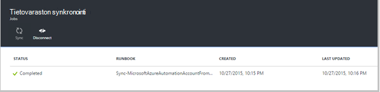

<properties 
    pageTitle=" Tietolähteen hallinta-integroinnin Azure automaatio | Microsoft Azure"
    description="Tässä artikkelissa kuvataan tietolähteen ohjausobjektin integrointi Azure automaatio GitHub."
    services="automation"
    documentationCenter=""
    authors="mgoedtel"
    manager="jwhit"
    editor="tysonn" />    
<tags 
    ms.service="automation"
    ms.devlang="na"
    ms.topic="article"
    ms.tgt_pltfrm="na"
    ms.workload="infrastructure-services"
    ms.date="09/12/2016"
    ms.author="magoedte;sngun" />

# Tietolähteen hallinta-integroinnin Azure automaatio

Tietolähteen ohjausobjektin integroinnin avulla voit yhdistää runbooks GitHub tietolähteen ohjausobjektin säilöön automaatio-tilisi. Tietolähteen ohjausobjektin avulla voit helposti työskentely työryhmän kanssa, muutosten jäljittäminen ja palata oman runbooks aiemmissa versioissa. Esimerkiksi tietolähteen ohjausobjektin avulla voit synkronoida eri haaroja tietolähteen ohjausobjektin kehitystä, Testaa tai tuotannon automaatio tilit, helpottaa edistää tunnus, jolla on testattu kehittäminen ympäristön oman tuotannon automaatio-tili.

Tietolähteen ohjausobjektin voit push koodin Azure automaatio-ja tietolähteen ohjausobjektin tai tuoda oman runbooks hallinnassa, Azure automaatio. Tässä artikkelissa käsitellään määrittäminen tietolähteen ohjausobjektin Azure automaatio-ympäristössä. Olemme alkavat Azure automaatio GitHub säilöön ja käy läpi eri toiminnoista, joita voidaan toteuttaa määrittämällä tietolähteen ohjausobjektin integroinnin. 

>[AZURE.NOTE]Tietolähteen ohjausobjektin tukee tietojen ja [PowerShell työnkulun runbooks](automation-runbook-types.md#powershell-workflow-runbooks) sekä [PowerShell runbooks](automation-runbook-types.md#powershell-runbooks)valitseminen. [Graafisen runbooks](automation-runbook-types.md#graphical-runbooks) ei vielä tueta.  

Sisältää kaksi määrittäminen tietolähteen ohjausobjektin automaatio-tilisi ja vain, jos sinulla on jo GitHub tili pakollinen yksinkertainen vaihetta. Ne:
## Vaihe 1 – Luo GitHub säilö

Jos sinulla on jo GitHub-tili ja säilöön, jonka haluat linkittää Azure automaatio ja valitse Kirjaudu sisään aiemmin luodulle tilille ja aloita vaihe 2 alla. Muussa tapauksessa siirry [GitHub](https://github.com/), kirjaudu määrittäminen uuden tilin ja [Luo uusi tietovarasto](https://help.github.com/articles/create-a-repo/).

## Vaihe 2 – Azure automaatio-ja tietolähteen ohjausobjektin määrittäminen

1. Azure-portaalissa automaatio-tili-sivu, valitse **määrittäminen lähde-ohjausobjekti.** 
 
    

2. **Ohjausobjektin lähde** -sivu avautuu, jossa voit määrittää GitHub tilitiedot. Alla on luettelo parametrien määrittäminen:  

  	|**Parametri**            |**Kuvaus** |
  	|:---|:---| 
  	|Valitse lähde   | Valitse lähde. Tällä hetkellä vain **GitHub** tuetaan. |
  	|Todennus | Azure automaatio käyttöoikeuden GitHub säilö valitsemalla **Hyväksy** . Jos olet jo kirjautunut GitHub tilisi omassa ikkunassaan, käytetään kyseisen tilin tunnistetiedot. Kun todennus on onnistunut, sivu näkyy **Luvan**ominaisuuden GitHub käyttäjänimesi. |
  	|Valitse säilöön | Valitse GitHub säilön käytettävissä säilöjen tietoihin luettelo. |
  	|Valitse haara | Valitse haara käytettävissä haaroja luettelosta. Vain **perusmuodon** haaran näkyy Jos et ole vielä luonut minkä tahansa haaroja. |
  	|Runbookin kansiopolku | Runbookin kansiopolku määrittää polun GitHub säilöön, josta haluat push tai tuoda koodisi. Se on kirjoitettava muodossa **/foldername/subfoldername**. Vain runbooks runbookin kansion polun synkronoidaan automaatio-tiliisi. Runbooks alikansioista runbookin kansion polku avautuu **ei** voi synkronoida. Käytä **/** Synkronoi kaikki runbooks säilö-kohdassa. |

3. Esimerkiksi jos säilön nimeltä **PowerShellScripts** , joka sisältää **RootFolder**-nimiseen kansioon, joka sisältää kansion nimi **alikansion**. Voit käyttää seuraavia merkkijonoja tasoissa kansion synkronointi:

    1. Voit synkronoida runbooks **säilöstä**runbookin kansiopolku on*/*
    2. Synkronoi- **RootFolder**runbooks runbookin kansiopolku on */RootFolder*
    3. Synkronoi- **alikansion**runbooks runbookin kansiopolku on */RootFolder/SubFolder*.
  

4. Kun määrität parametreja, ne näkyvät **määrittäminen lähde-ohjausobjektin sivu.**  
 
    

5. Kun valitset OK, ohjausobjektin lähde-integrointi on nyt määritetty automaatio-tilisi ja GitHub tiedot päivitetään. Voit valita nyt voit tarkastella kaikkia tietolähteen ohjausobjektin synkronointi oman Työhistoria tämän osan.  

    

6. Määritettyäsi tietolähteen ohjausobjektin automaatio-tilisi luodaan automaatio seuraavissa resursseissa:  
 Kahden [muuttujan varat](automation-variables.md) luodaan.  
      
    * Muuttujan **Microsoft.Azure.Automation.SourceControl.Connection** sisältää yhteysmerkkijonossa arvot alla kuvatulla tavalla.  

  	|**Parametri**            |**Arvo** |
  	|:---|:---|
  	| Nimi  | Microsoft.Azure.Automation.SourceControl.Connection |
  	| Tyyppi | Merkkijono |
  	| Arvo  | {"Haaran":\<*haaran nimi*>, "RunbookFolderPath":\<*Runbookin kansiopolku*>, "ProviderType":\<*on arvo 1, GitHub*>, "Säilöön":\<*lisääminen säilöön nimi*>, "Käyttäjänimi":\<*Your GitHub käyttäjänimi*>} |   

    * Muuttujan **Microsoft.Azure.Automation.SourceControl.OAuthToken**on kohdassa OAuthToken suojatun salatun arvo.  

  	|**Parametri**            |**Arvo** |
  	|:---|:---|
  	| Nimi  | Microsoft.Azure.Automation.SourceControl.OAuthToken |
  	| Tyyppi | Unknown(encrypted) |
  	| Arvo | <*Salatun OAuthToken*> |  

      

    * **Automaatio ja tietolähteen ohjausobjektin** lisätään valtuutettuja sovelluksena GitHub-tiliisi. Voit tarkastella sovelluksen: Siirry GitHub kotisivulla **profiilin** > **asetukset** > **sovellukset**. Tämän sovelluksen avulla Azure automaatio synkronoimaan GitHub-tietovarasto automaatio-tiliin.  

    

## Tietolähteen ohjausobjektin käyttäminen automaatio

### Sisäänkuittauksen runbookin Azure automaatio-hallintaan

Runbookin sisäänkuittauksen avulla voit push tekemäsi runbookin Azure automaatio-lähde-ohjausobjektin säilöön kyselyjä muutokset. Seuraavassa on sisäänkuittauksen runbookin vaiheet:

1. Automaatio-tiliä, [Luo uusi tekstiä runbookin](automation-first-runbook-textual.md)tai [Muokkaa olemassa olevia, tekstimuotoinen runbookin](automation-edit-textual-runbook.md). Tämä runbookin voi olla PowerShell työnkulun tai PowerShell-komentosarjaa runbookin.  

2. Kun olet muokannut oman runbookin, tallenna se ja valitse **sisäänkuittauksen** - **Muokkaa** -sivu.  

    

     >[AZURE.NOTE] Kuittaa sisään-Azure automaatio korvaa koodi, joka on tällä hetkellä tietolähteen ohjausobjektin. Git vastaavat komentorivin ohje sisäänkuittauksen on **git Lisää + git Vahvista + git push**  

3. Kun napsautat **sisäänkuittauksen**, tulee näyttöön tulee vahvistussanoma, jatka valitsemalla Kyllä.  

    

4. Sisäänkuittauksen käynnistyy Ohjausobjektin lähde-runbookin: **Synkronointi MicrosoftAzureAutomationAccountToGitHubV1**. Tämä runbookin muodostaa yhteyden GitHub ja vie muutokset Azure automaatio-että säilöön. Voit tarkastella sisäänkuittauksen Työhistoria, palaa **Tietolähteen ohjausobjektin integraatio** -välilehti ja avaa säilöön synkronointi-sivu napsauttamalla. Tämä sivu näyttää kaikkien lähde hallinta-projekteille.  Valitse työ haluat tarkastella ja sitten voit tarkastella tietoja.  

    

    >[AZURE.NOTE] Tietolähteen ohjausobjektin runbooks ovat erityisiä automaatio-runbooks, et voi tarkastella tai muokata. Samalla, kun ne eivät näy runbookin luettelossa, näet synkronoinnin työt näy Projektit-luettelossa.
 
5. Muokattu runbookin nimi lähetetään syötteen parametrina sisäänkuittauksen runbookin. Voit [tarkastella projektin](automation-runbook-execution.md#viewing-job-status-using-the-azure-management-portal) laajentamalla **Säilöön synkronoinnin** sivu runbookin.  

    

6. Päivitä GitHub säilöön, kun työ on valmis voit tarkastella muutoksia.  Säilöön, jos Vahvista viestillä pitäisi olla vahvistamista: * *Updated *Runbookin nimi* -Azure Automation.* *  

### Synkronoi runbooks hallinnassa Azure automaatio 

Tietovaraston synkronointi-sivu valitsemalla Synkronoi-painiketta voit tuoda kaikki runbooks runbookin kansion polun lisääminen säilöön automaatio-tiliisi. Saman säilö voi synkronoida useita automaatio-tilille. Alla on ohjeet synkronointi runbookin:

1. Automaatio-tililtä, jossa tietolähteen ohjausobjektin määrittäminen, avaat **tietolähteen ohjausobjektin integrointi/säilöön synkronoinnin sivu** ja valitse **Synkronoi** sitten näyttöön tulee kehotus vahvistussanoman Jatka valitsemalla **Kyllä** .  

    

2. Synkronointi aloitetaan: n runbookin: **Synkronointi MicrosoftAzureAutomationAccountFromGitHubV1**. Tämä runbookin muodostaa yhteyden GitHub ja hakee muutokset oman säilöstä Azure automaatio. Raportissa pitäisi näkyä uusi projekti, jotta tämä toiminto **Säilöön synkronoinnin** -sivu. Voit tarkastella tietoja synkronointi työn, voit avata projektin tiedot-sivu.  
 
    

 
    >[AZURE.NOTE] Synkronoi lähteestä ohjausobjektista korvaa **kaikki** runbooks tietolähteen ohjausobjektin olevat automaatio-tilisi tällä hetkellä käytettävissä olevia runbooks luonnos-versiota. Synkronoi Git vastaavat komentorivin ohje on **erotettu git**

## Ohjausobjektin lähde-ongelmien vianmääritys

Jos virheitä sisäänkuittauksen tai synkronointi työhön, työn tila keskeytetään, ja voit tarkastella tarkempia tietoja virheen työ-sivu.  **Kaikki lokit** -osa näyttää kaikki työhön liittyvää PowerShell virtaa. Tämä antaa sinulle auttaa korjaa mahdolliset sisäänkuittauksen tai synkronoi tarvittavia tietoja. Se näkyvät myös toiminnot, jotka synkronoidaan tai tarkistuksen käytöstä runbookin tapahtui järjestystä.  

## Tietolähteen ohjausobjektin yhteyden katkaiseminen

Katkaise yhteys GitHub tililtä, Avaa säilöön synkronointi-sivu ja valitse **Katkaise yhteys**. Kun lopetat tietolähteen ohjausobjektin, automaatio-tilisi säilyy edelleen runbooks, jotka on synkronoitu aiemmin, mutta säilöön synkronointi-sivu ei käytössä.  

  

## Seuraavat vaiheet

Lisätietoja tietolähteen ohjausobjektin integrointi on seuraavissa resursseissa:  
- [Azure automaatio: Tietolähteen ohjausobjektin integroinnin Azure automaatio](https://azure.microsoft.com/blog/azure-automation-source-control-13/)  
- [Suosikkiuutislähteesi ohjausobjektin järjestelmän äänestä](https://www.surveymonkey.com/r/?sm=2dVjdcrCPFdT0dFFI8nUdQ%3d%3d)  
- [Azure automaatio: Paikallisen ympäristön integroinnissa Runbookin tietolähteen ohjausobjektin Visual Studio Team Services-palvelujen avulla](https://azure.microsoft.com/blog/azure-automation-integrating-runbook-source-control-using-visual-studio-online/)  
