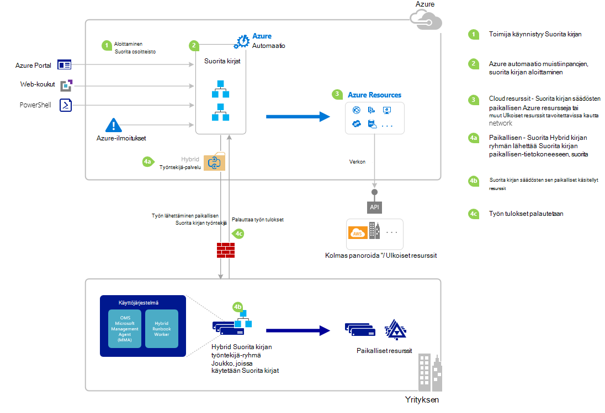

<properties
   pageTitle="Tietojen runbookin Azure automaatio | Microsoft Azure"
   description="Yhteenveto eri tavoilla avulla voidaan aloittaa runbookin Azure automaatio ja annetaan tietoja Azure portal- ja Windows PowerShellin avulla."
   services="automation"
   documentationCenter=""
   authors="mgoedtel"
   manager="jwhit"
   editor="tysonn" />
<tags
   ms.service="automation"
   ms.devlang="na"
   ms.topic="article"
   ms.tgt_pltfrm="na"
   ms.workload="infrastructure-services"
   ms.date="10/08/2016"
   ms.author="magoedte;bwren"/>

# <a name="starting-a-runbook-in-azure-automation"></a>Tietojen runbookin Azure automaatio

Seuraavan taulukon avulla voit voit aloittaa runbookin Azure automaatio, joka on parhaiten sopiva tietyn skenaarion siirtomenetelmä. Tässä artikkelissa on lisätietoja Azure-portaalissa ja Windows PowerShellin avulla runbookin käynnistäminen. Muita tapoja tiedot on tarkoitettu muita asiakirjoja, voit käyttää alla olevia linkkejä.

| **MENETELMÄ**                                                                    | **OMINAISUUDET**                                                                                                                                                                                                                                                                                                                                                |
|-------------------------------------------------------------------------------|--------------------------------------------------------------------------------------------------------------------------------------------------------------------------------------------------------------------------------------------------------------------------------------------------------------------------------------------------------------------|
| [Azure Portal](#starting-a-runbook-with-the-azure-portal)                     | <li>Helpoin tapa vuorovaikutteinen käyttöliittymää.<br> <li>Yksinkertainen parametrin arvot lomake.<br> <li>Helposti seuraamaan työn tila.<br> <li>Accessin todennettu Azure sisäänkirjautumisen kanssa.                                                                                                                                                                               |
| [Windows PowerShellin](https://msdn.microsoft.com/library/dn690259.aspx)        | <li>Soita komentoriviltä kanssa Windows PowerShellin cmdlet-komennot.<br> <li>Voit lisätä Automaattinen ratkaisussa, jossa on useita vaiheita.<br> <li>On todentaa varmennetta tai OAuth käyttäjän pääasiallista / palvelun pääasiallista.<br> <li>Anna yksinkertaisten ja monimutkaisten parametriarvot.<br> <li>Voit seurata projektin tila.<br> <li>Asiakkaan tarvitaan, jotta PowerShellin cmdlet-komennot. |
| [Azure automaatio-Ohjelmointirajapinta](https://msdn.microsoft.com/library/azure/mt662285.aspx) | <li>Helpoin tapa, mutta myös useimmat kompleksiluvun.<br> <li>Soita mukautetun koodin, jotka voivat tehdä pyyntöjen.<br> <li>Pyyntö todentaa varmennetta tai Oauth käyttäjän pääasiallista / palvelun pääasiallista.<br> <li>Anna yksinkertaisten ja monimutkaisten parametriarvot.<br> <li>Voit seurata projektin tila.                                                                          |
| [Webhooks](automation-webhooks.md)                                            | <li>Käynnistä runbookin yksittäisen HTTP-pyynnön.<br> <li>Todennettu suojaustunnus URL-osoitteen kanssa.<br> <li>Asiakas ei voi ohittaa webhook luotaessa parametriarvot. Runbookin voit määrittää yksittäisen parametri, joka lisätään HTTP-pyynnön tiedot.<br> <li>Ei voi seurata projektin tila webhook URL-Osoitteen kautta.                                      |
| [Azure reagoiminen](../log-analytics/log-analytics-alerts.md)               | <li>Aloita runbookin saatuaan Azure ilmoitus.<br> <li>Määritä webhook runbookin ja ilmoita-linkkiä.<br> <li>Todennettu suojaustunnus URL-osoitteen kanssa.<br> <li>Tukee tällä hetkellä ilmoitus arvojen mukaisesti vain.                                                                                                                                                       |
| [Aikataulu](automation-schedules.md)                                | <li>Käynnistä runbookin automaattisesti tunnin välein, päivittäin tai viikoittain aikataulun mukaisesti.<br> <li>Käsitellä Azure portal, PowerShellin cmdlet-komennot ja Azure API aikataulu.<br> <li>Anna parametriarvot, jota käytetään aikataulu.                                                                                                                                               |
| [Valitse toinen Runbookin](automation-child-runbooks.md)                          | <li>Määritä runbookin toiseen runbookin toimintaa.<br> <li>Hyödyllisiä toimintoja, jotka käyttävät useita runbooks.<br> <li>Anna parametriarvot lapsen runbookin ja käyttää tulosteen ylemmän tason runbookin.                                                                                                                                                               |

Seuraavassa kuvassa on kuvattu yksityiskohtaiset vaiheittaisiin ohjeisiin siirtymistä runbookin elinkaaren. Se sisältää eri tavalla runbookin käynnistetään Azure automaatio osien vaaditaan Hybrid Runbookin työntekijä suorittaa Azure automaatio runbooks ja vuorovaikutukset eri osien välillä. Saat lisätietoja suoritat automaatio runbooks oman palvelinkeskuksen viitata [hybrid runbookin työntekijöille](automation-hybrid-runbook-worker.md)



## <a name="starting-a-runbook-with-the-azure-portal"></a>Aloittaminen runbookin Azure-portaalissa

1.  Azure-portaalissa Valitse **Automaattiset** ja valitse sitten automaatio-tilin nimi.
2.  Valitse **Runbooks** -välilehti.
3.  Valitse runbookin ja valitse sitten **Käynnistä**.
4.  Jos n runbookin on parametreja, voit pyydetään antamaan arvot kullekin parametrille tekstiruudun avulla. Katso lisätietoja parametrit [Runbookin parametrit](#Runbook-parameters) alapuolella.
5.  Valitse **Näytä työ** **käynnistetään** runbookin viestin vieressä, tai valitse runbookin projektin tila runbookin **työt** -välilehti.

## <a name="starting-a-runbook-with-the-azure-portal"></a>Aloittaminen runbookin Azure-portaalissa

1.  Automaatio-tililtä Napsauta **Runbooks** osaa, Avaa **Runbooks** -sivu.
2.  Valitse runbookin, voit avata sen **Runbookin** -sivu.
3.  Napsauta **Käynnistä-painiketta**.
4.  Jos n runbookin ei ole parametreja, voit pyydetään vahvistamaan, haluatko käynnistää sen. Jos n runbookin on parametreja, **Käynnistä Runbookin** -sivu avataan, jolloin voit antaa parametriarvot. Katso lisätietoja parametrit [Runbookin parametrit](#Runbook-parameters) alapuolella.
5.  **Työ** -sivu on avattuna, jotta voit seurata projektin tilaa.

## <a name="starting-a-runbook-with-windows-powershell"></a>Windows PowerShellin avulla runbookin käynnistäminen

[Käynnistä AzureRmAutomationRunbook](https://msdn.microsoft.com/library/mt603661.aspx) avulla voit aloittaa runbookin Windows PowerShellin avulla. Seuraava esimerkki koodi käynnistää runbookin, kutsutaan testin Runbookin.

```
Start-AzureRmAutomationRunbook -AutomationAccountName "MyAutomationAccount" -Name "Test-Runbook" -ResourceGroupName "ResourceGroup01"
```

Käynnistä AzureRmAutomationRunbook palauttaa työn objektia, jonka avulla voit seurata sen tilan, kun n runbookin aloitetaan. Voit sitten käyttämällä [Hae AzureRmAutomationJob](https://msdn.microsoft.com/library/mt619440.aspx) työn objektin määrittämään työn ja [Hae AzureRmAutomationJobOutput](https://msdn.microsoft.com/library/mt603476.aspx) saat tulos. Seuraava esimerkki koodi käynnistää runbookin, kutsutaan testi-Runbookin, odottaa, kunnes se on valmis, ja näyttää tulos.

```
$runbookName = "Test-Runbook"
$ResourceGroup = "ResourceGroup01"
$AutomationAcct = "MyAutomationAccount"

$job = Start-AzureRmAutomationRunbook –AutomationAccountName $AutomationAcct -Name $runbookName -ResourceGroupName $ResourceGroup

$doLoop = $true
While ($doLoop) {
   $job = Get-AzureRmAutomationJob –AutomationAccountName $AutomationAcct -Id $job.JobId -ResourceGroupName $ResourceGroup
   $status = $job.Status
   $doLoop = (($status -ne "Completed") -and ($status -ne "Failed") -and ($status -ne "Suspended") -and ($status -ne "Stopped"))
}

Get-AzureRmAutomationJobOutput –AutomationAccountName $AutomationAcct -Id $job.JobId -ResourceGroupName $ResourceGroup –Stream Output
```

Jos n runbookin vaatii parametreja, sinun on määritettävä niiden kuin [hajautustaulukko](http://technet.microsoft.com/library/hh847780.aspx) missä hajautustaulukko avain vastaa parametrin nimi ja arvo on parametriarvo. Seuraavassa esimerkissä runbookin käynnistäminen nimeltä Etunimi ja Sukunimi, kokonaisluku, jonka nimi on RepeatCount ja totuusarvo parametrin Näytä kaksi merkkijonoa parametreilla. Saat lisätietoja parametrit [Runbookin parametrit](#Runbook-parameters) alla.

```
$params = @{"FirstName"="Joe";"LastName"="Smith";"RepeatCount"=2;"Show"=$true}
Start-AzureRmAutomationRunbook –AutomationAccountName "MyAutomationAccount" –Name "Test-Runbook" -ResourceGroupName "ResourceGroup01" –Parameters $params
```

## <a name="runbook-parameters"></a>Runbookin parametrit

Käynnistyessä runbookin Azure-portaalista tai Windows PowerShellin Azure automaatio-WWW-palvelun kautta lähetetään Ohje. Tämä palvelu ei tue monimutkaisten tietotyyppien parametrit. Jos sinun on annettava monimutkaisia parametrin arvon, sitten voit on kutsua sitä tekstiin toiseen runbookin [lapsen runbooks-Azure automaatio](automation-child-runbooks.md)kuvatulla tavalla.

Azure automaatio-verkkopalvelun päivitystavasta erikoistoimintoja parametrien käyttämällä tietty tietotyyppi ohjeiden mukaisesti seuraavissa osissa.

### <a name="named-values"></a>Nimettyjen arvojen

Jos parametri on tietotyyppi [objekti] ja valitse JSON-muoto avulla voit lähettää nimettyjen arvojen luettelo: *{nimi1: 'Arvo1', nimi2: 'Arvo2', Name3: "Arvo3"}*. Nämä arvot on oltava yksinkertainen tyyppejä. N runbookin saavat parametrin kuin [PSCustomObject](https://msdn.microsoft.com/library/system.management.automation.pscustomobject%28v=vs.85%29.aspx) ominaisuudet, jotka vastaavat kunkin arvo.

Ota huomioon seuraavat testin runbookin, joka hyväksyy parametrin nimeltä käyttäjä.

```
Workflow Test-Parameters
{
   param (
      [Parameter(Mandatory=$true)][object]$user
   )
    $userObject = $user | ConvertFrom-JSON
    if ($userObject.Show) {
        foreach ($i in 1..$userObject.RepeatCount) {
            $userObject.FirstName
            $userObject.LastName
        }
    }
}
```

Seuraava teksti voidaan käyttää käyttäjän-parametrin.

```
{FirstName:'Joe',LastName:'Smith',RepeatCount:'2',Show:'True'}
```

Tämä aiheuttaa seuraava tulos.

```
Joe
Smith
Joe
Smith
```

### <a name="arrays"></a>Matriisien

Jos parametri on matriisikaava, kuten [taulukko] ja [merkkijono []] sitten JSON-muoto avulla voit lähettää arvoluettelon: *arvo1, arvo2, Arvo3*. Nämä arvot on oltava yksinkertainen tyyppejä.

Ota huomioon seuraavat testin runbookin, joka hyväksyy parametrin nimeltä *käyttäjä*.

```
Workflow Test-Parameters
{
   param (
      [Parameter(Mandatory=$true)][array]$user
   )
    if ($user[3]) {
        foreach ($i in 1..$user[2]) {
            $ user[0]
            $ user[1]
        }
    }
}
```

Seuraava teksti voidaan käyttää käyttäjän-parametrin.

```
["Joe","Smith",2,true]
```

Tämä aiheuttaa seuraava tulos.

```
Joe
Smith
Joe
Smith
```

### <a name="credentials"></a>Tunnistetiedot

Jos parametri on tietotyyppi **PSCredential**, voit kirjoittaa nimen Azure automaatio [tunnistetiedon resurssi](automation-credentials.md). N runbookin hakee tunnistetiedot, jotka määrität nimellä.

Ota huomioon seuraavat testin runbookin, joka hyväksyy parametrin nimeltä tunnistetiedon.

```
Workflow Test-Parameters
{
   param (
      [Parameter(Mandatory=$true)][PSCredential]$credential
   )
   $credential.UserName
}
```

Seuraava teksti voidaan käyttää käyttäjän parametrin olettaen, että ollut tunnistetiedon-resurssi nimeltä *Omat tunnistetiedot*.

```
My Credential
```

Jos tunnistetieto käyttäjänimi on *PKoponen*, tuloksena on seuraava tulos.

```
jsmith
```

## <a name="next-steps"></a>Seuraavat vaiheet

-   Runbookin arkkitehtuuri nykyisen artikkelissa on yleiskatsaus runbooks Azure ja paikallinen Hybrid Runbookin työntekijöiden kanssa resurssien hallinta.  Saat lisätietoja suoritat automaatio runbooks oman palvelinkeskuksen viittaavat [Hybrid Runbookin työntekijöiden](automation-hybrid-runbook-worker.md).
-   Saat lisätietoja luominen moduulit runbooks käytettävän muiden runbooks tietyt tai yhteiset toiminnot viittaavat [Lapsen Runbooks](automation-child-runbooks.md).
