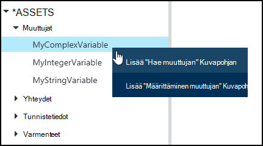
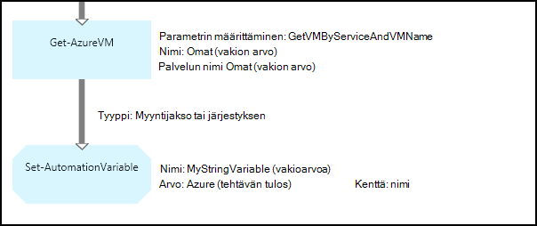
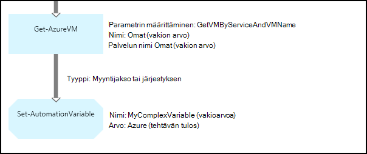
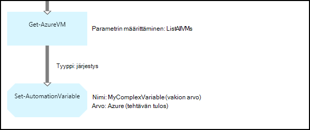
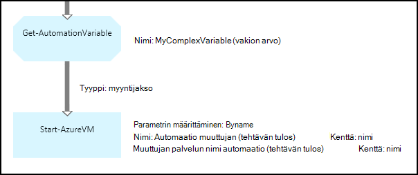
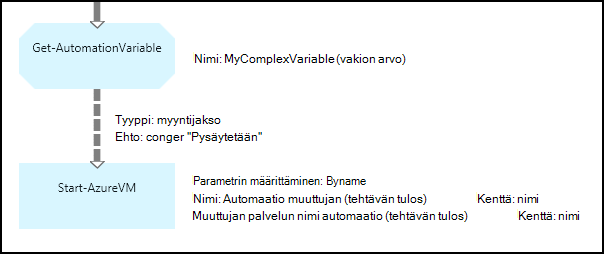

<properties 
   pageTitle="Azure automaatio muuttujan kohteita | Microsoft Azure"
   description="Muuttujan varat ovat arvoja, jotka ovat käytettävissä kaikissa runbooks ja Azure automaatio DSC asetuksista.  Tässä artikkelissa kerrotaan muuttujat ja miten voit käsitellä sekä tekstiä että graafinen authoring tietoja."
   services="automation"
   documentationCenter=""
   authors="mgoedtel"
   manager="jwhit"
   editor="tysonn" />
<tags 
   ms.service="automation"
   ms.devlang="na"
   ms.topic="article"
   ms.tgt_pltfrm="na"
   ms.workload="infrastructure-services"
   ms.date="05/24/2016"
   ms.author="magoedte;bwren" />

# Azure automaatio muuttujan kohteita

Muuttujan resurssit ovat arvoja, jotka ovat käytettävissä kaikissa runbooks ja DSC käyttömahdollisuudet automaatio-tilisi. Ne voidaan luoda, muokata ja hakea Windows PowerShellin Azure portaalista ja runbookin tai DSC määrittämistä. Automaatio muuttujat on hyötyä seuraavissa tilanteissa:

- Jakaa arvo väliltä useita runbooks tai DSC määrityksiä.

- Jakaa arvo väliltä samaan runbookin tai DSC määritysten useita työt.

- Hallita arvo-portaalista tai Windows PowerShell-komentoriviltä, jota käytetään runbooks tai DSC määrityksiä.

Automaatio muuttujat säilyvät niin, että ne edelleen on käytettävissä, vaikka runbookin tai DSC määritys ei onnistu.  Tämä asetus mahdollistaa myös arvo, joka voidaan määrittää yhden runbookin, joita käytetään toisen tai käyttää samaa runbookin tai DSC määritysten seuraavan kerran, se suoritetaan.

Kun muuttuja on luotu, voit määrittää, että se on tallennettu salattuja.  Kun muuttuja on salattu, se tallennetaan suojatusti Azure automaatio ja sen arvoa ei voi hakea [Get-AzureAutomationVariable](http://msdn.microsoft.com/library/dn913772.aspx) cmdlet-komento, joka toimittaa Azure PowerShell-moduulin osana.  **Hae AutomationVariable** runbookin tai DSC määritysten tehtävästä on ainoa tapa salattua arvoa voi hakea.

>[AZURE.NOTE]Suojatun varat Azure automaatio-sisältävät tunnistetiedot, varmenteet, yhteydet ja salattuja muuttujat. Nämä resurssit ovat salataan ja tallennetaan yksilöivä tunnus, joka on luotu käyttämällä automaatio-tileille Azure automaatio. Avaimeen perusmuodon todistus salataan ja tallennetaan Azure automaatio. Ennen tallentamista suojatun resurssi-näppäintä automaatio-tili on purettu perusmuodon sertifikaatin avulla ja sitten kohteen salaamisessa käytettyä.

## Muuttujan tyypit

Kun luot muuttujan Azure-portaalissa, avattavasta luettelosta tietotyyppi on määritettävä jotta portaalin voi näyttää sopivan ohjausobjektin työnkulun muuttujan arvo. Muuttujan ei rajoiteta tietotyypiksi, mutta sinun on määritettävä Windows PowerShellin avulla, jos haluat määrittää arvon erityyppisiä muuttuja. Jos määrität **ei ole määritetty**, valitse muuttujan arvo asetetaan **$null**ja sinun on määritettävä [Määrittäminen AzureAutomationVariable](http://msdn.microsoft.com/library/dn913767.aspx) cmdlet-komennon tai **Aseta AutomationVariable** toiminta arvon.  Et voi luoda tai muuttaa arvon kompleksiluvun muuttujan tyyppi-portaalissa, mutta voit antaa arvo on mikä tahansa Windows PowerShellin avulla. Monitasoisia tyyppejä palautetaan [PSCustomObject](http://msdn.microsoft.com/library/system.management.automation.pscustomobject.aspx).

Voit tallentaa useita arvoja yhden muuttujan luomalla matriisin tai hajautustaulukko ja tallentamalla sen muuttuja.

## Cmdlet-komennot ja työnkulun toiminnot

Seuraavassa taulukossa cmdlet-komentojen avulla voit luoda ja hallita automaatio muuttujat Windows PowerShellin avulla. Toimitus [Azure PowerShell-moduulin](../powershell-install-configure.md) on käytettävissä automaatio runbooks ja DSC määritys osana.

|Cmdlet-komennot|Kuvaus|
|:---|:---|
|[Hae AzureAutomationVariable](http://msdn.microsoft.com/library/dn913772.aspx)|Hakee aiemmin muuttujan arvon.|
|[Uusi AzureAutomationVariable](http://msdn.microsoft.com/library/dn913771.aspx)|Luo uusi muuttuja ja määrittää sen arvon.|
|[Poista AzureAutomationVariable](http://msdn.microsoft.com/library/dn913775.aspx)|Poistaa olemassa olevaa muuttujaa.|
|[Määritä AzureAutomationVariable](http://msdn.microsoft.com/library/dn913767.aspx)|Määrittää aiemmin muuttuja-arvon.|

Työnkulun toiminnot seuraavassa taulukossa on käyttää Automation muuttujat runbookin. He ovat vain käytettäväksi runbookin tai DSC määritys ja Älä toimita Azure PowerShell-moduulin osana.

|Työnkulun toiminnot|Kuvaus|
|:---|:---|
|Hae AutomationVariable|Hakee aiemmin muuttujan arvon.|
|Määritä AutomationVariable|Määrittää aiemmin muuttuja-arvon.|

>[AZURE.NOTE] Vältä muuttujien käyttäminen – nimeä-parametrissa, **Hae AutomationVariable** runbookin tai DSC määritysten jälkeen tämä vaikeuttaen etsintää runbooks tai DSC määritys ja automaatio muuttujat väliset riippuvuudet suunnitteluvaiheessa.

## Luodaan uusi Automaatiomuuttuja

### Voit luoda uuden muuttujan Azure-portaalissa

1. Automaatio-tilisi valitsemalla **kalusto** ikkunan yläreunassa.
1. Ikkunan alareunassa valitsemalla **Lisää**.
1. Valitse **Lisää muuttuja**.
1. Suorita ohjattu ja valitse valintaruutu, jos haluat tallentaa uuden muuttuja.

### Voit luoda uuden muuttujan Azure-portaalissa

1. Automaatio-tililtä valitsemalla Avaa **kalusto** -sivu **kalusto** -osa.
1. Valitse **muuttujat** -osan avaaminen **muuttujaa** -sivu.
1. Valitse **Lisää muuttuja** sivu yläreunassa.
1. Täytä lomake ja sitten **Luo** uusi muuttujan tallentamiseen.

### Voit luoda uuden muuttujan Windows PowerShellin avulla

[Uusi AzureAutomationVariable](http://msdn.microsoft.com/library/dn913771.aspx) cmdlet-komento luo uusi muuttuja, ja määrittää sen alkuarvo. Voit hakea arvon käyttämällä [Hae AzureAutomationVariable](http://msdn.microsoft.com/library/dn913772.aspx). Jos arvo on yksinkertainen tyyppi, että samantyyppisten palautetaan. Monitasoinen tyyppi on **PSCustomObject** palautetaan.

Esimerkki seuraavista komennoista Näytä merkkijonomuotoisen muuttujan luomisesta ja sen palautusarvo.

    New-AzureAutomationVariable –AutomationAccountName "MyAutomationAccount" –Name 'MyStringVariable' –Encrypted $false –Value 'My String'
    $string = (Get-AzureAutomationVariable –AutomationAccountName "MyAutomationAccount" –Name 'MyStringVariable').Value

Esimerkki seuraavat komennot näyttää, miten voit luoda monimutkaisia sisältötyyppi muuttujan ja palauttaa sen ominaisuuksia. Tässä tapauksessa virtuaalikoneen objektin **Get-AzureVM** käytetään.

    $vm = Get-AzureVM –ServiceName "MyVM" –Name "MyVM"
    New-AzureAutomationVariable –AutomationAccountName "MyAutomationAccount" –Name "MyComplexVariable" –Encrypted $false –Value $vm
    
    $vmValue = (Get-AzureAutomationVariable –AutomationAccountName "MyAutomationAccount" –Name "MyComplexVariable").Value
    $vmName = $vmValue.Name
    $vmIpAddress = $vmValue.IpAddress

## Muuttujan runbookin tai DSC määritysten käyttäminen

**Määritä AutomationVariable** tehtävän avulla voit määrittää automaatio-muuttujan arvon runbookin tai DSC määritys ja **Hae AutomationVariable** voit hakea ne.  Runbookin tai DSC kokoonpanon **Määrittäminen AzureAutomationVariable** tai **Hae AzureAutomationVariable** cmdlet ei kannata käyttää, koska ne ovat yhtä tehokasta kuin työnkulun toiminnot.  Ei voi hakea suojatun muuttujat ja **Hae AzureAutomationVariable**arvo.  Voit luoda uuden muuttujan runbookin tai DSC määritys vain silloin, kun [Uusi AzureAutomationVariable](http://msdn.microsoft.com/library/dn913771.aspx) cmdlet-komennon.

### Tekstimuotoinen runbookin objektit

#### Määrittäminen ja hakeminen yksinkertainen arvo-muuttuja

Esimerkki seuraavista komennoista näyttää, miten voit määrittää ja hakea tekstiä runbookin muuttuja. Tässä esimerkissä oletetaan tyyppi kokonaisluku muuttujat nimeltä *NumberOfIterations* ja *NumberOfRunnings* ja muuttujan nimetyn *SampleMessage* on jo luotu merkkijonomuotoisen.

    $NumberOfIterations = Get-AutomationVariable -Name 'NumberOfIterations'
    $NumberOfRunnings = Get-AutomationVariable -Name 'NumberOfRunnings'
    $SampleMessage = Get-AutomationVariable -Name 'SampleMessage'
    
    Write-Output "Runbook has been run $NumberOfRunnings times."
    
    for ($i = 1; $i -le $NumberOfIterations; $i++) {
       Write-Output "$i`: $SampleMessage"
    }
    Set-AutomationVariable –Name NumberOfRunnings –Value ($NumberOfRunnings += 1)

#### Määrittäminen ja monimutkaisia objektin muuttujaan hakeminen

Seuraava näyte koodi esitetään, kuinka voit päivittää muuttujan tekstiä runbookin monimutkaisia arvon. Tässä esimerkissä Azure virtuaalikoneen noutaa **Get-AzureVM** ja tallennettu aiemmin Automaatiomuuttuja.  [Muuttujan tyypit](#variable-types)esitetyllä tämä on tallennettu PSCustomObject.

    $vm = Get-AzureVM -ServiceName "MyVM" -Name "MyVM"
    Set-AutomationVariable -Name "MyComplexVariable" -Value $vm

Seuraava koodi arvo on haettu muuttujan ja käyttää virtuaalikoneen käynnistämiseen.

    $vmObject = Get-AutomationVariable -Name "MyComplexVariable"
    if ($vmObject.PowerState -eq 'Stopped') {
       Start-AzureVM -ServiceName $vmObject.ServiceName -Name $vmObject.Name
    }

#### Määrittäminen ja sivustokokoelman muuttujaan hakeminen

Seuraava näyte koodi näkyy muuttujan käyttäminen tekstiä runbookin monimutkaisia arvojen kokoelma. Tässä esimerkissä useita Azuren näennäiskoneiden on noutaa **Get-AzureVM** ja tallentanut automaatio-muokattaviksi.  [Muuttujan tyypit](#variable-types)esitetyllä tämä on tallennettu PSCustomObjects kokoelma.

    $vms = Get-AzureVM | Where -FilterScript {$_.Name -match "my"}     
    Set-AutomationVariable -Name 'MyComplexVariable' -Value $vms

Seuraava koodi kokoelma on noutaa muuttujan ja käyttää kunkin virtuaalikoneen käynnistämiseen.

    $vmValues = Get-AutomationVariable -Name "MyComplexVariable"
    ForEach ($vmValue in $vmValues)
    {
       if ($vmValue.PowerState -eq 'Stopped') {
          Start-AzureVM -ServiceName $vmValue.ServiceName -Name $vmValue.Name
       }
    }

### Graafisen runbookin objektit

Graafisen runbookin Lisää **Get-AutomationVariable** tai **Aseta AutomationVariable** muuttujan graafinen editorin kirjasto-ruudussa hiiren kakkospainikkeella ja valitsemalla haluamasi aktiviteetti.

#### Arvon muuttujana

Seuraavassa kuvassa on esimerkki toimintoja Päivitä muuttujan graafinen runbookin yksinkertainen arvon. Tässä esimerkissä yhteen Azure virtual tietokoneeseen haetaan **Get-AzureVM** kanssa ja tietokonenimi on tallennettu aiemmin Automaatiomuuttuja, jonka tyyppi on merkkijono.  Se ei ole väliä, [linkki on myyntijakso tai sarjan](automation-graphical-authoring-intro.md#links-and-workflow) jälkeen Odotamme yhtenä objektina vain tulosteessa.

Seuraava kuva esittää päivittämiseen muuttujan monimutkaisia arvona graafinen runbookin toimintoja. Edellisessä esimerkissä käytetty mallitietokanta ainoa muutos on määrittämättä **kentän polku** **Määrittäminen AutomationVariable** tehtävän **aktiviteetin tulosteen** niin, että objekti on tallennettu sen sijaan, että vain objektin ominaisuus.  [Muuttujan tyypit](#variable-types)esitetyllä tämä on tallennettu PSCustomObject.

Seuraava kuva esittää samat toiminnot kuin edellisessä esimerkissä usean muuttujan tallennettu näennäiskoneiden kanssa.  [Sarjan linkki](automation-graphical-authoring-intro.md#links-and-workflow) on käytettävä tätä niin, että **Määrittäminen AutomationVariable** tehtävän saa kuin yhden sivustokokoelman näennäiskoneiden koko sarja.  Jos [myyntijakso-linkki](automation-graphical-authoring-intro.md#links-and-workflow) on käytetty, valitse **Määrittäminen AutomationVariable** tehtävän suoritetaan erikseen kunkin objektin tuloksella on, että vain viimeinen virtuaalikoneen sivustokokoelman tallennetaan.  [Muuttujan tyypit](#variable-types)esitetyllä tämä on tallennettu PSCustomObjects kokoelma.

#### Muuttujan arvot noutaminen

Seuraavassa kuvassa on esimerkki toimintoja, jotka noutaa ja käyttää muuttujaa graafinen runbookin.  Ensimmäinen tehtävä hakee näennäiskoneiden, jotka on tallennettu edellisessä esimerkissä muuttuja.  Linkki on oltava [myyntijakso](automation-graphical-authoring-intro.md#links-and-workflow) niin, että **Käynnistä AzureVM** tehtävän suoritetaan kerran kullekin objektille lähettäjä: **Get-AutomationVariable** tehtävän.  Tämä toimii samalla onko yksittäisen objektin tai useita objekteja on tallennettu muuttuja.  **Käynnistä AzureVM** tehtävä käyttää PSCustomObject, joka esittää kunkin virtuaalikoneen ominaisuudet. 

Seuraava kuva esittää suodattaminen objekteja, jotka on tallennettu graafinen runbookin muuttuja.  [Ehto](automation-graphical-authoring-intro.md#links-and-workflow) lisätään edellisen esimerkin suodattaa vain ne näennäiskoneiden, joka on pysäytetty muuttujan määrittämispäivästä linkkiä.

## Seuraavat vaiheet

- Lisätietoja yhteyden toimintojen yhdessä graafinen authoring [-Graafinen authoring linkkien](automation-graphical-authoring-intro.md#links-and-workflow) tarkasteleminen
- Graafinen runbooks aloittaminen-kohdassa [Oma ensimmäisen graafinen runbookin](automation-first-runbook-graphical.md) 
