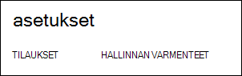
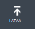
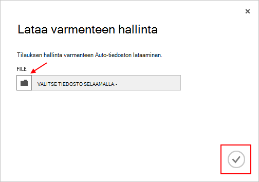

<properties 
    pageTitle="Lataa Azure hallinta-Ohjelmointirajapinnan varmenteen | Azure Microsoft" 
    description="Opit lataamaan athe Management API certficate perinteinen Azure-portaalin." 
    services="cloud-services" 
    documentationCenter=".net" 
    authors="Thraka" 
    manager="timlt" 
    editor=""/>

<tags 
    ms.service="na" 
    ms.workload="tbd" 
    ms.tgt_pltfrm="na" 
    ms.devlang="na" 
    ms.topic="article" 
    ms.date="04/18/2016"
    ms.author="adegeo"/>

# Lataa Azure hallinnan API-hallinta-varmenteen

Hallinnan varmenteet mahdollistavat Azure myöntämä Service Management Ohjelmointirajapinnan todentamismenetelmä. Monta ohjelmat ja työkalut (esimerkiksi Visual Studio tai Azure SDK) käyttää näitä certficates automatisoida määrittämistä ja käyttöönottoa eri Azure palveluista. **Tämä koskee ainoastaan Azure perinteinen-portaaliin**. 

>[AZURE.WARNING] Ole varovainen! Varmenteiden seuraavanlaisiin sallia kenen tahansa todentaa heidän kanssaan niihin liittyviä tilauksen hallintaan. 

Lisätietoja Azure varmenteet (mukaan lukien itse allekirjoitetun varmenteen luominen) on [käytettävissä](cloud-services/cloud-services-certs-create.md#what-are-management-certificates) , jos tarvitse sitä.

[Azure Active Directoryn](/services/active-directory/) avulla voit myös todentaa asiakas-koodi automaatio varten.

## Lataa varmenteen hallinta

Kun olet luonut management certficate, (.cer-tiedosto julkisella avaimella) voit ladata sen portaalin. Kun varmenne on käytettävissä-portaalissa, kaikki, joilla on vastaava certficiate (yksityinen avain) yhteys hallinta-Ohjelmointirajapinnan kautta ja resursseihin liittyvien tilaukseen.

1. Kirjaudu sisään [Azure perinteinen portal](http://manage.windowsazure.com).

2. Varmista, että oikea tilaus, johon haluat liittää varmenteen. Paina **tilaukset** -teksti ylös oikealle portaalin.

    

3. Kun olet valinnut oikean tilauksen tai paina **asetukset** (joudut ehkä vierittämään) portaalin vasemmalla puolella. 
    
    

4. Paina **Hallinta varmenteet** -välilehti.

    
    
5. Paina **Lataa** -painiketta.

    
    
6. Täytä valintaikkunan tiedot ja paina valmis **valintamerkki**.

    

## Seuraavat vaiheet

Nyt kun olet luonut hallinta-certficate liittyvä tilaus, voit (Jos olet asentanut vastaava sertifikaatti paikallisesti) ohjelmallisesti [Service Management REST API](https://msdn.microsoft.com/library/azure/mt420159.aspx) yhdistäminen ja automatisoida eri Azure resurssit, jotka liittyvät myös, että tilaus. 