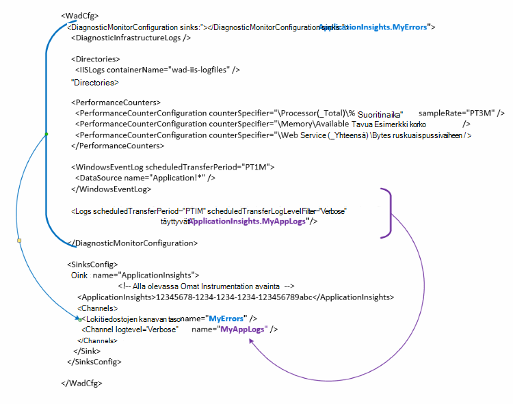

<properties
   pageTitle="Määritä Azure vianmääritys ja Lähetä tiedot sovelluksen havainnollistamisen | Microsoft Azure"
   description="Päivitä Azure diagnostiikka julkisen Hakumääritysten tietojen lähettäminen hakemuksen tiedot."
   services="multiple"
   documentationCenter=".net"
   authors="sbtron"
   manager="douge"
   editor="" />
<tags
   ms.service="application-insights"
   ms.devlang="na"
   ms.topic="article"
   ms.tgt_pltfrm="na"
   ms.workload="na"
   ms.date="12/15/2015"
   ms.author="saurabh" />

# Määritä Azure diagnostiikka tietojen lähettäminen hakemuksen tiedot

Azure diagnostiikka tallentaa tiedot Azuren tallennustilaan taulukoihin.  Voit kuitenkin myös pystyviivaa kaikki tai osan tiedoista sovelluksen havainnollistamisen määrittäminen "täyttyvät" ja "kanavien" kokoonpanoa käytettäessä Azure diagnostiikka-tunniste 1.5 tai uudempi.

Tässä artikkelissa kerrotaan, miten Luo julkinen määritys Azure diagnostiikka-laajennuksen niin, että sen määritetty tietojen lähettäminen hakemuksen tiedot.

## Hakemuksen tiedot määrittäminen kuin käsittelytoiminto

Azure diagnostiikka-tunniste 1,5 esitellään **<SinksConfig>** osan julkisen määritykset. Tämä määrittää muita *käsittelytoiminto* , jossa Azure diagnostiikka tiedot voidaan lähettää. Voit määrittää kohtaa, johon haluat lähettää Azure diagnostiikka tiedot osana tämän sovelluksen tiedot resurssin tiedot **<SinksConfig>**.
Esimerkki **SinksConfig** näyttää tältä-  

    <SinksConfig>
        <Sink name="ApplicationInsights">
          <ApplicationInsights>{Insert InstrumentationKey}</ApplicationInsights>
          <Channels>
            <Channel logLevel="Error" name="MyTopDiagData"  />
            <Channel logLevel="Verbose" name="MyLogData"  />
          </Channels>
        </Sink>
      </SinksConfig>

**Käsittelytoiminto** elementin *name* -määrite määrittää merkkijonoarvo, jota käytetään viittaamaan yksilöllisesti käsittelytoiminto.
**ApplicationInsights** elementti määrittää instrumentation avaimen hakemuksen tiedot resurssin johon Azure diagnostiikka tiedot lähetetään. Jos sinulla ei ole olemassa olevan sovelluksen tiedot-resurssin [Luo uuden sovelluksen tiedot resurssin](./application-insights/app-insights-create-new-resource.md) Saat lisätietoja resurssin luominen ja käytön instrumentation-näppäintä.

Jos kehität Azure SDK 2,8 pilvipalvelussa projektin instrumentation avaimeen täytetään automaattisesti perusteella **APPINSIGHTS_INSTRUMENTATIONKEY** palvelu määritys-asetusta, kun pakkaamista pilven palvelun projektin julkisen määrityksessä. Katso [Käyttää sovelluksen havainnollistamisen tehostaminen Azure diagnostiikka pilvipalvelussa ongelmien vianmääritystä](./cloud-services/cloud-services-dotnet-diagnostics-applicationinsights.md).

**Kanavat** -osan avulla voit määrittää yhden tai useamman tiedot, jotka lähetetään käsittelytoiminto **kanava** -osat. Kanavan toimii samalla tavalla kuin suodattimen, ja voit valita, haluat lähettää käsittelytoiminto tietyn log tasot. Esimerkiksi voi kerätä yksityiskohtainen lokit ja lähetä ne tallennustilan, mutta voi valita kanavan log viereiset virheen ja voit lähettää lokit kautta kanavan vain virheraportit lähetetään, käsittelytoiminto määrittämiseen.
**Kanavan** *nimi* -määrite käytetään kyseisen kanavan yksilöllisesti viitata.
*Loglevel* -määritteen avulla voit määrittää lokitiedoston, joka sallii kanavan. Käytettävissä olevat lokin tasot järjestyksessä eniten vähintään tiedot ovat
 - Yksityiskohtainen
 - Tietoja
 - Varoitus
 - Virhe
 - Kriittinen

## Lähetä tiedot sovelluksen havainnollistamisen käsittelytoiminto
Kun sovellus havainnollistamisen käsittelytoiminto määritetty voit lähettää tiedot, käsittelytoiminto lisäämällä *käsittelytoiminto* määrite **DiagnosticMonitorConfiguration** solmun osat. *Täyttyvät* -osan lisääminen kukin solmu määrittää, että haluat solmun ja se lähetetään määritetty käsittelytoiminto solmu kerättyjä tietoja.

Esimerkiksi jos haluat lähettää kaikki tiedot, jotka Azure diagnostiikka keräämiä sitten lisättävien *käsittelytoiminto* määrite suoraan **DiagnosticMonitorConfiguration** -solmu. Määritä arvo *täyttyvät* käsittelytoiminto nimi, joka on määritetty **SinkConfig**.

    <DiagnosticMonitorConfiguration overallQuotaInMB="4096" sinks="ApplicationInsights">

Jos haluat määrittää Lähetä vain sovelluksen havainnollistamisen virhelokeja allas jälkeen voit määrittää *poistumia* -arvo, joka on käsittelytoiminto nimen perässä erotetaan toisistaan pisteellä kanavan nimi ("."). Voit lähettää vain virhelokit sovelluksen havainnollistamisen esimerkiksi käsittelytoiminto avulla MyTopDiagdata kanavaa, joka oli määritetty yllä SinksConfig.  

    <DiagnosticMonitorConfiguration overallQuotaInMB="4096" sinks="ApplicationInsights.MyTopDiagdata">

Jos haluat lähettää yksityiskohtainen sovelluksen lokit sovelluksen havainnollistamisen *täyttyvät* määritettä lisääminen **lokit** -solmu.

    <Logs scheduledTransferPeriod="PT1M" scheduledTransferLogLevelFilter="Verbose" sinks="ApplicationInsights.MyLogData"/>

Voit myös lisätä useita pesualtaita hierarkiassa eri tasoilla määritykset. Tässä tapauksessa määritetyn hierarkian ylimmällä tasolla käsittelytoiminto toimii yleinen asetus ja yksittäisen osan elementti säädösten ohitus Yleiset asetukset, kuten osoitteessa on määritetty.    

Seuraavassa on valmis Esimerkki julkisen määritystiedoston, joka lähettää kaikki virheet hakemuksen tiedot (määritelty **DiagnosticMonitorConfiguration** -solmu) ja lisäksi yksityiskohtainen tason lokit sovelluksen lokit (määritelty **lokit** -solmu).

    <WadCfg>
      <DiagnosticMonitorConfiguration overallQuotaInMB="4096"
           sinks="ApplicationInsights.MyTopDiagData"> <!-- All info below sent to this channel -->
        <DiagnosticInfrastructureLogs />
        <PerformanceCounters>
          <PerformanceCounterConfiguration counterSpecifier="\Processor(_Total)\% Processor Time" sampleRate="PT3M" sinks="ApplicationInsights.MyLogData/>
          <PerformanceCounterConfiguration counterSpecifier="\Memory\Available MBytes" sampleRate="PT3M" />
          <PerformanceCounterConfiguration counterSpecifier="\Web Service(_Total)\Bytes Total/Sec" sampleRate="PT3M" />
        </PerformanceCounters>
        <WindowsEventLog scheduledTransferPeriod="PT1M">
          <DataSource name="Application!*" />
        </WindowsEventLog>
        <Logs scheduledTransferPeriod="PT1M" scheduledTransferLogLevelFilter="Verbose"
                sinks="ApplicationInsights.MyLogData"/> <!-- This specific info sent to this channel -->
      </DiagnosticMonitorConfiguration>

    <SinksConfig>
        <Sink name="ApplicationInsights">
          <ApplicationInsights>{Insert InstrumentationKey}</ApplicationInsights>
          <Channels>
            <Channel logLevel="Error" name="MyTopDiagData"  />
            <Channel logLevel="Verbose" name="MyLogData"  />
          </Channels>
        </Sink>
      </SinksConfig>
    </WadCfg>

On joitakin rajoituksia otettava huomioon tämän toiminnon avulla

- Kanavien on tarkoitettu vain lokitiedoston tyyppi ja suorituskyvyn laskureita. Jos määrität kanavan suorituskyvyn laskuri-elementin, se ohitetaan.
- Log-tason kanavan eivät saa ylittää log tason Azure diagnostiikka kerättyjä tietoja. Esimerkki: Et voi kerätä sovelluksen virheiden lokit-osaan ja yritä lähettää yksityiskohtainen tapahtumalokien sovelluksen tietoja käsittelytoiminto. *ScheduledTransferLogLevelFilter* -määrite on aina kerätä yhtä tai Lisää lokit lokit kuin yrität lähettää käsittelytoiminto.
- Blob-objektien mitään tietoja ei voi lähettää keräämiä Azure diagnostiikka tunniste sovelluksen havainnollistamisen. Esimerkiksi mitään, mitä on kohdassa *hakemistoja* -solmu on määritetty. Saat kaatumisen kirjoittaa todellisia kaatumisvedos edelleen lähetetään blob storage ja hakemuksen tiedot lähetetään vain ilmoituksen kaatumisvedos luotiin.

## Seuraavat vaiheet

- [PowerShellin](./cloud-services/cloud-services-diagnostics-powershell.md) avulla voit ottaa käyttöön sovelluksen Azure diagnostiikka-laajennus. 
- [Visual Studio](vs-azure-tools-diagnostics-for-cloud-services-and-virtual-machines.md) avulla voit ottaa käyttöön sovelluksen Azure diagnostiikka-tunniste
