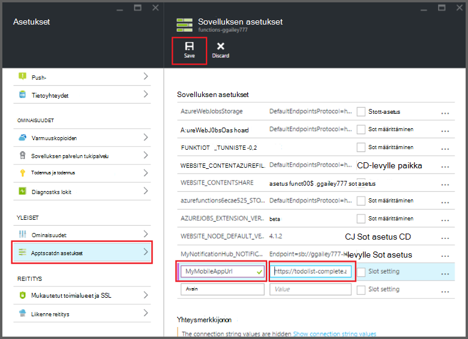

<properties
    pageTitle="Azure Funktiot Mobile-sovellusten sidontojen | Microsoft Azure"
    description="Tietoja sidontojen Azure Mobile-sovellusten käyttämisestä Azure-funktiot."
    services="functions"
    documentationCenter="na"
    authors="ggailey777"
    manager="erikre"
    editor=""
    tags=""
    keywords="Azure toimii, Funktiot, tapahtuman käsittelyn dynaaminen Laske serverless arkkitehtuuri"/>

<tags
    ms.service="functions"
    ms.devlang="multiple"
    ms.topic="reference"
    ms.tgt_pltfrm="multiple"
    ms.workload="na"
    ms.date="08/30/2016"
    ms.author="glenga"/>

# Azure Funktiot Mobile-sovellusten sidontojen

[AZURE.INCLUDE [functions-selector-bindings](../../includes/functions-selector-bindings.md)]

Tässä artikkelissa kerrotaan, miten määritetään ja koodin Azure-mobiilisovellukset sidontojen Azure-funktioissa. 

[AZURE.INCLUDE [intro](../../includes/functions-bindings-intro.md)] 

Azure App palvelun Mobile-sovellusten avulla voit näyttää mobiilisovellukset taulukon päätepisteen tiedot. Tässä taulukossa samat tiedot voidaan käyttää sekä syötteen ja tulosteen sidontojen Azure-funktioissa. Koska se tukee dynaamisen rakenteen, Node.js Taustajärjestelmä mobiilisovelluksessa sopii paljastaa taulukkomuotoiset tiedot oman funktioiden kanssa käytettäväksi. Dynaaminen rakenne on oletusarvoisesti käytössä, ja olisi poistetaan käytöstä tuotannon mobiilisovelluksessa. Katso lisätietoja taulukon päätepisteet Node.js taustassa [yleiskatsaus: taulukon toimintojen](../app-service-mobile/app-service-mobile-node-backend-how-to-use-server-sdk.md#TableOperations). Mobile-sovellusten Node.js Taustajärjestelmä tukee portal-selaamisen ja taulukoiden muokkaamisen. Lisätietoja Node.js SDK-artikkelissa [portal-muokkaamista](../app-service-mobile/app-service-mobile-node-backend-how-to-use-server-sdk.md#in-portal-editing) . Kun käytät .NET Taustajärjestelmä mobiilisovelluksessa Azure-toiminnoilla, on päivitettävä manuaalisesti tietomallin funktion tarvittaessa. Katso lisätietoja taulukon päätepisteet .NET Taustajärjestelmä mobiilisovelluksessa [Toimintaohje: Määritä valvonta on taulukon](../app-service-mobile/app-service-mobile-dotnet-backend-how-to-use-server-sdk.md#define-table-controller) .NET Taustajärjestelmä SDK-artikkelissa. 

## Luo ympäristömuuttuja mobiilisovelluksen Taustajärjestelmä URL-osoite

Mobile-sovellusten sidontojen edellyttävät tällä hetkellä luoda ympäristömuuttuja, joka palauttaa itse mobiilisovelluksen Taustajärjestelmä URL-osoite. Tätä URL-osoite löytyy [Azure portal](https://portal.azure.com) etsiminen mobile-sovellus ja avaamalla sivu.

Voit määrittää tämän URL-Osoitteen ympäristömuuttuja funktio-sovelluksessa:

1. Valitse funktio sovelluksen [Azure Funktiot portal](https://functions.azure.com/signin)- **funktion sovelluksen asetukset** > **sovelluksen palvelun asetukset**. 

    

2. Funktio-sovelluksen **kaikki asetukset**, vieritä **asetukset**, valitse **sovelluksen asetusten** tyyppi-kohdassa ympäristömuuttuja uusi **nimi** , Liitä URL-osoite- **arvo**, varmistetaan, että HTTPS-malli ja valitse **Tallenna** ja sulje funktion app sivu palauttavat Funktiot-portaaliin.   

    

Voit nyt määrittää tämä uusi ympäristömuuttuja *yhteyden* kentäksi oman sidontojen.

## Käytä mobiilisovellukset-taulukon päätepisteet suojattu käyttö API näppäintä.

Azure-Funktiot mobile taulukon sidontojen avulla voit määrittää API-näppäintä, joka on salaisuus, jonka avulla voidaan estää ei-toivottuja sovelluksista kuin oman funktiot. Mobile-sovellusten ei ole tukee API avaimen todennusta. Voit toteuttaa Ohjelmointirajapinnan avain Node.js Taustajärjestelmä mobile-sovelluksen seuraamalla esimerkeissä [Azure palvelun mobiilisovellukset Taustajärjestelmä API-avainta](https://github.com/Azure/azure-mobile-apps-node/tree/master/samples/api-key). Voit vastaavasti toteuttaa Ohjelmointirajapinnan avain [.NET Taustajärjestelmä mobiilisovelluksessa](https://github.com/Azure/azure-mobile-apps-net-server/wiki/Implementing-Application-Key).

>[AZURE.IMPORTANT] Ohjelmointirajapinnan avain ei jaeta mobiilisovelluksen asiakkaiden kanssa, se tulee vain jakaa turvallisesti palvelun Include asiakkaille, kuten Azure-funktiot. 

## Azure Mobile-sovellusten syötteen sidonta

Syötteen sidontojen voit ladata tietueen mobile taulukon päätepiste ja välittää sen suoraan yhteyttä sidonta. Tietueen tunnus määritetään perusteella käynnistin, joka käynnistää toiminnon. C#-funktiossa tietueeseen tehdyt muutokset lähetetään automaattisesti takaisin taulukon kun funktio poistuu onnistuneesti.

#### Function.JSON mobiilisovellukset syötteen sidontaa varten

*Function.json* -tiedosto tukee seuraavia ominaisuuksia:

- `name`: Funktio käyttää uuden tietueen muuttujan nimi.
- `type`: Biding tyyppi on määritettävä *mobileTable*.
- `tableName`: Taulukko, jossa uusi tietue luodaan.
- `id`: Tunnus tietueen hakemiseen. Tämä ominaisuus tukee sidontojen samalla `{queueTrigger}`, joka käyttää jonon viestin merkkijonoarvo tietueen tunnus.
- `apiKey`: Merkkijono, joka on sovelluksen-asetus, joka määrittää valinnainen Ohjelmointirajapinnan avain mobile-sovellus. Tämä on pakollinen, kun mobile-sovellus käyttää asiakkaan rajoittamisesta API-näppäintä.
- `connection`: Merkkijono, joka on ympäristömuuttuja sovellusasetukset-mobiilisovelluksen Taustajärjestelmä URL-Osoitteen määrittävän nimi.
- `direction`: Sidonta suuntaan, johon on määritettävä *sisään*.

Esimerkki *function.json* tiedosto:

    {
      "bindings": [
        {
          "name": "record",
          "type": "mobileTable",
          "tableName": "MyTable",
          "id" : "{queueTrigger}",
          "connection": "My_MobileApp_Url",
          "apiKey": "My_MobileApp_Key",
          "direction": "in"
        }
      ],
      "disabled": false
    }

#### Azure C#-jonossa käynnistimen mobiilisovellukset Esimerkki

Perusteella esimerkiksi function.json edellä Mobile-sovellusten tietueen taulukon ID, jolla jonon viestin merkkijonoa ja välittää sen *tietueen* parametriä päätepisteen syötteen sidonta hakee. Kun tietuetta ei löydy-parametri on null. Tietueen päivitetään sitten *Uusi tekstiarvo* , kun funktio poistuu.

    #r "Newtonsoft.Json"    
    using Newtonsoft.Json.Linq;
    
    public static void Run(string myQueueItem, JObject record)
    {
        if (record != null)
        {
            record["Text"] = "This has changed.";
        }    
    }

#### Azure Node.js jonossa käynnistimen mobiilisovellukset Esimerkki

Perusteella esimerkiksi function.json edellä Mobile-sovellusten tietueen taulukon ID, jolla jonon viestin merkkijonoa ja välittää sen *tietueen* parametriä päätepisteen syötteen sidonta hakee. Node.js funktioissa päivitetyt tietueet ei lähetetä takaisin taulukkoon. Tämä esimerkki kirjoittaa haetut tietueen lokiin.

    module.exports = function (context, input) {    
        context.log(context.bindings.record);
        context.done();
    };

## Azure Mobile-sovellusten tulosteen sidonta

Funktion voit kirjoittaa tietueen Mobile-sovellusten taulukon päätepisteen-tulostus-sidonta avulla. 

#### Mobile-sovellusten Function.JSON tulosteen sidonta

Function.json-tiedosto tukee seuraavia ominaisuuksia:

- `name`: Funktio käyttää uuden tietueen muuttujan nimi.
- `type`: Sidonta tyyppi, joka on määritettävä *mobileTable*.
- `tableName`: Taulukko, jossa uusi tietue luodaan.
- `apiKey`: Merkkijono, joka on sovelluksen-asetus, joka määrittää valinnainen Ohjelmointirajapinnan avain mobile-sovellus. Tämä on pakollinen, kun mobile-sovellus käyttää asiakkaan rajoittamisesta API-näppäintä.
- `connection`: Merkkijono, joka on ympäristömuuttuja sovellusasetukset-mobiilisovelluksen Taustajärjestelmä URL-Osoitteen määrittävän nimi.
- `direction`: Sidonta suuntaan, joka on määritettävä *ulos*.

Esimerkki function.json:

    {
      "bindings": [
        {
          "name": "record",
          "type": "mobileTable",
          "tableName": "MyTable",
          "connection": "My_MobileApp_Url",
          "apiKey": "My_MobileApp_Key",
          "direction": "out"
        }
      ],
      "disabled": false
    }

#### Azure C#-jonossa käynnistimen mobiilisovellukset Esimerkki

C# koodin esimerkin Lisää uusi tietue mobiilisovellukset-taulukon päätepisteen *tekstin* ominaisuus on määritetty edellä sidonta-taulukkoon.

    public static void Run(string myQueueItem, out object record)
    {
        record = new {
            Text = $"I'm running in a C# function! {myQueueItem}"
        };
    }

#### Azure Node.js jonossa käynnistimen mobiilisovellukset Esimerkki

Esimerkin koodi Node.js Lisää uusi tietue mobiilisovellukset-taulukon päätepisteen *tekstin* ominaisuus on määritetty edellä sidonta-taulukkoon.

    module.exports = function (context, input) {
    
        context.bindings.record = {
            text : "I'm running in a Node function! Data: '" + input + "'"
        }   
    
        context.done();
    };

## Seuraavat vaiheet

[AZURE.INCLUDE [next steps](../../includes/functions-bindings-next-steps.md)]
