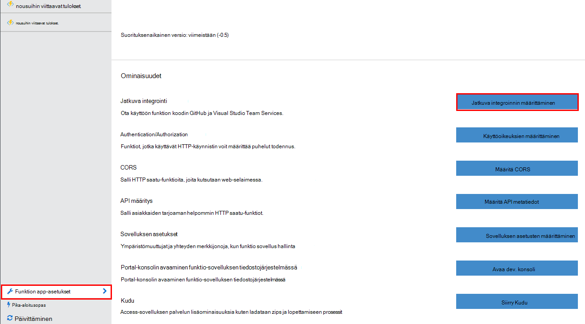
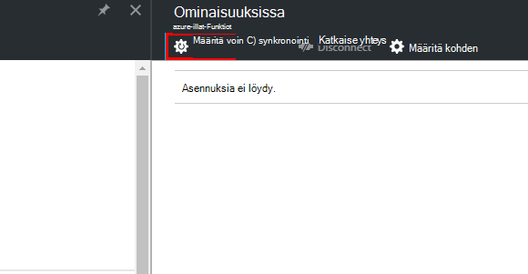
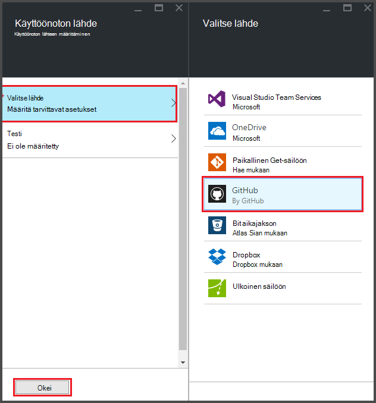
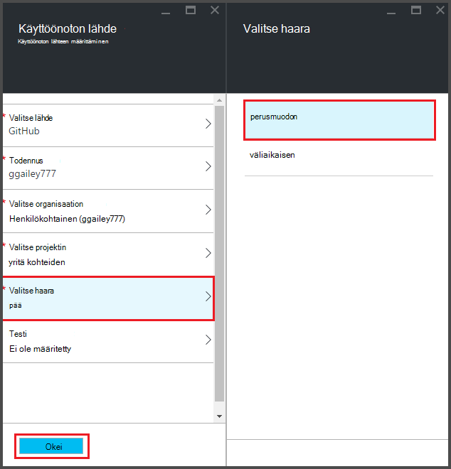
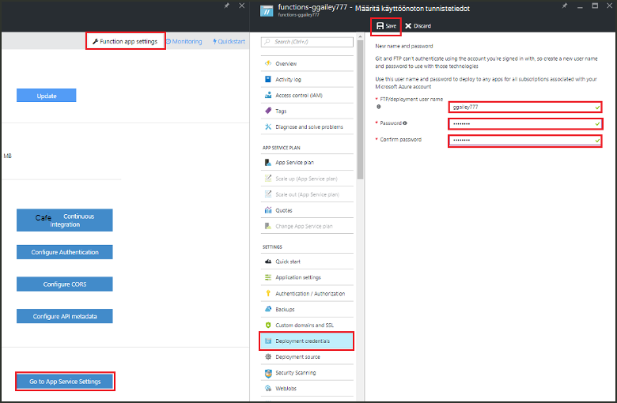
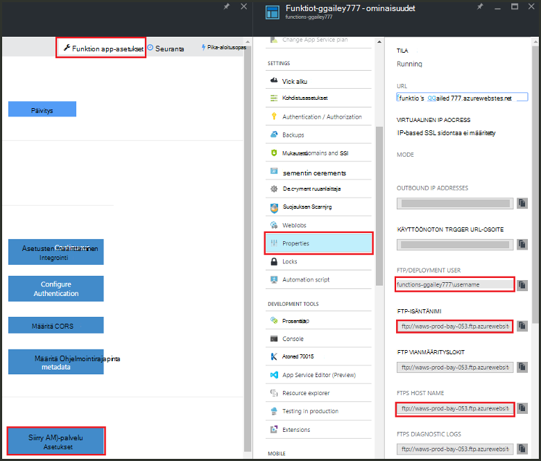
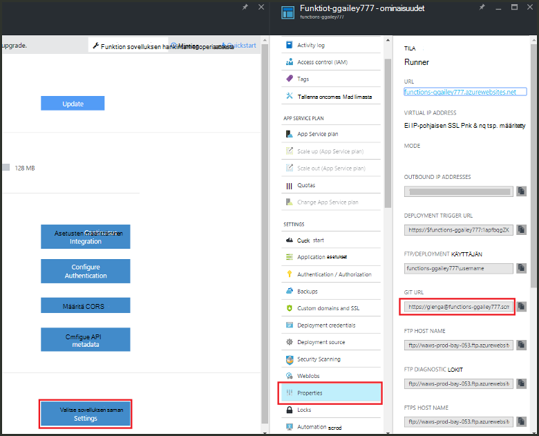

<properties
   pageTitle="Jatkuva Azure-toimintojen käyttöönotto | Microsoft Azure"
   description="Jatkuva käyttöönoton tilat Azure sovelluksen-palvelun avulla voit julkaista Azure-funktiot."
   services="functions"
   documentationCenter="na"
   authors="ggailey777"
   manager="erikre"
   editor=""
   tags=""
   />

<tags
   ms.service="functions"
   ms.devlang="multiple"
   ms.topic="article"
   ms.tgt_pltfrm="multiple"
   ms.workload="na"
   ms.date="09/25/2016"
   ms.author="glenga"/>

# Jatkuva Azure-toimintojen käyttöönotto 

Azure funktiot on helppo Jos haluat määrittää jatkuva funktio sovelluksen. Funktiot hyödyntää Azure App palvelun integrointi BitBucket, Dropbox, GitHub ja Visual Studio ryhmän Services (VSTS) käyttöön jatkuva käyttöönoton työnkulun missä Azure hakee päivitykset Funktiot-koodia, kun ne on julkaistu johonkin näistä palveluista. Jos ole ennen käyttänyt Azure-Funktiot, aloita [Azure Funktiot](functions-overview.md)yleiskuvauksessa.

Jatkuva käyttöönotto on hyvä vaihtoehto projekteille, jossa useita ja toistuvat maksut integroidaan. Se myös avulla voit säilyttää tietolähteen ohjausobjektin Funktiot-koodin. Seuraavista käyttöönoton lähteistä tällä hetkellä tueta:

+ [Bitbucket](https://bitbucket.org/)
+ [Dropbox](https://bitbucket.org/)
+ [Git paikallisen repo](../app-service-web/app-service-deploy-local-git.md)
+ Git ulkoiset repo
+ [GitHub]
+ Mercurial ulkoiset repo
+ [OneDrive](https://onedrive.live.com/)
+ Visual Studio Team Services

Ominaisuuksissa on määritetty kohden-funktion-sovelluksen välein. Jatkuva käyttöönoton on otettu käyttöön, kun funktio koodi portaalissa määritetään *vain luku-tilassa*.

## Jatkuva käyttöönottovaatimukset

Määritetty käyttöönoton lähde- ja funktiot-koodi on oltava käyttöönoton lähteen ennen kuin voit aloittaa jatkuva käyttöönotto. Määritetty toiminto sovellusten käyttöönoton kukin funktio sijaitsevat nimetty alikansio, kansionimi on funktion nimi. Tämä kansiorakenne on käytettävä sivustokoodi. 

[AZURE.INCLUDE [functions-folder-structure](../../includes/functions-folder-structure.md)]

## Jatkuva käyttöönoton määrittäminen

Jos haluat määrittää jatkuva aiemmin funktion sovelluksen noudattamalla seuraavia vaiheita:

1. Valitse funktio sovelluksen [Azure Funktiot portal](https://functions.azure.com/signin)- **funktion sovelluksen asetukset** > **määrittäminen jatkuva integrointi** > **asetukset**.

    
    
    
    
    Voit myös siirtyä käyttöönottoa sivu-Funktiot-pikaopas valitsemalla **Aloita tietolähteen ohjausobjektin**.

2. -Käyttöönottoa sivu, **Valitse lähteen**, valitse fill-in valitsemasi käyttöönoton lähteen tiedot ja valitse **OK**.

    

Kun jatkuva käyttöönoton on määritetty, kaikki muutokset tiedostot käyttöönoton lähteen kopioidaan funktion-sovellukseen ja koko sivuston käyttöönotto käynnistyy. Sivusto on myymälät päivitysajankohdan lähde-tiedostoja.

##Käyttöönottoasetukset

Tyypillinen käyttöönoton joissakin tilanteissa ovat seuraavat:

+ 

###Luo väliaikaisen käyttöönotto

Funktion sovellusten vielä ei tue käyttöönoton paikkaa. Voit silti hallita eri vaiheet ja tuotannon ominaisuuksissa jatkuva integroinnin avulla.

Voit määrittää ja käyttää väliaikaisen käyttöönoton prosessin näyttää yleensä tältä:

1. Luo kaksi funktion sovelluksia tilauksen, yksi tuotannon-koodin ja yksi vaiheet. 

2. Luo käyttöönoton lähteen, jos sinulla ei ole vielä yksi. Käytämme [GitHub].
 
3. Tuotannon-funktion sovelluksen edellä mainittujen vaiheiden **määrittäminen jatkuva** käyttöönoton ja määritä käyttöönotto-haara GitHub repo perusmuodon haaran.

    

4. Toista tämä vaihe väliaikaisen funktion sovelluksen, mutta tällä hetkellä valita väliaikaisen haaran GitHub repo. Jos käyttöönoton lähde ei tue haarautumista, käytä toista kansiota.
 
5. Varmista päivitykset väliaikaisen haaran tai kansiosta koodi ja valitse Tarkista, että muutokset näkyvät myös väliaikaisen käyttöönotto.

6. Testauksen jälkeen Yhdistä muutokset väliaikaisesta päätasolta perusmuodon haaran kyselyjä. Tämä käynnistää käyttöönoton tuotannon funktio-sovellukseen. Jos käyttöönoton lähde ei tue haaroja, korvaa tiedostojen valmistelukansio tuotannon-kansiossa olevat tiedostot.

###Siirtää olemassa olevat funktiot jatkuva käyttöönotto

Jos on olemassa olevat Funktiot, jotka on luodaan ja ylläpidetään portaalin, sinun täytyy ladata olemassa olevan funktion koodin tiedostojen FTP tai paikallisen Git säilöön, ennen kuin voit voit aloittaa jatkuva käyttöönoton yllä olevien ohjeiden mukaisesti. Voit tehdä tämän sovelluksen palvelun asetukset-funktio-sovelluksen. Kun tiedostot on ladattu, voit ladata ne valitsemasi jatkuva käyttöönoton lähde.

>[AZURE.NOTE]Kun määrität jatkuva integrointi, Muokkaa lähdetiedostot Funktiot-portaalissa ei enää voi.

####Toimintaohje: käyttöönoton tunnistetietojen määrittäminen
Ennen kuin voit ladata tiedostoja funktio-sovellukset, sinun on määritettävä tunnistetiedot voivat käyttää sivustoa, voit tehdä sen-portaalista. Tunnistetiedot on määritetty funktion sovelluksen tasolla.

1. Valitse funktio sovelluksen [Azure Funktiot portal](https://functions.azure.com/signin)- **funktion sovelluksen asetukset** > **sovelluksen palvelun asetukset** > **käyttöönoton tunnistetiedot**.

    

2. Kirjoita käyttäjänimi ja salasana ja valitse sitten **Tallenna**. Voit nyt käyttää funktiota sovelluksen FTP- tai valmiin Git repo näitä tunnistetietoja.

####Toimintaohje: lataa tiedostoja FTP:

1. Valitse funktio sovelluksen [Azure Funktiot portal](https://functions.azure.com/signin)- **funktion sovelluksen asetukset** > **sovelluksen palvelun asetukset** > **Ominaisuudet** ja kopioi arvot **FTP/käyttöönoton käyttäjän**, **FTP-isäntänimi**ja **FTPS isäntänimi**.  
**FTP/käyttöönoton käyttäjän** on syötettävä sellaisina kuin ne näkyvät portaalissa, mukaan lukien sovelluksen nimen, jos haluat säätää tietää FTP-palvelimeen.

    
    
2. FTP-asiakasohjelmassa käyttää yhteystietoja keräsit sovelluksen yhdistäminen ja ladata oman toimintojen lähdetiedostoja.

####Toimintaohje: lataa tiedostot paikallisen Git säilö

1. Valitse funktio sovelluksen [Azure Funktiot portal](https://functions.azure.com/signin)- **funktion sovelluksen asetukset** > **määrittäminen jatkuva integrointi** > **asetukset**.

2. -Käyttöönottoa sivu **Valitse lähde**- **paikallisen Git säilöön**, valitse sitten **OK**.
 
3. Valitse **sovellus-palvelun asetukset** > **Ominaisuudet** ja Huomautus Git URL-Osoitteen arvo. 
    
    

4. Kloonaa repo Git tukeva komentoriviltä tai tuttuja Git-työkalun avulla paikallisesta tietokoneesta. Git Kloonaa komento näyttää seuraavalta:

        git clone https://username@my-function-app.scm.azurewebsites.net:443/my-function-app.git

5. Nouda tiedostoja funktio-sovelluksen avulla Kloonaa paikallisessa tietokoneessa, kuten seuraavassa esimerkissä:

        git pull origin master

    Pyydettäessä, Anna käyttäjänimi ja salasana, funktio-sovelluksen käyttöönottoa varten.  

[GitHub]: https://github.com/
