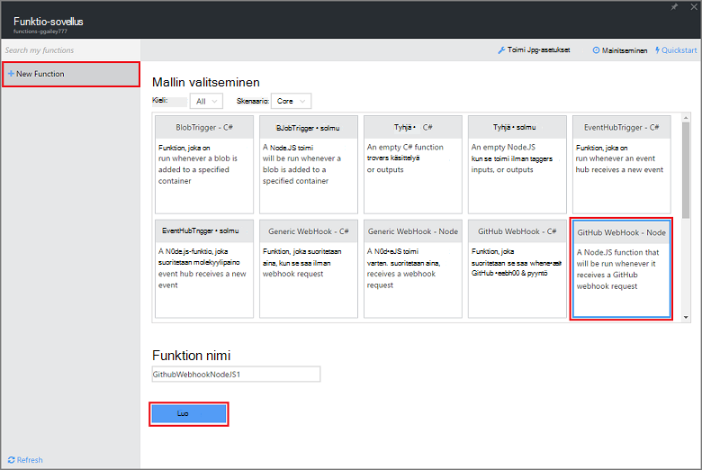

<properties
   pageTitle="Luo web koukku tai API Azure-funktion | Microsoft Azure"
   description="Käytetään Azure-funktioita voit luoda funktion, joka suoritetaan WebHook tai Ohjelmointirajapinnan kutsu."
   services="azure-functions"
   documentationCenter="na"
   authors="ggailey777"
   manager="erikre"
   editor=""
   tags=""
   />

<tags
   ms.service="functions"
   ms.devlang="multiple"
   ms.topic="get-started-article"
   ms.tgt_pltfrm="multiple"
   ms.workload="na"
   ms.date="08/30/2016"
   ms.author="glenga"/>
   
# Luo webhook tai API Azure-funktio

Azure funktiot on tapahtumaohjattu, Laske pyydettäessä joka avulla voit luoda ajoittaa tai saatu koodi toteutettu erilaisia ohjelmoinnin kieliä. Lisätietoja Azure-Funktiot, artikkelissa [Azure Funktiot yleiskatsaus](functions-overview.md).

Tässä ohjeaiheessa esitellään, miten voit luoda uuden Node.js-funktion, joka suoritetaan GitHub webhook mukaan. Uusi funktio luodaan Azure-Funktiot-portaalissa valmiin mallin pohjalta. Voit myös katsoa lyhyt video ja katso, kuinka nämä vaiheet suoritetaan portaalissa.

## Katso video

Seuraavassa videossa Näytä tietoja tässä opetusohjelmassa perusvaiheet 

[AZURE.VIDEO create-a-web-hook-or-api-azure-function]

##Webhook saatu funktion luominen mallista

Funktion app isännöi oman Azure-funktioiden suorittaminen. Ennen kuin voit luoda funktion, tarvitset on aktiivinen Azure-tili. Jos sinulla ei vielä ole Azure tili, [vapaa-tilit ovat käytettävissä](https://azure.microsoft.com/free/). 

1. Siirry [Azure Funktiot portal](https://functions.azure.com/signin) ja kirjaudu sisään Azure-tili.

2. Jos sinulla on aiemmin funktio-sovelluksen avulla, valitse **funktio** -sovelluksista Valitse **Avaa**. Funktion uuden sovelluksen luominen, uusi funktio sovellus yksilöllinen **nimi** tai hyväksy luotu yksi, valitse haluamasi **alue**ja valitse sitten **Luo + Aloita**. 

3. Valitse funktio-sovelluksen **+ Uusi funktio** > **GitHub Webhook - solmu** > **luominen**. Tämä luo funktion oletusnimen, joka perustuu määritetyn mallin kanssa. 

     

4. Huomaa **kehittäminen** **koodi** -ikkunassa sample express.js-funktio. Tämä funktio saa pyynnön GitHub ongelma-kommentti webhook, Kirjaa ongelman teksti ja lähettää vastauksen kuin webhook `New GitHub comment: <Your issue comment text>`.

     

5. Kopioi **Funktion URL-osoite** ja **GitHub salaisuus** arvot. Tarvitset nämä luodessasi webhook GitHub. 

6. Vieritä **suorittaa**, Huomaa ennalta määritettyjä JSON leipätekstiin ongelma-kommentti pyynnön tekstiosaan ja valitse sitten **Suorita**. 
 
    Voit aina testata uutta malliin perustuvan funktiota oikealle **kehittäminen** -välilehdessä toimittamalla jokin oikein leipätekstistä JSON tietoja ja **suorittaa** -vaihtoehdon. Tässä tapauksessa mallissa on esimääritettyjä leipätekstin ongelman kommentin. 
 
Seuraavaksi luodaan todellinen webhook GitHub säilöön.

##Määritä webhook

1. Siirry GitHub, säilöön, jonka omistat; Tämä vaihtoehto sisältää kaikki säilöjen tietoihin, jotka on forked.
 
2. Valitse **asetukset** > **Webhooks ja palvelujen** > **Lisää webhook**.

       

3. Liitä oman funktion URL-osoite ja salaisuus **Paketti URL-osoite** ja **salainen**, napsauta **Haluan yksittäiset tapahtumat**, **ongelma** kommentti ja sitten **Lisää webhook**.

     

Tässä vaiheessa GitHub webhook on määritetty käynnistettävän funktion kommentin ongelma lisättäessä.  
Nyt on testausvaiheessa sen.

##Testi funktio

1. GitHub-repo, valitse Avaa **Seurantakohteet** -välilehti uudessa selainikkunassa, valitse **Uusi seurantakohde**, kirjoita otsikko valitsemalla **Lähetä uusi seurantakohde**. Voit myös avata aiemmin luodun seurantakohteen.

2. Kirjoita kommentti ongelmaa, ja valitse **Kommentti**. Tässä vaiheessa voit siirtyä takaisin, että uuden webhook GitHub-kohdassa Katso **Viimeisimmät toimitukset** , webhook pyyntö lähetettiin ja että vastauksen teksti on `New GitHub comment: <Your issue comment text>`.

3. Edellinen-Funktiot-portaaliin, Selaa kohtaan lokit ja katso funktion saatu ja arvo `New GitHub comment: <Your issue comment text>` kirjoitetaan streaming lokitiedot.

##Seuraavat vaiheet

Seuraavissa aiheissa lisätietoja Azure-funktiot.

+ [Azure Funktiot Sovelluskehittäjän opas](functions-reference.md)  
Ohjelmointi viittaus coding funktiot.
+ [Azure Funktiot testaaminen](functions-test-a-function.md)  
Tässä artikkelissa kuvataan eri työkaluja ja menetelmiä oman Funktiot testikäyttöön.
+ [Miten Azure Funktiot](functions-scale.md)  
Tässä artikkelissa käsitellään palvelusopimusten vaihtoehdot käytettävissä Azure-toimintoja, kuten dynaaminen palvelusopimus ja voit valita oikean suunnitelma.  

[AZURE.INCLUDE [Getting Started Note](../../includes/functions-get-help.md)]
