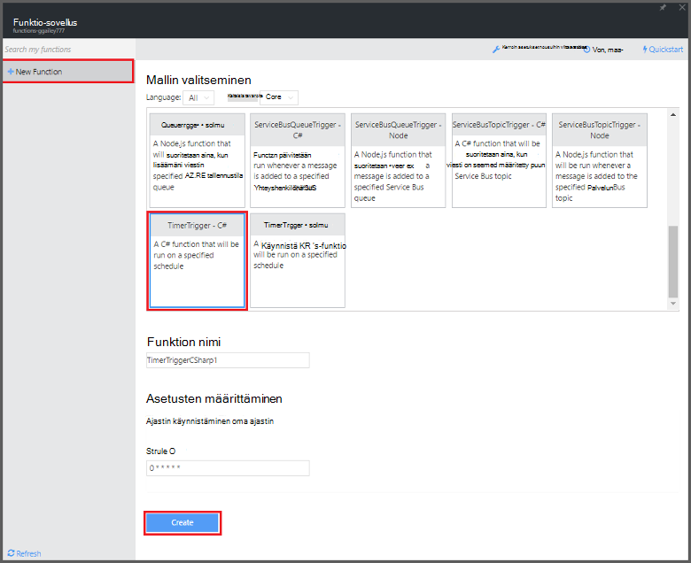
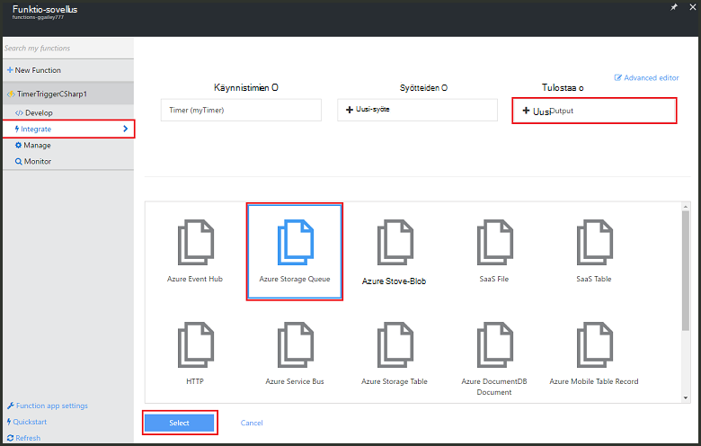
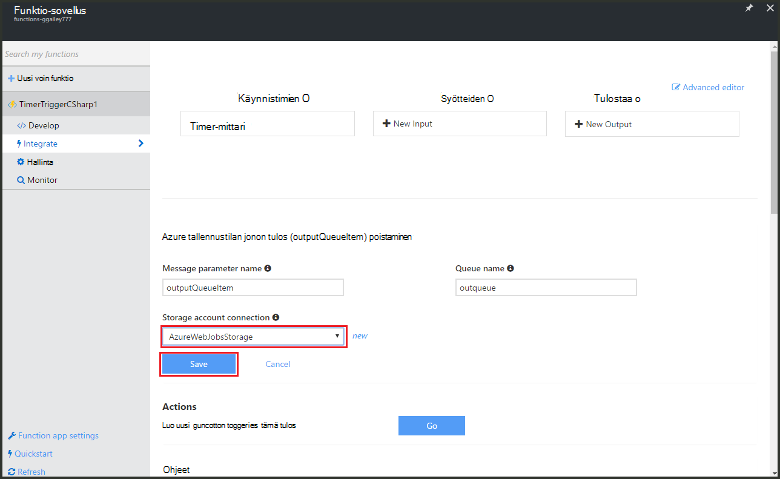

<properties
   pageTitle="Tapahtuman käsittelyn funktion luominen | Microsoft Azure"
   description="Käytä Azure Funktiot Luo C#-funktio, joka suoritetaan tapahtuman ajastin perusteella."
   services="functions"
   documentationCenter="na"
   authors="ggailey777"
   manager="erikre"
   editor=""
   tags=""
   />

<tags
   ms.service="functions"
   ms.devlang="multiple"
   ms.topic="get-started-article"
   ms.tgt_pltfrm="multiple"
   ms.workload="na"
   ms.date="09/25/2016"
   ms.author="glenga"/>
   
# Luoda tapahtumien käsittelyn Azure-funktio

Azure funktiot on tapahtumaohjattu, Laske pyydettäessä joka avulla voit luoda ajoittaa tai saatu koodi toteutettu erilaisia ohjelmoinnin kieliä. Lisätietoja Azure-Funktiot, artikkelissa [Azure Funktiot yleiskatsaus](functions-overview.md).

Tässä ohjeaiheessa esitellään, miten voit luoda uuden funktion C#, joka suorittaa tapahtuma-ajastin viestien lisäämiseen storage jonon perusteella. 

## Edellytykset 

Ennen kuin voit luoda funktion, tarvitset on aktiivinen Azure-tili. Jos sinulla ei vielä ole Azure tili, [vapaa-tilit ovat käytettävissä](https://azure.microsoft.com/free/).

## Ajastin saatu funktion luominen mallista

Funktion app isännöi oman Azure-funktioiden suorittaminen. Ennen kuin voit luoda funktion, tarvitset on aktiivinen Azure-tili. Jos sinulla ei vielä ole Azure tili, [vapaa-tilit ovat käytettävissä](https://azure.microsoft.com/free/). 

1. Siirry [Azure Funktiot portal](https://functions.azure.com/signin) ja kirjaudu sisään Azure-tili.

2. Jos sinulla on aiemmin funktio-sovelluksen avulla, valitse **funktio** -sovelluksista Valitse **Avaa**. Funktion uuden sovelluksen luominen, uusi funktio sovellus yksilöllinen **nimi** tai hyväksy luotu yksi, valitse haluamasi **alue**ja valitse sitten **Luo + Aloita**. 

3. Valitse funktio-sovelluksen **+ Uusi funktio** > **TimerTrigger - C#** > **luominen**. Tämä luo funktion kanssa oletusnimi on käynnissä olevat oletusarvon aikataulun kerran minuutin välein. 

    

4. Valitse uudesta funktiosta on **liittää** -välilehti > **Uusi tulosteen** > **Azure-tallennustilan jonon** > **Valitse**.

    

5. **Azure-tallennustilan jonon tulosteen**Valitse olemassa olevan **tallennustilan tiliyhteys**, tai Luo uusi ja valitse sitten **Tallenna**. 

    

6. Takaisin sisään **kehittäminen** -välilehdessä korvaa aiemmin luotu C#-komentosarjan **koodi** -ikkunassa seuraava koodi:

        using System;
        
        public static void Run(TimerInfo myTimer, out string outputQueueItem, TraceWriter log)
        {
            // Add a new scheduled message to the queue.
            outputQueueItem = $"Ping message added to the queue at: {DateTime.Now}.";
            
            // Also write the message to the logs.
            log.Info(outputQueueItem);
        }

    Tämä koodi Lisää uusi viesti jonossa nykyisen päivämäärän ja ajan, kun funktio suoritetaan.

7. Valitse **Tallenna** ja katso **lokit** ikkunoiden seuraavan toiminnon suorittaminen.

8. (Valinnainen) Siirry tallennustilan-tili ja tarkista, että viestit lisätään jonossa.

9. Avaa **liittää** -välilehti ja muuta aikataulun kentän `0 0 * * * *`. Funktio suoritetaan nyt kerran tunnissa. 

Tämä on hyvin yksinkertaistettu Esimerkki ajastin käynnistin ja tallennustilaa jonon tulosteen sidonta. Lisätietoja [Azure Funktiot ajastin käynnistin](functions-bindings-timer.md) ja [Azure Funktiot käynnistimien ja Azure-tallennustilan sidontojen](functions-bindings-storage.md) aiheet.

##Seuraavat vaiheet

Seuraavissa aiheissa lisätietoja Azure-funktiot.

+ [Azure Funktiot Sovelluskehittäjän opas](functions-reference.md)  
Ohjelmointi viittaus coding Funktiot ja käynnistimien ja sidontojen määrittäminen.
+ [Azure Funktiot testaaminen](functions-test-a-function.md)  
Tässä artikkelissa kuvataan eri työkaluja ja menetelmiä oman Funktiot testikäyttöön.
+ [Miten Azure Funktiot](functions-scale.md)  
Tässä artikkelissa käsitellään palvelusopimusten vaihtoehdot käytettävissä Azure-toimintoja, kuten dynaaminen palvelusopimus ja voit valita oikean suunnitelma.  

[AZURE.INCLUDE [Getting Started Note](../../includes/functions-get-help.md)]
