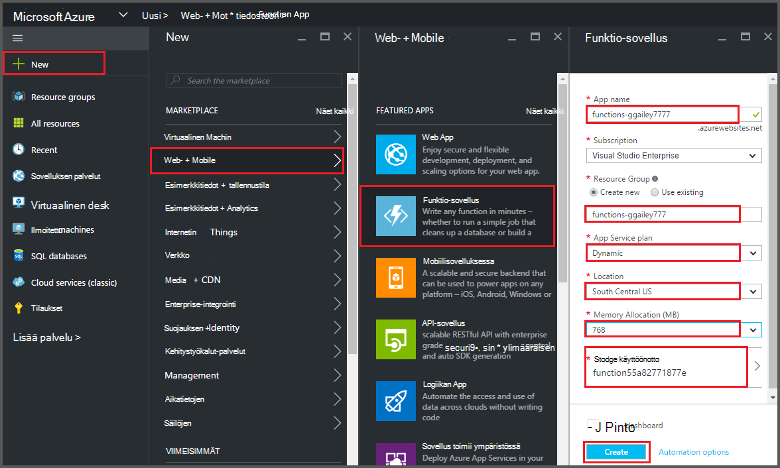
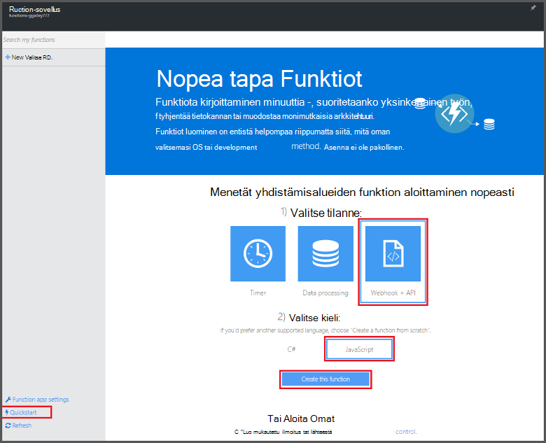
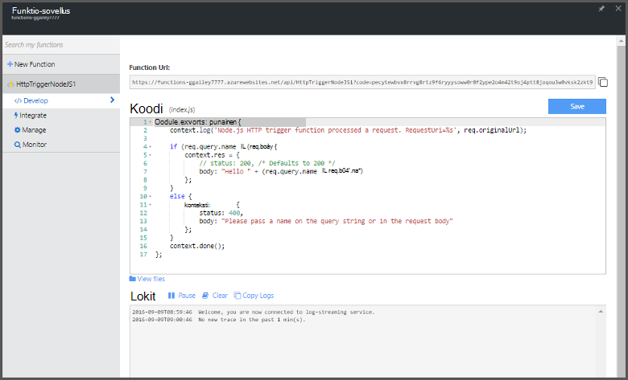

<properties
   pageTitle="Funktion luominen Azure-portaalista | Microsoft Azure"
   description="Luo ensimmäinen Azure funktion, serverless-sovelluksessa, alle kahdessa minuutissa."
   services="functions"
   documentationCenter="na"
   authors="ggailey777"
   manager="erikre"
   editor=""
   tags=""
/>

<tags
   ms.service="functions"
   ms.devlang="multiple"
   ms.topic="article"
   ms.tgt_pltfrm="multiple"
   ms.workload="na"
   ms.date="09/08/2016"
   ms.author="glenga"/>

#Funktion luominen Azure-portaalista

##Yleiskatsaus
Azure funktiot on tapahtumaohjattu, Laske pyydettäessä, joka ulottuu aiemmin Azure sovelluksen ympäristössä, ominaisuuksia, jotka Toteuta tapahtumien määrä Azure services, SaaS tuotteet ja paikallisen järjestelmien koodi. Azure-funktion sovellustesi skaalata mukaan demand ja maksat vain resursseille, voit käyttää. Azure funktioiden avulla voit luoda ajoittaa tai saatu koodit, jotka on toteutettu ohjelmoinnin eri kielillä. Lisätietoja Azure-Funktiot, artikkelissa [Azure Funktiot yleiskatsaus](functions-overview.md).

Tässä ohjeaiheessa kerrotaan, miten Azure portaalin avulla voit luoda yksinkertaisen "Hei" Node.js Azure-funktiota, joka on käynnistää HTTP käynnistintä. Ennen kuin voit luoda funktion Azure-portaalissa, sinun on luotava funktio-sovelluksen erikseen Azure sovelluksen-palvelussa. Jos haluat funktion sovelluksen luodaan automaattisesti, katso [Muut funktiot Azure pikaopas opetusohjelman](functions-create-first-azure-function.md), joka heikkenee yksinkertaisempi pikaopas ja sisältää videon.

##Funktion sovelluksen luominen

Funktion app isännöi oman Azure-funktioiden suorittaminen. Funktion sovelluksen luominen Azure-portaalissa seuraavasti.

Ennen kuin voit luoda ensimmäisen toimintoa, tarvitset on aktiivinen Azure-tili. Jos sinulla ei vielä ole Azure tili, [vapaa-tilit ovat käytettävissä](https://azure.microsoft.com/free/).

1. Siirry [Azure portal](https://portal.azure.com) ja kirjaudu sisään Azure-tili.

2. Valitse **+ Uusi** > **Web + Mobile** > **Funktion sovellus**, valitse **tilaus**, yksilöllinen **sovelluksen nimi** , joka määrittää funktion-sovelluksen sitten määrittää seuraavat asetukset:

    + **[Resurssiryhmä](../azure-portal/resource-group-portal.md/)**: **Luo uusi** ja kirjoita uusi resurssiryhmä nimi. Voit myös valita aiemmin resurssiryhmä kuitenkin Suunnittele dynaaminen App palvelun funktion sovelluksen ehkä ole.
    + **[Sovelluksen palvelusopimus](../app-service/azure-web-sites-web-hosting-plans-in-depth-overview.md)**: Valitse *dynaaminen* tai *perinteinen*. 
        + **Dynaaminen**: suunnitelma oletuslajin Azure-funktiot. Kun valitset Dynaaminen suunnitelma, on myös **sijainnin** ja määrittää **Muistin varaamista** (megatavuina). Lisätietoja muistin varaamista vaikutus kustannukset, artikkelissa [Azure Funktiot hinnat](https://azure.microsoft.com/pricing/details/functions/). 
        + **Perinteinen**: perinteinen App palvelusopimus edellyttää, että voit luoda **sovelluksen palvelun suunnitelman/sijainti** tai valitse aiemmin luotu. Nämä asetukset määrittävät [sijainti-ominaisuuksia, kustannus- ja Laske resurssit](https://azure.microsoft.com/pricing/details/app-service/) -sovellukseen kytketty.  
    + **Tallennustilan tilin**: funktion kunkin sovelluksen edellyttää tallennustilan tiliä. Voit valita käytössä olevan tallennustilan-tilin tai luoda. 

    

3. Valitse **Luo** valmistelu ja uusi funktio-sovelluksen käyttöönotto.  

Nyt kun funktio-sovellus on valmisteltu, voit luoda ensimmäisen funktio.

## Funktion luominen

Näin luoda funktion Azure-Funktiot-pikaopas.

1. **Pikaopas** -välilehdessä Valitse **WebHook + API** - ja **JavaScript**-ja valitse sitten **Luo funktiota**. Luodaan uusi ennalta määritettyä Node.js-funktiota. 

    

2. (Valinnainen) Tässä vaiheessa-pikaopas, voit toteuttaa esittelyn Azure Funktiot ominaisuudet-portaalissa.   Kun olet valmis tai ohitettu esittely, voit testata uudesta funktiosta HTTP-käynnistimen avulla.

##Testi funktio

Koska Azure Funktiot quickstarts sisältää toimintojen koodi, voit testata heti uudesta funktiosta.

1. **Kehittäminen** -välilehden **koodi** -ikkunassa Tarkista ja huomaat, että Node.js koodi odottaa HTTP-pyyntö välitetyn viestin tekstissä tai kyselymerkkijonon *nimi* -arvo. Kun funktio suoritetaan, tämä arvo palautetaan vastausviesti.

    

2. Vieritä **pyytää leipäteksti** -tekstiruutu, muuta *nimi* -ominaisuuden arvoksi nimesi ja valitse **Suorita**. Huomaat, että suorittamisen käynnistämä testi HTTP-pyyntö, tiedot kirjoitetaan streaming lokit ja "Hei" vastaus näkyy **tulos**. 

3. Käynnistettävän toisesta selainikkunan tai välilehden saman toiminnon suorittaminen, kopioi **Funktion URL-osoite** -arvo **kehittäminen** -välilehdestä ja liitä se selaimen osoiterivillä Valitse liittäminen kyselyn merkkijonoarvo `&name=yourname` ja paina enter-näppäintä. Samoja tietoja kirjoitetaan lokit ja selain näyttää ennen kuin vastaus "Hei".

##Seuraavat vaiheet

Tämä pikaopas osoittaa erittäin yksinkertaisia suorittamisen basic HTTP saatu-funktiota. Seuraavissa aiheissa lisätietoja käyttämällä potenssiin Azure-Funktiot-sovelluksia.

+ [Azure Funktiot Sovelluskehittäjän opas](functions-reference.md)  
Ohjelmointi viittaus coding Funktiot ja käynnistimien ja sidontojen määrittäminen.
+ [Azure Funktiot testaaminen](functions-test-a-function.md)  
Tässä artikkelissa kuvataan eri työkaluja ja menetelmiä oman Funktiot testikäyttöön.
+ [Miten Azure Funktiot](functions-scale.md)  
Tässä artikkelissa käsitellään palvelusopimusten vaihtoehdot käytettävissä Azure-toimintoja, kuten dynaaminen palvelusopimus ja voit valita oikean suunnitelma. 
+ [Azure-sovelluksen palvelun kuvaus](../app-service/app-service-value-prop-what-is.md)  
Azure Funktiot käyttää Azure App Service-ympäristö perustoiminnot, kuten ominaisuuksissa ympäristömuuttujat ja vianmääritys. 

[AZURE.INCLUDE [Getting Started Note](../../includes/functions-get-help.md)]
