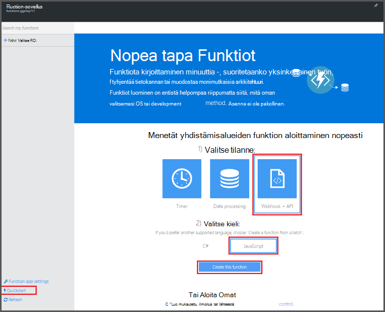
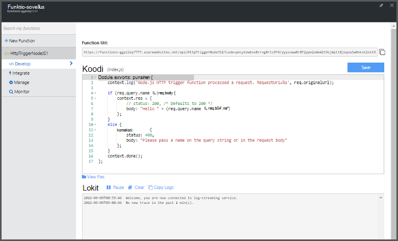

<properties
   pageTitle="Luo ensimmäinen Azure-funktio | Microsoft Azure"
   description="Luo ensimmäinen Azure funktion, serverless-sovelluksessa, alle kahdessa minuutissa."
   services="functions"
   documentationCenter="na"
   authors="ggailey777"
   manager="erikre"
   editor=""
   tags=""
/>

<tags
   ms.service="functions"
   ms.devlang="multiple"
   ms.topic="hero-article"
   ms.tgt_pltfrm="multiple"
   ms.workload="na"
   ms.date="09/08/2016"
   ms.author="glenga"/>

#Luo ensimmäinen Azure-funktio

##Yleiskatsaus
Azure funktiot on tapahtumaohjattu, Laske pyydettäessä, joka ulottuu aiemmin Azure sovelluksen ympäristössä, ominaisuuksia, jotka Toteuta tapahtumien määrä Azure services, SaaS tuotteet ja paikallisen järjestelmien koodi. Azure-funktion sovellustesi skaalata mukaan demand ja maksat vain resursseille, voit käyttää. Azure funktioiden avulla voit luoda ajoittaa tai saatu toteutettu löytyvään ohjelmoinnin koodit. Lisätietoja Azure-Funktiot, artikkelissa [Azure Funktiot yleiskatsaus](functions-overview.md).

Tämän artikkelin avulla voit luoda yksinkertaisen "Tervetuloa maailman" Node.js funktion, joka on käynnistää HTTP käynnistimen portaalin Azure-Funktiot-pikaopas avulla. Voit myös katsoa lyhyt video ja katso, kuinka nämä vaiheet suoritetaan portaalissa.

## Katso video

Seuraavassa videossa esitellään, miten perusvaiheet suorittaa tässä opetusohjelmassa. 

[AZURE.VIDEO create-your-first-azure-function-simple]

##Funktion luominen pikaopas

Funktion app isännöi oman Azure-funktioiden suorittaminen. Voit luoda uuden funktion sovelluksen uudesta funktiosta seuraavasti. Uusi funktio-sovellus on luotu oletusasetukset. Esimerkki erikseen funktion sovelluksen luomisesta on kohdassa [Muut funktiot Azure pikaopas-opetusohjelma](functions-create-first-azure-function-azure-portal.md).

Ennen kuin voit luoda ensimmäisen toimintoa, tarvitset on aktiivinen Azure-tili. Jos sinulla ei vielä ole Azure tili, [vapaa-tilit ovat käytettävissä](https://azure.microsoft.com/free/).

1. Siirry [Azure Funktiot portal](https://functions.azure.com/signin) ja kirjaudu sisään Azure-tili.

2. Uusi funktio sovellus yksilöllinen **nimi** tai hyväksy luotu yksi, valitse haluamasi **alue**ja valitse sitten **Luo + Aloita**. 

3. **Pikaopas** -välilehdessä Valitse **WebHook + API** - ja **JavaScript**-ja valitse sitten **Luo funktiota**. Luodaan uusi ennalta määritettyä Node.js-funktiota. 

    

4. (Valinnainen) Tässä vaiheessa-pikaopas, voit toteuttaa esittelyn Azure Funktiot ominaisuudet-portaalissa.   Kun olet valmis tai ohitettu esittely, voit testata uudesta funktiosta HTTP-käynnistimen avulla.

##Testi funktio

Koska Azure Funktiot quickstarts sisältää toimintojen koodi, voit testata heti uudesta funktiosta.

1. **Kehittäminen** -välilehden **koodi** -ikkunassa Tarkista ja huomaat, että Node.js koodi odottaa HTTP-pyyntö välitetyn viestin tekstissä tai kyselymerkkijonon *nimi* -arvo. Kun funktio suoritetaan, tämä arvo palautetaan vastausviesti.

    

2. Vieritä **pyytää leipäteksti** -tekstiruutu, muuta *nimi* -ominaisuuden arvoksi nimesi ja valitse **Suorita**. Tulet huomaamaan, että suorittamisen käynnistämä testi HTTP-pyyntö, tiedot kirjoitetaan streaming lokit ja **tulos**näytetään "Hei" vastaus. 

3. Käynnistettävän toisesta selainikkunan tai välilehden saman toiminnon suorittaminen, kopioi **Funktion URL-osoite** -arvo **kehittäminen** -välilehdestä ja liitä se selaimen osoiterivillä Valitse liittäminen kyselyn merkkijonoarvo `&name=yourname` ja paina enter-näppäintä. Samoja tietoja kirjoitetaan lokit ja selain näyttää ennen kuin vastaus "Hei".

##Seuraavat vaiheet

Tämä pikaopas osoittaa erittäin yksinkertaisia suorittamisen basic HTTP saatu-funktiota. Seuraavissa aiheissa lisätietoja hyödyntäminen potenssiin Azure-Funktiot-sovelluksia.

+ [Azure Funktiot Sovelluskehittäjän opas](functions-reference.md)  
Ohjelmointi viittaus coding Funktiot ja käynnistimien ja sidontojen määrittäminen.
+ [Azure Funktiot testaaminen](functions-test-a-function.md)  
Tässä artikkelissa kuvataan eri työkaluja ja menetelmiä oman Funktiot testikäyttöön.
+ [Miten Azure Funktiot](functions-scale.md)  
Tässä artikkelissa käsitellään palvelusopimusten vaihtoehdot käytettävissä Azure-toimintoja, kuten dynaaminen palvelusopimus ja voit valita oikean suunnitelma. 
+ [Azure-sovelluksen palvelun kuvaus](../app-service/app-service-value-prop-what-is.md)  
Azure Funktiot hyödyntää perustoiminnot, kuten ominaisuuksissa ympäristömuuttujat ja diagnostiikka Azure App Service-ympäristön. 

[AZURE.INCLUDE [Getting Started Note](../../includes/functions-get-help.md)]
