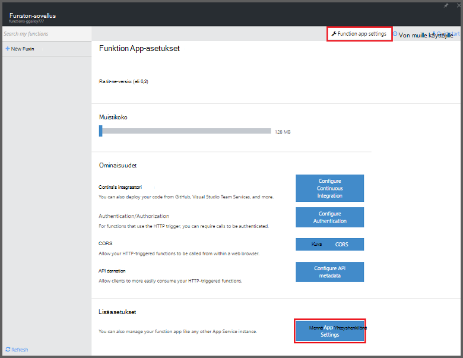
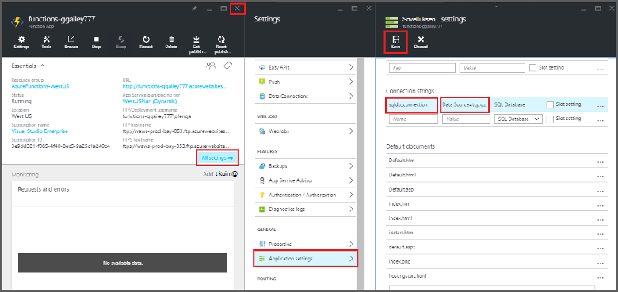

<properties
   pageTitle="Azure-funktioiden avulla voit suorittaa tehtävän SIIVOA | Microsoft Azure"
   description="Käytä Azure Funktiot Luo C#-funktio, joka suoritetaan tapahtuman ajastin perusteella."
   services="functions"
   documentationCenter="na"
   authors="ggailey777"
   manager="erikre"
   editor=""
   tags=""
   />

<tags
   ms.service="functions"
   ms.devlang="multiple"
   ms.topic="article"
   ms.tgt_pltfrm="multiple"
   ms.workload="na"
   ms.date="09/26/2016"
   ms.author="glenga"/>
   
# Azure-funktioiden avulla voit suorittaa tehtävän SIIVOA

Tässä ohjeaiheessa kerrotaan, miten Azure-funktioiden avulla voit luoda uutta funktiota C#, joka suoritetaan perustuvat SIIVOA-tapahtuman ajastin tietokannan taulukon rivejä. Uusi funktio luodaan Azure-Funktiot-portaalissa valmiin mallin pohjalta. Tässä skenaariossa tukemaan sinun on myös määritettävä tietokannan yhteysmerkkijonon sovelluksen palveluna päivämääräkentän funktio-sovelluksessa. 

## Edellytykset 

Ennen kuin voit luoda funktion, tarvitset on aktiivinen Azure-tili. Jos sinulla ei vielä ole Azure tili, [vapaa-tilit ovat käytettävissä](https://azure.microsoft.com/free/).

Tässä ohjeaiheessa esitellään Transact-SQL-komento, joka suoritetaan samalla kertaa poistotoiminto taulukon *TodoItems* SQL-tietokantaan. Tämän saman TodoItems-taulukko luodaan, kun olet suorittanut [Azure palvelun mobiilisovellukset pikaopas opetusohjelma](../app-service-mobile/app-service-mobile-ios-get-started.md). Voit käyttää mallitietokanta myös, jos haluat käyttää eri taulukko, sinun on muokattava komento.

Voit käyttää **kaikkia**asetuksia portaalissa Mobile-sovelluksen taustassa käyttämä yhteysmerkkijonon > **Sovellusasetukset** > **yhteysmerkkijonon** > **Näytä yhteyden merkkijonoarvoa** > **MS_TableConnectionString**. Saat myös yhteysmerkkijonon suoraan portaalin **kaikkia**asetuksia SQL-tietokannasta > **Ominaisuudet** > **Näytä tietokannan yhteysmerkkijonot** > **ADO.NET (SQL-todennus)**.

Tässä skenaariossa käyttää Joukkotoiminnon tietokannassa. Muodostamaan yhteyttä funktion prosessin yksittäisten CRUD toimintojen mobiilisovellukset taulukon Käytä sen sijaan Mobile taulukon sidonta.

## Määritä SQL-tietokantaan yhteysmerkkijonon funktio-sovelluksessa

Funktion app isännöi oman Azure-funktioiden suorittaminen. Se on yleensä paras käytäntö tallentaa yhteysmerkkijonon ja muita tietoja funktion app-asetukset. Tämä estää vahingossa paljastaminen, kun funktio koodin päättyy-ylös repo toiseen sijaintiin. 

1. Siirry [Azure Funktiot portal](https://functions.azure.com/signin) ja kirjaudu sisään Azure-tili.

2. Jos sinulla on aiemmin funktio-sovelluksen avulla, valitse **funktio** -sovelluksista Valitse **Avaa**. Funktion uuden sovelluksen luominen, uusi funktio sovellus yksilöllinen **nimi** tai hyväksy luotu yksi, valitse haluamasi **alue**ja valitse sitten **Luo + Aloita**. 

3. Valitse funktio-sovelluksen **funktion sovelluksen asetukset** > **sovelluksen palvelun asetukset**. 

    

4. Funktio-sovelluksen **kaikki asetukset**, Vieritä alaspäin **asetukset**ja valitse **yhteyden merkkijonot** tyyppi-kohdassa `sqldb_connection` **nimi**-yhteysmerkkijonon liittäminen **arvo**, valitse **Tallenna**ja valitse Sulje palauttaa Funktiot-portaaliin funktion sovellus-sivu.

    

Voit nyt lisätä C# funktion koodi, joka muodostaa yhteyden SQL-tietokantaan.

## Ajastin saatu funktion luominen mallista

1. Valitse funktio-sovelluksen **+ Uusi funktio** > **TimerTrigger - C#** > **luominen**. Tämä luo funktion kanssa oletusnimi on käynnissä olevat oletusarvon aikataulun kerran minuutin välein. 

    

2. Lisää seuraavat Kokoonpanoviittaukset **kehittäminen** -välilehden **koodi** -ruudussa aiemmin funktion koodin yläreunassa:

        #r "System.Configuration"
        #r "System.Data"

3. Lisää seuraava `using` lauseet funktiota:

        using System.Configuration;
        using System.Data.SqlClient;
        using System.Threading.Tasks; 

4. Korvaa aiemmin luotu **Suorita** -funktion seuraava koodi:

        public static async Task Run(TimerInfo myTimer, TraceWriter log)
        {
            var str = ConfigurationManager.ConnectionStrings["sqldb_connection"].ConnectionString;
            using (SqlConnection conn = new SqlConnection(str))
            {
                conn.Open();
                var text = "DELETE from dbo.TodoItems WHERE Complete='True'";
                using (SqlCommand cmd = new SqlCommand(text, conn))
                {
                    // Execute the command and log the # rows deleted.
                    var rows = await cmd.ExecuteNonQueryAsync();
                    log.Info($"{rows} rows were deleted");
                }
            }
        }

5. Valitse **Tallenna**, katso **lokit** ikkunoiden seuraavan toiminnon suorittaminen ja valitse Huomaa poistaminen TodoItems taulukon rivien määrä.

6. (Valinnainen) Muut kohteet [mobiilisovellukset pikaopas-sovelluksen](../app-service-mobile/app-service-mobile-ios-get-started.md)käyttäminen merkitsee, "Valmis" palaa sitten **lokit** -ikkuna ja katso sama määrä rivejä poisteta funktio seuraavan suorituksen aikana. 

##Seuraavat vaiheet

Seuraavissa aiheissa lisätietoja Azure-funktiot.

+ [Azure Funktiot Sovelluskehittäjän opas](functions-reference.md)  
Ohjelmointi viittaus coding Funktiot ja käynnistimien ja sidontojen määrittäminen.
+ [Azure Funktiot testaaminen](functions-test-a-function.md)  
Tässä artikkelissa kuvataan eri työkaluja ja menetelmiä oman Funktiot testikäyttöön.
+ [Miten Azure Funktiot](functions-scale.md)  
Tässä artikkelissa käsitellään palvelusopimusten vaihtoehdot käytettävissä Azure-toimintoja, kuten dynaaminen palvelusopimus ja voit valita oikean suunnitelma.  

[AZURE.INCLUDE [Getting Started Note](../../includes/functions-get-help.md)]