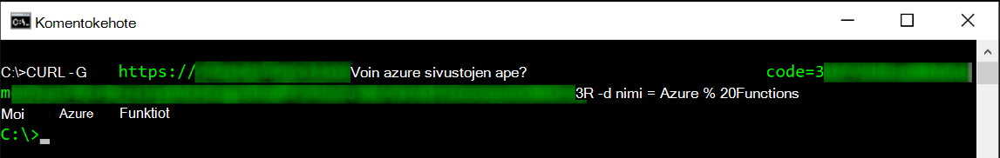
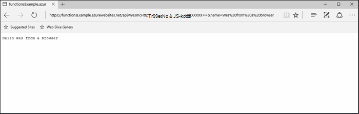
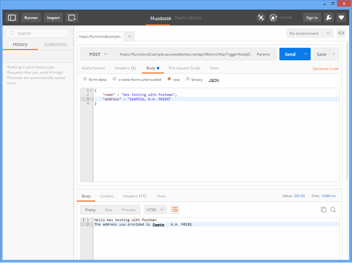
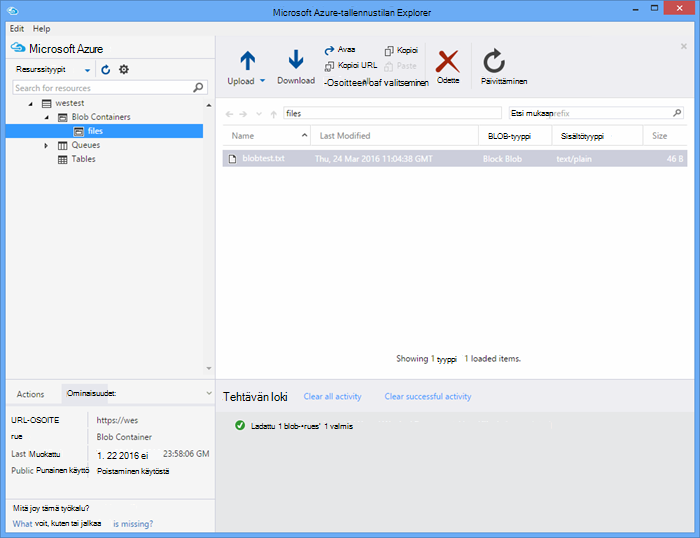

<properties
   pageTitle="Testauksessa Azure Funktiot | Microsoft Azure"
   description="Testaa yhteyttä Postman, kääntö ja Node.js Azure-funktiot."
   services="functions"
   documentationCenter="na"
   authors="wesmc7777"
   manager="erikre"
   editor=""
   tags=""
   keywords="Azure Funktiot, funktioiden, käsittely, webhooks, dynaaminen suorittaminen, serverless arkkitehtuuri testaaminen"/>

<tags
   ms.service="functions"
   ms.devlang="multiple"
   ms.topic="article"
   ms.tgt_pltfrm="multiple"
   ms.workload="na"
   ms.date="08/19/2016"
   ms.author="wesmc"/>

# Azure Funktiot testaaminen

## Yleiskatsaus

Tässä opetusohjelmassa selkeät eri tavoista testaamiseen funktiot. Olemme määrittää http käynnistimen-funktio, joka hyväksyy syöte kyselymerkkijonoparametrin tai pyynnön tekstissä. Oletusarvoisen **HttpTrigger Node.js funktion** mallin koodi tukee `name` kyselyn kyselymerkkijonon parametrin. On myös lisätä koodia tukevat mukana parametrin `address` pyynnön tekstissä käyttäjän tietoja.

## Funktion testikäyttöön luominen

Tässä opetusohjelmassa useimpien Käytämme **HttpTrigger Nodejs funktion** malli, joka on käytettävissä, kun luot uuden funktion toimintoja on muutettu versio.  Voit tarkastella [luominen Azure-funktion ensimmäinen opetusohjelma](functions-create-first-azure-function.md) Jos tarvitset apua uudesta funktiosta.  Valitse **HttpTrigger Nodejs funktion** mallin juuri luodessasi test-toiminnolla [Azure-portaalissa].

Funktion oletusmalli on lähinnä Hei maailma-funktio, joka echoes takaisin kokouspyynnön tekstiosassa tai kyselyn Merkkijonoparametri, nimen `name=<your name>`.  Päivitämme koodin avulla voit määrittää nimen ja osoitteen JSON sisällön pyynnön myös. Valitse funktio Päivitä nämä takaisin asiakas, kun niitä on saatavilla.   

Päivitä funktion joka testikäyttöön Käytämme seuraava koodi:

    module.exports = function(context, req) {
        context.log("Node.js HTTP trigger function processed a request. RequestUri=%s", req.originalUrl);
        context.log("Request Headers = " + JSON.stringify(req.headers));    
    
        if (req.query.name || (req.body && req.body.name)) {
            if (typeof req.query.name != "undefined") {
                context.log("Name was provided as a query string param..."); 
                ProcessNewUserInformation(context, req.query.name);
            }
            else {
                context.log("Processing user info from request body..."); 
                ProcessNewUserInformation(context, req.body.name, req.body.address);
            }
        }
        else {
            context.res = {
                status: 400,
                body: "Please pass a name on the query string or in the request body"
            };
        }
        context.done();
    };
    
    function ProcessNewUserInformation(context, name, address)
    {    
        context.log("Processing User Information...");            
        context.log("name = " + name);            
        echoString = "Hello " + name;
        
        if (typeof address != "undefined")
        {
            echoString += "\n" + "The address you provided is " + address;
            context.log("address = " + address);            
        }
        
        context.res = {
                // status: 200, /* Defaults to 200 */
                body: echoString
            };
    }

## Testaa funktioon työkaluja

### Testaa kääntö

Usein kun testaaminen ohjelmiston ei tarvitse tarkistettava mitään muita kuin komentorivin virheenkorjaus sovelluksen avulla, tämä on sama asia toiminnoilla.

Voit testata yllä funktiota kopioi **Funktion URL-osoite** -portaalista. Se on seuraavassa muodossa: 

    https://<Your Function App>.azurewebsites.net/api/<Your Function Name>?code=<your access code>
    
Tämä on käynnistävä funktion URL-osoite, emme voi testata kääntö komennolla komentorivillä, jotta Get (`-G` tai `--get`) pyynnön vastaan Microsoftin funktiota:

    curl -G https://<Your Function App>.azurewebsites.net/api/<Your Function Name>?code=<your access code>
    
Tämä tietyn esimerkin edellyttää kyselymerkkijonoparametrin joka voi välittää tiedot (`-d`) kääntö-komennolla:

    curl -G https://<Your Function App>.azurewebsites.net/api/<Your Function Name>?code=<your access code> -d name=<Enter a name here>
    
Kirjoita osumien ja -funktion tulos tulee näkyviin komentorivillä.

Portaalin **lokit** -ikkunassa suoritettaessa funktion kirjataan tulosteen seuraavankaltaiselta:

    2016-04-05T21:55:09  Welcome, you are now connected to log-streaming service.
    2016-04-05T21:55:30.738 Function started (Id=ae6955da-29db-401a-b706-482fcd1b8f7a)
    2016-04-05T21:55:30.738 Node.js HTTP trigger function processed a request. RequestUri=https://functionsExample.azurewebsites.net/api/HttpTriggerNodeJS1?code=XXXXXXX&name=Azure Functions
    2016-04-05T21:55:30.738 Function completed (Success, Id=ae6955da-29db-401a-b706-482fcd1b8f7a)

### Testaa selaimessa

Toiminnot, jotka eivät vaadi parametreja tai on vain kyselyparametri, voidaan testata selaimessa.

Voit testata määritimme yläpuolella funktiota kopioi **Funktion URL-osoite** -portaalista. Se on seuraavassa muodossa:

    https://<Your Function App>.azurewebsites.net/api/<Your Function Name>?code=<your access code>

Liitä `name` kysely parametrin seuraavan kaavan avulla todellinen nimi `<Enter a name here>` paikkamerkki.

    https://<Your Function App>.azurewebsites.net/api/<Your Function Name>?code=<your access code>&name=<Enter a name here>

Liitä URL-Osoitteen selaimeen ja pitäisi saada vastaus seuraavankaltaiselta.

Portaalin **lokit** -ikkunassa suoritettaessa funktion kirjataan tulosteen seuraavankaltaiselta:

    2016-03-23T07:34:59  Welcome, you are now connected to log-streaming service.
    2016-03-23T07:35:09.195 Function started (Id=61a8c5a9-5e44-4da0-909d-91d293f20445)
    2016-03-23T07:35:10.338 Node.js HTTP trigger function processed a request. RequestUri=https://functionsExample.azurewebsites.net/api/WesmcHttpTriggerNodeJS1?code=XXXXXXXXXX==&name=Wes from a browser
    2016-03-23T07:35:10.338 Request Headers = {"cache-control":"max-age=0","connection":"Keep-Alive","accept":"text/html","accept-encoding":"gzip","accept-language":"en-US"}
    2016-03-23T07:35:10.338 Name was provided as a query string param.
    2016-03-23T07:35:10.338 Processing User Information...
    2016-03-23T07:35:10.369 Function completed (Success, Id=61a8c5a9-5e44-4da0-909d-91d293f20445)

### Testaa Postman

Testaa yhteyttä Funktiot useimmat suositella on Postman. Voit asentaa Postman-kohdassa [Hae Postman](https://www.getpostman.com/). Postman avulla voit hallita monia muita määritteitä HTTP-pyynnön.

> [AZURE.TIP] Käytä REST-asiakas, jonka olet perehtynyt. Seuraavassa on joitakin Postman vaihtoehtoja:  
> 
> * [Fiddler](http://www.telerik.com/fiddler)  
> * [Paw](https://luckymarmot.com/paw)  

Voit esikatsella Postman pyynnön leipätekstin funktiota: 

1. Käynnistä Postman Chrome-selaimessa-ikkunan oikeassa alakulmassa vasemmassa yläkulmassa **sovellukset** -painike.
2. Kopioi **Funktion URL-osoite** ja liitä se Postman. Se sisältää valintanumero kyselymerkkijonoparametrin.
3. Vaihtaa HTTP **viestiin**.
4. Napsauta **tekstiä** > **raaka** ja lisää JSON pyynnön leipätekstin seuraavankaltaiselta:

        {
            "name" : "Wes testing with Postman",
            "address" : "Seattle, W.A. 98101"
        }

5. Valitse **Lähetä**.

Seuraavassa kuvassa on esimerkki yksinkertainen Kaiku funktioista testaaminen Tässä opetusohjelmassa. 

Portaalin **lokit** -ikkunassa suoritettaessa funktion kirjataan tulosteen seuraavankaltaiselta:

    2016-03-23T08:04:51  Welcome, you are now connected to log-streaming service.
    2016-03-23T08:04:57.107 Function started (Id=dc5db8b1-6f1c-4117-b5c4-f6b602d538f7)
    2016-03-23T08:04:57.763 Node.js HTTP trigger function processed a request. RequestUri=https://functions841def78.azurewebsites.net/api/WesmcHttpTriggerNodeJS1?code=XXXXXXXXXX==
    2016-03-23T08:04:57.763 Request Headers = {"cache-control":"no-cache","connection":"Keep-Alive","accept":"*/*","accept-encoding":"gzip","accept-language":"en-US"}
    2016-03-23T08:04:57.763 Processing user info from request body...
    2016-03-23T08:04:57.763 Processing User Information...
    2016-03-23T08:04:57.763 name = Wes testing with Postman
    2016-03-23T08:04:57.763 address = Seattle, W.A. 98101
    2016-03-23T08:04:57.795 Function completed (Success, Id=dc5db8b1-6f1c-4117-b5c4-f6b602d538f7)
    
### Testaa blob Storage Resurssienhallinnassa käynnistin

Voit testata blob-käynnistystoiminto [Microsoft Azure-tallennustilan Resurssienhallinnan](http://storageexplorer.com/)avulla.

1. [Azure-portaalin] Funktiot-sovelluksen Luo uusi C#, F # tai solmu blob käynnistimen funktio. Määrittää seurannassa blob-säilö nimi. Esimerkki:

        files

2. Valitse **+** tai luo tallennustilan-tili, jota haluat käyttää-painiketta. Valitse **Luo**.

3. Seuraavia tekstin sisältävän tekstitiedoston luominen ja tallenna se:

        A text file for blob trigger function testing.

4. Suorita [Microsoft Azure-tallennustilan Explorer](http://storageexplorer.com/) ja Yhdistä-tallennustilan tilin seurataan blob-säilö.

5. **Lataa** -painiketta ja lataa tiedosto.

    

    Oletusarvoisen blob käynnistimen funktion koodi raportoi lokit-Blob-objektien käsittelyn:

        2016-03-24T11:30:10  Welcome, you are now connected to log-streaming service.
        2016-03-24T11:30:34.472 Function started (Id=739ebc07-ff9e-4ec4-a444-e479cec2e460)
        2016-03-24T11:30:34.472 C# Blob trigger function processed: A text file for blob trigger function testing.
        2016-03-24T11:30:34.472 Function completed (Success, Id=739ebc07-ff9e-4ec4-a444-e479cec2e460)

## Funktion sisällyttäminen Funktiot testaaminen

### Testaa Suorita toiminnot-portaalissa

Portaalissa on **Suorita** -painike, jonka avulla voit tehdä joitakin rajoitettu testaamiseen. Voit antaa pyynnön tekstin Suorita-painiketta, mutta et voi säätää kyselyparametri tai pyynnön otsikoiden päivittäminen.

Testaa HTTP käynnistimen-funktio on aiemmin luotu lisäämällä seuraavanlainen JSON merkkijonon **pyytää leipäteksti** -kenttään ja valitse sitten **Suorita** -painiketta.

    {
        "name" : "Wes testing Run button",
        "address" : "USA"
    } 

Portaalin **lokit** -ikkunassa suoritettaessa funktion kirjataan tulosteen seuraavankaltaiselta:

    2016-03-23T08:03:12  Welcome, you are now connected to log-streaming service.
    2016-03-23T08:03:17.357 Function started (Id=753a01b0-45a8-4125-a030-3ad543a89409)
    2016-03-23T08:03:18.697 Node.js HTTP trigger function processed a request. RequestUri=https://functions841def78.azurewebsites.net/api/wesmchttptriggernodejs1
    2016-03-23T08:03:18.697 Request Headers = {"connection":"Keep-Alive","accept":"*/*","accept-encoding":"gzip","accept-language":"en-US"}
    2016-03-23T08:03:18.697 Processing user info from request body...
    2016-03-23T08:03:18.697 Processing User Information...
    2016-03-23T08:03:18.697 name = Wes testing Run button
    2016-03-23T08:03:18.697 address = USA
    2016-03-23T08:03:18.744 Function completed (Success, Id=753a01b0-45a8-4125-a030-3ad543a89409)

### Testaa ajastin käynnistin

Joitakin toimintoja ei voi testata todella mainittiin työkaluilla. Esimerkiksi sisältävä jonon käynnistimen funktio suoritetaan, kun viesti poistetaan [Azure jonon](../storage/storage-dotnet-how-to-use-queues.md)varastoon. Voit aina kirjoittaa koodin viestin pudottaa jonossa ja Esimerkki tämä konsoli projektin on jäljempänä. On kuitenkin toisen menetelmän avulla voit testata funktioiden suoraan.  

Voi käyttää jonon määritetty ajastin käynnistimen tulosteen sidonta. Ajastin käynnistimen koodia sitten voi kirjoittaa testi viestit jonossa. Tässä osassa käy läpi Esimerkki kautta. 

Katso tarkempia tietoja käyttämällä sidontojen Azure-toiminnoilla, [Azure Funktiot Sovelluskehittäjän opas](functions-reference.md). 

#### Luo jonon käynnistimen testaaminen

Tämän menetelmän osoittamaan ensin luodaan jonon käynnistystoiminto, että haluat testata nimeltä jonon `queue-newusers`. Tämä funktio käsittelee pudotettu Azure jonon varastoon uuden käyttäjän nimi ja osoite tiedot. 

> [AZURE.NOTE] Jos käytät toisen nimen, varmista, että tätä nimeä käytetään [nimeäminen olevien ja metatiedot](https://msdn.microsoft.com/library/dd179349.aspx) sääntöjen mukainen.  Muussa tapauksessa saat HTTP-tilakoodin 400: virheelliset pyytää. 

1. [Azure-portaalin] Funktiot-sovelluksen, valitse **Uusi funktio** > **QueueTrigger - C#**.
2. Jonon nimi seurattava jonon-funktio 

        queue-newusers 

3. Valitse **+** (Lisää)-painiketta tai luo tallennustilan-tili, jota haluat käyttää. Valitse **Luo**.
4. Jätä tämän portaalin selainikkunassa avattu, jotta voit valvoa oletus jonon funktion mallin koodi tapahtumat.

#### Voit poistaa viestin jonossa ajastin käynnistimen luominen

1. [Azure-portaalin] avaaminen uudessa selainikkunassa, ja siirry funktion sovelluksen.
2. Valitse **Uusi funktio** > **TimerTrigger - C#**. Kirjoita cron-lauseke, joka määrittää, kuinka usein ajastin-koodin suorittaminen testaaminen jonon-funktio. Valitse **Luo**. Jos haluat suorittaa 30 sekunnin välein testi voit käyttää seuraavaa [CRON lauseke](https://wikipedia.org/wiki/Cron#CRON_expression):

        */30 * * * * *

2. Valitse uuden ajastin käynnistimen **liittää** -välilehti.
3. Valitse **tulostus**valitsemalla **+ Uusi tulos** . Valitse **jono** ja **Valitse** -painiketta.
4. Huomautus Tätä nimeä käytetään **jonon viestin objektin** voit käyttää tätä ajastin-funktion koodi.

        myQueue

4. Kirjoita jonon nimen, johon viesti lähetetään: 

        queue-newusers 

3. Valitse **+** (Lisää)-painiketta ja valitse olet käyttänyt aikaisemmin jonon käynnistin tallennustilan tilin. Valitse **Tallenna**.
4. Valitse ajastin käynnistimen **kehittäminen** -välilehti.
5. Seuraava koodi voi käyttää C# timer-funktio, kunhan sama jonon viestin objektin nimen yllä. Valitse **Tallenna**

        using System;
        
        public static void Run(TimerInfo myTimer, out String myQueue, TraceWriter log)
        {
            String newUser = 
            "{\"name\":\"User testing from C# timer function\",\"address\":\"XYZ\"}";
        
            log.Verbose($"C# Timer trigger function executed at: {DateTime.Now}");   
            log.Verbose($"{newUser}");   
            
            myQueue = newUser;
        }

Tässä vaiheessa C# timer-funktio suoritetaan 30 sekunnin välein, jos olet käyttänyt Esimerkki cron lauseke. Timer-funktio lokien raportoi kukin suoritus:

    2016-03-24T10:27:02  Welcome, you are now connected to log-streaming service.
    2016-03-24T10:27:30.004 Function started (Id=04061790-974f-4043-b851-48bd4ac424d1)
    2016-03-24T10:27:30.004 C# Timer trigger function executed at: 3/24/2016 10:27:30 AM
    2016-03-24T10:27:30.004 {"name":"User testing from C# timer function","address":"XYZ"}
    2016-03-24T10:27:30.004 Function completed (Success, Id=04061790-974f-4043-b851-48bd4ac424d1)

Jono-funktion selainikkunassa kunkin käsitellään sanoma tulee näkyviin:

    2016-03-24T10:27:06  Welcome, you are now connected to log-streaming service.
    2016-03-24T10:27:30.607 Function started (Id=e304450c-ff48-44dc-ba2e-1df7209a9d22)
    2016-03-24T10:27:30.607 C# Queue trigger function processed: {"name":"User testing from C# timer function","address":"XYZ"}
    2016-03-24T10:27:30.607 Function completed (Success, Id=e304450c-ff48-44dc-ba2e-1df7209a9d22)
    
## Testaa funktioon koodilla

### Testaa HTTP-käynnistystoiminto koodilla: Node.js

Voit käyttää Node.js koodin http-pyyntö, voit testata Azure-funktiota. 

Varmista, että voit määrittää:

- `host` Funktio-sovelluksen isäntään pyynnön-asetukset
- Funktion nimeä `path`.
- Access-koodin (`<your code>`)- `path`.

Esimerkki:

    var http = require("http");
    
    var nameQueryString = "name=Wes%20Query%20String%20Test%20From%20Node.js";
    
    var nameBodyJSON = {
        name : "Wes testing with Node.JS code",
        address : "Dallas, T.X. 75201"
    };
    
    var bodyString = JSON.stringify(nameBodyJSON);
    
    var options = {
      host: "functions841def78.azurewebsites.net",
      //path: "/api/HttpTriggerNodeJS2?code=sc1wt62opn7k9buhrm8jpds4ikxvvj42m5ojdt0p91lz5jnhfr2c74ipoujyq26wab3wk5gkfbt9&" + nameQueryString,
      path: "/api/HttpTriggerNodeJS2?code=sc1wt62opn7k9buhrm8jpds4ikxvvj42m5ojdt0p91lz5jnhfr2c74ipoujyq26wab3wk5gkfbt9",
      method: "POST",
      headers : {
          "Content-Type":"application/json",
          "Content-Length": Buffer.byteLength(bodyString)
        }    
    };
    
    callback = function(response) {
      var str = ""
      response.on("data", function (chunk) {
        str += chunk;
      });
    
      response.on("end", function () {
        console.log(str);
      });
    }
    
    var req = http.request(options, callback);
    console.log("*** Sending name and address in body ***");
    console.log(bodyString);
    req.end(bodyString);

Tulos:

    C:\Users\Wesley\testing\Node.js>node testHttpTriggerExample.js
    *** Sending name and address in body ***
    {"name" : "Wes testing with Node.JS code","address" : "Dallas, T.X. 75201"}
    Hello Wes testing with Node.JS code
    The address you provided is Dallas, T.X. 75201
        
Portaalin **lokit** -ikkunassa suoritettaessa funktion kirjataan tulosteen seuraavankaltaiselta:

    2016-03-23T08:08:55  Welcome, you are now connected to log-streaming service.
    2016-03-23T08:08:59.736 Function started (Id=607b891c-08a1-427f-910c-af64ae4f7f9c)
    2016-03-23T08:09:01.153 Node.js HTTP trigger function processed a request. RequestUri=http://functionsExample.azurewebsites.net/api/WesmcHttpTriggerNodeJS1/?code=XXXXXXXXXX==
    2016-03-23T08:09:01.153 Request Headers = {"connection":"Keep-Alive","host":"functionsExample.azurewebsites.net"}
    2016-03-23T08:09:01.153 Name not provided as query string param. Checking body...
    2016-03-23T08:09:01.153 Request Body Type = object
    2016-03-23T08:09:01.153 Request Body = [object Object]
    2016-03-23T08:09:01.153 Processing User Information...
    2016-03-23T08:09:01.215 Function completed (Success, Id=607b891c-08a1-427f-910c-af64ae4f7f9c)
    

### Testaa jonon käynnistimen funktion koodilla: C# #

Mainittiin voi testata jonon käynnistimen pudota viestin jonossa koodia käyttäen. Seuraava esimerkkikoodi perustuu [Azure jonon tallennustilan käytön aloittaminen](../storage/storage-dotnet-how-to-use-queues.md) -opetusohjelma esitettyjä C#-koodin käytöstä. Muiden kielten koodi on myös linkki käytettävissä.

Voit testata koodi console-sovelluksessa, sinun täytyy seuraavasti:

- [Määritä tallennustilan yhteysmerkkijono app.config-tiedostossa](../storage/storage-dotnet-how-to-use-queues.md#setup-a-storage-connection-string).
- Tämä koodi hyväksyy nimi ja osoite uudelle käyttäjälle komentorivin argumentit suorituksen aikana. Välittää `name` ja `address` parametreiksi-sovellukseen. Esimerkiksi`C:\myQueueConsoleApp\test.exe "Wes testing queues" "in a console app"`

Esimerkki C#-koodin:

    static void Main(string[] args)
    {
        string name = null;
        string address = null;
        string queueName = "queue-newusers";
        string JSON = null;

        if (args.Length > 0)
        {
            name = args[0];
        }
        if (args.Length > 1)
        {
            address = args[1];
        }

        // Retrieve storage account from connection string
        CloudStorageAccount storageAccount = CloudStorageAccount.Parse(ConfigurationManager.AppSettings["StorageConnectionString"]);

        // Create the queue client
        CloudQueueClient queueClient = storageAccount.CreateCloudQueueClient();

        // Retrieve a reference to a queue
        CloudQueue queue = queueClient.GetQueueReference(queueName);

        // Create the queue if it doesn't already exist
        queue.CreateIfNotExists();

        // Create a message and add it to the queue.
        if (name != null)
        {
            if (address != null)
                JSON = String.Format("{{\"name\":\"{0}\",\"address\":\"{1}\"}}", name, address);
            else
                JSON = String.Format("{{\"name\":\"{0}\"}}", name);
        }

        Console.WriteLine("Adding message to " + queueName + "...");
        Console.WriteLine(JSON);

        CloudQueueMessage message = new CloudQueueMessage(JSON);
        queue.AddMessage(message);
    }

Jono-funktion selainikkunassa kunkin käsitellään sanoma tulee näkyviin:

    2016-03-24T10:27:06  Welcome, you are now connected to log-streaming service.
    2016-03-24T10:27:30.607 Function started (Id=e304450c-ff48-44dc-ba2e-1df7209a9d22)
    2016-03-24T10:27:30.607 C# Queue trigger function processed: {"name":"Wes testing queues","address":"in a console app"}
    2016-03-24T10:27:30.607 Function completed (Success, Id=e304450c-ff48-44dc-ba2e-1df7209a9d22)

<!-- URLs. -->

[Azure Portal]: https://portal.azure.com
