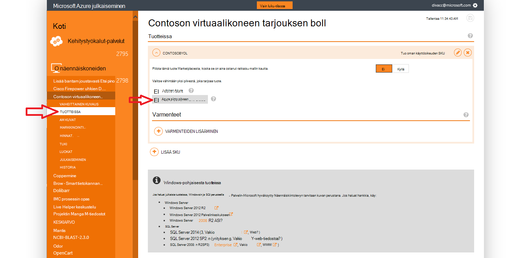

<properties
            pageTitle="Azure Government-ohjeet | Microsoft Azure"
            description="Tämä on vertailu ominaisuuksista ja ohjeita Azure Government sovellusten kehittämisestä."
            services="Azure-Government"
            cloud="gov"
            documentationCenter=""
            authors="tsingh"
            manager="asimm"
            editor=""/>
 
<tags    ms.service="multiple"
            ms.devlang="na"
            ms.topic="article"
            ms.tgt_pltfrm="na"
            ms.workload="azure-government"
            ms.date="10/20/2016"
            ms.author="zakramer;tsingh;divacc"/> 

# Azure Government Marketplacesta
Etsi tietoja alla kumppanien käyttämällä omaa tarjouksia julkaiseminen Government Azure Marketplacesta.

## Julkaiseminen
>[AZURE.NOTE] Jos et ole aiemmin Azure Marketplacesta Certified-kumppani, Suorita vaiheet [tähän](../marketplace-publishing/marketplace-publishing-getting-started.md) ennen kuin jatkat.

### Vaihe 1  
Kirjaudu [https://publish.windowsazure.com](https://publish.windowsazure.com)

### Vaihe 2
Valitse julkaistavat tarjous

### Vaihe 3
Valitse **tuotteissa** ja Azure Government Cloud-ruutu

>[AZURE.NOTE] Tuetaan vain tuoda Omat oman käyttöoikeuden (BYOL)-tuotteissa.  Tämä vaihtoehto ei ole käytettävissä ryhmävakuutussopimukset (PayG) varastointiyksikköjen.

### Vaihe 4
Valitse + voit lisätä linkkejä minkä tahansa kaltaisilta tarjous, Lisää sertifikaatin linkki.

### Vaihe 5
Microsoft Azure Government pilvipohjaisia kokeilutili pyynnön, jotta voit esikatsella kuva Julkaisemisportaali: [https://azuregov.microsoft.com/trial/azuregovtrial](https://azuregov.microsoft.com/trial/azuregovtrial)

Oikeutettu kumppani, joka toimii US federal, tila, paikallinen tai Presidentinkanslian kohteet tarkistetaan ja vahvistus toimitetaan sähköpostitse.  Kokeiluversio-tili on käytettävissä on toimintoa 3 – 5 työpäivän.

### Vaihe 6
Julkaise ja valitse sitten Push vaiheet. 

Voit pyydetään antamaan whitelisted Tilauksen, jolla on pääsy vaiheistettu tarjota. Anna tilauksen tunnus juuri luetun kokeiluversion Azure Government-tililtä.

### Vaihe 7: ssä
Kun tarjous onnistuneesti Vaiheistettu, voit testata kuvan kirjautumalla sisään [https://portal.azure.us](https://portal.azure.us) Azure Government kokeiluversio-tilin avulla.

### Vaihe 8
Kun kuva käyttämällä sen kokeiluversiotilauksen osalta on vahvistettu, voit määrittää tarjous käytettäväksi reaaliaikainen mukaan valitsemalla Julkaise ja pyytää hyväksyntää Siirry tuotannon. 

## Seuraavat vaiheet

Lisätietoa ja päivitykset-tilaa [Microsoft Azure Government-blogi](https://blogs.msdn.microsoft.com/azuregov/).
