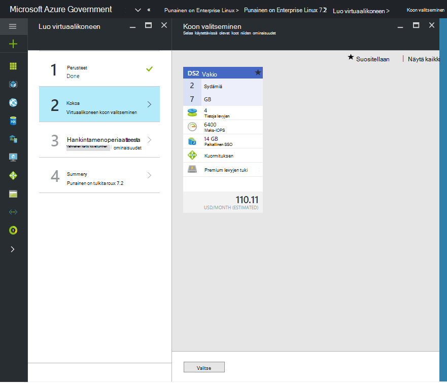

 <properties
    pageTitle="Azure Government-ohjeet | Microsoft Azure"
    description="Tämä on vertailu ominaisuuksista ja ohjeita Azure Government sovellusten kehittämisestä."
    services="Azure-Government"
    cloud="gov"
    documentationCenter=""
    authors="VybavaRamadoss"
    manager="asimm"
    editor=""/>

<tags   ms.service="multiple"
    ms.devlang="na"
    ms.topic="article"
    ms.tgt_pltfrm="na"
    ms.workload="azure-government"
    ms.date="10/20/2016"
    ms.author="zakramer;vybavar"/>

# Government Azure Marketplacesta
Azure Marketplacesta on käytettävissä Azure Government, tutustu marketplace-julkaisijat kuvia päivitettyä luetteloa. 

## Variaatiot
Alla on joitakin tapoja, Government Azure Marketplacesta käytettäessä:

- Tuo Your oman käyttöoikeuden (BYOL)-kuvat ovat käytettävissä. Et voi käyttää kuvia, jotka edellyttävät ostotapahtuma kautta Azure Marketplacesta
- Kuvien alijoukko on tällä hetkellä käytettävissä julkisen marketplace verrattuna. Voit etsiä käytettävissä olevat kuvat luettelo [tähän](../azure-government-image-gallery.md) 
- Ennen valmistelu kuvan yrityksen järjestelmänvalvoja on otettava käyttöön tilauksen Azure Marketplace ostot
  - Kirjaudu sisään kuin yrityksen järjestelmänvalvoja-portaaliin
  - Siirry *hallinta*
  - *Rekisteröinti tiedot* -kohdasta *Azure Marketplace* -rivin kohteen vieressä kynä-kuvake
  - Vaihda tarvittaessa *Käytössä/poissa käytöstä*
  - Valitse *Tallenna*

>[AZURE.NOTE] Jos olet kiinnostunut tekeminen kuvien käytettävissä Azure Government Katso lisätietoja [kumppanin onboarding ohjeita](documentation-government-manage-marketplace-partners.md) .

### Vaihe 1
Käynnistä on Marketplace

  

### Vaihe 2
Etsi oikea eri tuotteiden selaamalla.

Marketplace-publisher sisältää luettelon kaltaisilta osana tuotekuvaus tehdä sopiva vaihtoehto. 

### Vaihe 3
Valitse product\image

### Vaihe 4
Luo työnkulku Käynnistä ja anna tarvittavat parametrit käyttöönottoa varten

>[AZURE.NOTE] Valitse sijainti avattavasta-vain Azure Government sijainnit ovat näkyvissä

### Vaihe 5
Noudata hinnat

### Vaihe 6
Vaihetta ja valitse Ok, jos haluat aloittaa valmistelu

## Seuraavat vaiheet

Lisätietoa ja päivitykset-tilaa [Microsoft Azure Government-blogi](https://blogs.msdn.microsoft.com/azuregov/).
